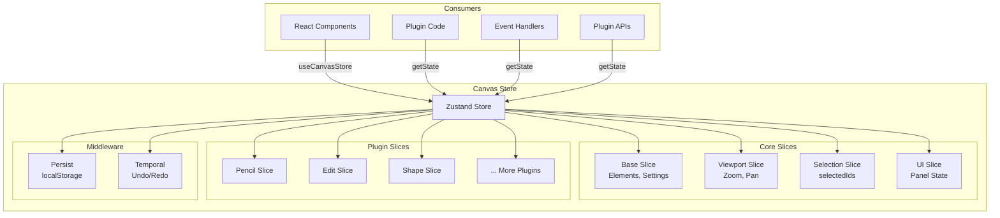
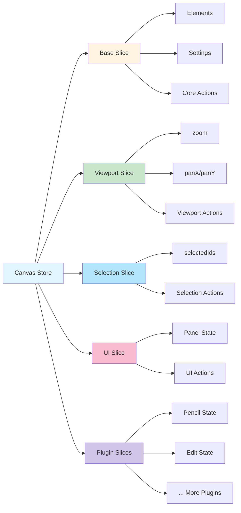
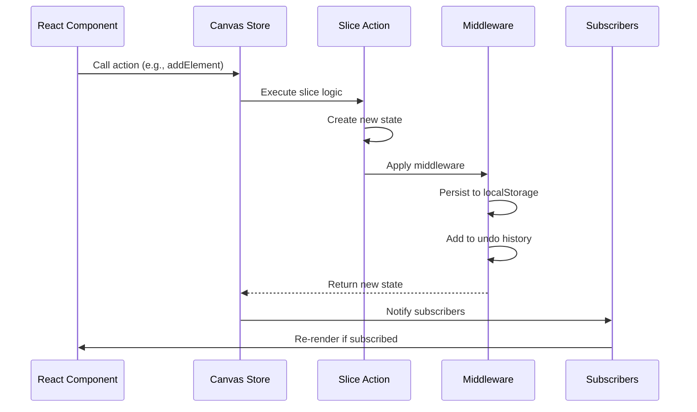

# Canvas Store API

The **Canvas Store** is VectorNest's centralized state management system built on Zustand. It serves as the single source of truth for all application state, including canvas elements, viewport settings, selection, UI state, and plugin-specific data.

## Why Zustand?

VectorNest uses Zustand instead of Redux or Context API because it provides:

1. **Minimal Boilerplate**: No actions, reducers, or complex setup
2. **Performance**: Fine-grained subscriptions prevent unnecessary re-renders
3. **Developer Experience**: Simple API with full TypeScript support
4. **Middleware Support**: Built-in persist and temporal (undo/redo) middleware
5. **Flexibility**: Easy to integrate with React and non-React code

## Architecture Overview



## Store Structure

The Canvas Store is composed of multiple **slices**, each responsible for a specific domain:

```typescript
interface CanvasStore extends 
  BaseSlice,
  ViewportSlice,
  SelectionSlice,
  UISlice,
  // Dynamic plugin slices
  PencilPluginSlice,
  EditPluginSlice,
  ShapePluginSlice,
  // ... more plugin slices
{
  // All slice methods and state combined
}
```

### Slice-Based Design



Each slice is self-contained and can be developed independently, making the codebase modular and maintainable.

## Core Architecture

VectorNest uses Zustand for state management with the following key principles:

- **Slice-based**: Each feature area has its own slice with dedicated actions
- **Immutable updates**: All state changes create new state objects
- **Plugin integration**: Plugins can contribute their own slices to the store
- **Type-safe**: Full TypeScript support with proper type definitions
- **Middleware**: Persistence (localStorage) and temporal (undo/redo) support

### State Access Patterns

#### React Components (Hooks)

```typescript
import { useCanvasStore } from '@/store/canvasStore';

function MyComponent() {
  // Subscribe to specific state
  const zoom = useCanvasStore(state => state.viewport.zoom);
  const selectedIds = useCanvasStore(state => state.selectedIds);
  
  // Subscribe to actions
  const addElement = useCanvasStore(state => state.addElement);
  
  return <div>Zoom: {zoom}x</div>;
}
```

#### Non-React Code (Direct Access)

```typescript
import { useCanvasStore } from '@/store/canvasStore';

// Get current state snapshot
const state = useCanvasStore.getState();

// Read state
console.log(state.elements);

// Call actions
state.addElement({ type: 'path', d: 'M 0 0 L 100 100' });
state.setViewport({ zoom: 2.0 });
```

#### Subscribing to Changes (Outside React)

```typescript
// Subscribe to store changes
const unsubscribe = useCanvasStore.subscribe((state) => {
  console.log('Store updated:', state);
});

// Cleanup
unsubscribe();
```

### State Update Flow



## Core Slices

### Base Slice

The base slice manages fundamental canvas operations and application settings:

```typescript
interface BaseSlice {
  // Canvas elements
  elements: CanvasElement[];
  
  // Active tool
  activePlugin: string | null;
  
  // Document name
  documentName: string;
  
  // Panel visibility
  showFilePanel: boolean;
  showSettingsPanel: boolean;
  
  // Mobile features
  isVirtualShiftActive: boolean;
  
  // Style eyedropper
  styleEyedropper: {
    isActive: boolean;
    copiedStyle: PathData | null;
  };
  
  // Application settings
  settings: {
    keyboardMovementPrecision: number;
    showRenderCountBadges: boolean;
    showMinimap: boolean;
    showTooltips: boolean;
    defaultStrokeColor: string;
  };
  
  // Core actions
  addElement(element: Omit<CanvasElement, 'id' | 'zIndex'>): string;
  updateElement(id: string, updates: Partial<CanvasElement>): void;
  deleteElement(id: string): void;
  deleteSelectedElements(): void;
  setActivePlugin(plugin: string | null): void;
  setMode(mode: string): void;
  setDocumentName(name: string): void;
  setShowFilePanel(show: boolean): void;
  setShowSettingsPanel(show: boolean): void;
  setVirtualShift(active: boolean): void;
  toggleVirtualShift(): void;
  updateSettings(updates: Partial<BaseSlice['settings']>): void;
}
```

**Key Methods:**
- `deleteElement(id)`: Removes a single element by ID
- `deleteSelectedElements()`: Removes all currently selected elements
- `setMode(pluginId)`: Activates a plugin/tool by ID
- `addElement(element)`: Adds a new element to the canvas and returns its ID
- `updateElement(id, updates)`: Updates an existing element's properties

**Note**: Selection state (`selectedIds`) is managed by SelectionSlice, not BaseSlice.

### Viewport Slice

Manages canvas pan and zoom with a nested viewport object:

```typescript
interface Viewport {
  zoom: number;      // Zoom level (1.0 = 100%)
  panX: number;      // Pan offset X
  panY: number;      // Pan offset Y
}

interface ViewportSlice {
  // State
  viewport: Viewport;
  
  // Actions
  setViewport(viewport: Partial<Viewport>): void;
  pan(deltaX: number, deltaY: number): void;
  zoom(factor: number, centerX?: number, centerY?: number): void;
  resetPan(): void;
  resetZoom(): void;
  
  // Selectors
  selectViewport(): Viewport;
  selectZoom(): number;
}
```

**Key Methods:**
- `setViewport(viewport)`: Updates viewport properties (zoom, panX, panY)
- `pan(deltaX, deltaY)`: Increments pan offset by delta values
- `zoom(factor, centerX?, centerY?)`: Multiplies zoom by factor, optionally around a point
- `resetPan()`: Resets pan offset to (0, 0)
- `resetZoom()`: Resets zoom level to 1.0 (100%)

**Important**: Zoom is multiplicative (not incremental steps), and there are no built-in `fitToContent()` or `centerOnSelection()` methods.

### Selection Slice

Handles element selection and provides utilities for selected elements:

```typescript
interface SelectionSlice {
  // State
  selectedIds: string[];
  
  // Actions
  selectElement(id: string, multiSelect?: boolean): void;
  selectElements(ids: string[]): void;
  clearSelection(): void;
  getSelectedElements(): CanvasElement[];
  getSelectedPathsCount(): number;
  moveSelectedElements(deltaX: number, deltaY: number): void;
  updateSelectedPaths(properties: Partial<PathData>): void;
}
```

**Key Methods:**
- `selectElement(id, multiSelect?)`: Selects a single element (optionally adding to existing selection)
- `selectElements(ids)`: Replaces current selection with provided IDs
- `clearSelection()`: Clears all selections
- `getSelectedElements()`: Returns array of currently selected element objects
- `getSelectedPathsCount()`: Returns count of selected path elements
- `moveSelectedElements(deltaX, deltaY)`: Translates all selected elements
- `updateSelectedPaths(properties)`: Updates PathData properties on selected paths

**Important**: There is no `selectionBounds` property calculated automatically. Selection bounds must be computed on-demand when needed. Methods like `addToSelection`, `removeFromSelection`, `selectAll`, `invertSelection`, and `selectByBounds` do not exist in this slice.

## Plugin Slices

Each plugin can contribute its own slice to the global store. Plugin slices are namespaced by plugin ID and registered dynamically at runtime:

```typescript
// Access plugin state
const pencilState = useCanvasStore(state => state.pencil);
const gridState = useCanvasStore(state => state.grid);

// Plugin slice example (PencilPluginSlice)
interface PencilPluginSlice {
  pencil: {
    // Pencil-specific state
    brushSize: number;
    brushColor: string;
    brushOpacity: number;
    
    // Actions
    setBrushSize(size: number): void;
    setBrushColor(color: string): void;
    setBrushOpacity(opacity: number): void;
  };
}
```

**Available Plugin Slices**:
- `pencil` - Pencil drawing tool state
- `text` - Text tool state
- `shape` - Shape tool state
- `transformation` - Transformation tool state
- `edit` - Edit tool state
- `subpath` - Subpath editing state
- `opticalAlignment` - Optical alignment state
- `curves` - Curves tool state
- `guidelines` - Guidelines plugin state
- `grid` - Grid plugin state

**Note**: The `select` plugin does not have its own slice. Selection state is managed globally by SelectionSlice.

### Accessing Plugin State

```typescript
import { useCanvasStore } from '@/store/canvas';

// Get plugin state (may be undefined if plugin not loaded)
const pencilState = useCanvasStore(state => state.pencil);
const gridState = useCanvasStore(state => state.grid);

// Safe access with optional chaining
const brushSize = useCanvasStore(state => state.pencil?.brushSize);
```

## State Persistence

The store uses Zustand's `persist` middleware to automatically save state to localStorage:

```typescript
// Persistence configuration
persist(
  temporal(/* ... */),
  {
    name: 'canvas-app-state',
    partialize: (state: CanvasStore) => {
      // All state is persisted by default
      return state;
    }
  }
)
```

**Persisted State**:
- All elements and their properties
- Viewport (zoom, pan)
- Plugin-specific state
- Application settings

**Temporal Middleware (Undo/Redo)**:

The store also uses `zundo`'s temporal middleware for undo/redo functionality:

```typescript
temporal(
  (set, get, api) => ({ /* slices */ }),
  {
    limit: 50, // Keep last 50 states
    partialize: (state) => ({
      elements: state.elements,
      selectedIds: state.selectedIds,
      viewport: state.viewport,
    }),
    equality: isDeepEqual,
    handleSet: debounce(handleSet, 100), // 100ms cool-off period
  }
)
```

**Note**: There is no support for custom `include`/`exclude` lists beyond the `partialize` function.

## Type Definitions

```typescript
// Base element types
export type ElementType = 'path' | 'group';

export interface CanvasElementBase {
  id: string;
  type: ElementType;
  zIndex: number;
  parentId?: string | null;
}

export interface PathElement extends CanvasElementBase {
  type: 'path';
  data: PathData;
}

export interface GroupElement extends CanvasElementBase {
  type: 'group';
  data: GroupData;
}

export type CanvasElement = PathElement | GroupElement;

// Path data structure
export interface PathData {
  subPaths: SubPath[];
  strokeWidth: number;
  strokeColor: string;
  strokeOpacity: number;
  fillColor: string;
  fillOpacity: number;
  strokeLinecap?: 'butt' | 'round' | 'square';
  strokeLinejoin?: 'miter' | 'round' | 'bevel';
  fillRule?: 'nonzero' | 'evenodd';
  strokeDasharray?: string;
  isPencilPath?: boolean;
  transform?: {
    scaleX: number;
    scaleY: number;
    rotation: number;
    translateX: number;
    translateY: number;
  };
}

// Group data structure
export interface GroupData {
  childIds: string[];
  name: string;
  isLocked: boolean;
  isHidden: boolean;
  isExpanded: boolean;
  transform: {
    translateX: number;
    translateY: number;
    rotation: number;
    scaleX: number;
    scaleY: number;
  };
}

// Viewport structure
export interface Viewport {
  zoom: number;
  panX: number;
  panY: number;
}

// Geometric types
export interface Point {
  x: number;
  y: number;
}

export interface Rect {
  x: number;
  y: number;
  width: number;
  height: number;
}
```

**Important Notes**:
- `CanvasElement` is a union type, not a flat object with dimensions
- Specific element data is stored in the `data` property
- Properties like `visible`, `locked`, `opacity`, `width`, and `height` are NOT at the top level
- Groups have `isLocked` and `isHidden` in their `GroupData`
- Transform data is nested within the element's `data` property

## Best Practices

### State Updates
```typescript
// ✅ Good: Immutable updates
store.setState(state => ({
  ...state,
  elements: state.elements.map(el => 
    el.id === id ? { ...el, x: newX } : el
  )
}));

// ❌ Bad: Direct mutation
store.setState(state => {
  state.elements[0].x = newX; // Don't do this
  return state;
});
```

### Plugin Integration
```typescript
// Plugins should define their slice interface
interface MyPluginSlice {
  myPluginData: any;
  setMyPluginData(data: any): void;
}

// Register with store
const useMyPluginSlice = createSlice<MyPluginSlice>((set) => ({
  myPluginData: null,
  setMyPluginData: (data) => set({ myPluginData: data })
}));
```

### Performance Considerations
- Use selector functions to prevent unnecessary re-renders
- Avoid storing large objects in state
- Use `shallow` comparison for complex objects
- Consider using `useCallback` for event handlers

## Error Handling

The store includes built-in error boundaries and recovery mechanisms:

```typescript
// Error recovery
try {
  store.getState().addElement(newElement);
} catch (error) {
  console.error('Failed to add element:', error);
  // Recovery logic
}
```

## Testing

Store slices can be tested in isolation:

```typescript
import { renderHook } from '@testing-library/react';
import { useCanvasStore } from '@/store/canvas';

test('selection slice', () => {
  const { result } = renderHook(() => useCanvasStore());
  
  act(() => {
    result.current.addToSelection('element-1');
  });
  
  expect(result.current.selectedIds).toContain('element-1');
});
```