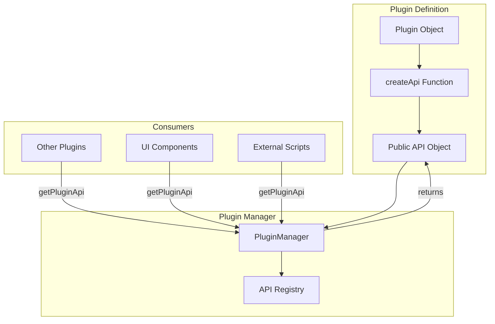
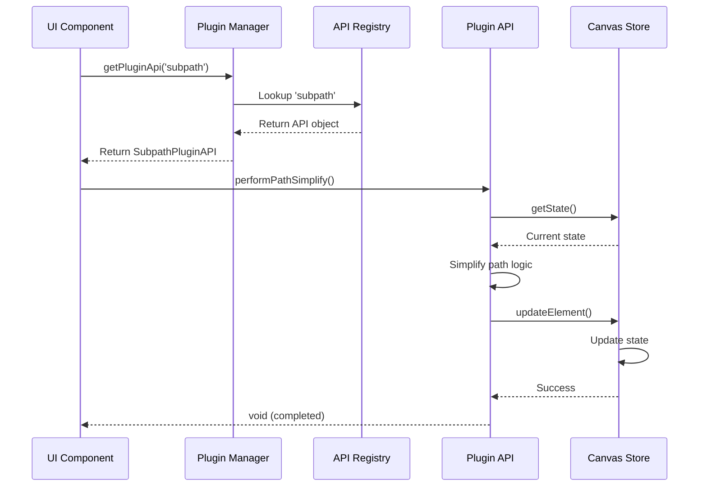

# createApi Pattern

The `createApi` function is the mechanism by which plugins expose **public methods** to other parts of the application. This enables controlled inter-plugin communication and allows external code to interact with plugin functionality in a type-safe, documented manner.

## Why Public APIs?

Plugins often implement functionality that other plugins or UI components need to access:

- **Subpath plugin** exposes `performPathSimplify()`, `performSubPathJoin()` and `performSubPathReverse()` to simplify, join, or reverse subpaths programmatically
- **GridFill plugin** exposes `fillGridCell()` for scripted grid filling
- **Shape plugin** exposes `createShape()` to generate shapes from code

Without `createApi`, plugins would need to:
1. Expose internal state directly (breaks encapsulation)
2. Use global functions (loses type safety)
3. Directly import plugin modules (creates tight coupling)

The `createApi` pattern solves these problems by providing a clean, type-safe interface.

## Architecture



## Basic Structure

### Plugin Definition with createApi

```typescript
import { PluginDefinition } from '@/types/plugins';
import type { CanvasStore } from '@/store/canvasStore';

export const myPlugin: PluginDefinition<CanvasStore> = {
  id: 'my-plugin',
  metadata: {
    label: 'My Plugin',
    icon: MyIcon,
  },
  
  // Public API definition
  createApi: (context) => ({
    // Method 1: Simple calculation
    calculateBounds: (elementId: string): Bounds | null => {
      const state = context.store.getState();
      const element = state.elements.find(e => e.id === elementId);
      return element ? computeBounds(element) : null;
    },
    
    // Method 2: State manipulation
    simplifyPath: (pathId: string, tolerance: number): boolean => {
      const state = context.store.getState();
      const path = state.elements.find(e => e.id === pathId);
      
      if (!path || path.type !== 'path') return false;
      
      const simplified = simplifyPathData(path.d, tolerance);
      context.store.getState().updateElement(pathId, { d: simplified });
      return true;
    },
  }),
  
  // ... rest of plugin definition (handler, keyboardShortcuts, etc.)
};
```

### Context Object

The `context` parameter provides access to the Canvas Store:

```typescript
interface PluginApiContext<TStore> {
  // Zustand store for state management
  store: PluginStoreApi<TStore>;
}
```

**Note**: The context object **only contains the `store`**. It does not include:
- ❌ `eventBus` - Event Bus is accessed separately via hooks/contexts
- ❌ `pluginManager` - Plugin Manager is not injected into API context
- ❌ `name` - Plugin metadata uses `metadata.label` instead

This allows APIs to:
- Read store state via `context.store.getState()`
- Modify state by calling store methods
- Subscribe to state changes via `context.store.subscribe()`

## Type Safety

### Defining API Types

Always define TypeScript interfaces for your APIs:

```typescript
// Define the API interface
export interface SubpathPluginAPI {
  performPathSimplify: () => void;
  performSubPathReverse: () => void;
  performSubPathJoin: () => void;
}

// Implement the interface
export const subpathPlugin: PluginDefinition<CanvasStore> = {
  id: 'subpath',
  metadata: {
    label: 'Subpath',
    icon: SubpathIcon,
  },
  
  createApi: (context): SubpathPluginAPI => ({
    performPathSimplify: () => {
      performPathSimplify(context.store.getState);
    },
    
    performSubPathReverse: () => {
      performSubPathReverse(context.store.getState);
    },
    performSubPathJoin: () => {
      performSubPathJoin(context.store.getState);
    },
  }),
};
```

### Type-Safe Consumption

```typescript
import { SubpathPluginAPI } from '@/plugins/subpath';

// Type-safe API access
const api = pluginManager.getPluginApi<SubpathPluginAPI>('subpath');

if (api) {
  api.performPathSimplify(); // ✓ Type-checked
  api.performSubPathReverse(); // ✓ Type-checked
  api.performSubPathJoin?.(); // ✓ Type-checked (optional chaining)
  api.invalidMethod();       // ✗ TypeScript error
}
```

## Accessing Plugin APIs

### From Other Plugins

```typescript
export const myPlugin: PluginDefinition = {
  id: 'my-plugin',
  
  activate: (context) => {
    // Access another plugin's API
    const gridFillAPI = context.pluginManager.getPluginApi<GridFillAPI>('gridFill');
    
    if (gridFillAPI) {
      gridFillAPI.fillGridCell({ x: 100, y: 100 });
    }
  },
};
```

### From UI Components

```typescript
import { useCanvasStore } from '@/store/canvasStore';
import { pluginManager } from '@/plugins/pluginManager';

function MyButton() {
  const handleClick = () => {
    const api = pluginManager.getPluginApi<SubpathPluginAPI>('subpath');
    
    if (api) {
      api.performPathSimplify();
    } else {
      console.warn('Subpath plugin not available');
    }
  };
  
  return <button onClick={handleClick}>Simplify Path</button>;
}
```

### From Event Handlers

```typescript
eventBus.subscribe('keyboard', (payload) => {
  if (payload.event.key === 's' && payload.event.ctrlKey) {
    const shapeAPI = pluginManager.getPluginApi<ShapeAPI>('shape');
    
    if (shapeAPI) {
      shapeAPI.createShape({ x: 0, y: 0 }, { x: 100, y: 100 });
    }
  }
});
```

## API Call Flow



## Real-World Examples

### Example 1: Subpath Plugin

```typescript
export interface SubpathPluginAPI {
  performPathSimplify: () => void;
  performSubPathReverse: () => void;
}

export const subpathPlugin: PluginDefinition<CanvasStore> = {
  id: 'subpath',
  metadata: {
    label: 'Subpath',
    icon: SubpathIcon,
  },
  
  createApi: ({ store }): SubpathPluginAPI => ({
    performPathSimplify: () => {
      performPathSimplify(store.getState);
    },
    
    performSubPathReverse: () => {
      performSubPathReverse(store.getState);
    },
    
    performSubPathJoin: () => {
      performSubPathJoin(store.getState);
    },
  }),
};
```

**Usage**:
```typescript
const api = pluginManager.getPluginApi<SubpathPluginAPI>('subpath');
api?.performPathSimplify();
```

### Example 2: Grid Fill Plugin

```typescript
export interface GridFillAPI {
  fillGridCell: (point: Point) => void;
}

export const gridFillPlugin: PluginDefinition<CanvasStore> = {
  id: 'gridFill',
  metadata: {
    label: 'Grid Fill',
    icon: GridFillIcon,
  },
  
  createApi: ({ store }): GridFillAPI => ({
    fillGridCell: (point: Point) => {
      return fillGridCell(point, store.getState);
    },
  }),
};
```

**Usage**:
```typescript
const api = pluginManager.getPluginApi<GridFillAPI>('gridFill');
api?.fillGridCell({ x: 150, y: 200 });
```

### Example 3: Shape Plugin

```typescript
export interface ShapeAPI {
  createShape: (startPoint: Point, endPoint: Point) => void;
}

export const shapePlugin: PluginDefinition<CanvasStore> = {
  id: 'shape',
  metadata: {
    label: 'Shape',
    icon: ShapeIcon,
  },
  
  createApi: ({ store }): ShapeAPI => ({
    createShape: (startPoint: Point, endPoint: Point) => {
      createShape(startPoint, endPoint, store.getState);
    },
  }),
};
```

**Usage**:
```typescript
const api = pluginManager.getPluginApi<ShapeAPI>('shape');
api?.createShape({ x: 0, y: 0 }, { x: 100, y: 100 });
```

## Best Practices

### 1. Keep APIs Minimal

Only expose what's necessary:

```typescript
// ❌ BAD: Exposing internal state
createApi: (context) => ({
  getInternalState: () => context.store.getState().myPlugin,
  setInternalState: (state) => { /* ... */ },
});

// ✅ GOOD: Focused, high-level operations
createApi: (context) => ({
  simplifyPath: (tolerance: number) => { /* ... */ },
  reversePath: () => { /* ... */ },
});
```

### 2. Return Immutable Data

Never return mutable references:

```typescript
// ❌ BAD: Returning mutable object
createApi: (context) => ({
  getElements: () => context.store.getState().elements,
});

// ✅ GOOD: Return copy or specific data
createApi: (context) => ({
  getElementIds: () => [...context.store.getState().elements.map(e => e.id)],
  getElementById: (id: string) => {
    const element = context.store.getState().elements.find(e => e.id === id);
    return element ? { ...element } : null;
  },
});
```

### 3. Handle Errors Gracefully

```typescript
createApi: (context) => ({
  simplifyPath: (pathId: string, tolerance: number): boolean => {
    try {
      const state = context.store.getState();
      const path = state.elements.find(e => e.id === pathId);
      
      if (!path) {
        console.warn(`Path ${pathId} not found`);
        return false;
      }
      
      if (path.type !== 'path') {
        console.warn(`Element ${pathId} is not a path`);
        return false;
      }
      
      // Perform operation
      const simplified = simplifyPathData(path.d, tolerance);
      state.updateElement(pathId, { d: simplified });
      return true;
      
    } catch (error) {
      console.error('Error simplifying path:', error);
      return false;
    }
  },
});
```

### 4. Document Types Thoroughly

```typescript
export interface MyPluginAPI {
  /**
   * Calculate the bounding box for an element
   * @param elementId - ID of the element to measure
   * @returns Bounds object or null if element not found
   */
  calculateBounds: (elementId: string) => Bounds | null;
  
  /**
   * Simplify a path using Douglas-Peucker algorithm
   * @param pathId - ID of the path element
   * @param tolerance - Simplification tolerance (higher = more simplified)
   * @returns true if successful, false if path not found or invalid
   */
  simplifyPath: (pathId: string, tolerance: number) => boolean;
}
```

### 5. Use Semantic Versioning for Breaking Changes

If you must change an API, version it:

```typescript
export interface MyPluginAPI_V1 {
  doSomething: (arg: string) => void;
}

export interface MyPluginAPI_V2 {
  doSomething: (arg: string, options?: Options) => Promise<void>;
}

// Support both versions temporarily
createApi: (context) => ({
  // V2 implementation
  doSomething: async (arg: string, options?: Options) => { /* ... */ },
  
  // V1 compatibility (deprecated)
  doSomethingV1: (arg: string) => { /* ... */ },
});
```

## Advanced Patterns

### Async APIs

```typescript
createApi: (context) => ({
  loadExternalData: async (url: string): Promise<Data> => {
    const response = await fetch(url);
    const data = await response.json();
    return processData(data);
  },
});

// Usage
const api = pluginManager.getPluginApi<MyAPI>('my-plugin');
const data = await api?.loadExternalData('https://...');
```

### Chaining APIs

```typescript
createApi: (context) => ({
  selectElement: (id: string) => {
    context.store.getState().selectElement(id);
    return api; // Return self for chaining
  },
  
  moveSelection: (dx: number, dy: number) => {
    context.store.getState().moveSelectedElements(dx, dy);
    return api;
  },
});

// Usage: Chain multiple operations
api?.selectElement('element-1')
    .moveSelection(10, 20);
```

### Event-Based APIs

```typescript
createApi: (context) => ({
  onPathChanged: (callback: (pathId: string) => void) => {
    const unsubscribe = context.eventBus.subscribe('pathChanged', (payload) => {
      callback(payload.pathId);
    });
    return unsubscribe;
  },
});

// Usage
const unsubscribe = api?.onPathChanged((pathId) => {
  console.log('Path changed:', pathId);
});

// Cleanup
unsubscribe?.();
```

## Testing Plugin APIs

```typescript
import { describe, it, expect, vi } from 'vitest';

describe('MyPlugin API', () => {
  it('should expose correct API methods', () => {
    const mockContext = {
      store: mockStore,
      eventBus: mockEventBus,
      pluginManager: mockPluginManager,
    };
    
    const api = myPlugin.createApi!(mockContext);
    
    expect(api).toHaveProperty('calculateBounds');
    expect(typeof api.calculateBounds).toBe('function');
  });
  
  it('should calculate bounds correctly', () => {
    const api = myPlugin.createApi!(mockContext);
    const bounds = api.calculateBounds('element-1');
    
    expect(bounds).toEqual({
      x: 0,
      y: 0,
      width: 100,
      height: 100,
    });
  });
});
```

## Related Documentation

- **[Plugin Manager](./plugin-manager)**: Complete PluginManager API reference
- **[Canvas Store](./canvas-store)**: Store methods available in context
- **[Plugin Registration](../plugins/registration)**: How to register and configure plugins
- **[Plugin Lifecycle](../plugins/lifecycle)**: Understanding plugin lifecycle hooks
