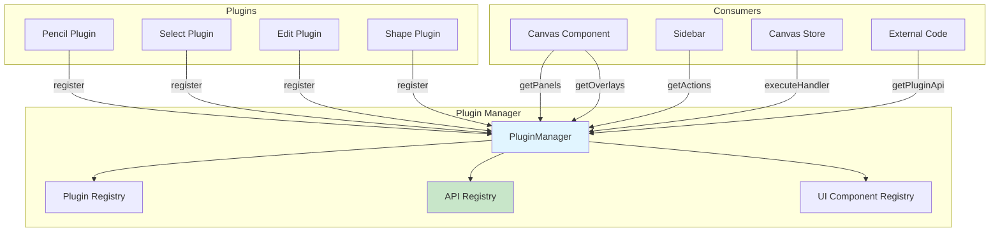
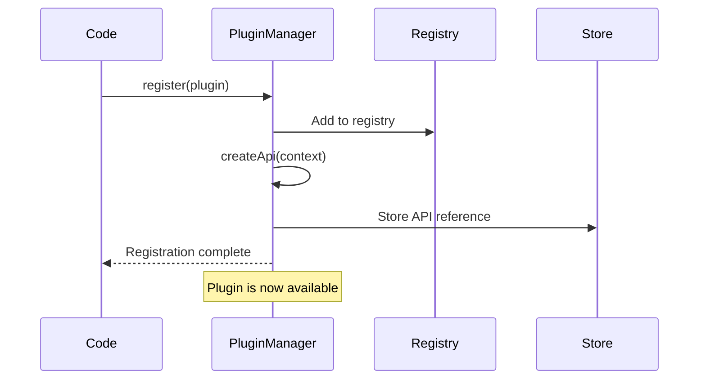
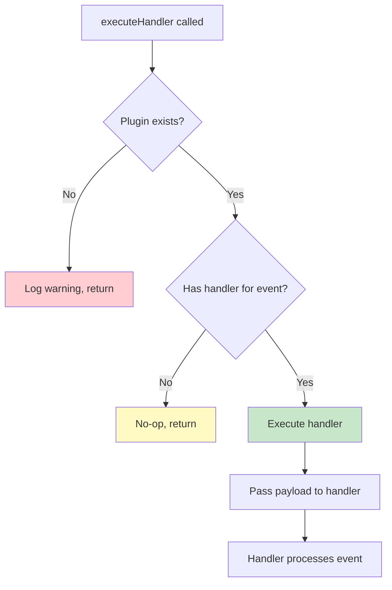
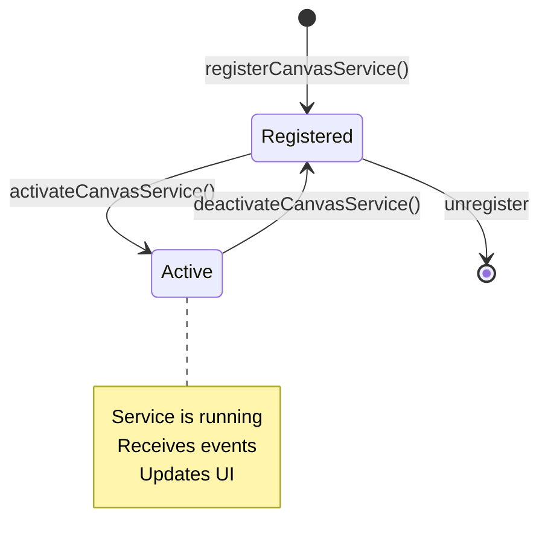
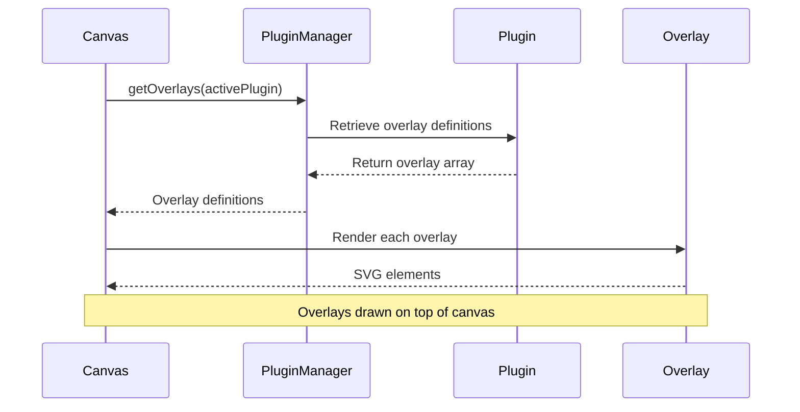
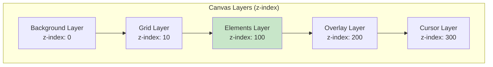

# Plugin Manager API

The **PluginManager** is the central orchestrator of Vectornest's plugin system. It manages plugin lifecycle, handles plugin registration, provides access to plugin APIs, and coordinates UI components (panels, overlays, actions) across the application.

## Overview

The PluginManager acts as a registry and coordinator for all plugins:



## Core Responsibilities

1. **Plugin Lifecycle**: Register, unregister, and track plugins
2. **API Management**: Store and provide access to plugin APIs
3. **Event Coordination**: Execute plugin event handlers
4. **UI Orchestration**: Collect and provide UI components from plugins
5. **Service Management**: Register and activate canvas services

## API Reference

### Plugin Registration

#### `register(plugin: PluginDefinition): void`

Registers a new plugin with the manager.

```typescript
import { pencilPlugin } from '@/plugins/pencil';

pluginManager.register(pencilPlugin);
```

**Flow**:


**Details**:
- Validates plugin structure
- Creates plugin API if `createApi` is defined
- Stores plugin in internal registry
- Makes plugin available for querying

#### `unregister(pluginId: string): void`

Removes a plugin from the manager.

```typescript
pluginManager.unregister('pencil');
```

**Use Cases**:
- Hot reloading during development
- Disabling plugins at runtime
- Cleanup during testing

:::warning
Unregistering a plugin does NOT automatically:
- Deactivate the plugin if it's currently active
- Clean up plugin state in the store
- Remove plugin-generated elements
:::

#### `getPlugin(pluginId: string): PluginDefinition | undefined`

Retrieves a plugin's full definition.

```typescript
const plugin = pluginManager.getPlugin('pencil');

if (plugin) {
  console.log(plugin.name);        // "Pencil"
  console.log(plugin.description); // Plugin description
  console.log(plugin.icon);        // Icon component
}
```

#### `getAll(): PluginDefinition[]`

Returns all registered plugins.

```typescript
const allPlugins = pluginManager.getAll();

allPlugins.forEach(plugin => {
  console.log(`${plugin.id}: ${plugin.name}`);
});
```

**Use Cases**:
- Building plugin selection UI
- Debugging/inspection
- Analytics

#### `hasTool(name: string): boolean`

Checks if a plugin with the given ID exists.

```typescript
if (pluginManager.hasTool('pencil')) {
  // Safe to use pencil plugin
  const api = pluginManager.getPluginApi('pencil');
}
```

### API Access

#### `getPluginApi<T>(pluginId: string): T | undefined`

Retrieves a plugin's public API with type safety.

```typescript
import { SubpathPluginAPI } from '@/plugins/subpath';

// Type-safe API access
const api = pluginManager.getPluginApi<SubpathPluginAPI>('subpath');

if (api) {
  api.performPathSimplify();     // ✓ Type-checked
  api.performSubPathReverse();   // ✓ Type-checked
}
```

**Type Safety**:
```typescript
// Without generic: untyped
const api = pluginManager.getPluginApi('subpath');
api?.doSomething(); // No type checking

// With generic: fully typed
const api = pluginManager.getPluginApi<SubpathPluginAPI>('subpath');
api?.performPathSimplify(); // ✓ IntelliSense & type checking
```

**Returns**: 
- The plugin's API object if plugin exists and has `createApi`
- `undefined` if plugin doesn't exist or has no API

#### `callPluginApi(pluginId: string, method: string, ...args: any[]): any`

Dynamically calls a plugin API method.

```typescript
// Direct call
const result = pluginManager.callPluginApi(
  'gridFill',
  'fillGridCell',
  { x: 100, y: 100 }
);
```

**Use Cases**:
- Dynamic plugin interactions
- Scripting interfaces
- Plugin debugging tools

:::caution
Prefer `getPluginApi<T>()` for type safety. Only use `callPluginApi` when the method name is truly dynamic.
:::

### Event Handling

#### `executeHandler(tool: string, event: string, point: Point, target: EventTarget | null, helpers: any): void`

Executes a plugin's event handler for a specific event type.

```typescript
pluginManager.executeHandler(
  'pencil',
  'pointerdown',
  { x: 100, y: 100 },
  event.target,
  helpers
);
```

**Internal Use**: This method is primarily called by the Canvas component when dispatching events to the active plugin.

**Handler Resolution**:


#### `registerInteractionHandler(pluginId: string, eventType: string, handler: Function): void`

Registers an event handler for a plugin.

```typescript
pluginManager.registerInteractionHandler(
  'my-plugin',
  'pointerdown',
  (payload) => {
    console.log('Pointer down at:', payload.point);
  }
);
```

**Note**: Most plugins define handlers in their plugin definition. This method is for dynamic handler registration.

### Canvas Services

Canvas Services are background utilities that run independently of the active plugin.

#### `registerCanvasService(service: CanvasService): void`

Registers a canvas service.

```typescript
const gridService: CanvasService = {
  id: 'grid',
  activate: (context) => {
    // Setup grid overlay
  },
  deactivate: () => {
    // Clean up grid
  },
};

pluginManager.registerCanvasService(gridService);
```

#### `activateCanvasService(serviceId: string, context: PluginContext): void`

Activates a registered canvas service.

```typescript
pluginManager.activateCanvasService('grid', {
  store,
  eventBus,
  pluginManager,
});
```

#### `deactivateCanvasService(serviceId: string): void`

Deactivates an active canvas service.

```typescript
pluginManager.deactivateCanvasService('grid');
```

**Service Lifecycle**:


### UI Component Queries

#### `getPanels(toolName: string): PanelDefinition[]`

Returns all panels registered by a plugin.

```typescript
const panels = pluginManager.getPanels('edit');

panels.forEach(panel => {
  console.log(panel.id);          // e.g., 'edit-panel'
  console.log(panel.position);    // 'top' | 'bottom'
  console.log(panel.render);      // React component
});
```

**Usage in Sidebar**:
```typescript
function Sidebar() {
  const activePlugin = useCanvasStore(state => state.activePlugin);
  const panels = activePlugin ? pluginManager.getPanels(activePlugin) : [];
  
  return (
    <div>
      {panels.map(panel => (
        <Panel key={panel.id} definition={panel} />
      ))}
    </div>
  );
}
```

#### `getOverlays(toolName: string): OverlayDefinition[]`

Returns all overlays registered by a plugin.

```typescript
const overlays = pluginManager.getOverlays('edit');

overlays.forEach(overlay => {
  console.log(overlay.id);        // e.g., 'edit-points-overlay'
  console.log(overlay.render);    // React component
});
```

**Overlay Rendering**:


#### `getActions(placement: ActionPlacement): ActionDefinition[]`

Returns contextual actions for a specific UI placement.

```typescript
const bottomActions = pluginManager.getActions('bottom-bar');

bottomActions.forEach(action => {
  console.log(action.id);         // e.g., 'delete-action'
  console.log(action.icon);       // Icon component
  console.log(action.label);      // "Delete"
  console.log(action.onClick);    // Handler function
});
```

**Action Placements**:
- `'top-bar'`: Top action bar
- `'bottom-bar'`: Bottom action bar
- `'context-menu'`: Right-click menu
- `'sidebar'`: Sidebar actions

**Dynamic Action Bar**:
```typescript
function BottomActionBar() {
  const actions = pluginManager.getActions('bottom-bar');
  
  return (
    <HStack>
      {actions.map(action => (
        <ToolbarIconButton
          key={action.id}
          icon={action.icon}
          label={action.label}
          onClick={action.onClick}
        />
      ))}
    </HStack>
  );
}
```

#### `getCanvasLayers(): LayerDefinition[]`

Returns all registered canvas layers from plugins.

```typescript
const layers = pluginManager.getCanvasLayers();

layers.forEach(layer => {
  console.log(layer.id);          // e.g., 'grid-layer'
  console.log(layer.zIndex);      // Rendering order
  console.log(layer.render);      // React component
});
```

**Layer Rendering Order**:


## Advanced Usage

### Plugin Hot Reloading

```typescript
// Unregister old version
pluginManager.unregister('my-plugin');

// Register new version
import { myPlugin } from './my-plugin-v2';
pluginManager.register(myPlugin);

// Reset store state if needed
const state = useCanvasStore.getState();
state.setMode(null);
state.setMode('my-plugin');
```

### Conditional Plugin Loading

```typescript
const loadPlugins = () => {
  const basePlugins = [pencilPlugin, selectPlugin, editPlugin];
  pluginManager.registerAll(basePlugins);
  
  // Load advanced plugins only if feature flag enabled
  if (features.advancedTools) {
    pluginManager.register(opticalAlignmentPlugin);
    pluginManager.register(gridFillPlugin);
  }
  
  // Load experimental plugins in dev mode
  if (process.env.NODE_ENV === 'development') {
    pluginManager.register(experimentalPlugin);
  }
};
```

### Plugin Discovery

```typescript
// Find all plugins with a specific capability
const pluginsWithAPIs = pluginManager
  .getAll()
  .filter(plugin => plugin.createApi !== undefined);

console.log('Plugins with public APIs:', pluginsWithAPIs.map(p => p.id));

// Find all drawing tools
const drawingTools = pluginManager
  .getAll()
  .filter(plugin => plugin.category === 'drawing');
```

### Batch Operations

```typescript
// Register multiple plugins
const registerAll = (plugins: PluginDefinition[]) => {
  plugins.forEach(plugin => pluginManager.register(plugin));
};

registerAll([pencilPlugin, shapePlugin, textPlugin]);

// Get APIs for multiple plugins
const getAPIs = <T>(pluginIds: string[]): (T | undefined)[] => {
  return pluginIds.map(id => pluginManager.getPluginApi<T>(id));
};

const [subpathAPI, gridFillAPI] = getAPIs<any>(['subpath', 'gridFill']);
```

## Implementation Details

### Location

**File**: `/src/plugins/PluginManager.ts`

### Singleton Pattern

```typescript
// Global singleton instance
export const pluginManager = new PluginManager();

// Usage throughout app
import { pluginManager } from '@/plugins/pluginManager';
```

### Internal Structure

```typescript
class PluginManager {
  private plugins: Map<string, PluginDefinition> = new Map();
  private apis: Map<string, any> = new Map();
  private services: Map<string, CanvasService> = new Map();
  
  register(plugin: PluginDefinition): void {
    this.plugins.set(plugin.id, plugin);
    
    if (plugin.createApi) {
      const api = plugin.createApi(this.getContext());
      this.apis.set(plugin.id, api);
    }
  }
  
  getPluginApi<T>(pluginId: string): T | undefined {
    return this.apis.get(pluginId) as T | undefined;
  }
  
  // ... other methods
}
```

## Testing

### Mock Plugin Manager

```typescript
import { describe, it, expect, vi } from 'vitest';

describe('PluginManager', () => {
  it('should register and retrieve plugins', () => {
    const mockPlugin: PluginDefinition = {
      id: 'test-plugin',
      name: 'Test Plugin',
    };
    
    pluginManager.register(mockPlugin);
    
    const retrieved = pluginManager.getPlugin('test-plugin');
    expect(retrieved).toEqual(mockPlugin);
  });
  
  it('should create and retrieve plugin APIs', () => {
    const mockPlugin: PluginDefinition = {
      id: 'test-plugin',
      name: 'Test Plugin',
      createApi: () => ({
        testMethod: () => 'test result',
      }),
    };
    
    pluginManager.register(mockPlugin);
    
    const api = pluginManager.getPluginApi('test-plugin');
    expect(api?.testMethod()).toBe('test result');
  });
});
```

## Related Documentation

- **[createApi Pattern](./create-api)**: How to expose plugin APIs
- **[Canvas Store](./canvas-store)**: Store methods available to plugins
- **[Plugin Registration](../plugins/registration)**: How to register and configure plugins
- **[Plugin Lifecycle](../plugins/lifecycle)**: Understanding plugin lifecycle hooks
