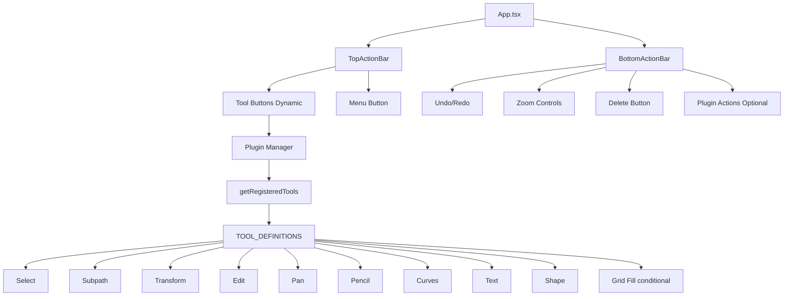

# Action Bars

TTPE features two **floating action bars** that provide quick access to tools, actions, and canvas operations. These bars are **non-intrusive overlays** positioned at the top and bottom of the canvas, adapting to sidebar state and screen size.

## Overview

The action bars serve as the primary **toolbar interface** for the application:

- **Top Action Bar**: Mode selection, plugin shortcuts, canvas utilities, mobile menu
- **Bottom Action Bar**: Undo/redo, zoom controls, viewport operations, element deletion

Both action bars are **responsive** and adjust their position based on sidebar width (when pinned) to avoid overlapping with sidebar content.

## Architecture



## Top Action Bar

The Top Action Bar (`/src/ui/TopActionBar.tsx`) provides **mode/plugin selection** and **canvas utilities**.

### Components

#### Tool Selection Buttons

Icon buttons for switching between editor tools. Tools are defined in `/src/config/toolDefinitions.ts`:

```typescript
// From toolDefinitions.ts
export const TOOL_DEFINITIONS = [
  { mode: 'select', label: 'Select', icon: MousePointer, cursor: 'default', order: 1 },
  { mode: 'subpath', label: 'Subpath', icon: Route, cursor: 'pointer', order: 2 },
  { mode: 'transformation', label: 'Transform', icon: SquareDashedMousePointer, cursor: 'move', order: 3 },
  { mode: 'edit', label: 'Edit', icon: MousePointerClick, cursor: 'pointer', order: 4 },
  { mode: 'pan', label: 'Pan', icon: Hand, cursor: 'grab', order: 5 },
  { mode: 'pencil', label: 'Pencil', icon: Pen, cursor: 'crosshair', order: 6 },
  { mode: 'curves', label: 'Curves', icon: PenTool, cursor: 'crosshair', order: 7 },
  { mode: 'text', label: 'Text', icon: Type, cursor: 'text', order: 8 },
  { mode: 'shape', label: 'Shape', icon: Shapes, cursor: 'crosshair', order: 9 },
  { mode: 'gridFill', label: 'Grid Fill', icon: PaintBucket, cursor: 'crosshair', order: 10 },
];
```

**Tool Rendering:**

The Top Action Bar dynamically renders buttons based on **registered plugins** from the Plugin Manager, using tool definitions for metadata (icon, label, cursor, order).

```typescript
const registeredTools = pluginManager
  .getRegisteredTools()
  .filter((plugin) => TOOL_DEFINITION_MAP.has(plugin.id as ToolMode))
  .filter((plugin) => {
    // Only show gridFill if grid is enabled
    if (plugin.id === 'gridFill') {
      return gridEnabled;
    }
    return true;
  })
  .map((plugin) => {
    const fallbackDefinition = TOOL_DEFINITION_MAP.get(plugin.id as ToolMode);
    return {
      id: plugin.id,
      label: plugin.metadata.label ?? fallbackDefinition?.label,
      icon: plugin.metadata.icon ?? fallbackDefinition?.icon,
      order: fallbackDefinition?.order ?? 999,
    };
  })
  .sort((a, b) => a.order - b.order);
```

**Behavior:**

- **Active tool highlighted**: Button shows active state with animated background transition
- **Keyboard shortcuts**: Display shortcuts in tooltips (e.g., "V" for Select)
- **Counter badges**: Some tools show counters (e.g., selected element count for Select tool)
- **Dynamic visibility**: Grid Fill tool only appears when grid is enabled
- **Plugin integration**: Tools registered via Plugin Manager appear automatically

#### Zoom Level Display

Shows current viewport zoom as percentage:

```tsx
<Text fontSize="sm" fontWeight="medium" color="gray.600">
  {Math.round(viewport.zoom * 100)}%
</Text>
```

- **Read-only display**: Shows zoom level, not interactive
- **Updates live**: Changes as user zooms with wheel/pinch
- **Range**: 10% to 1000%

#### Grid Toggle Button

Toggle for showing/hiding grid:

```tsx
<ToolbarIconButton
  icon={Grid3x3}
  label="Toggle Grid"
  onClick={toggleGrid}
  variant={grid?.enabled ? 'solid' : 'ghost'}
  colorScheme={grid?.enabled ? 'blue' : 'gray'}
/>
```

- **Visual state**: Shows active state when grid enabled
- **Shortcut**: `G` key
- **Triggers Grid Plugin**: Activates/deactivates grid rendering

#### Mobile Menu Button

Hamburger menu for opening sidebar on small screens:

```tsx
{!isSidebarOpen && (
  <ToolbarIconButton
    icon={Menu}
    label="Open Menu"
    onClick={onMenuClick}
    showTooltip={false}
  />
)}
```

- **Visibility**: Only shown when sidebar is closed and screen is narrow
- **Action**: Opens sidebar drawer
- **Responsive**: Hidden on desktop when sidebar is pinned

### Props

```typescript
interface TopActionBarProps {
  activeMode: string;                  // Current active plugin/mode
  onModeChange: (mode: string) => void; // Mode change handler
  sidebarWidth: number;                 // Width of pinned sidebar (0 if not pinned)
  isSidebarPinned: boolean;            // Whether sidebar is pinned
  isSidebarOpen: boolean;              // Whether sidebar is open (mobile)
  onMenuClick: () => void;             // Handler for mobile menu button
  selectedPaths: CanvasElement[];      // Currently selected path elements
  showGridRulers: boolean;             // Whether grid rulers are visible
}
```

### Positioning

The Top Action Bar uses **dynamic positioning** to adapt to sidebar state:

```tsx
const leftPosition = isSidebarPinned 
  ? `${sidebarWidth + 16}px`  // Offset by sidebar width + padding
  : '16px';                    // Fixed left padding
```

**Responsive behavior:**

- **Desktop (sidebar pinned)**: Positioned to the right of sidebar
- **Desktop (sidebar unpinned)**: Positioned at left edge of viewport
- **Mobile**: Centered horizontally, includes menu button

### Styling

```css
position: absolute;
top: 16px;
left: {leftPosition};
z-index: 999;
background: rgba(255, 255, 255, 0.9);  /* Translucent background */
backdrop-filter: blur(10px);            /* Blur effect */
border-radius: 12px;
box-shadow: 0 2px 8px rgba(0, 0, 0, 0.1);
```

---

## Bottom Action Bar

The Bottom Action Bar (`/src/ui/BottomActionBar.tsx`) provides **undo/redo**, **zoom controls**, and **element deletion**.

### Components

#### Undo/Redo Buttons

Buttons for history navigation:

```tsx
<ToolbarIconButton
  icon={Undo2}
  label="Undo"
  onClick={undo}
  counter={canUndo ? undoStack.length : 0}
  isDisabled={!canUndo}
/>

<ToolbarIconButton
  icon={Redo2}
  label="Redo"
  onClick={redo}
  counter={canRedo ? redoStack.length : 0}
  isDisabled={!canRedo}
/>
```

- **Counter badges**: Show number of available undo/redo operations
- **Disabled state**: Grayed out when no operations available
- **Keyboard shortcuts**: `Ctrl/Cmd + Z` (undo), `Ctrl/Cmd + Shift + Z` (redo)
- **Tooltips**: Show shortcuts and operation counts

#### Zoom Controls

Single section with three zoom buttons:

```tsx
{/* Zoom Group */}
<HStack spacing={0}>
  <ToolbarIconButton
    icon={ZoomOut}
    label="Zoom Out"
    onClick={() => zoom(1 / zoomFactor)}
  />

  <ToolbarIconButton
    icon={Maximize2}
    label="Reset Zoom"
    onClick={() => resetZoom()}
    counter={isZoomDifferent ? currentZoom : undefined}
  />

  <ToolbarIconButton
    icon={ZoomIn}
    label="Zoom In"
    onClick={() => zoom(zoomFactor)}
  />
</HStack>
```

**Implementation details:**

- **Zoom factor**: `1.2` multiplier per click (zoom in multiplies by 1.2, zoom out divides by 1.2)
- **Reset Zoom button**: Middle button with `Maximize2` icon
  - Resets zoom to 100% (`resetZoom()` action)
  - Shows current zoom percentage as counter badge when zoom ≠ 100%
  - Counter calculated as: `Math.round(viewport.zoom * 100)`
- **No disabled states**: All three buttons are always enabled
- **No min/max enforced in UI**: Zoom limits handled by Canvas Store
- **Keyboard shortcuts**: 
  - `Ctrl/Cmd + Plus` (zoom in)
  - `Ctrl/Cmd + Minus` (zoom out)
  - `Ctrl/Cmd + 0` (reset zoom)

#### Delete Button

Button for deleting selected elements:

```tsx
<ToolbarIconButton
  icon={Trash2}
  label="Delete"
  onClick={deleteSelected}
  counter={selectedIds.length}
  counterColor="red"
  isDisabled={selectedIds.length === 0}
/>
```

- **Counter badge**: Shows number of selected elements (red color)
- **Disabled state**: Grayed out when nothing selected
- **Keyboard shortcut**: `Delete` or `Backspace` key
- **Confirmation**: No confirmation dialog (undo available)

### Props

```typescript
interface BottomActionBarProps {
  sidebarWidth: number;  // Width of pinned sidebar (0 if not pinned)
}
```

The Bottom Action Bar **subscribes directly to Canvas Store** for undo/redo/viewport state, requiring minimal props.

### Positioning

Similar to Top Action Bar, positions dynamically based on sidebar:

```tsx
const leftPosition = sidebarWidth > 0 
  ? `${sidebarWidth + 16}px` 
  : '16px';
```

```css
position: absolute;
bottom: 16px;
left: {leftPosition};
z-index: 999;
```

### Styling

Same translucent overlay style as Top Action Bar:

```css
background: rgba(255, 255, 255, 0.9);
backdrop-filter: blur(10px);
border-radius: 12px;
box-shadow: 0 2px 8px rgba(0, 0, 0, 0.1);
padding: 8px;
```

---

## Responsive Behavior

Both action bars use **Chakra UI responsive props** with consistent breakpoints:

### Breakpoints (from theme)

```typescript
breakpoints: {
  base: '0em',    // 0px - Mobile
  sm: '30em',     // ~480px - Large mobile
  md: '48em',     // ~768px - Tablet
  lg: '64em',     // ~1024px - Desktop
  xl: '80em',     // ~1280px - Large desktop
  '2xl': '96em',  // ~1536px - Extra large
}
```

### Positioning Behavior

**Both Top and Bottom Action Bars:**

- **Pinned Sidebar** (`sidebarWidth > 0`):
  - `left: 0`
  - `right: {sidebarWidth}px`
  - Toolbar fills space between left edge and sidebar
  - Responsive spacing via `top` or `bottom` with `{ base: X, md: Y }` values
  
- **Unpinned Sidebar** (`sidebarWidth === 0`):
  - `left: 50%`
  - `transform: translateX(-50%)`
  - Toolbar centered horizontally
  - Responsive spacing via `top` or `bottom` with `{ base: X, md: Y }` values

### Spacing Values

**Top Action Bar:**
- Without grid rulers: `top: { base: 2, md: 6 }` (8px mobile, 24px desktop)
- With grid rulers: `top: { base: 6, md: 10 }` (24px mobile, 40px desktop)

**Bottom Action Bar:**
- `bottom: { base: 2, md: 5 }` (8px mobile, 20px desktop)

### Button Visibility

**Top Action Bar:**
- **All tool buttons** always render (no responsive hiding)
- **Menu button** shows when `!isSidebarPinned` (drawer mode)
- **Grid Fill tool** conditionally shows based on `grid.enabled` state

**Bottom Action Bar:**
- **All controls** always render (no responsive hiding)
- Undo/Redo, Zoom (3 buttons), Delete always visible
- **Plugin actions** can optionally replace default controls via `pluginManager.getActions('bottom')`

### Tooltip Behavior

**ConditionalTooltip** (used by ToolbarIconButton):
- **Mobile** (`< 768px`): Tooltips disabled
- **Desktop** (`>= 768px`): Tooltips enabled on hover

**Note:** There is **no toolbar wrapping, button hiding, or layout changes** across breakpoints. The action bars maintain the same button set at all screen sizes, only adjusting spacing and tooltip behavior.

---

## Integration with Canvas Store

Action bars **subscribe to Canvas Store** state:

```typescript
// Top Action Bar subscriptions
const activePlugin = useCanvasStore(state => state.activePlugin);
const selectedIds = useCanvasStore(state => state.selectedIds);
const viewport = useCanvasStore(state => state.viewport);
const grid = useCanvasStore(state => state.grid);

// Bottom Action Bar subscriptions
const canUndo = useCanvasStore(state => state.canUndo);
const canRedo = useCanvasStore(state => state.canRedo);
const undo = useCanvasStore(state => state.undo);
const redo = useCanvasStore(state => state.redo);
const viewport = useCanvasStore(state => state.viewport);
const selectedIds = useCanvasStore(state => state.selectedIds);
```

**State changes that trigger updates:**

- Mode changes → Update active button highlight
- Selection changes → Update counter badges
- Viewport changes → Update zoom display
- History changes → Update undo/redo state

---

## Accessibility

Action bars follow accessibility best practices:

### Keyboard Navigation

- **Tab order**: Logical left-to-right order
- **Focus indicators**: Clear outline on focused buttons
- **Keyboard shortcuts**: All actions have keyboard equivalents

### ARIA Attributes

- **aria-label**: All icon-only buttons have descriptive labels
- **aria-pressed**: Toggle buttons indicate pressed state
- **aria-disabled**: Disabled buttons announce state to screen readers

### Screen Readers

- Button labels describe action clearly
- Counter badges announced as part of label
- Keyboard shortcuts announced in tooltips

---

## Component Files

```
src/ui/
├── TopActionBar.tsx         # Top action bar component
├── BottomActionBar.tsx      # Bottom action bar component
├── ToolbarIconButton.tsx    # Shared icon button component
├── FloatingToolbarShell.tsx # Wrapper for floating toolbar styling
└── VirtualShiftButton.tsx   # Mobile virtual Shift key (separate)
```

---

## Usage Example

Action bars are rendered in the main App component:

```tsx
import { TopActionBar } from './ui/TopActionBar';
import { BottomActionBar } from './ui/BottomActionBar';

function App() {
  const [sidebarWidth, setSidebarWidth] = useState(0);
  const activePlugin = useCanvasStore(state => state.activePlugin);
  const setMode = useCanvasStore(state => state.setMode);

  return (
    <div>
      <Canvas />
      <Sidebar onWidthChange={setSidebarWidth} />
      
      <TopActionBar
        activeMode={activePlugin}
        onModeChange={setMode}
        sidebarWidth={sidebarWidth}
        isSidebarPinned={isSidebarPinned}
        isSidebarOpen={isSidebarOpen}
        onMenuClick={handleMenuClick}
        selectedPaths={selectedPaths}
        showGridRulers={grid?.enabled && grid?.showRulers}
      />
      
      <BottomActionBar sidebarWidth={sidebarWidth} />
    </div>
  );
}
```

---

## Related Documentation

- [Canvas](./canvas.md) - Main canvas component
- [Sidebar](./sidebar.md) - Sidebar panels and navigation
- [UI Components](../ui/components.md) - ToolbarIconButton and other components
- [Plugin System](../plugins/overview.md) - Mode/plugin registration
- [Undo/Redo](../features/undo-redo.md) - History management
- [Viewport Management](../features/transforms.md#viewport-management) - Pan and zoom

---

## Best Practices

### For UI Developers

1. **Use ToolbarIconButton**: Consistent button component for action bars
2. **Add keyboard shortcuts**: All actions should have keyboard equivalents
3. **Show counter badges**: Visual feedback for selection/history counts
4. **Disable when unavailable**: Gray out buttons that can't be used
5. **Provide clear tooltips**: Include keyboard shortcuts in tooltips

### For Plugin Developers

1. **Register mode icon**: Provide icon and label for Top Action Bar
2. **Handle mode activation**: Implement activate/deactivate lifecycle
3. **Update action availability**: Enable/disable actions based on selection
4. **Respect active mode**: Only handle events when mode is active

---

## Future Enhancements

- **Customizable toolbars**: Allow users to show/hide buttons
- **Plugin actions**: Allow plugins to add custom buttons
- **Toolbar presets**: Different layouts for different workflows
- **Touch gestures**: Swipe gestures to toggle toolbars on mobile
- **Floating position**: Drag to reposition toolbars
- **Collapsible toolbars**: Auto-hide when not in use
