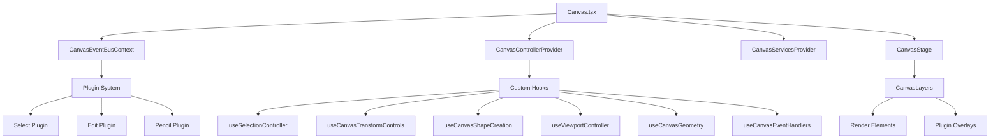
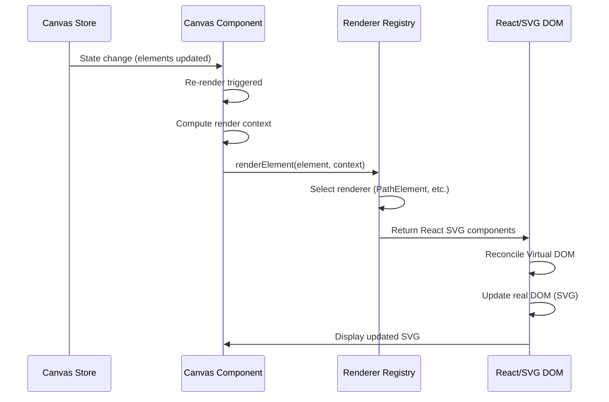

# Canvas

The **Canvas** is the core rendering and interaction surface of TTPE. It's an infinite 2D workspace where users create, edit, and manipulate vector graphics using an **SVG-based rendering system** with React components.

## Overview

The Canvas component (`/src/canvas/Canvas.tsx`) is responsible for:

- **Rendering all canvas elements** as SVG (paths, groups, shapes, text)
- **Handling viewport transformations** (pan, zoom via SVG viewBox)
- **Managing user interactions** (pointer/touch events, gesture recognition)
- **Coordinating with plugins** via event bus for tool-specific behavior
- **Providing layered overlays** through plugin system

The canvas uses a **modular hook-based architecture** with centralized control:

1. **Canvas Controller**: Centralized state and operations via Context
2. **Event Bus**: Plugin communication system
3. **Custom Hooks**: 24+ specialized hooks for different concerns
4. **Plugin Layers**: Plugins render their own overlays on top of elements

## Architecture



## Canvas Coordinate Systems

TTPE uses **multiple coordinate systems** for different purposes:

### 1. **Screen Coordinates** (Viewport Space)
- Origin: Top-left corner of the browser window
- Units: CSS pixels
- Used for: Pointer/touch events, UI positioning

### 2. **Canvas Coordinates** (SVG World Space)
- Origin: Transformed by SVG viewBox (pan/zoom)
- Units: SVG user units (1 unit = 1px at zoom level 1.0)
- Used for: Element positions, rendering, geometric calculations

### 3. **Element Local Coordinates**
- Origin: Element's own coordinate system
- Units: Relative to element's transform matrix
- Used for: Path data, shape dimensions, nested transforms

**Coordinate conversion** (from `useViewportController`):

```typescript
// Screen to canvas coordinates (via SVG coordinate transformation)
function screenToCanvas(svg: SVGSVGElement, screenX: number, screenY: number): Point {
  const point = svg.createSVGPoint();
  point.x = screenX;
  point.y = screenY;
  const ctm = svg.getScreenCTM();
  if (ctm) {
    const transformed = point.matrixTransform(ctm.inverse());
    return { x: transformed.x, y: transformed.y };
  }
  return { x: screenX, y: screenY };
}

// Canvas to screen coordinates
function canvasToScreen(x: number, y: number, viewport: Viewport): Point {
  return {
    x: x * viewport.zoom + viewport.offsetX,
    y: y * viewport.zoom + viewport.offsetY
  };
}
```

## Rendering Pipeline

The canvas uses **React's reconciliation** with SVG elements for rendering:



### Rendering Phases

1. **State Change**: Canvas Store state update triggers Canvas re-render
2. **Context Preparation**: Build `CanvasRenderContext` with viewport, handlers, selections
3. **Element Rendering**: Each element passed through `canvasRendererRegistry.render()`
4. **Component Creation**: Registry returns React SVG components (`<path>`, `<g>`, etc.)
5. **React Reconciliation**: React diffs and updates actual SVG DOM
6. **Plugin Layers**: Plugins render their overlays on top via `CanvasLayers`

### Renderer Registry

The `CanvasRendererRegistry` (`/src/canvas/renderers/CanvasRendererRegistry.ts`) maps element types to React components:

```typescript
interface CanvasRenderContext {
  viewport: Viewport;
  activePlugin: string;
  isElementHidden: (id: string) => boolean;
  isElementLocked: (id: string) => boolean;
  isElementSelected: (id: string) => boolean;
  isTransforming: boolean;
  isSelecting: boolean;
  isCreatingShape: boolean;
  eventHandlers: {
    onPointerUp: (id: string, e: React.PointerEvent) => void;
    onPointerDown: (id: string, e: React.PointerEvent) => void;
    onDoubleClick: (id: string, e: React.MouseEvent) => void;
    onTouchEnd: (id: string, e: React.TouchEvent) => void;
  };
}

canvasRendererRegistry.render(element, context) // Returns React.ReactNode
```

## Event Handling

The Canvas uses an **Event Bus architecture** for plugin communication:

```typescript
// Event flow
Pointer/Touch/Keyboard event on SVG
  ↓
Canvas event handler (useCanvasEventHandlers)
  ↓
Convert screen coords to canvas coords (screenToCanvas)
  ↓
Emit to Event Bus (eventBus.emit)
  ↓
Plugins subscribed to event receive notification
  ↓
Plugin updates Canvas Store state
  ↓
Canvas re-renders with new state
```

**Core Event Handlers** (from `useCanvasEventHandlers`):

- **handlePointerDown**: Start interactions (selection, dragging, drawing)
- **handlePointerMove**: Continuous interactions (dragging, drawing strokes)
- **handlePointerUp**: End interactions (finalize selection, complete paths)
- **handleElementClick**: Element selection/deselection
- **handleElementDoubleClick**: Enter edit mode for elements
- **handleCanvasDoubleClick**: Exit current mode to select mode

**Event Bus Events** (`CanvasEventBusContext`):

```typescript
eventBus.emit('pointerdown', { event, point, target, activePlugin, helpers, state });
eventBus.emit('pointermove', { event, point, target, activePlugin, helpers, state });
eventBus.emit('pointerup', { event, point, target, activePlugin, helpers, state });
```

Plugins subscribe to these events via `useCanvasEventBus()` hook.

## Viewport Management

The viewport controls the **visible region** and **zoom level** using **SVG viewBox**:

```typescript
interface Viewport {
  offsetX: number;      // Pan X offset (canvas units)
  offsetY: number;      // Pan Y offset (canvas units)
  zoom: number;         // Zoom level (0.1 to 10.0)
}
```

**ViewBox Calculation** (from `useViewportController`):

```typescript
function getViewBoxString(canvasSize: Size): string {
  const viewportWidth = canvasSize.width / viewport.zoom;
  const viewportHeight = canvasSize.height / viewport.zoom;
  return `${-viewport.offsetX} ${-viewport.offsetY} ${viewportWidth} ${viewportHeight}`;
}

// Applied to SVG element:
<svg viewBox={getViewBoxString(canvasSize)} ... />
```

**Viewport Operations:**

- **Pan**: Translate canvas view (Space + Drag, implemented in `useCanvasDragInteractions`)
- **Zoom**: Scale canvas view (Ctrl/Cmd + Wheel in `useCanvasZoom`, or Pinch in `useMobileTouchGestures`)
- **Reset Zoom**: `resetZoom()` action in Canvas Store (resets to zoom: 1, offsets: 0)

**Zoom Behavior** (from `useCanvasZoom`):

- Zoom centers on **mouse cursor position** (not canvas center)
- Minimum zoom: `0.1` (10%)
- Maximum zoom: `10.0` (1000%)
- Zoom steps: `zoomFactor = 1.2` multiplier per action

## Canvas State

The Canvas subscribes to **Canvas Store** state using Zustand selectors:

```typescript
// From Canvas.tsx and custom hooks
const elements = useCanvasStore(state => state.elements);
const viewport = useCanvasStore(state => state.viewport);
const selectedIds = useCanvasStore(state => state.selectedIds);
const editingPoint = useCanvasStore(state => state.editingPoint);
const selectedCommands = useCanvasStore(state => state.selectedCommands);
const selectedSubpaths = useCanvasStore(state => state.selectedSubpaths);
const draggingSelection = useCanvasStore(state => state.draggingSelection);
const pencil = useCanvasStore(state => state.pencil);
const addPointMode = useCanvasStore(state => state.addPointMode);
```

**Key State Properties:**

- `elements`: Array of all canvas elements (paths, groups, shapes, text)
- `viewport`: Pan/zoom state (offsetX, offsetY, zoom)
- `selectedIds`: Currently selected element IDs
- `elementMap`: Map of element ID → element (for fast lookups)
- `sortedElements`: Elements sorted by Z-index (rendering order)
- Plugin-specific state: `pencil`, `addPointMode`, `editingPoint`, etc.

## Performance Optimizations

TTPE implements several optimizations for smooth rendering:

### 1. **React SVG Reconciliation**
React efficiently diffs and updates only changed SVG elements (not full re-renders).

### 2. **Zustand Granular Selectors**
Use specific selectors to minimize component re-renders:

```typescript
// ❌ Bad: Re-renders on ANY state change
const state = useCanvasStore();

// ✅ Good: Only re-renders when elements change
const elements = useCanvasStore(state => state.elements);
```

### 3. **Memoized Contexts**
`canvasLayerContext` and `renderContext` use `useMemo` to prevent unnecessary re-creation.

### 4. **Ref-Based Callbacks**
Functions like `moveSelectedElements` stored in refs to avoid stale closures:

```typescript
const moveSelectedElementsRef = useRef(moveSelectedElements);
useEffect(() => {
  moveSelectedElementsRef.current = moveSelectedElements;
}, [moveSelectedElements]);
```

### 5. **Dynamic Canvas Size**
`useDynamicCanvasSize` hook adjusts canvas dimensions to viewport without full re-renders.

### 6. **Temporal State Subscription**
Undo/redo state subscribed separately to avoid main Canvas re-renders on history changes.

## Canvas Overlays (Plugin Layers)

Overlays are rendered by **plugins through `CanvasLayers` component**:

### Plugin Layer System

Plugins register layers via Plugin Manager that render on top of canvas elements:

```typescript
// Example: SelectionOverlay from Select Plugin
pluginManager.registerPlugin({
  id: 'select',
  layers: [
    {
      id: 'selection-overlay',
      component: SelectionOverlay,
      position: 'overlay', // Renders on top of elements
    }
  ]
});
```

### Common Plugin Overlays

**Select Plugin**:
- Selection rectangles (blue dashed borders)
- Transformation handles (corner/edge handles)
- Rotation handle
- Center point indicator

**Edit Plugin**:
- Bézier control point handles
- Control point connecting lines
- Smooth brush cursor
- Add point mode indicators

**Subpath Plugin**:
- Path direction indicators
- Start/end markers
- Selected subpath highlighting

**Grid Plugin**:
- Grid lines (configurable spacing, subdivisions)
- Ruler markings
- Origin indicator

**Guidelines Plugin**:
- Horizontal/vertical alignment guides
- Snapping indicators (red lines)
- Distance labels

## Integration with Plugins

The Canvas exposes multiple integration points for plugins:

### 1. **Event Bus Subscriptions**

Plugins subscribe to pointer/touch events:

```typescript
const eventBus = useCanvasEventBus();

useEffect(() => {
  const handlePointerDown = (eventData) => {
    // Plugin logic here
  };
  
  eventBus.on('pointerdown', handlePointerDown);
  return () => eventBus.off('pointerdown', handlePointerDown);
}, [eventBus]);
```

### 2. **Canvas Layer Context**

Plugins receive `CanvasLayerContext` with controller methods:

```typescript
interface CanvasLayerContext {
  // Controller methods
  elements: CanvasElement[];
  viewport: Viewport;
  selectedIds: string[];
  updateElement: (id: string, updates: Partial<CanvasElement>) => void;
  // ... many more methods
  
  // Canvas-specific
  activePlugin: string;
  canvasSize: Size;
  getElementBounds: (elementId: string) => Bounds | null;
  
  // Plugin-specific (conditionally added)
  isSmoothBrushActive?: boolean;
  smoothBrush?: SmoothBrushState;
  isCreatingShape?: boolean;
  shapeStart?: Point;
  // ...
}
```

### 3. **Canvas Store Access**

Plugins directly access Canvas Store for state and actions:

```typescript
const elements = useCanvasStore(state => state.elements);
const addElement = useCanvasStore(state => state.addElement);
```

### 4. **Renderer Registry**

Plugins can register custom element renderers:

```typescript
canvasRendererRegistry.register('custom-type', CustomElementRenderer);
```

## Canvas Component Props

The Canvas component is **self-contained** with no props:

```typescript
export const Canvas: React.FC = () => {
  // All state from Canvas Store
  // All interactions via Event Bus
  // All rendering via React SVG
}
```

The Canvas is fully reactive to Canvas Store state changes.

## File Structure

```
src/canvas/
├── Canvas.tsx                          # Main Canvas component (522 lines)
├── CanvasEventBusContext.tsx           # Event Bus Context and Provider
├── components/
│   ├── CanvasLayers.tsx                # Plugin layer rendering
│   └── CanvasStage.tsx                 # Main SVG stage component
├── controller/
│   ├── CanvasControllerContext.ts      # Controller Context definition
│   └── CanvasControllerProvider.tsx    # Centralized controller with all canvas operations
├── geometry/
│   └── CanvasGeometryService.ts        # Geometric calculations service
├── hooks/                              # 24 specialized hooks
│   ├── useCanvasDragInteractions.ts    # Drag point/element interactions
│   ├── useCanvasEventBusManager.ts     # Event bus instance management
│   ├── useCanvasEventHandlerDeps.ts    # Event handler dependencies preparation
│   ├── useCanvasEventHandlers.ts       # Main event handlers (pointer/touch/click)
│   ├── useCanvasGeometry.ts            # Element bounds calculations
│   ├── useCanvasKeyboardControls.ts    # Keyboard state (Space, modifiers)
│   ├── useCanvasModeMachine.ts         # Mode state machine
│   ├── useCanvasPointerSelection.ts    # Pointer-based selection
│   ├── useCanvasServiceActivation.ts   # Service activation logic
│   ├── useCanvasShapeCreation.ts       # Shape creation interactions
│   ├── useCanvasShortcuts.ts           # Keyboard shortcut registry
│   ├── useCanvasSideEffects.ts         # Side effects management
│   ├── useCanvasSmoothBrush.ts         # Smooth brush for transformations
│   ├── useCanvasTransformControls.ts   # Transformation (move/rotate/scale)
│   ├── useCanvasZoom.ts                # Mouse wheel zoom
│   ├── useDoubleTap.ts                 # Touch double-tap detection
│   ├── useDynamicCanvasSize.ts         # Responsive canvas sizing
│   ├── useEditAddPoint.ts              # Edit mode: add point to path
│   ├── useEditSmoothBrush.ts           # Edit mode: smooth brush
│   ├── useElementDoubleTap.ts          # Element double-tap handler
│   ├── useMobileTouchGestures.ts       # Touch gestures (pinch zoom, pan)
│   ├── usePencilDrawing.ts             # Pencil drawing service management
│   ├── usePointerStateController.ts    # Pointer state coordination
│   ├── useSelectionController.ts       # Selection rectangle logic
│   └── useViewportController.ts        # Viewport transformation (viewBox)
├── interactions/                       # Interaction controllers
│   ├── CurvesController.ts             # Curves plugin interactions
│   ├── SelectionController.ts          # Selection logic
│   ├── ShapeCreationController.ts      # Shape creation logic
│   ├── SmoothBrushController.ts        # Smooth brush logic
│   └── TransformController.ts          # Transformation logic
├── listeners/
│   └── AddPointListener.ts             # Add point event listener
├── modes/
│   └── CanvasModeMachine.ts            # Mode state machine definition
├── renderers/
│   ├── CanvasRendererRegistry.ts       # Element renderer registry
│   ├── PathElementRenderer.tsx         # Path element SVG renderer
│   └── index.ts                        # Exports
├── selection/
│   └── SelectionController.ts          # Selection state management
├── services/
│   ├── CanvasServicesProvider.tsx      # Services Context Provider
│   └── PencilDrawingService.ts         # Pencil drawing service
├── shortcuts/                          # Keyboard shortcut definitions
└── viewport/
    └── ViewportController.ts           # Viewport operations
```

## Usage Example

The Canvas is rendered in the main App component:

```tsx
import { Canvas } from './canvas/Canvas';

function App() {
  return (
    <div style={{ width: '100vw', height: '100vh', position: 'relative' }}>
      <Canvas />
      <Sidebar />
      <TopActionBar />
      <BottomActionBar />
    </div>
  );
}
```

Canvas is positioned absolutely to fill viewport, with UI overlays on top.

## Related Documentation

- [Architecture Overview](../architecture/overview.md) - Application architecture
- [Plugin System](../plugins/overview.md) - How plugins interact with Canvas
- [Select Plugin](../plugins/catalog/select.md) - Selection and transformation
- [Pencil Plugin](../plugins/catalog/pencil.md) - Freehand drawing on canvas
- [Transform System](../features/transforms.md) - Element transformations
- [Viewport Operations](../features/transforms.md) - Pan and zoom

## Best Practices

### For Plugin Developers

1. **Use Event Bus**: Subscribe to `pointerdown`/`pointermove`/`pointerup` via `useCanvasEventBus()`
2. **Access Layer Context**: Receive `CanvasLayerContext` in plugin layer components
3. **Convert coordinates**: Use `screenToCanvas` from context for pointer coordinates
4. **Render overlays**: Register plugin layers to render on top of elements
5. **Clean up subscriptions**: Unsubscribe from Event Bus in cleanup functions

### For Contributors

1. **Create focused hooks**: Keep hooks single-purpose and composable
2. **Use refs for callbacks**: Avoid stale closures with `useRef` + `useEffect`
3. **Memoize expensive values**: Use `useMemo` for computed contexts
4. **Granular Zustand selectors**: Subscribe to specific state slices only
5. **Test across devices**: Verify pointer/touch events work on desktop, tablet, mobile
6. **Profile rendering**: Use React DevTools Profiler to identify re-render bottlenecks
