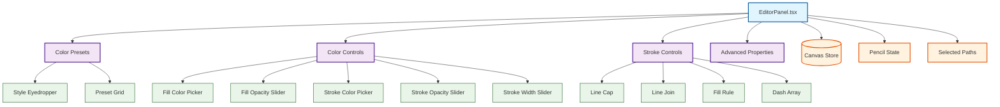

# Editor Panel

The **Editor Panel** provides universal stroke/fill/opacity controls, independent of the active mode. This panel is **transversal** - it appears in all modes except `file` and `settings`, providing consistent access to visual properties regardless of which tool is active.

## Overview

The Editor Panel (`/src/sidebar/panels/EditorPanel.tsx`) serves as the **universal property editor** for VectorNest:

- **Transversal panel**: Available in all editing modes
- **Dual operation modes**: Creation mode (no selection) and editing mode (selection active)
- **Collapsible sections**: Color presets, detailed color controls, advanced stroke properties
- **State persistence**: Properties stored in Canvas Store

## Features

### 1. Color Presets (Top Row)

- **Style Eyedropper**: Copy stroke/fill/opacity from one path and apply to selected paths
  - Enabled only when exactly 1 path is selected
  - Click to activate, then click another path to copy its style
- **Preset Grid**: 8-10 predefined color/stroke combinations (responsive)
- **Expand/Collapse Toggle**: Show/hide detailed color controls

### 2. Color Controls (Collapsible)

When expanded, provides detailed control over fill and stroke:

- **Fill Color & Opacity**:
  - Color picker (circular button)
  - Opacity slider (0-100%)
  - "None" toggle (X button) for transparent fill

- **Stroke Color & Opacity**:
  - Color picker (circular button)
  - Opacity slider (0-100%)
  - "None" toggle (X button) for no stroke

- **Stroke Width**:
  - Slider control (0-20px)
  - Direct value input

**Note:** For stroke width and similar non-percent sliders, directly editing the numeric value now accepts numbers above the configured slider `max` and passes the typed value to the underlying `onChange` handler. The slider thumb remains visually clamped to `min`/`max` while the numeric value can be higher — this is useful for larger stroke widths or other cases where typing an exact out-of-range value is required.

### 3. Advanced Stroke Properties (Collapsible)

Expand/collapse via chevron button next to stroke width:

- **Line Cap**: How line ends are rendered
  - `butt`: Flat edge at path end
  - `round`: Rounded edge extending beyond path end
  - `square`: Square edge extending beyond path end

- **Line Join**: How corners are rendered
  - `miter`: Sharp corner
  - `round`: Rounded corner
  - `bevel`: Beveled corner

- **Fill Rule**: How overlapping paths are filled
  - `nonzero`: Non-zero winding rule
  - `evenodd`: Even-odd rule

- **Dash Array**: Stroke dash pattern
  - Custom input (e.g., "5,3,2,3")
  - Preset buttons (solid, dashed, dotted)
  - "none" for solid stroke

## Behavior Modes

The Editor Panel operates in two modes based on selection:

### Creation Mode (No Selection)

- Shows default values for new paths
- Changes affect newly created elements
- Values stored in `pencil` state in Canvas Store
- Used as defaults by drawing tools

### Editing Mode (Path(s) Selected)

- Shows properties of selected path(s)
- If 1 path selected: shows that path's values
- If multiple paths selected: shows common values (or mixed indicator)
- Changes apply to all selected paths immediately
- Updates `strokeColor`, `fillColor`, `strokeWidth`, etc. on selected elements

## Code Reference

```typescript
// From EditorPanel.tsx
const updatePathProperty = <T,>(property: string, value: T) => {
  if (selectedPathsCount > 0) {
    // Editing mode: update selected paths
    updateSelectedPaths?.({ [property]: value });
  } else {
    // Creation mode: update default pencil state
    updatePencilState?.({ [property]: value });
  }
};

// Get current value from selection or defaults
const currentStrokeColor = useSelectedPathProperty(
  'strokeColor',
  pencil?.strokeColor ?? defaultStrokeColor
);
```

## Visibility

**When visible**: All modes except `file` and `settings`

**Panel visibility logic** (from `panelConfig.tsx`):

```typescript
// Editor Panel: always visible except in file/settings modes
{
  key: 'editor',
  condition: (ctx) => !ctx.isInSpecialPanelMode, // isInSpecialPanelMode = file or settings
  component: EditorPanel,
}
```

## Architecture

