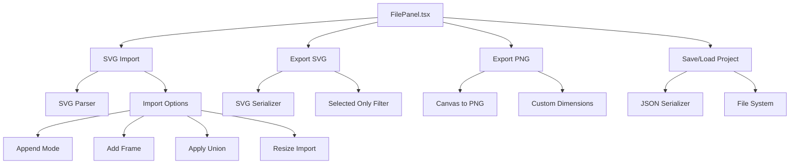
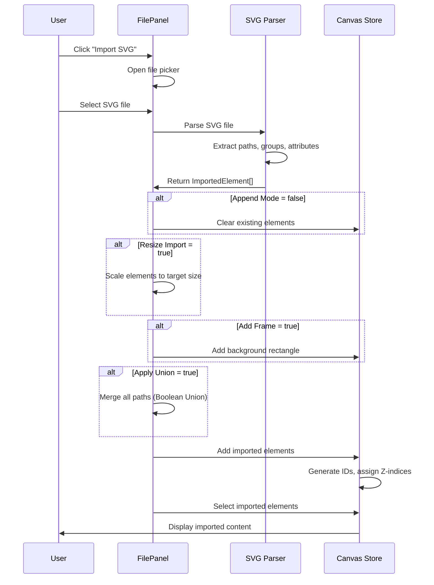

# File Panel

The **File Panel** provides import/export functionality and project management for TTPE. It allows users to import SVG files, export canvas to SVG/PNG, and save/load project files in JSON format.

## Overview

The File Panel (`/src/sidebar/panels/FilePanel.tsx`) is accessible via the **File button** in the Top Action Bar and provides:

- **Import SVG**: Load SVG files into canvas with advanced options
- **Export SVG**: Save canvas as SVG file (all elements or selected only)
- **Export PNG**: Render canvas to PNG image with custom dimensions
- **Save Project**: Serialize canvas state to JSON file
- **Load Project**: Restore canvas from saved JSON file
- **Document Name**: Set project name (used in filenames)

## Architecture



## Import SVG

Import SVG files into the canvas with various processing options.

### Basic Import

**Usage:**

1. Click **"Import SVG"** button
2. Select an SVG file from file picker
3. Canvas is replaced with imported content (default behavior)

**Behavior:**

- Parses SVG file using `importSVGWithDimensions()`
- Converts `<path>`, `<rect>`, `<circle>`, `<ellipse>`, `<line>`, `<polygon>`, `<polyline>` to canvas paths
- Preserves `<g>` groups as canvas groups with hierarchy
- Extracts SVG dimensions (width/height/viewBox) for proper scaling
- Clears existing canvas elements (unless Append Mode enabled)
- Selects imported elements after import

### Import Options

#### Append Mode

**Toggle**: `appendMode` (default: `false`)

When enabled, imported SVG elements are **added** to existing canvas instead of replacing it.

```typescript
if (!appendMode) {
  // Clear existing elements
  clearCanvas();
}

// Add imported elements
addImportedElementsToCanvas(elements, addElement, updateElement);
```

**Use cases:**

- Combine multiple SVG files
- Import icons/assets into existing design
- Build complex compositions from separate files

---

#### Add Frame

**Toggle**: `addFrame` (default: `false`)

Automatically creates a **background rectangle** matching SVG dimensions.

```typescript
if (addFrame) {
  const frameId = addElement({
    type: 'path',
    data: {
      subPaths: [[
        { type: 'M', points: [0, 0] },
        { type: 'L', points: [width, 0] },
        { type: 'L', points: [width, height] },
        { type: 'L', points: [0, height] },
        { type: 'Z', points: [] },
      ]],
      fillColor: '#ffffff',
      strokeColor: 'none',
      strokeWidth: 0,
    },
  });
}
```

**Use cases:**

- Create artboard/canvas boundary
- Add white background for transparent SVGs
- Export with visible bounds

---

#### Apply Union

**Toggle**: `applyUnion` (default: `false`)

Applies **Boolean Union** operation to merge all imported paths into a single path.

```typescript
if (applyUnion && elements.length > 1) {
  const unionPath = performPathUnion(elements);
  // Replace all elements with single merged path
  addElement({ type: 'path', data: unionPath });
}
```

**Algorithm**: Uses polygon clipping library (e.g., `polygon-clipping`)

**Use cases:**

- Simplify complex SVGs with many overlapping paths
- Create compound shapes
- Reduce element count for performance

**Note**: Only works with closed paths (shapes), not open paths (lines).

---

#### Resize Import

**Toggle**: `resizeImport` (default: `false`)  
**Dimensions**: `resizeWidth` (default: 64), `resizeHeight` (default: 64)

Scales imported SVG to fit specified dimensions while **preserving aspect ratio**.

```typescript
if (resizeImport) {
  const scale = Math.min(resizeWidth / svgWidth, resizeHeight / svgHeight);
  
  // Transform all path commands
  elements = mapImportedElements(elements, (pathData) => ({
    ...pathData,
    subPaths: pathData.subPaths.map(subPath => 
      transformCommands(subPath, { scaleX: scale, scaleY: scale })
    ),
    strokeWidth: calculateScaledStrokeWidth(pathData.strokeWidth, scale),
  }));
}
```

**Aspect ratio**: Scales uniformly (no distortion)

**Stroke width**: Automatically adjusted to maintain visual appearance

**Use cases:**

- Import icons at consistent size
- Scale artwork to fit canvas
- Create thumbnail previews

---

### Import Flow



---

## Export SVG

Export canvas to SVG file format.

### Basic Export

**Usage:**

1. Click **"Export SVG"** button
2. File is automatically downloaded as `{documentName}.svg`

**Behavior:**

- Serializes canvas elements to SVG XML
- Preserves paths, groups, transforms, styles
- Generates clean SVG code (no inline styles, uses attributes)
- Includes `viewBox` calculated from element bounds

### Export Options

#### Selected Only

**Toggle**: `svgSelectedOnly` (default: `false`)

Export only selected elements instead of entire canvas.

```typescript
const elementsToExport = svgSelectedOnly 
  ? elements.filter(el => selectedIds.includes(el.id))
  : elements;

const svgContent = saveAsSvg(elementsToExport);
```

**Use cases:**

- Export specific elements as separate files
- Extract portions of design
- Create component library

### SVG Output Format

```xml
<svg xmlns="http://www.w3.org/2000/svg" 
     width="800" height="600" 
     viewBox="0 0 800 600">
  <g id="group-1" data-name="My Group">
    <path d="M 0 0 L 100 0 L 100 100 L 0 100 Z"
          fill="#ff0000"
          stroke="#000000"
          stroke-width="2" />
  </g>
</svg>
```

**Features:**

- Clean attribute-based styling (no inline styles)
- Preserves group hierarchy with `<g>` elements
- Group names stored in `data-name` attribute
- Transform matrices applied to paths (flattened)
- Optimized path data (removes redundant commands)

---

## Export PNG

Render canvas to PNG image file.

### Basic Export

**Usage:**

1. Set PNG dimensions (width/height)
2. Toggle "Selected Only" if desired
3. Click **"Export PNG"** button
4. Image is downloaded as `{documentName}.png`

**Behavior:**

- Renders canvas to offscreen Canvas element
- Converts to PNG using `canvas.toDataURL('image/png')`
- Triggers browser download
- Preserves transparency (alpha channel)

### PNG Options

#### Dimensions

**Inputs**: `pngWidth` (default: viewport width), `pngHeight` (default: viewport height)

Specify output image dimensions in pixels.

```typescript
const canvas = document.createElement('canvas');
canvas.width = pngWidth;
canvas.height = pngHeight;

const ctx = canvas.getContext('2d');
renderElementsToContext(ctx, elements, { scale: pngWidth / canvasWidth });

const dataUrl = canvas.toDataURL('image/png');
downloadFile(dataUrl, `${documentName}.png`);
```

**Scaling**: Elements are scaled to fit specified dimensions

**Quality**: Full resolution (no compression)

#### Selected Only

**Toggle**: `pngSelectedOnly` (default: `true`)

Export only selected elements (with transparent background).

**Use cases:**

- Export individual elements as PNG assets
- Create image thumbnails
- Generate sprite sheets

---

## Save/Load Project

Serialize and restore entire canvas state.

### Save Project

**Usage:**

1. Set document name (optional)
2. Click **"Save Project"** button
3. File is downloaded as `{documentName}.json`

**Saved Data:**

```json
{
  "version": "1.0",
  "documentName": "My Project",
  "elements": [
    {
      "id": "path-1",
      "type": "path",
      "zIndex": 0,
      "data": {
        "subPaths": [[...]],
        "fillColor": "#ff0000",
        "strokeColor": "#000000",
        "strokeWidth": 2
      }
    }
  ],
  "viewport": {
    "offsetX": 0,
    "offsetY": 0,
    "zoom": 1
  },
  "grid": {
    "enabled": true,
    "spacing": 20,
    "subdivisions": 5
  },
  "settings": {
    "defaultStrokeColor": "#000000",
    "defaultFillColor": "none"
  }
}
```

**Includes:**

- All canvas elements (paths, groups, with full data)
- Viewport state (pan, zoom)
- Grid configuration
- App settings
- Document metadata

### Load Project

**Usage:**

1. Click **"Load Project"** button
2. Select a `.json` file
3. Canvas is replaced with loaded project

**Behavior:**

- Parses JSON file
- Validates schema version
- Restores all elements with IDs
- Restores viewport, grid, settings
- Clears existing canvas
- Clears undo/redo history (fresh start)

**Error Handling:**

- Invalid JSON → Show error toast
- Missing required fields → Show error toast
- Version mismatch → Attempt migration or show warning

---

## Document Name

The document name is used as the default filename for exports.

### Usage

**Input**: Text input at top of File Panel

```tsx
<Input
  value={localDocumentName}
  onChange={(e) => setLocalDocumentName(e.target.value)}
  onBlur={handleSaveDocumentName}
  placeholder="Untitled Document"
  size="sm"
/>
```

**Behavior:**

- Changes are saved to Canvas Store on blur (debounced)
- Used in export filenames: `{documentName}.svg`, `{documentName}.png`, `{documentName}.json`
- Persists across sessions (stored in Canvas Store persistence)
- Default: "Untitled Document"

**Auto-save indicator:**

Shows "Saving..." feedback briefly after edits.

---

## Panel Layout

The File Panel uses collapsible sections for better organization:

```tsx
<Panel title="File" icon={<FolderOpen />}>
  {/* Document Name */}
  <FormControl>
    <FormLabel>Document Name</FormLabel>
    <Input value={documentName} onChange={setDocumentName} />
  </FormControl>

  {/* Import Section */}
  <VStack spacing={2}>
    <PanelStyledButton onClick={handleImportSVG}>
      Import SVG
    </PanelStyledButton>
    
    {/* Advanced Options (Collapsible) */}
    <Collapse in={isAdvancedOpen}>
      <VStack spacing={2}>
        <PanelToggle value={appendMode} onChange={setAppendMode}>
          Append Mode
        </PanelToggle>
        <PanelToggle value={addFrame} onChange={setAddFrame}>
          Add Frame
        </PanelToggle>
        <PanelToggle value={applyUnion} onChange={setApplyUnion}>
          Apply Union
        </PanelToggle>
        <PanelToggle value={resizeImport} onChange={setResizeImport}>
          Resize Import
        </PanelToggle>
        {resizeImport && (
          <HStack>
            <NumberInput value={resizeWidth} onChange={setResizeWidth} />
            <NumberInput value={resizeHeight} onChange={setResizeHeight} />
          </HStack>
        )}
      </VStack>
    </Collapse>
    
    <IconButton 
      icon={isAdvancedOpen ? <ChevronUp /> : <ChevronDown />}
      onClick={onAdvancedToggle}
      aria-label="Toggle Advanced Options"
    />
  </VStack>

  {/* Export Section */}
  <VStack spacing={2}>
    <PanelStyledButton onClick={handleExportSVG}>
      Export SVG
    </PanelStyledButton>
    <PanelToggle value={svgSelectedOnly} onChange={setSvgSelectedOnly}>
      Selected Only
    </PanelToggle>
    
    <PanelStyledButton onClick={handleExportPNG}>
      Export PNG
    </PanelStyledButton>
    <HStack>
      <NumberInput value={pngWidth} onChange={setPngWidth} />
      <NumberInput value={pngHeight} onChange={setPngHeight} />
    </HStack>
    <PanelToggle value={pngSelectedOnly} onChange={setPngSelectedOnly}>
      Selected Only
    </PanelToggle>
  </VStack>

  {/* Project Management */}
  <VStack spacing={2}>
    <PanelStyledButton onClick={handleSaveProject}>
      Save Project
    </PanelStyledButton>
    <PanelStyledButton onClick={handleLoadProject}>
      Load Project
    </PanelStyledButton>
  </VStack>
</Panel>
```

---

## Integration with Canvas Store

File Panel operations modify Canvas Store state:

```typescript
// Import SVG
const addElement = useCanvasStore(state => state.addElement);
const updateElement = useCanvasStore(state => state.updateElement);
const selectElements = useCanvasStore(state => state.selectElements);

// Export
const saveAsSvg = useCanvasStore(state => state.saveAsSvg);
const saveDocument = useCanvasStore(state => state.saveDocument);

// Project management
const loadDocument = useCanvasStore(state => state.loadDocument);
const setDocumentName = useCanvasStore(state => state.setDocumentName);
```

---

## File Formats

### Supported Import Formats

- **SVG**: Full SVG 1.1 support (paths, shapes, groups, transforms, styles)

### Supported Export Formats

- **SVG**: Clean, optimized SVG XML
- **PNG**: Raster image with transparency
- **JSON**: TTPE project format (full state serialization)

---

## Related Documentation

- [Sidebar](./sidebar.md) - Sidebar container and navigation
- [Canvas Store](../api/canvas-store) - State management API
- [Persistence](../features/persistence.md) - Project save/load

---

## Best Practices

### For Users

1. **Save frequently**: Use Save Project to preserve work
2. **Name your document**: Set meaningful document names for exports
3. **Test import options**: Preview with different options before committing
4. **Export selected only**: Extract specific elements for reuse
5. **Use resize import**: Maintain consistent sizes for icons/assets

### For Developers

1. **Validate imported SVG**: Check for malformed paths or invalid attributes
2. **Handle errors gracefully**: Show user-friendly error messages
3. **Optimize exports**: Remove unnecessary attributes/metadata
4. **Preserve metadata**: Keep group names and structure
5. **Test edge cases**: Empty canvas, single element, large files

---

## Future Enhancements

- **PDF Export**: Export canvas to PDF format
- **Batch Import**: Import multiple SVG files at once
- **Cloud Storage**: Save/load projects from cloud services
- **Version Control**: Track project history and revisions
- **Import Preview**: Show preview before importing
- **Export Presets**: Save export settings as presets
- **Auto-save**: Automatically save projects periodically
