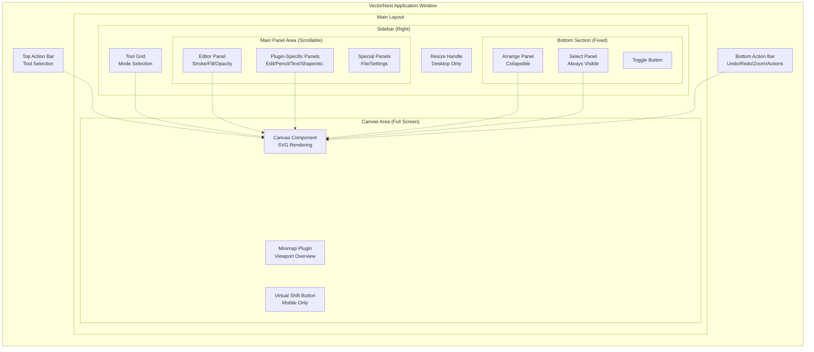
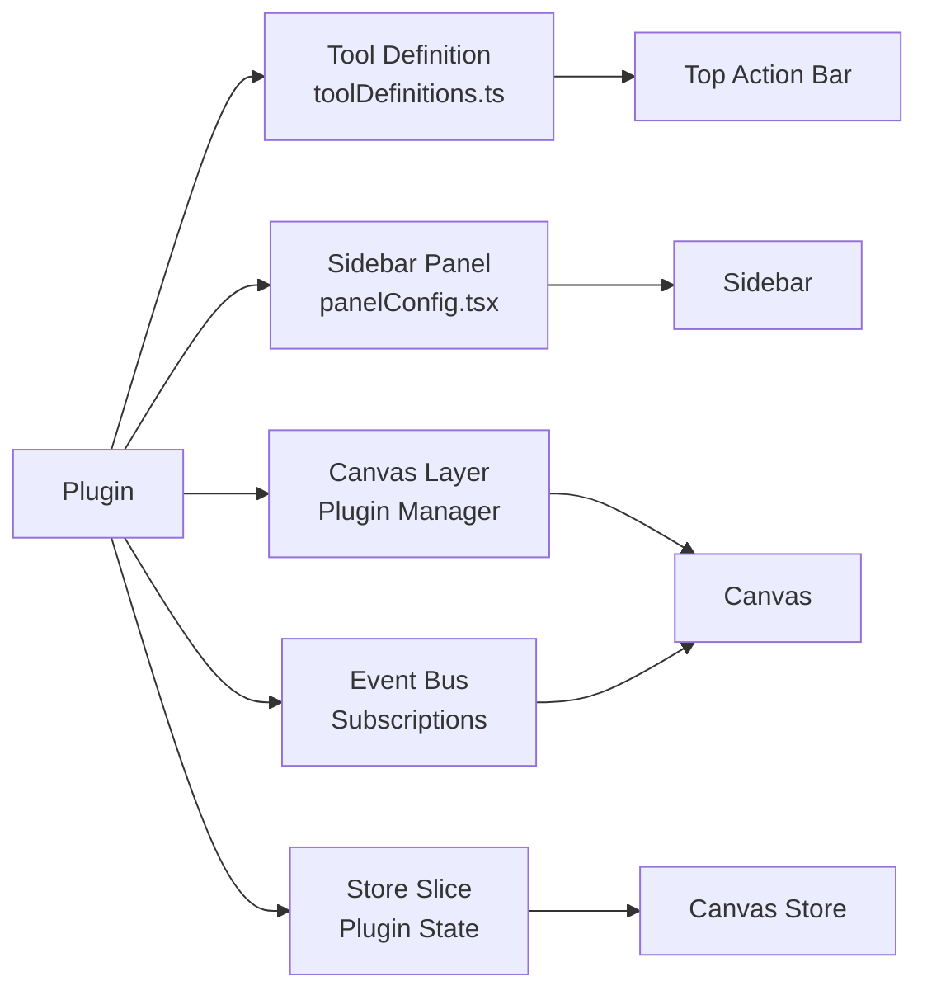

# Application Structure Overview

VectorNest is a **React-based vector graphics editor** with a modular architecture. This page provides a visual overview of how the major UI components are organized and interact.

## Visual Layout

The application consists of several key areas that work together to provide the editing experience:



## Component Hierarchy

```
App.tsx
├── Canvas (Full viewport)
│   ├── CanvasStage (SVG rendering)
│   ├── CanvasLayers (Plugin overlays)
│   └── Event Handlers (Pointer/Touch/Keyboard)
│
├── Top Action Bar (Floating, top)
│   ├── Tool Buttons (Select, Pencil, Edit, etc.)
│   ├── Menu Button (Drawer mode only)
│   └── Animated Background (Active tool indicator)
│
├── Bottom Action Bar (Floating, bottom)
│   ├── Undo/Redo Buttons (with counters)
│   ├── Zoom Controls (Out/Reset/In)
│   └── Context Menu Button (with counter)
│
├── Sidebar (Right, pinned or drawer)
│   ├── Resize Handle (Pinned mode, desktop)
│   ├── Tool Grid (Fixed, top)
│   │   ├── Mode Buttons (9 modes)
│   │   └── Pin Toggle (Desktop)
│   │
│   ├── Main Panel Area (Scrollable)
│   │   ├── Editor Panel (Transversal)
│   │   ├── Plugin Panels (Mode-specific)
│   │   └── Special Panels (File/Settings)
│   │
│   └── Bottom Section (Fixed, bottom)
│       ├── Arrange Panel (Collapsible, when selected)
│       ├── Toggle Button (Expand/Collapse)
│       └── Select Panel (Always visible)
│
├── Minimap (Bottom-right corner, optional)
│   └── Viewport rectangle overlay
│
└── Virtual Shift Button (Bottom-right, mobile only)
    └── Constraint modifier for drawing
```

## Layout Zones

The application UI can be divided into several functional zones:

### 1. Canvas Zone (Center)

**Position**: Full viewport, `position: relative`
**Z-index**: Base layer (z-index: 0)

**Contains**:
- SVG canvas for element rendering
- Plugin overlay layers
- Event capture surface

**Characteristics**:
- Infinite scrollable workspace
- Viewport-based pan and zoom
- Plugin-specific overlays (selection, handles, guidelines, grid)

---

### 2. Action Bars Zone (Overlay)

**Position**: Floating overlays, `position: fixed`
**Z-index**: 
- Top Bar: 999
- Bottom Bar: 1000

**Top Action Bar**:
- Horizontal position: Adjusts based on sidebar width
- When sidebar pinned: Offset from left by sidebar width
- When sidebar unpinned: Centered
- Vertical: Top of screen with responsive spacing

**Bottom Action Bar**:
- Horizontal position: Same logic as Top Bar
- Vertical: Bottom of screen with responsive spacing

**Responsive Behavior**:
- Spacing adapts via Chakra breakpoints (`{ base: X, md: Y }`)
- No button hiding or wrapping - all controls always visible

---

### 3. Sidebar Zone (Right)

**Position**: 
- Desktop Pinned: `position: fixed`, right: 0
- Mobile Drawer: Chakra Drawer component (slides in/out)

**Z-index**: 1000

**Desktop Pinned Mode**:
- Width: 260px - 600px (resizable)
- Height: 100vh
- Resize handle on left edge (double-click to reset)
- Action bars offset to avoid overlap

**Mobile Drawer Mode**:
- Width: 280px (fixed)
- Slides in from right
- Overlay backdrop (semi-transparent)
- Not resizable

**Internal Layout**:
```
┌─────────────────────────────┐
│ Tool Grid (Fixed Top)       │ ← Mode selection buttons
├─────────────────────────────┤
│                             │
│ Main Panel Area             │ ← Scrollable content
│ (Scrollable)                │   Editor + Plugin panels
│                             │
│ (Uses padding-bottom equal  │
│  to footer height)          │
│                             │
├─────────────────────────────┤
│ Bottom Section (Fixed)      │ ← Arrange + Select panels
│  - Arrange (Collapsible)    │
│  - Toggle Button            │
│  - Select (Always visible)  │
└─────────────────────────────┘
```

---

### 4. Minimap Zone (Bottom-Right)

**Position**: `position: fixed`, bottom-right corner
**Z-index**: 1001

**Visibility**: Optional, toggleable in Settings Panel

**Features**:
- Small canvas preview
- Viewport rectangle indicator
- Click to pan viewport
- Desktop only (hidden on mobile)

---

### 5. Virtual Shift Button Zone (Bottom-Right)

**Position**: `position: fixed`, bottom-right (above minimap if both visible)
**Z-index**: 1002

**Visibility**: Mobile only (`< 768px`)

**Purpose**: 
- Constraint modifier for drawing
- Emulates Shift key hold
- Used with tools that support constraints (line angles, proportional scaling)

---

## Responsive Breakpoints

VectorNest uses **Chakra UI breakpoints** for responsive design:

```typescript
breakpoints: {
  base: '0em',    // 0px - Mobile
  sm: '30em',     // ~480px - Large mobile
  md: '48em',     // ~768px - Tablet/Desktop threshold
  lg: '64em',     // ~1024px - Desktop
  xl: '80em',     // ~1280px - Large desktop
  '2xl': '96em',  // ~1536px - Extra large
}
```

**Key Breakpoint: `md` (768px)**

Below 768px (Mobile):
- Sidebar switches to drawer mode
- Tooltips disabled
- Virtual Shift button appears
- Action bar spacing reduces
- Minimap hidden

Above 768px (Desktop):
- Sidebar defaults to pinned mode
- Tooltips enabled
- Virtual Shift button hidden
- Action bar spacing increases
- Minimap available

---

## State Management

All major components share state through **Canvas Store** (Zustand):

```typescript
Canvas Store (Zustand)
├── Elements (paths, groups, shapes, text)
├── Viewport (pan, zoom, offsetX, offsetY)
├── Selection (selectedIds, selectedCommands, selectedSubpaths)
├── Active Plugin (select, pencil, edit, etc.)
├── Sidebar (width, panel visibility)
├── Settings (theme, grid, defaults)
├── History (undo/redo via temporal middleware)
└── Plugin State (pencil, edit, curves, etc.)
```

**Key Features**:
- **Granular selectors**: Components subscribe to specific state slices
- **Temporal middleware**: Automatic undo/redo tracking
- **Persistence**: Selected state persisted to localStorage
- **Actions**: Colocated with state for predictable updates

---

## Plugin Integration

Plugins extend the application through multiple integration points:



**Plugin Lifecycle**:
1. **Registration**: Plugin registers with Plugin Manager
2. **Tool Definition**: Metadata (icon, label, cursor) added to `toolDefinitions.ts`
3. **Panel Registration**: Panel component added to `panelConfig.tsx`
4. **Layer Registration**: Canvas overlay layer (optional)
5. **Event Subscription**: Subscribe to pointer/touch events via Event Bus
6. **State Management**: Plugin state slice in Canvas Store

---

## File Structure

```
src/
├── App.tsx                          # Root component
├── canvas/                          # Canvas component and hooks
│   ├── Canvas.tsx                   # Main canvas component
│   ├── components/                  # CanvasStage, CanvasLayers
│   ├── hooks/                       # 24+ specialized hooks
│   ├── renderers/                   # Element rendering registry
│   └── ...
│
├── sidebar/                         # Sidebar container and panels
│   ├── Sidebar.tsx                  # Main sidebar component
│   ├── components/                  # SidebarContent, SidebarFooter, etc.
│   └── panels/                      # Editor, Select, Arrange, File, Settings
│
├── ui/                              # UI components and action bars
│   ├── TopActionBar.tsx             # Top action bar
│   ├── BottomActionBar.tsx          # Bottom action bar
│   ├── FloatingToolbarShell.tsx     # Shared toolbar wrapper
│   └── ...                          # Buttons, sliders, selectors, etc.
│
├── plugins/                         # Plugin implementations
│   ├── select/                      # Select plugin
│   ├── pencil/                      # Pencil plugin
│   ├── edit/                        # Edit plugin
│   ├── curves/                      # Curves plugin
│   └── ...                          # Text, Shape, Transformation, etc.
│
├── store/                           # State management
│   └── canvasStore.ts               # Zustand store with slices
│
├── config/                          # Configuration
│   └── toolDefinitions.ts           # Tool metadata for Top Action Bar
│
└── utils/                           # Utilities
    └── pluginManager.ts             # Plugin registration and lifecycle
```

---

## Related Documentation

- [Canvas](./canvas.md) - Canvas component architecture
- [Action Bars](./actionbars.md) - Top and Bottom action bars
- [Sidebar](./sidebar.md) - Sidebar panels and layout
- [File Panel](./file-panel.md) - Import/export operations
- [Settings Panel](./settings-panel.md) - Application preferences
- [Plugin System](../plugins/overview.md) - Plugin architecture
- [UI Components](../ui/components.md) - Reusable UI components

---

## Visual Summary

```
┌─────────────────────────────────────────────────────────────────┐
│  Canvas (Infinite SVG Workspace)                                │
│                                                                 │
│  ╔═══════════════════════════════════════════════════════════╗  │
│  ║ Top Action Bar (Floating)                                 ║  │
│  ║ [Select][Subpath][Transform][Edit][Pan][Pencil]...[Menu]  ║  │
│  ╚═══════════════════════════════════════════════════════════╝  │
│                                                                 │
│                                                ┌─────────────┐  │
│                                                │ Sidebar     │  │
│                                                │             │  │
│     ┌─────────────┐                            │ Tool Grid   │  │
│     │ Elements    │                            │─────────────│  │
│     │ + Plugin    │                            │             │  │
│     │ Overlays    │                            │             │  │
│     └─────────────┘                            │             │  │
│                                                │ Main Panels │  │
│                                                │ (Scroll)    │  │
│                                                │             │  │
│                                                │ • Editor    │  │
│                      ┌──────────────┐          │ • Plugin    │  │
│                      │ Minimap      │          │   Panels    │  │
│                      │ (Optional)   │          │             │  │
│                      ├──────────────┤          │─────────────│  │
│                      │ [⇧] Virtual  │          │ Bottom      │  │
│                      │  Shift Btn   │          │ (Fixed)     │  │
│                      │ (Mobile)     │          │             │  │
│                      └──────────────┘          │ • Arrange   │  │
│                                                │   [Toggle]  │  │
│                                                │ • Select    │  │
│                                                └─────────────┘  │
│                                                                 │
│  ╔═══════════════════════════════════════════════════════════╗  │
│  ║ Bottom Action Bar (Floating)                              ║  │
│  ║ [Undo][Redo] | [ZoomOut][Reset][ZoomIn] | [Actions]        ║  │
│  ╚═══════════════════════════════════════════════════════════╝  │
└─────────────────────────────────────────────────────────────────┘
```
