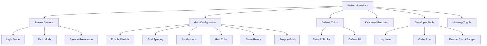

# Settings Panel

The **Settings Panel** provides application-wide configuration options, including theme selection, grid settings, default colors, and developer tools. Settings are persisted in Canvas Store and automatically saved to local storage.

## Overview

The Settings Panel (`/src/sidebar/panels/SettingsPanel.tsx`) is accessible via the **Settings button** in the Top Action Bar and provides:

- **Theme**: Light/dark mode and system preference
- **Grid Configuration**: Enable/disable, spacing, subdivisions, color, rulers
- **Snap to Grid**: Toggle grid snapping behavior
- **Default Colors**: Set default stroke/fill colors for new elements
- **Keyboard Precision**: Adjust arrow key movement distance
- **Developer Tools**: Log level, render count badges, debug overlays (dev mode only)
- **Minimap**: Toggle minimap visibility (desktop only)

## Architecture



## Settings Categories

### Theme Settings

Control the color scheme of the application.

**Options:**

- **Light**: Light color scheme with white backgrounds
- **Dark**: Dark color scheme with gray backgrounds
- **System**: Follow OS/browser preference

**Implementation:**

```tsx
import { useColorMode } from '@chakra-ui/react';

const { setColorMode } = useColorMode();

<JoinedButtonGroup
  options={[
    { value: 'light', label: 'Light' },
    { value: 'dark', label: 'Dark' },
    { value: 'system', label: 'System' },
  ]}
  value={selectedTheme}
  onChange={(value) => {
    setColorMode(value);
    localStorage.setItem('chakra-ui-color-mode', value);
  }}
/>
```

**Persistence:**

- Stored in browser localStorage: `chakra-ui-color-mode`
- Synced with Chakra UI color mode system
- Applied globally to all components

**Color Scheme Changes:**

When theme changes, the following updates automatically:

- UI component backgrounds and borders
- Text colors (for contrast)
- Canvas default stroke color (white in dark, black in light)
- Existing elements with default colors (transformed to new theme)

---

### Grid Configuration

Configure the background grid for alignment and snapping.

#### Enable Grid

**Toggle**: `grid.enabled` (default: `false`)

Show/hide grid lines on canvas.

```tsx
<PanelToggle
  isChecked={grid?.enabled ?? false}
  onChange={(e) => updateGrid({ enabled: e.target.checked })}
>
  Enable Grid
</PanelToggle>
```

**Keyboard shortcut**: `G` key

---

#### Grid Spacing

**Slider**: `grid.spacing` (default: `20`, range: `5` to `100`)

Distance between major grid lines in canvas units.

```tsx
<SliderControl
  label="Grid Spacing"
  value={grid?.spacing ?? 20}
  min={5}
  max={100}
  step={5}
  onChange={(value) => updateGrid({ spacing: value })}
  formatter={(val) => `${val}px`}
/>
```

**Visual effect**: Larger spacing = fewer, wider-spaced grid lines

---

#### Grid Subdivisions

**Slider**: `grid.subdivisions` (default: `5`, range: `1` to `10`)

Number of minor grid lines between major grid lines.

```tsx
<SliderControl
  label="Subdivisions"
  value={grid?.subdivisions ?? 5}
  min={1}
  max={10}
  step={1}
  onChange={(value) => updateGrid({ subdivisions: value })}
/>
```

**Visual effect**: More subdivisions = denser grid with finer alignment

**Example**: With spacing=20 and subdivisions=5, minor lines appear every 4px (20/5).

---

#### Grid Color

**Color Picker**: `grid.color` (default: `#e0e0e0` light, `#444444` dark)

Color of grid lines.

```tsx
<ColorPicker
  value={grid?.color ?? '#e0e0e0'}
  onChange={(color) => updateGrid({ color })}
/>
```

**Automatic theme adjustment**: Grid color changes with theme for visibility

---

#### Show Rulers

**Toggle**: `grid.showRulers` (default: `false`)

Display ruler markings along canvas edges showing coordinates.

```tsx
<PanelToggle
  isChecked={grid?.showRulers ?? false}
  onChange={(e) => updateGrid({ showRulers: e.target.checked })}
>
  Show Rulers
</PanelToggle>
```

**Visual effect**: Shows horizontal/vertical rulers at top/left edges with numeric labels

---

#### Snap to Grid

**Toggle**: `grid.snapToGrid` (default: `false`)

Enable automatic snapping of element positions to grid intersections.

```tsx
<PanelToggle
  isChecked={grid?.snapToGrid ?? false}
  onChange={(e) => updateGrid({ snapToGrid: e.target.checked })}
>
  Snap to Grid
</PanelToggle>
```

**Behavior:**

- When dragging elements, positions snap to nearest grid point
- Snapping distance based on grid spacing
- Applies to all movement operations (drag, arrow keys, nudge)

**Keyboard modifier**: Hold `Shift` to temporarily disable snapping

---

### Default Colors

Set default stroke and fill colors for newly created elements.

#### Default Stroke Color

**Color Picker**: `settings.defaultStrokeColor` (default: `#000000` light, `#ffffff` dark)

```tsx
<ColorPicker
  label="Default Stroke"
  value={settings.defaultStrokeColor}
  onChange={(color) => updateSettings({ defaultStrokeColor: color })}
/>
```

**Usage:**

- Applied to new paths drawn with Pencil tool
- Used for new shapes created with Shape tool
- Changed automatically when theme switches

---

#### Default Fill Color

**Color Picker**: `settings.defaultFillColor` (default: `none`)

```tsx
<ColorPicker
  label="Default Fill"
  value={settings.defaultFillColor}
  onChange={(color) => updateSettings({ defaultFillColor: color })}
/>
```

**Usage:**

- Applied to new shapes (circle, rectangle)
- Default is `none` (no fill, transparent)
- Paths drawn with Pencil tool have no fill by default

---

### Keyboard Precision

Adjust the distance elements move when using arrow keys.

**Slider**: `settings.keyboardMovementPrecision` (default: `1`, range: `0` to `10`)

```tsx
<SliderControl
  label="Arrow Key Movement"
  value={settings.keyboardMovementPrecision}
  min={0}
  max={10}
  step={0.5}
  onChange={(value) => updateSettings({ keyboardMovementPrecision: value })}
  formatter={(val) => `${val}px`}
/>
```

**Behavior:**

- **Arrow keys**: Move selected elements by specified distance
- **Shift + Arrow keys**: Move by 10× distance (for larger adjustments)
- **Value 0**: Disables arrow key movement

**Use cases:**

- **Fine control** (0.5-1px): Pixel-perfect positioning
- **Standard** (1-2px): General editing
- **Quick positioning** (5-10px): Rapid layout adjustments

---

### Minimap Toggle

Show/hide the minimap panel (desktop only).

**Toggle**: `settings.showMinimap` (default: `false`)

```tsx
{!isMobile && (
  <PanelToggle
    isChecked={settings.showMinimap}
    onChange={(e) => updateSettings({ showMinimap: e.target.checked })}
  >
    Show Minimap
  </PanelToggle>
)}
```

**Minimap features:**

- Shows entire canvas at small scale
- Highlights current viewport (blue rectangle)
- Click to jump to location
- Drag viewport rectangle to pan

**Visibility**: Only shown on desktop (hidden on mobile due to limited screen space)

---

### Developer Tools

Debug and development settings (only visible in development mode).

#### Log Level

**Select**: `LogLevel` (options: DEBUG, INFO, WARN, ERROR)

Control console logging verbosity.

```tsx
{import.meta.env.DEV && (
  <CustomSelect
    label="Log Level"
    value={logLevel.toString()}
    onChange={(value) => {
      const level = parseInt(value) as LogLevel;
      logger.setConfig({ level });
    }}
    options={[
      { value: LogLevel.DEBUG.toString(), label: 'DEBUG' },
      { value: LogLevel.INFO.toString(), label: 'INFO' },
      { value: LogLevel.WARN.toString(), label: 'WARN' },
      { value: LogLevel.ERROR.toString(), label: 'ERROR' },
    ]}
  />
)}
```

**Log Levels:**

- **DEBUG**: All logs (verbose, for development)
- **INFO**: Informational messages + warnings + errors
- **WARN**: Warnings + errors only
- **ERROR**: Errors only (production default)

---

#### Show Caller Info

**Toggle**: `logger.showCallerInfo` (default: `false`)

Include file/line information in console logs.

```tsx
{import.meta.env.DEV && (
  <PanelToggle
    isChecked={showCallerInfo}
    onChange={(enabled) => logger.setShowCallerInfo(enabled)}
  >
    Show caller info in logs
  </PanelToggle>
)}
```

**Example output:**

```
[Canvas.tsx:123] INFO: Rendering 50 elements
```

**Use case**: Debugging to quickly locate log source

---

#### Render Count Badges

**Toggle**: `settings.showRenderCountBadges` (default: `false`)

Display render count badges on components for performance profiling.

```tsx
{import.meta.env.DEV && (
  <PanelToggle
    isChecked={settings.showRenderCountBadges}
    onChange={(e) => updateSettings({ showRenderCountBadges: e.target.checked })}
  >
    Show render count badges (debug)
  </PanelToggle>
)}
```

**Visual effect**: Small badges appear in component corners showing number of renders

**Use case**: Identify components that re-render too frequently

---

## Panel Layout

```tsx
<Panel title="Settings" icon={<Settings />}>
  <VStack spacing={3} align="stretch">
    {/* Theme */}
    <FormControl>
      <FormLabel>Theme</FormLabel>
      <JoinedButtonGroup
        options={themeOptions}
        value={selectedTheme}
        onChange={setSelectedTheme}
      />
    </FormControl>

    {/* Grid Configuration */}
    <FormControl>
      <FormLabel>Grid</FormLabel>
      <PanelToggle value={grid.enabled} onChange={toggleGrid}>
        Enable Grid
      </PanelToggle>
      
      <Collapse in={grid.enabled}>
        <VStack spacing={2}>
          <SliderControl
            label="Spacing"
            value={grid.spacing}
            onChange={updateSpacing}
            min={5}
            max={100}
          />
          <SliderControl
            label="Subdivisions"
            value={grid.subdivisions}
            onChange={updateSubdivisions}
            min={1}
            max={10}
          />
          <PanelToggle value={grid.showRulers} onChange={toggleRulers}>
            Show Rulers
          </PanelToggle>
          <PanelToggle value={grid.snapToGrid} onChange={toggleSnap}>
            Snap to Grid
          </PanelToggle>
        </VStack>
      </Collapse>
    </FormControl>

    {/* Default Colors */}
    <FormControl>
      <FormLabel>Default Colors</FormLabel>
      <ColorPicker
        label="Stroke"
        value={settings.defaultStrokeColor}
        onChange={updateStrokeColor}
      />
      <ColorPicker
        label="Fill"
        value={settings.defaultFillColor}
        onChange={updateFillColor}
      />
    </FormControl>

    {/* Keyboard Precision */}
    <SliderControl
      label="Arrow Key Movement"
      value={settings.keyboardMovementPrecision}
      onChange={updateKeyboardPrecision}
      min={0}
      max={10}
      step={0.5}
    />

    {/* Minimap (Desktop Only) */}
    {!isMobile && (
      <PanelToggle value={settings.showMinimap} onChange={toggleMinimap}>
        Show Minimap
      </PanelToggle>
    )}

    {/* Developer Tools (Dev Mode Only) */}
    {import.meta.env.DEV && (
      <>
        <FormControl>
          <FormLabel>Log Level</FormLabel>
          <CustomSelect
            value={logLevel}
            onChange={setLogLevel}
            options={logLevelOptions}
          />
        </FormControl>
        <PanelToggle value={showCallerInfo} onChange={toggleCallerInfo}>
          Show caller info in logs
        </PanelToggle>
        <PanelToggle value={settings.showRenderCountBadges} onChange={toggleRenderBadges}>
          Show render count badges
        </PanelToggle>
      </>
    )}
  </VStack>
</Panel>
```

---

## Integration with Canvas Store

Settings are stored in Canvas Store and persist across sessions:

```typescript
interface CanvasState {
  settings: {
    defaultStrokeColor: string;
    defaultFillColor: string;
    keyboardMovementPrecision: number;
    showRenderCountBadges: boolean;
    showMinimap: boolean;
  };
  grid: {
    enabled: boolean;
    spacing: number;
    subdivisions: number;
    color: string;
    showRulers: boolean;
    snapToGrid: boolean;
  };
  updateSettings: (updates: Partial<Settings>) => void;
  updateGrid: (updates: Partial<Grid>) => void;
}
```

**Persistence:**

- Settings automatically saved to localStorage via Zustand persist middleware
- Restored on page reload
- Synchronized across browser tabs (via storage events)

---

## Related Documentation

- [Sidebar](./sidebar.md) - Sidebar container and navigation
- [Canvas Store API](../api/canvas-store-api.md) - State management API
- [Grid Plugin](../plugins/catalog/grid.md) - Grid rendering and snapping
- [Minimap Plugin](../plugins/catalog/minimap.md) - Canvas overview
- [Theme System](../ui/theming.md) - Application theming

---

## Best Practices

### For Users

1. **Choose comfortable theme**: Select light/dark based on environment
2. **Enable grid for precision**: Use grid for accurate alignment
3. **Adjust keyboard precision**: Set based on your workflow (fine vs. rapid)
4. **Use snap to grid**: Enable for consistent spacing and alignment
5. **Customize default colors**: Set colors you use frequently

### For Developers

1. **Validate settings**: Check ranges and types before applying
2. **Provide visual feedback**: Show immediate effect of setting changes
3. **Use theme tokens**: Reference Chakra theme colors, not hardcoded values
4. **Test both themes**: Ensure settings work in light and dark modes
5. **Log setting changes**: Debug logger to track configuration issues

---

## Future Enhancements

- **Export/Import Settings**: Save settings as presets and share
- **Per-Document Settings**: Override global settings per project
- **Custom Themes**: User-defined color schemes
- **Workspace Presets**: Different setting profiles for different workflows
- **Keyboard Shortcuts Config**: Customize all keyboard shortcuts
- **Auto-save Settings**: Save settings as they change (no manual save)
- **Reset to Defaults**: One-click reset all settings
