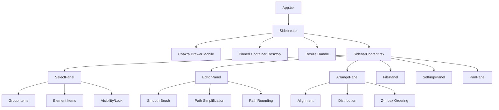

# Sidebar

The **Sidebar** is the main **panel container** in VectorNest, providing contextual controls and settings based on the active plugin/mode. It displays different panels (Select, Editor, Arrange, File, Settings) and can be **pinned**, **resized**, or **hidden** based on user preference and screen size.

## Overview

The Sidebar (`/src/sidebar/Sidebar.tsx`) serves as the **control center** for the application:

- **Contextual panels**: Shows different panels based on active mode
- **Responsive behavior**: Pinned on desktop, drawer on mobile
- **Resizable**: Adjustable width when pinned (double-click to reset)
- **State persistence**: Panel visibility and width stored in Canvas Store

The sidebar contains specialized panels, each with distinct functionality:

### Select Panel

## Architecture



## Sidebar Modes

The sidebar **displays multiple panels** based on the active plugin. Most modes show the **Editor Panel** plus their own plugin-specific panels:

| Mode | Panels Displayed | Purpose |
|------|-----------------|---------|
| `select` | Editor Panel, Path Operations, SubPath Operations, Optical Alignment (conditional) | General editing, path operations, alignment |
| `pencil` | Editor Panel, Pencil Panel | Drawing settings, stroke/fill properties |
| `text` | Editor Panel, Text Panel | Text editing, typography, stroke/fill |
| `shape` | Editor Panel, Shape Panel | Shape creation, stroke/fill properties |
| `transformation` | Editor Panel, Transformation Panel | Transform controls, stroke/fill properties |
| `edit` | Editor Panel, Edit Panel, Control Point Alignment | Path editing, smooth brush, control points |
| `subpath` | Editor Panel, SubPath Operations | Subpath operations, stroke/fill |
| `curves` | Editor Panel, Curves Panel | Curve control points, stroke/fill |
| `pan` | Editor Panel, Pan Panel | Viewport navigation |
| `file` | File Panel | Import/export, project management |
| `settings` | Settings Panel, Guidelines Panel, Grid Panel | App preferences, theme, grid config |

**Key insight:** The **Editor Panel** is **transversal** - it appears in almost all modes (except `file` and `settings`) to provide universal access to stroke/fill properties, regardless of active tool.

**Panel visibility logic** (from `panelConfig.tsx`):

```typescript
// Editor Panel: always visible except in file/settings modes
{
  key: 'editor',
  condition: (ctx) => !ctx.isInSpecialPanelMode, // isInSpecialPanelMode = file or settings
  component: EditorPanel,
}

// Plugin-specific panels
{
  key: 'pencil',
  condition: (ctx) => !ctx.isInSpecialPanelMode && ctx.activePlugin === 'pencil',
  component: PencilPanel,
}

{
  key: 'edit',
  condition: (ctx) => !ctx.isInSpecialPanelMode && ctx.activePlugin === 'edit',
  component: EditPanel,
}
```

## Responsive Behavior

The sidebar adapts to screen size:

### Desktop (≥ 768px)

- **Pinned by default**: Fixed position on left side
- **Resizable**: Drag handle to adjust width (250px - 600px)
- **Always visible**: Remains open, action bars offset to right
- **Pin toggle**: Can be unpinned to float over canvas

**Pinned sidebar positioning:**

```tsx
<Box
  position="fixed"
  left={0}
  top={0}
  height="100vh"
  width={`${sidebarWidth}px`}
  borderRight="1px solid"
  borderColor={sidebarBorder}
  bg={sidebarBg}
  zIndex={1000}
>
  <SidebarContent />
  <ResizeHandle />
</Box>
```

### Mobile (< 768px)

- **Drawer by default**: Slides in from left
- **Not resizable**: Fixed width (280px)
- **Hidden initially**: Opens via menu button in Top Action Bar
- **Never pinned**: Always overlays canvas with backdrop

**Drawer sidebar (Chakra UI):**

```tsx
<Drawer
  isOpen={isOpen}
  placement="left"
  onClose={onClose}
  size="xs"
>
  <DrawerOverlay bg={overlayBg} />
  <DrawerContent bg={sidebarBg}>
    <DrawerBody>
      <SidebarContent />
    </DrawerBody>
  </DrawerContent>
</Drawer>
```

## Sidebar Props

```typescript
interface SidebarProps {
  onPinnedChange?: (isPinned: boolean) => void;       // Notify parent when pin state changes
  onWidthChange?: (width: number) => void;            // Notify parent of width changes (for action bar positioning)
  onToggleOpen?: (isOpen: boolean) => void;           // Notify parent when drawer opens/closes
  onRegisterOpenHandler?: (openHandler: () => void) => void; // Register drawer open function
}
```

**Parent integration:**

```tsx
// App.tsx
const [sidebarWidth, setSidebarWidth] = useState(0);
const [isSidebarPinned, setIsSidebarPinned] = useState(false);
const [isSidebarOpen, setIsSidebarOpen] = useState(true);

<Sidebar
  onWidthChange={setSidebarWidth}
  onPinnedChange={setIsSidebarPinned}
  onToggleOpen={setIsSidebarOpen}
  onRegisterOpenHandler={setSidebarOpenHandler}
/>

// Action bars offset by sidebar width
<TopActionBar sidebarWidth={sidebarWidth} />
<BottomActionBar sidebarWidth={sidebarWidth} />
```

## Sidebar Panels

The sidebar contains specialized panels, each with distinct functionality:

### Editor Panel (Transversal)

**Purpose**: Universal stroke/fill/opacity controls, independent of active mode

**Key characteristic**: This panel is **transversal** - it appears in all modes except `file` and `settings`, providing consistent access to visual properties regardless of which tool is active.

**Features:**

**1. Color Presets (Top Row)**
- **Style Eyedropper**: Copy stroke/fill/opacity from one path and apply to selected paths
  - Enabled only when exactly 1 path is selected
  - Click to activate, then click another path to copy its style
- **Preset Grid**: 8-10 predefined color/stroke combinations (responsive)
- **Expand/Collapse Toggle**: Show/hide detailed color controls

**2. Color Controls (Collapsible)**

When expanded, provides detailed control over fill and stroke:

- **Fill Color & Opacity**:
  - Color picker (circular button)
  - Opacity slider (0-100%)
  - "None" toggle (X button) for transparent fill
  
- **Stroke Color & Opacity**:
  - Color picker (circular button)
  - Opacity slider (0-100%)
  - "None" toggle (X button) for no stroke
  
- **Stroke Width**:
  - Slider control (0-20px)
  - Direct value input

**3. Advanced Stroke Properties (Collapsible)**

Expand/collapse via chevron button next to stroke width:

- **Line Cap**: How line ends are rendered
  - `butt`: Flat edge at path end
  - `round`: Rounded edge extending beyond path end
  - `square`: Square edge extending beyond path end
  
- **Line Join**: How corners are rendered
  - `miter`: Sharp corner
  - `round`: Rounded corner
  - `bevel`: Beveled corner
  
- **Fill Rule**: How overlapping paths are filled
  - `nonzero`: Non-zero winding rule
  - `evenodd`: Even-odd rule
  
- **Dash Array**: Stroke dash pattern
  - Custom input (e.g., "5,3,2,3")
  - Preset buttons (solid, dashed, dotted)
  - "none" for solid stroke

**Behavior Modes:**

The Editor Panel operates in two modes based on selection:

**Creation Mode (No Selection)**:
- Shows default values for new paths
- Changes affect newly created elements
- Values stored in `pencil` state in Canvas Store
- Used as defaults by drawing tools

**Editing Mode (Path(s) Selected)**:
- Shows properties of selected path(s)
- If 1 path selected: shows that path's values
- If multiple paths selected: shows common values (or mixed indicator)
- Changes apply to all selected paths immediately
- Updates `strokeColor`, `fillColor`, `strokeWidth`, etc. on selected elements

**Code Reference:**

```typescript
// From EditorPanel.tsx
const updatePathProperty = <T,>(property: string, value: T) => {
  if (selectedPathsCount > 0) {
    // Editing mode: update selected paths
    updateSelectedPaths?.({ [property]: value });
  } else {
    // Creation mode: update default pencil state
    updatePencilState?.({ [property]: value });
  }
};

// Get current value from selection or defaults
const currentStrokeColor = useSelectedPathProperty(
  'strokeColor', 
  pencil?.strokeColor ?? defaultStrokeColor
);
```

**When visible**: All modes except `file` and `settings`

---

### Select Panel

**Purpose**: Element selection, grouping, visibility, locking

**Features:**

- **Element list**: Hierarchical tree view of canvas elements
- **Group support**: Nested groups with expand/collapse
- **Selection**: Click to select
- **Visibility toggles**: Eye icon to show/hide elements
- **Lock toggles**: Lock icon to prevent editing
- **Group operations**: Create group, ungroup, rename
- **Element count badges**: Show number of children in groups

**When visible**: Available in most modes, but most relevant in `select` mode

See also: [Selection](../features/selection.md), [Groups](../features/groups.md)

---

### Edit Panel (Plugin-Specific)

**Purpose**: Path editing tools specific to Edit mode

**Features:**

- **Smooth Brush**: Smooth path segments with adjustable radius/strength
- **Path Simplification**: Reduce point count with Douglas-Peucker algorithm
- **Path Rounding**: Round sharp corners with configurable radius
- **Add Point Mode**: Add points to existing paths
- **Command selection**: Select specific path commands for editing

**When visible**: `edit` mode only (in addition to Editor Panel)

**Note:** This is a plugin-specific panel separate from the transversal Editor Panel. Edit mode shows **both** the Editor Panel (for stroke/fill) **and** the Edit Panel (for path operations).

---

### Pencil Panel (Plugin-Specific)

**Purpose**: Drawing-specific settings for Pencil tool

**Features:**

- **Reuse Path**: Continue drawing on last path vs. create new path
- **Simplification Tolerance**: Auto-simplify while drawing
- **Smoothing Options**: Line smoothing settings

**When visible**: `pencil` mode only (in addition to Editor Panel)

---

### Text Panel (Plugin-Specific)

**Purpose**: Text editing and typography controls

**Features:**

- **Font Selection**: Choose font family
- **Font Size**: Adjust text size
- **Text Alignment**: Left/center/right alignment
- **Text Content**: Edit text content

**When visible**: `text` mode only (in addition to Editor Panel)

---

### Shape Panel (Plugin-Specific)

**Purpose**: Shape creation parameters

**Features:**

- **Shape Type**: Rectangle, ellipse, polygon, etc.
- **Corner Radius**: For rounded rectangles
- **Sides**: Number of sides for polygons

**When visible**: `shape` mode only (in addition to Editor Panel)

---

### Transformation Panel (Plugin-Specific)

**Purpose**: Precise transformation controls

**Features:**

- **Position**: X/Y coordinates
- **Size**: Width/height
- **Rotation**: Angle in degrees
- **Scale**: Uniform or non-uniform scaling

**When visible**: `transformation` mode only (in addition to Editor Panel)

---

### Curves Panel (Plugin-Specific)

**Purpose**: Curve control point manipulation

**Features:**

- **Control Point Editing**: Direct manipulation of Bézier control points
- **Handle Constraints**: Lock/unlock handles
- **Curve Smoothing**: Smooth curve segments

**When visible**: `curves` mode only (in addition to Editor Panel)

---

## Sidebar Bottom Section

The sidebar features a **fixed bottom section** that provides persistent access to element selection and arrangement controls, regardless of active mode.

### Structure

The bottom section (`SidebarFooter`) contains two key panels:

```
┌─────────────────────────────────┐
│  Arrange Panel (Collapsible)    │ ← Only when selection exists & expanded
├─────────────────────────────────┤
│  [Collapse/Expand Button]       │ ← Toggle button (centered)
├─────────────────────────────────┤
│  ═══ Resize Handle (ns-resize) ═│ ← Drag up/down to adjust height
├─────────────────────────────────┤
│  Select Panel (Resizable)       │ ← Element hierarchy tree (96-360px)
│  • Element list with scroll     │
│  • Visibility/lock controls     │
│  • Group/element cards          │
└─────────────────────────────────┘
```

### Arrange Panel (Collapsible)

**Visibility**: Only shows when elements/commands/subpaths are selected and is expanded

**State**: Expandable/collapsible via chevron button
- **Expanded**: Shows alignment, distribution, and ordering controls
- **Collapsed**: Hidden, only toggle button visible
- State persisted in Canvas Store (`arrangePanelExpanded`)

**Features**:
- Alignment tools (left, center, right, top, middle, bottom)
- Distribution tools (horizontal, vertical)
- Ordering tools (bring to front, send to back, step forward/backward)

**Toggle Button**:
- Positioned absolutely between Arrange and Select panels
- Chevron icon changes: `ChevronUp` (expand) / `ChevronDown` (collapse)
- Small circular button (24px) with outline variant

### Select Panel (Always Visible)

**Visibility**: Always visible in bottom section (except in `file` and `settings` modes)

**Purpose**: Persistent access to element hierarchy

**Features**:
- Hierarchical tree of all canvas elements
- Group management with expand/collapse
- Element selection (click to select)
- Visibility toggles (eye icon)
- Lock toggles (lock icon)
- Element count badges for groups
- **Resizable height**: Drag the horizontal handle at the top to adjust panel height
  - Default height: 140px
  - Minimum height: 96px
  - Maximum height: 360px
  - **Drag up**: Increases panel height (shows more elements)
  - **Double-click**: Resets to default height
  - Visual feedback: Handle highlights on hover and during drag

**Position**: Fixed at bottom of sidebar, always accessible regardless of scrolling in main panel area

**Resize Behavior**:

The Select Panel features a **vertical resize handle** at its top edge, allowing users to adjust the visible area to see more elements when many paths are created:

```tsx
<Box
  height="6px"
  cursor="ns-resize"
  onPointerDown={handleResizeStart}
  onDoubleClick={handleResetHeight}
  bg={isResizing ? resizeColor : resizeInactiveColor}
  borderRadius="full"
  mx="auto"
  my={1}
  w="120px"
  title="Arrastra para redimensionar, doble clic para resetear"
  _hover={{ bg: resizeColor }}
/>
```

**Implementation**:

Uses the `useDragResize` hook with vertical direction and reverse mode (drag up = increase height):

```typescript
const { 
  isDragging: isResizing, 
  handlePointerDown: handleResizeStart, 
  handleDoubleClick: handleResetHeight 
} = useDragResize({
  onResize: setPanelHeight,
  onReset: () => setPanelHeight(DEFAULT_PANEL_HEIGHT),
  minValue: MIN_PANEL_HEIGHT,   // 96px
  maxValue: MAX_PANEL_HEIGHT,   // 360px
  direction: 'vertical',
  reverseVertical: true,         // Drag up increases height
  initialValue: panelHeight,
});
```

:::tip
When you have many path elements in your canvas, increase the Select Panel height by dragging the handle upward. This allows you to see more element cards without scrolling.
:::

:::note
This vertical resize is distinct from the sidebar's horizontal resize handle. The sidebar handle adjusts the overall sidebar width, while the Select Panel handle adjusts only the panel's internal height.
:::

### Height Management

The bottom section uses a **dynamic height CSS variable**:

```typescript
// Managed by useSidebarFooterHeight hook
document.documentElement.style.setProperty(
  '--sidebar-footer-height',
  `${height}px`
);
```

This allows the main scrollable panel area (`SidebarPanelHost`) to adjust its padding/height automatically, ensuring panels above the footer are not obscured.

### Behavior

**When nothing is selected**:
- Arrange Panel hidden
- Toggle button hidden
- Only Select Panel visible

**When selection exists**:
- Arrange Panel appears (if expanded)
- Toggle button appears
- Select Panel remains visible below

**In file/settings modes**:
- Entire bottom section hidden
- Full sidebar height available for File/Settings panels

---

### Arrange Panel

**Purpose**: Alignment, distribution, ordering, size matching, and arrangement operations

**Features:**

- **Alignment**: Align elements left/center/right/top/middle/bottom
- **Distribution**: Distribute elements horizontally/vertically with even spacing
- **Match**: Homogenize dimensions by matching width or height to largest element
- **Ordering**: Change Z-index (bring to front, send to back, step forward/backward)
- **Grouping shortcuts**: Quick access to group/ungroup operations

**When visible**: `select` mode (collapsible section)

**Requirements**: At least 2 elements selected for alignment, distribution, and match operations

See also: [Alignment](../features/alignment.md), [Distribution](../features/distribution.md), [Match](../features/match.md), [Ordering](../features/ordering.md)

---

### File Panel

**Purpose**: Import/export, project management

**Features:**

- **Import SVG**: Load SVG files into canvas
- **Export SVG**: Save canvas as SVG file
- **Save Project**: Serialize canvas state to JSON
- **Load Project**: Restore canvas from saved JSON
- **Clear Canvas**: Delete all elements

**When visible**: `file` mode (activated via Top Action Bar)

[See detailed documentation](./file-panel.md)

---

### Settings Panel

**Purpose**: Application preferences, theme, grid configuration

**Features:**

- **Theme**: Light/dark mode toggle
- **Grid**: Enable/disable, spacing, subdivisions, color
- **Rulers**: Show/hide grid rulers
- **Snap to Grid**: Toggle grid snapping
- **Default colors**: Set default stroke/fill colors
- **Performance**: Render count badges, debug mode

**When visible**: `settings` mode (activated via Top Action Bar)

[See detailed documentation](./settings-panel.md)

---

### Pan Panel

**Purpose**: Viewport navigation (legacy, may be deprecated)

**Features:**

- **Pan controls**: Arrow buttons for panning viewport
- **Reset view**: Center canvas at origin

**When visible**: `pan` mode (if registered)

---

## Resize Handle

When sidebar is **pinned on desktop**, a **resize handle** appears on the right edge:

```tsx
<Box
  position="absolute"
  right={-2}
  top={0}
  bottom={0}
  width="4px"
  cursor="ew-resize"
  bg="transparent"
  _hover={{ bg: 'blue.500' }}
  onMouseDown={handleResizeStart}
  onDoubleClick={handleReset}
/>
```

**Resize behavior:**

- **Drag**: Adjust sidebar width between 250px and 600px
- **Double-click**: Reset to default width (250px)
- **Visual feedback**: Handle highlights on hover (blue)
- **Constraint**: Width constrained to min/max bounds

**Implementation:**

```typescript
const handleResize = useCallback((newWidth: number) => {
  const constrainedWidth = Math.max(250, Math.min(600, newWidth));
  setSidebarWidth(constrainedWidth);
}, [setSidebarWidth]);
```

## State Management

Sidebar state is managed in **Canvas Store** using Zustand:

```typescript
interface CanvasState {
  // Sidebar dimensions
  sidebarWidth: number;           // Current width (default: 250)
  setSidebarWidth: (width: number) => void;
  
  // Panel visibility
  showFilePanel: boolean;
  showSettingsPanel: boolean;
  setShowFilePanel: (show: boolean) => void;
  setShowSettingsPanel: (show: boolean) => void;
  
  // Panel expansion state
  arrangePanelExpanded: boolean;
  setArrangePanelExpanded: (expanded: boolean) => void;
}
```

**Why store in Canvas Store?**

- **Persistence**: Width and panel state persist across page reloads
- **Global access**: Action bars can read sidebar width for positioning
- **Reactivity**: Changes propagate automatically to dependent components

## Sidebar Content

The `SidebarContent` component renders the appropriate panel based on active mode:

```tsx
<SidebarContent
  activePlugin={activePlugin}
  setMode={setMode}
  smoothBrush={smoothBrush}
  pathSimplification={pathSimplification}
  pathRounding={pathRounding}
  selectedCommands={selectedCommands}
  selectedSubpaths={selectedSubpaths}
  addPointMode={addPointMode}
  // ... actions
  onTogglePin={togglePin}
  isPinned={isPinned}
  isDesktop={isDesktop}
  onClose={onClose}
  showFilePanel={showFilePanel}
  showSettingsPanel={showSettingsPanel}
  isArrangeExpanded={isArrangeExpanded}
  setIsArrangeExpanded={setIsArrangeExpanded}
/>
```

**Content switching logic:**

```tsx
{activePlugin === 'select' && <SelectPanel />}
{activePlugin === 'edit' && <EditorPanel />}
{activePlugin === 'subpath' && <EditorPanel />}
{activePlugin === 'curves' && <EditorPanel />}
{showFilePanel && <FilePanel />}
{showSettingsPanel && <SettingsPanel />}
```

## Performance Optimizations

The sidebar implements several optimizations to prevent unnecessary re-renders:

### 1. **Granular Zustand Selectors**

```typescript
// ❌ Bad: Re-renders on ANY state change
const state = useCanvasStore();

// ✅ Good: Only re-renders when activePlugin changes
const activePlugin = useCanvasStore(state => state.activePlugin);
```

### 2. **Memoized Objects**

Reconstruct objects from primitive selectors to avoid reference changes:

```typescript
// Select only primitive values
const smoothBrushRadius = useCanvasStore(state => state.smoothBrush?.radius ?? 50);
const smoothBrushStrength = useCanvasStore(state => state.smoothBrush?.strength ?? 0.5);

// Reconstruct object (memoized)
const smoothBrush = useMemo(() => ({
  radius: smoothBrushRadius,
  strength: smoothBrushStrength,
  // ... other properties
}), [smoothBrushRadius, smoothBrushStrength]);
```

### 3. **Avoid High-Frequency State**

Don't subscribe to state that changes frequently (e.g., mouse position):

```typescript
// ❌ Avoid: Updates on every mouse move
const cursorX = useCanvasStore(state => state.smoothBrush?.cursorX);

// ✅ Better: Omit cursor position from sidebar, only needed in Canvas
const smoothBrush = useMemo(() => ({
  // ... other properties
  cursorX: 0, // Not used in Sidebar
  cursorY: 0, // Not used in Sidebar
}), [/* dependencies */]);
```

### 4. **Stable Action References**

Action functions from Zustand store are **stable** and don't need memoization:

```typescript
const updateSmoothBrush = useCanvasStore(state => state.updateSmoothBrush);
// No need to memoize - function reference is stable
```

## Styling

Sidebar uses **Chakra UI theming** for consistent appearance:

```typescript
const sidebarBg = useColorModeValue('surface.sidebar', 'surface.sidebar');
const sidebarBorder = useColorModeValue('border.sidebar', 'border.sidebar');
const overlayBg = useColorModeValue('blackAlpha.600', 'blackAlpha.700');
```

**Theme tokens:**

- `surface.sidebar`: Background color (light: white, dark: gray.800)
- `border.sidebar`: Border color (light: gray.200, dark: gray.700)
- `blackAlpha.600/700`: Overlay backdrop for drawer

## File Structure

```
src/sidebar/
├── Sidebar.tsx                   # Main sidebar container
├── components/
│   └── SidebarContent.tsx        # Content router (switches panels)
└── panels/
    ├── SelectPanel.tsx           # Element selection and hierarchy
    ├── SelectPanelItem.tsx       # Individual element item
    ├── SelectPanelGroupItem.tsx  # Group item with children
    ├── EditorPanel.tsx           # Path editing controls
    ├── ArrangePanel.tsx          # Alignment/distribution/ordering
    ├── FilePanel.tsx             # Import/export/project management
    ├── SettingsPanel.tsx         # App preferences and configuration
    ├── PanPanel.tsx              # Viewport navigation (legacy)
    └── VisibilityLockControls.tsx # Shared visibility/lock controls
```

## Related Documentation

- [Canvas](./canvas.md) - Main canvas component
- [Action Bars](./actionbars.md) - Top and bottom toolbars
- [Selection](../features/selection.md) - Selection and hierarchy management
- [File Panel](./file-panel.md) - Import/export operations
- [Settings Panel](./settings-panel.md) - Application preferences
- [UI Components](../ui/components.md) - Reusable UI components
- [Plugin System](../plugins/overview.md) - Plugin integration

## Best Practices

### For UI Developers

1. **Use granular selectors**: Minimize re-renders with specific state subscriptions
2. **Memoize objects**: Reconstruct objects from primitives to avoid reference changes
3. **Avoid high-frequency state**: Don't subscribe to mouse/cursor position in panels
4. **Test responsive behavior**: Verify pinned/drawer modes on desktop/mobile
5. **Maintain panel state**: Persist expansion/visibility state in Canvas Store

### For Plugin Developers

1. **Register panel content**: Provide panel component for your plugin mode
2. **Handle mode activation**: Show/hide relevant panels when mode changes
3. **Update panel content**: Keep panel UI in sync with plugin state
4. **Provide clear actions**: Use buttons with icons and tooltips
5. **Group related controls**: Use collapsible sections for complex settings

## Future Enhancements

- **Multi-panel layout**: Show multiple panels simultaneously
- **Panel presets**: Save and load panel layouts
- **Floating panels**: Detach panels from sidebar
- **Panel tabs**: Tab-based navigation within sidebar
- **Panel search**: Quick filter/search for panel options
- **Keyboard shortcuts**: Navigate panels with keyboard
- **Panel customization**: Show/hide individual panel sections
