# Architecture Diagrams

This page provides comprehensive Mermaid diagrams visualizing TTPE's architecture, data flows, and subsystem interactions.

## System Context Diagram

```mermaid
graph TB
    subgraph "External Actors"
        User[👤 Designer/Artist]
        Browser[🌐 Web Browser]
    end
    
    subgraph "TTPE Application"
        App[TTPE Editor]
    end
    
    subgraph "External Systems"
        LocalStorage[(Local Storage)]
        WASM[WASM Modules<br/>potrace, opentype]
        Clipboard[System Clipboard]
    end
    
    User -->|Interacts| App
    App -->|Runs in| Browser
    App <-->|Persist/Load| LocalStorage
    App -->|Text-to-Curves| WASM
    App <-->|Copy/Paste| Clipboard
    
    style App fill:#007bff,color:#fff
    style User fill:#28a745,color:#fff
```

## Container Diagram

## Component Interaction Diagram

## Plugin Registration Sequence

## Event Bus Data Flow

## Plugin Handler Execution Flow

## Canvas Service Lifecycle

## Plugin Lifecycle State Machine

## Store Slice Composition

## Request Processing Flow

## Undo/Redo Flow

## Persistence Flow

## Canvas Layer Rendering

## Plugin API Exposure Pattern

## Cross-Plugin Communication

## Summary

These diagrams illustrate:

1. **System Context**: TTPE's external dependencies
2. **Containers**: Major architectural components
3. **Components**: Internal module structure
4. **Sequences**: Time-ordered interactions
5. **State Machines**: Plugin and service lifecycles
6. **Flows**: Data movement through the system
7. **Layers**: Canvas rendering stack
8. **Patterns**: Communication between plugins

## Next Steps

- **[Plugin System Overview](../plugins/overview)**: How to build plugins
- **[Event Bus](../event-bus/overview)**: Event payload schemas
- **[Public API](../api/create-api)**: Using the `createApi` pattern
- **[Canvas Store](../api/canvas-store)**: State management reference
