# Architecture Overview

TTPE is architected as a modular, extensible vector graphics editor. This document provides a high-level view of the system's design, key abstractions, and architectural decisions.

## Design Goals

### 1. Extensibility

Every feature should be pluggable. The core provides infrastructure; plugins provide functionality.

**Achievement**: All tools (select, pencil, shapes, text, transforms) are plugins. The core canvas knows nothing about specific tools.

### 2. Maintainability

Code should be organized by feature, not by layer. Related code lives together.

**Achievement**: Plugin directory structure groups slices, UI, and logic together (e.g., `plugins/pencil/` contains everything pencil-related).

### 3. Type Safety

TypeScript should catch errors at compile time, not runtime.

**Achievement**: Strict typing for events, store slices, plugin APIs, and all public interfaces.

### 4. Performance

Large canvases (1000+ elements) should remain responsive.

**Achievement**: Optimized rendering, debounced operations, memoized computations, and efficient data structures.

### 5. Testability

Features should be testable in isolation and as integrated systems.

**Achievement**: E2E tests with Playwright, modular slices, and injectable dependencies.

## System Context

```mermaid
graph TB
    User["👤 Designer/Artist<br/><small>Creates and edits<br/>vector graphics</small>"]
    
    TTPE["<b>TTPE Application</b><br/><small>Web-based vector editor</small>"]
    
    Browser["🌐 Web Browser<br/><small>Chrome, Firefox, Safari</small>"]
    Storage["💾 Local Storage<br/><small>Persists canvas state</small>"]
    WASM["⚡ WASM Modules<br/><small>Potrace for text-to-curves</small>"]
    
    User -->|"Interacts with"| TTPE
    TTPE -->|"Runs in"| Browser
    TTPE -->|"Persists to/loads from"| Storage
    TTPE -->|"Uses for heavy computation"| WASM
    
    style User fill:#08427b,stroke:#052e56,color:#fff
    style TTPE fill:#1168bd,stroke:#0b4884,color:#fff
    style Browser fill:#999,stroke:#666,color:#fff
    style Storage fill:#999,stroke:#666,color:#fff
    style WASM fill:#999,stroke:#666,color:#fff
```



## Container Architecture


```

## Component Architecture


## Key Abstractions

### 1. Plugin Manager

**Location**: `src/utils/pluginManager.ts`

**Purpose**: Central registry for plugins, handles lifecycle, shortcuts, APIs, and canvas services.

**Responsibilities**:
- Register/unregister plugins
- Manage plugin APIs via `createApi`
- Coordinate event bus subscriptions
- Handle keyboard shortcuts
- Manage canvas services (zoom, smooth brush, etc.)
- Provide canvas layer rendering

**Key Methods**:
```typescript
class PluginManager {
  register(plugin: PluginDefinition): void
  unregister(pluginId: string): void
  getPluginApi<T>(pluginId: string): T | undefined
  callPluginApi(pluginId, methodName, ...args): any
  registerInteractionHandler(pluginId, eventType, handler): () => void
  executeHandler(toolName, event, point, target, helpers): void
  activateCanvasService(serviceId, context): () => void
  getCanvasLayers(): CanvasLayerContribution[]
  getPanels(toolName): PluginUIContribution[]
  getOverlays(toolName): React.ComponentType[]
}
```

### 2. Canvas Event Bus

**Location**: `src/canvas/CanvasEventBusContext.tsx`

**Purpose**: Type-safe pub/sub for canvas interactions.

**Event Types**:
- `pointerdown` - Canvas pointer press
- `pointermove` - Canvas pointer movement
- `pointerup` - Canvas pointer release
- `keyboard` - Keyboard events
- `wheel` - Scroll/zoom events

**Usage**:
```typescript
// Subscribe
const unsubscribe = eventBus.subscribe('pointerdown', (payload) => {
  console.log(payload.point, payload.activePlugin);
});

// Emit
eventBus.emit('pointermove', {
  event, point, target, activePlugin, helpers, state
});

// Cleanup
unsubscribe();
```

### 3. Plugin Definition

**Location**: `src/types/plugins.ts`

**Purpose**: Schema for plugin contributions.

**Structure**:
```typescript
interface PluginDefinition<TStore> {
  id: string;
  metadata: {
    label: string;
    icon?: ComponentType;
    cursor?: string;
  };
  handler?: (event, point, target, context) => void;
  keyboardShortcuts?: CanvasShortcutMap;
  overlays?: PluginUIContribution[];
  canvasLayers?: CanvasLayerContribution[];
  panels?: PluginUIContribution[];
  actions?: PluginActionContribution[];
  slices?: PluginSliceFactory<TStore>[];
  createApi?: PluginApiFactory<TStore>;
}
```

### 4. Zustand Store Slices

**Location**: `src/store/canvasStore.ts` (core), `src/plugins/*/slice.ts` (plugin slices)

**Purpose**: Modular state management. Each plugin contributes a slice.

**Slice Pattern**:
```typescript
export interface MyPluginSlice {
  myData: DataType[];
  mySettings: SettingsType;
  updateMyData: (data: DataType[]) => void;
}

export const createMyPluginSlice: PluginSliceFactory = (set, get, api) => ({
  state: {
    myData: [],
    mySettings: defaultSettings,
    updateMyData: (data) => set({ myData: data }),
  },
  cleanup: () => {
    // Optional cleanup
  }
});
```

### 5. Canvas Services

**Location**: `src/canvas/listeners/*`

**Purpose**: Persistent background services that operate independently of active tools.

**Examples**:
- **ZoomListener** - Manages zoom gestures
- **SmoothBrushListener** - Applies smoothing to brush strokes
- **AddPointListener** - Detects and adds points to paths

**Interface**:
```typescript
interface CanvasService<TState> {
  id: string;
  create: (context: CanvasServiceContext) => CanvasServiceInstance<TState>;
}

interface CanvasServiceInstance<TState> {
  update?: (state: TState) => void;
  dispose: () => void;
}
```

## Data Flow

### User Interaction Flow


### Plugin Registration Flow


## State Management Strategy

### Store Organization

The Zustand store is composed of:

1. **Base Slice** (`src/store/slices/baseSlice.ts`)
   - Elements (paths, groups)
   - Active plugin
   - Panel visibility
   - Global settings

2. **Viewport Slice** (`src/store/slices/viewportSlice.ts`)
   - Pan offset
   - Zoom level
   - View bounds

3. **Selection Slice** (`src/store/slices/selectionSlice.ts`)
   - Selected element IDs
   - Selection helpers

4. **Plugin Slices** (dynamic, contributed by plugins)
   - Plugin-specific state
   - Plugin actions

### Undo/Redo

Managed by **Zundo** middleware:
- History depth: 50 steps
- Cooldown: 100ms between snapshots
- Selective state: Only `elements`, `selectedIds`, and plugin data are tracked

**Configuration**: `src/store/canvasStore.ts`

```typescript
const useCanvasStore = create<CanvasStore>()(
  temporal(
    (...args) => ({
      ...createBaseSlice(...args),
      ...createViewportSlice(...args),
      ...createSelectionSlice(...args),
      // Plugin slices registered dynamically
    }),
    {
      limit: 50,
      cooldown: 100,
      partialize: (state) => ({
        elements: state.elements,
        selectedIds: state.selectedIds,
        // Plugin state...
      })
    }
  )
);
```

## Persistence Strategy

**Location**: `src/store/slices/baseSlice.ts`

State is automatically persisted to `localStorage` on every update (debounced).

**Saved Keys**:
- `elements`: All canvas elements
- `settings`: User preferences (grid, snap, precision)
- Plugin-specific state (varies by plugin)

**Not Saved**:
- Viewport (pan/zoom)
- Transient UI state (hover, drag, selection rectangle)
- Undo history

## Security & Sandboxing

### Current State

Plugins run in the same JavaScript context with full access to the store and DOM.

### Considerations

- **Trusted Plugins Only**: Only ship vetted plugins in `CORE_PLUGINS`
- **Third-Party Plugins**: Not currently supported; would require iframe sandboxing or Web Workers
- **XSS Protection**: All user input (text, SVG) is sanitized via React's built-in escaping

### Future: Plugin Sandboxing

For third-party plugins:
1. **Web Workers**: Run plugin logic in a worker thread
2. **Message Passing**: Use `postMessage` for store interactions
3. **API Whitelist**: Only expose safe APIs to workers
4. **CSP Headers**: Enforce Content Security Policy

## Performance Optimizations

### 1. React Optimizations

- **Memoization**: `useMemo`, `useCallback` on all expensive computations
- **Render Counting**: Optional render count badges in dev mode
- **Selective Subscriptions**: Zustand selectors only subscribe to needed state

```typescript
// Good: Only re-renders when selectedIds changes
const selectedIds = useCanvasStore(state => state.selectedIds);

// Bad: Re-renders on ANY store change
const store = useCanvasStore();
```

### 2. Canvas Rendering

- **Layer Composition**: Separate SVG layers for static vs. dynamic content
- **Transform Caching**: Computed bounds are memoized
- **Conditional Rendering**: Overlays only render when active

### 3. Event Handling

- **Debouncing**: Undo snapshots, persistence saves
- **Throttling**: Smooth brush calculations
- **Passive Listeners**: Scroll/touch events use `{ passive: true }`

### 4. Data Structures

- **Maps for Lookups**: O(1) access for elements by ID
- **Sets for Selection**: O(1) membership checks
- **Immutable Updates**: Zustand ensures referential equality checks work

## Versioning & Migration

### Current Version: 0.0.0

**Assumption**: Pre-1.0, no formal versioning yet.

### Future Migration Strategy

When introducing breaking changes:

1. **Version Detection**: Store `version` key in persisted state
2. **Migration Functions**: Map old structure to new structure
3. **Fallback**: If migration fails, prompt user to reset

**Example**:
```typescript
function migrateState(state: any): CanvasStore {
  if (!state.version || state.version < 2) {
    return migrateV1ToV2(state);
  }
  return state;
}
```

## Glossary

| Term | Definition |
|------|------------|
| **Plugin** | Self-contained module extending TTPE functionality |
| **Slice** | Modular piece of Zustand store state |
| **Event Bus** | Pub/sub system for canvas interactions |
| **Canvas Service** | Background service independent of active tool |
| **Layer Contribution** | SVG rendering provided by a plugin |
| **Plugin API** | Public methods exposed by a plugin via `createApi` |
| **Handler** | Function executed on pointer events when plugin is active |
| **Overlay** | React component rendered above the canvas |
| **Panel** | Sidebar UI contributed by a plugin |
| **Action** | Contextual button/menu item contributed by a plugin |

## Constraints & Trade-offs

### Design Constraints

1. **Browser-Only**: No server-side rendering or Node.js runtime
2. **Single Canvas**: Multiple canvases not supported (could be added)
3. **SVG Output**: Raster export requires additional libraries
4. **No Collaborative Editing**: No remote sync infrastructure (WebSocket, CRDT, etc.)

### Trade-offs

| Decision | Pro | Con |
|----------|-----|-----|
| Plugin-based | Highly extensible | More abstraction layers |
| Zustand over Redux | Simpler, less boilerplate | Less ecosystem tooling |
| Chakra UI | Fast setup, theming | Bundle size larger than headless |
| LocalStorage | No backend needed | Limited to ~5MB, single-user |
| Event bus | Decouples plugins | Adds indirection |

## Next Steps

- **[Architecture Diagrams](./diagrams)**: Detailed Mermaid diagrams for every subsystem
- **[Plugin System](../plugins/overview)**: Deep dive into plugin development
- **[Event Bus](../event-bus/overview)**: Comprehensive event reference
- **[Canvas Store API](../api/canvas-store)**: Complete state management guide
