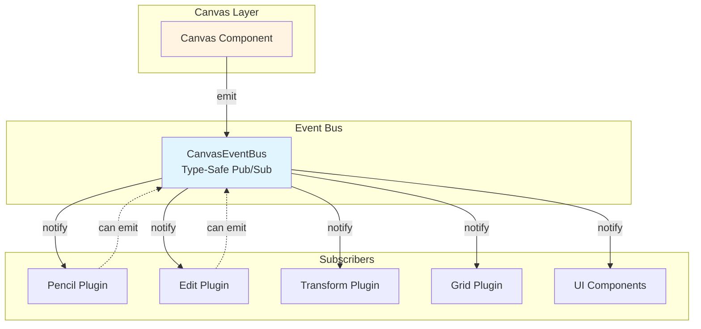
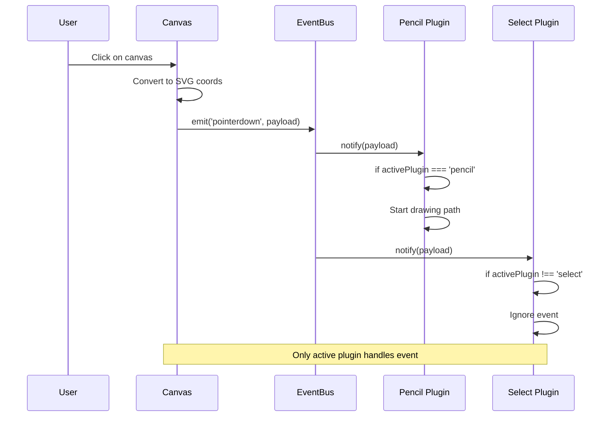
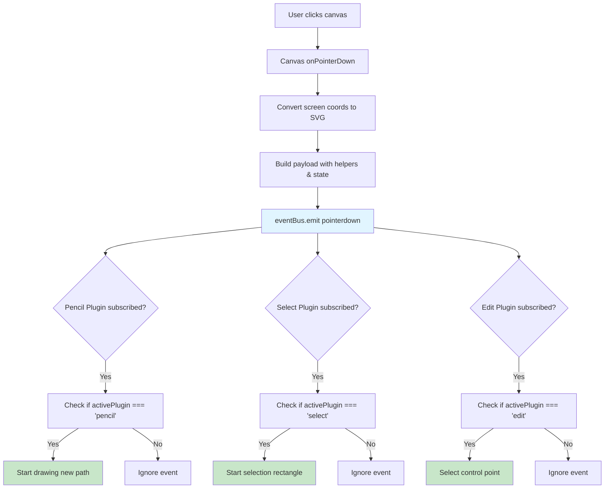

# Event Bus Overview

The **Canvas Event Bus** is a type-safe publish/subscribe (pub/sub) system that serves as the communication backbone of Vectornest. It decouples plugins from direct canvas manipulation and enables loose coupling between components, allowing them to communicate without explicit dependencies.

## Why an Event Bus?

In a plugin-based architecture, direct coupling between components creates several problems:

1. **Tight coupling**: Plugins would need direct references to other plugins or canvas components
2. **Circular dependencies**: Plugin A imports Plugin B which imports Plugin A
3. **Limited extensibility**: Adding new plugins requires modifying existing code
4. **Testing complexity**: Mocking dependencies becomes difficult

The Event Bus solves these problems by introducing an intermediary communication layer where:

- **Publishers** emit events without knowing who will handle them
- **Subscribers** listen to events without knowing who emitted them
- **Plugins** can be added or removed without affecting other components

## Architecture Overview



The Event Bus sits between the canvas layer and all subscribers (plugins, UI components). When the canvas detects user input, it emits typed events through the bus. Subscribers filter and handle only the events relevant to them.

## Core Components

### CanvasEventBus Class

The central event bus implementation provides three core methods:

```typescript
class CanvasEventBus {
  /**
   * Subscribe to an event type
   * @returns Unsubscribe function
   */
  subscribe<K extends keyof EventMap>(
    eventType: K, 
    handler: (payload: EventMap[K]) => void
  ): () => void;
  
  /**
   * Emit an event to all subscribers
   */
  emit<K extends keyof EventMap>(
    eventType: K, 
    payload: EventMap[K]
  ): void;
  
  /**
   * Clear all subscriptions (cleanup)
   */
  clear(): void;
}
```

### Event Map (Type Safety)

All events are strongly typed through the `EventMap` interface:

```typescript
interface EventMap {
  pointerdown: CanvasPointerEventPayload;
  pointermove: CanvasPointerEventPayload;
  pointerup: CanvasPointerEventPayload;
  keyboard: CanvasKeyboardEventPayload;
  wheel: CanvasWheelEventPayload;
}
```

This ensures:
- **Compile-time safety**: TypeScript catches invalid event types and payloads
- **IntelliSense support**: Auto-completion for event names and payload properties
- **Refactoring confidence**: Renaming events or changing payloads updates all usages

## Event Types

Vectornest's Event Bus handles five primary event types:

| Event Type | Trigger | Use Cases |
|------------|---------|-----------|
| **pointerdown** | Mouse/touch press on canvas | Start drawing, begin selection, initiate drag |
| **pointermove** | Mouse/touch movement | Continue drawing, drag elements, show cursor feedback |
| **pointerup** | Mouse/touch release | Complete drawing, end selection, finish drag |
| **keyboard** | Key press/release | Shortcuts, mode switching, deletion |
| **wheel** | Mouse wheel scroll | Zoom in/out, pan canvas |

### Event Flow Diagram



### Payload Structure

Every event carries a rich payload with context:

```typescript
interface CanvasPointerEventPayload {
  event: PointerEvent;              // Raw DOM event
  point: Point;                     // SVG coordinate space {x, y}
  target: EventTarget | null;       // DOM element under pointer
  activePlugin: string | null;      // Currently active tool
  helpers: {                        // Utility functions
    getViewportInfo: () => ViewportInfo;
    getSVGRoot: () => SVGSVGElement | null;
  };
  state: {                          // Current canvas state
    zoom: number;
    panX: number;
    panY: number;
    selectedIds: string[];
  };
}
```

This rich payload eliminates the need for plugins to query the store directly in many cases.

## Usage Patterns

### 1. Basic Subscription

```typescript
import { eventBus } from '@/canvas/eventBus';

// Subscribe to pointer down events
const unsubscribe = eventBus.subscribe('pointerdown', (payload) => {
  console.log('Pointer down at:', payload.point);
  console.log('Active plugin:', payload.activePlugin);
  console.log('Shift key pressed:', payload.event.shiftKey);
});

// Cleanup when component unmounts
unsubscribe();
```

### 2. Plugin-Scoped Handler

Most plugins only care about events when they're active:

```typescript
eventBus.subscribe('pointerdown', (payload) => {
  // Early return if this plugin isn't active
  if (payload.activePlugin !== 'my-plugin') return;
  
  // Handle event for this plugin
  const { point, event } = payload;
  startDrawing(point, event.shiftKey);
});
```

### 3. React Hook Integration

```typescript
import { useEffect } from 'react';

function MyPlugin() {
  useEffect(() => {
    const unsubscribe = eventBus.subscribe('pointermove', (payload) => {
      // Handle pointer move
    });
    
    // Cleanup on unmount
    return unsubscribe;
  }, []);
  
  return <div>Plugin UI</div>;
}
```

### 4. Emitting Events (Less Common)

While the canvas is the primary event emitter, plugins can emit custom events:

```typescript
// Plugin emits a custom event
eventBus.emit('pointerdown', {
  event: syntheticEvent,
  point: { x: 100, y: 100 },
  target: null,
  activePlugin: 'my-plugin',
  helpers,
  state,
});
```

## Benefits

### Decoupling

Plugins don't need to know about each other:

```typescript
// ❌ Without Event Bus - Tight coupling
import { selectPlugin } from '../select';
selectPlugin.handleClick(point);

// ✅ With Event Bus - Loose coupling
eventBus.emit('pointerdown', payload);
```

### Extensibility

New plugins can subscribe without modifying existing code:

```typescript
// New plugin added later
eventBus.subscribe('pointerdown', (payload) => {
  if (payload.activePlugin === 'new-plugin') {
    // Handle new plugin's logic
  }
});
```

### Testability

Easy to test in isolation:

```typescript
// Mock event bus for testing
const mockEventBus = {
  subscribe: vi.fn(),
  emit: vi.fn(),
  clear: vi.fn(),
};
```

### Performance

Subscribers can filter events early and avoid unnecessary processing:

```typescript
eventBus.subscribe('pointermove', (payload) => {
  // Fast early exit for irrelevant events
  if (payload.activePlugin !== 'pencil') return;
  if (!isDragging) return;
  
  // Expensive path drawing logic only runs when needed
  updatePath(payload.point);
});
```

## Data Flow Example

Here's how a complete pointer interaction flows through the system:



## Implementation Location

**File**: `/src/canvas/eventBus.ts`

```typescript
export class CanvasEventBus {
  private handlers: Map<keyof EventMap, Set<Function>> = new Map();

  subscribe<K extends keyof EventMap>(
    eventType: K,
    handler: (payload: EventMap[K]) => void
  ): () => void {
    if (!this.handlers.has(eventType)) {
      this.handlers.set(eventType, new Set());
    }
    this.handlers.get(eventType)!.add(handler);

    // Return unsubscribe function
    return () => {
      this.handlers.get(eventType)?.delete(handler);
    };
  }

  emit<K extends keyof EventMap>(eventType: K, payload: EventMap[K]): void {
    const handlers = this.handlers.get(eventType);
    if (handlers) {
      handlers.forEach(handler => handler(payload));
    }
  }

  clear(): void {
    this.handlers.clear();
  }
}

// Singleton instance
export const eventBus = new CanvasEventBus();
```

## Best Practices

1. **Always unsubscribe**: Prevent memory leaks by cleaning up subscriptions
2. **Filter early**: Check `activePlugin` at the start of handlers for performance
3. **Avoid side effects in emitters**: Keep emit calls simple and predictable
4. **Use typed payloads**: Never cast `any` - leverage TypeScript's type safety
5. **Document custom events**: If plugins emit events, document the payload structure
6. **Test event handlers**: Mock the event bus to test plugin logic in isolation

## Related Documentation

- **[Event Topics](./topics)**: Complete reference for all event payload schemas
- **[Event Patterns](./patterns)**: Advanced patterns and best practices
- **[Plugin System](../plugins/overview)**: How plugins integrate with the Event Bus
- **[Canvas Architecture](../app-structure/canvas)**: How the canvas emits events
