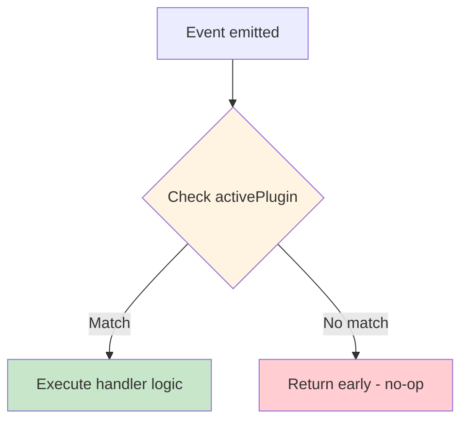
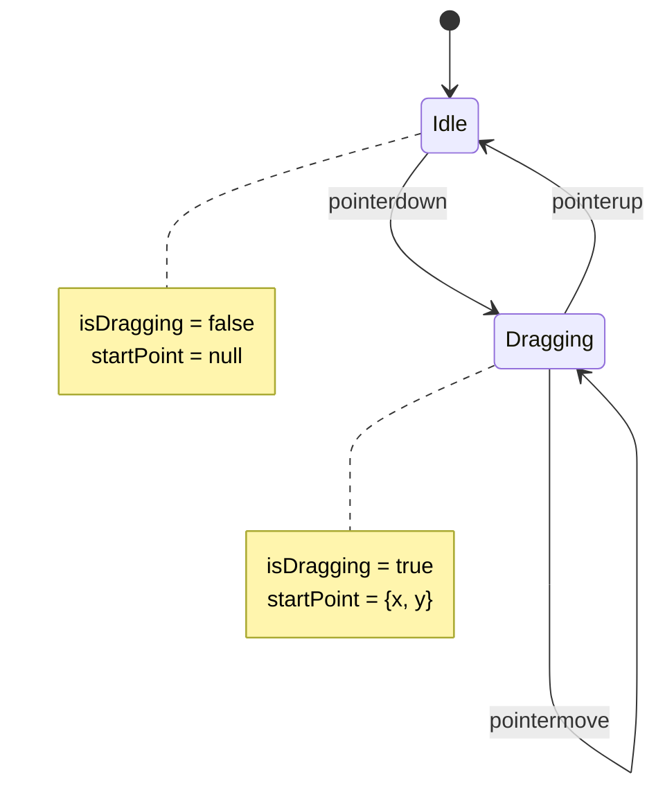
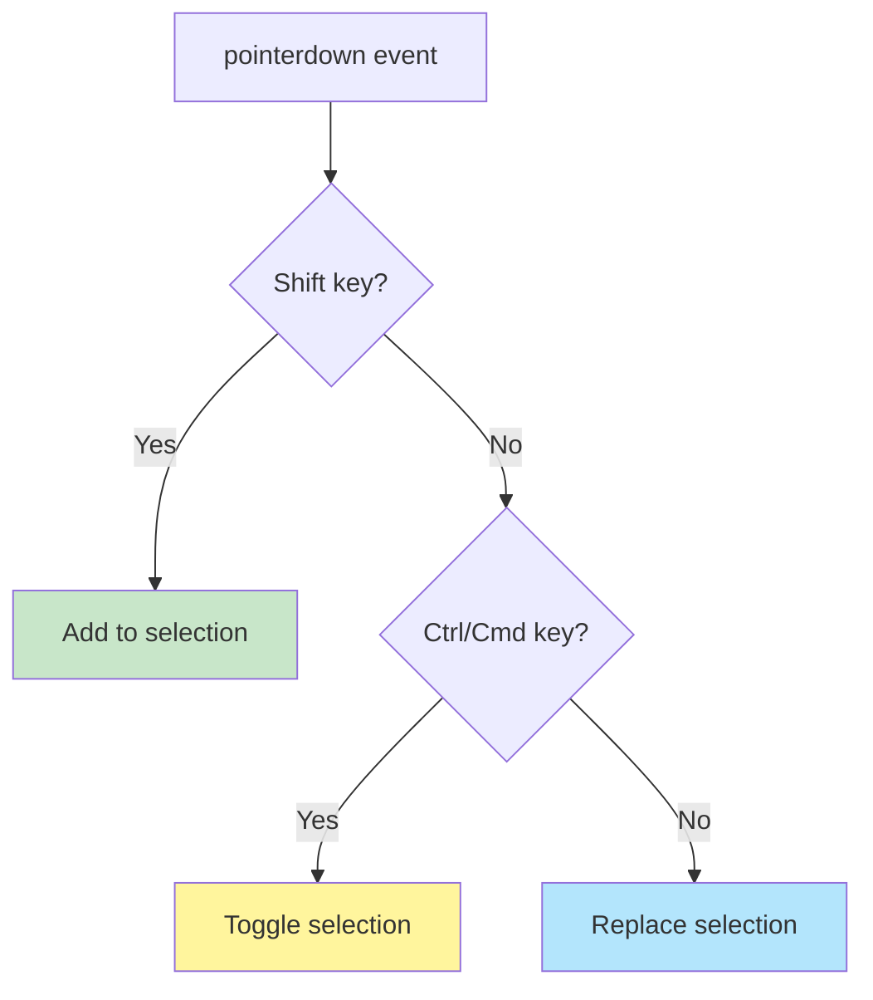
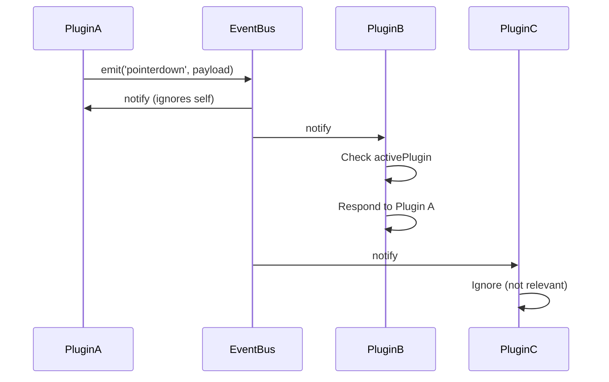

# Event Patterns

Advanced patterns and best practices for working with VectorNest's Event Bus. This guide covers common scenarios, performance optimizations, error handling, and architectural patterns used throughout the codebase.

## Core Patterns

### 1. Plugin-Scoped Handlers

The most common pattern: plugins only respond to events when they're active.

```typescript
eventBus.subscribe('pointerdown', (payload) => {
  // Early exit if this plugin isn't active
  if (payload.activePlugin !== 'my-plugin') return;
  
  // Plugin-specific handling
  const { point, event } = payload;
  handlePointerDown(point, event.shiftKey);
});
```

**Why**: Prevents unnecessary processing and avoids conflicts between plugins.

**Visual Flow**:



### 2. Multi-Phase Event Handling

Complex interactions often span multiple event types:

```typescript
let isDragging = false;
let startPoint: Point | null = null;

// Phase 1: Start
eventBus.subscribe('pointerdown', (payload) => {
  if (payload.activePlugin !== 'select') return;
  
  isDragging = true;
  startPoint = payload.point;
});

// Phase 2: Update
eventBus.subscribe('pointermove', (payload) => {
  if (!isDragging || payload.activePlugin !== 'select') return;
  
  const currentPoint = payload.point;
  updateSelectionRectangle(startPoint, currentPoint);
});

// Phase 3: Complete
eventBus.subscribe('pointerup', (payload) => {
  if (!isDragging || payload.activePlugin !== 'select') return;
  
  finalizeSelection(startPoint, payload.point);
  isDragging = false;
  startPoint = null;
});
```

**Lifecycle Diagram**:



### 3. Conditional Behavior Based on Modifiers

Use modifier keys to enable different behaviors:

```typescript
eventBus.subscribe('pointerdown', (payload) => {
  if (payload.activePlugin !== 'select') return;
  
  const { event, point } = payload;
  const state = useCanvasStore.getState();
  
  if (event.shiftKey) {
    // Add to existing selection
    state.addToSelection(getElementAt(point));
  } else if (event.ctrlKey || event.metaKey) {
    // Toggle selection
    state.toggleSelection(getElementAt(point));
  } else {
    // Replace selection
    state.setSelection([getElementAt(point)]);
  }
});
```

**Decision Tree**:



### 4. State-Dependent Handlers

Behavior changes based on current state:

```typescript
eventBus.subscribe('pointerdown', (payload) => {
  if (payload.activePlugin !== 'pencil') return;
  
  const state = useCanvasStore.getState();
  const { currentPath } = state.pencil;
  
  if (currentPath) {
    // Continue existing path
    addPointToPath(currentPath, payload.point);
  } else {
    // Start new path
    startNewPath(payload.point);
  }
});
```

### 5. Debounced Event Handlers

Limit processing frequency for performance:

```typescript
import { debounce } from 'lodash';

const debouncedHandler = debounce((payload: CanvasPointerEventPayload) => {
  // Expensive operation (e.g., auto-save)
  saveCanvasState();
}, 500);

eventBus.subscribe('pointermove', (payload) => {
  if (payload.activePlugin !== 'pencil') return;
  
  // Immediate: Update drawing
  updatePath(payload.point);
  
  // Debounced: Save state
  debouncedHandler(payload);
});
```

## Error Handling Patterns

### Graceful Degradation

Always handle errors gracefully to prevent crashing other plugins:

```typescript
eventBus.subscribe('pointerdown', (payload) => {
  try {
    if (payload.activePlugin !== 'my-plugin') return;
    
    // Potentially risky operations
    const element = findElementAt(payload.point);
    processElement(element);
    
  } catch (error) {
    console.error('[MyPlugin] Error handling pointerdown:', error);
    
    // Optionally show user feedback
    showToast('An error occurred. Please try again.');
    
    // Reset plugin state
    resetPluginState();
  }
});
```

### Validation Pattern

Validate payload data before processing:

```typescript
eventBus.subscribe('pointerdown', (payload) => {
  if (payload.activePlugin !== 'my-plugin') return;
  
  // Validate payload
  if (!payload.point || typeof payload.point.x !== 'number') {
    console.warn('[MyPlugin] Invalid point in payload');
    return;
  }
  
  if (!payload.event) {
    console.warn('[MyPlugin] Missing event in payload');
    return;
  }
  
  // Safe to proceed
  handlePointerDown(payload);
});
```

### Defensive State Access

Check store state before using it:

```typescript
eventBus.subscribe('pointerdown', (payload) => {
  if (payload.activePlugin !== 'edit') return;
  
  const state = useCanvasStore.getState();
  const selectedElement = state.elements.find(
    el => el.id === state.selectedIds[0]
  );
  
  if (!selectedElement) {
    console.warn('[EditPlugin] No selected element found');
    return;
  }
  
  if (selectedElement.type !== 'path') {
    console.warn('[EditPlugin] Selected element is not a path');
    return;
  }
  
  // Safe to edit path
  editPath(selectedElement, payload.point);
});
```

## Performance Patterns

### Early Exit Optimization

Exit as early as possible to avoid unnecessary work:

```typescript
eventBus.subscribe('pointermove', (payload) => {
  // Exit #1: Wrong plugin
  if (payload.activePlugin !== 'pencil') return;
  
  const state = useCanvasStore.getState();
  
  // Exit #2: Not drawing
  if (!state.pencil.isDrawing) return;
  
  // Exit #3: No current path
  if (!state.pencil.currentPath) return;
  
  // Exit #4: Point too close to last point
  const lastPoint = getLastPoint(state.pencil.currentPath);
  if (distance(lastPoint, payload.point) < 2) return;
  
  // Now perform expensive operation
  updatePathWithSmoothing(payload.point);
});
```

### Throttled Processing

Limit processing rate for expensive operations:

```typescript
let lastProcessTime = 0;
const THROTTLE_MS = 16; // ~60fps

eventBus.subscribe('pointermove', (payload) => {
  if (payload.activePlugin !== 'my-plugin') return;
  
  const now = Date.now();
  if (now - lastProcessTime < THROTTLE_MS) return;
  
  lastProcessTime = now;
  expensiveOperation(payload.point);
});
```

### Batch Updates

Collect multiple events and process them together:

```typescript
let pendingPoints: Point[] = [];
let batchTimeout: number | null = null;

eventBus.subscribe('pointermove', (payload) => {
  if (payload.activePlugin !== 'pencil') return;
  
  // Add point to batch
  pendingPoints.push(payload.point);
  
  // Clear existing timeout
  if (batchTimeout) clearTimeout(batchTimeout);
  
  // Schedule batch processing
  batchTimeout = setTimeout(() => {
    processBatch(pendingPoints);
    pendingPoints = [];
    batchTimeout = null;
  }, 50);
});
```

## React Integration Patterns

### Hook-Based Subscription

```typescript
import { useEffect } from 'react';
import { eventBus } from '@/canvas/eventBus';

function useCanvasEvents(pluginId: string) {
  useEffect(() => {
    const unsubPointerDown = eventBus.subscribe('pointerdown', (payload) => {
      if (payload.activePlugin !== pluginId) return;
      handlePointerDown(payload);
    });
    
    const unsubPointerMove = eventBus.subscribe('pointermove', (payload) => {
      if (payload.activePlugin !== pluginId) return;
      handlePointerMove(payload);
    });
    
    const unsubPointerUp = eventBus.subscribe('pointerup', (payload) => {
      if (payload.activePlugin !== pluginId) return;
      handlePointerUp(payload);
    });
    
    // Cleanup all subscriptions
    return () => {
      unsubPointerDown();
      unsubPointerMove();
      unsubPointerUp();
    };
  }, [pluginId]); // Re-subscribe if plugin ID changes
}
```

### State Synchronization

Sync event data with component state:

```typescript
function MyPlugin() {
  const [currentPoint, setCurrentPoint] = useState<Point | null>(null);
  const [isDragging, setIsDragging] = useState(false);
  
  useEffect(() => {
    const unsubDown = eventBus.subscribe('pointerdown', (payload) => {
      if (payload.activePlugin !== 'my-plugin') return;
      setIsDragging(true);
      setCurrentPoint(payload.point);
    });
    
    const unsubMove = eventBus.subscribe('pointermove', (payload) => {
      if (!isDragging || payload.activePlugin !== 'my-plugin') return;
      setCurrentPoint(payload.point);
    });
    
    const unsubUp = eventBus.subscribe('pointerup', () => {
      setIsDragging(false);
      setCurrentPoint(null);
    });
    
    return () => {
      unsubDown();
      unsubMove();
      unsubUp();
    };
  }, [isDragging]);
  
  return (
    <div>
      {isDragging && currentPoint && (
        <Cursor x={currentPoint.x} y={currentPoint.y} />
      )}
    </div>
  );
}
```

### Callback Dependencies

Handle dependencies correctly in event handlers:

```typescript
function MyPlugin({ onUpdate }: { onUpdate: (point: Point) => void }) {
  const activePlugin = useCanvasStore(state => state.activePlugin);
  
  useEffect(() => {
    const unsubscribe = eventBus.subscribe('pointermove', (payload) => {
      if (payload.activePlugin !== 'my-plugin') return;
      
      // onUpdate is a dependency - handler will update when it changes
      onUpdate(payload.point);
    });
    
    return unsubscribe;
  }, [onUpdate]); // Re-subscribe when onUpdate changes
}
```

## Advanced Patterns

### Event Filtering Pipeline

Create reusable filters:

```typescript
// Filter factory
const createPluginFilter = (pluginId: string) => 
  (payload: CanvasPointerEventPayload) => 
    payload.activePlugin === pluginId;

const createModifierFilter = (modifiers: { shift?: boolean; ctrl?: boolean }) =>
  (payload: CanvasPointerEventPayload) => {
    if (modifiers.shift && !payload.event.shiftKey) return false;
    if (modifiers.ctrl && !(payload.event.ctrlKey || payload.event.metaKey)) return false;
    return true;
  };

// Usage
const isPencilActive = createPluginFilter('pencil');
const isShiftPressed = createModifierFilter({ shift: true });

eventBus.subscribe('pointerdown', (payload) => {
  if (!isPencilActive(payload)) return;
  if (!isShiftPressed(payload)) return;
  
  // Handle Shift+Click in pencil mode
  handleShiftClick(payload.point);
});
```

### Event Composition

Compose multiple event handlers:

```typescript
type EventHandler = (payload: CanvasPointerEventPayload) => void;

const composeHandlers = (...handlers: EventHandler[]): EventHandler =>
  (payload) => handlers.forEach(handler => handler(payload));

const logHandler: EventHandler = (payload) => {
  console.log('Event:', payload.point);
};

const drawHandler: EventHandler = (payload) => {
  updatePath(payload.point);
};

const saveHandler: EventHandler = (payload) => {
  saveToHistory(payload.point);
};

// Compose multiple handlers into one
const composedHandler = composeHandlers(
  logHandler,
  drawHandler,
  saveHandler
);

eventBus.subscribe('pointermove', composedHandler);
```

### Cross-Plugin Communication

Plugins can communicate through the event bus:

```typescript
// Plugin A emits a custom event
eventBus.emit('pointerdown', {
  event: syntheticEvent,
  point: calculatedPoint,
  target: null,
  activePlugin: 'plugin-a',
  helpers,
  state,
});

// Plugin B listens for Plugin A's events
eventBus.subscribe('pointerdown', (payload) => {
  if (payload.activePlugin === 'plugin-a') {
    respondToPluginA(payload);
  }
});
```

**Communication Flow**:



## Testing Patterns

### Mock Event Bus

```typescript
import { describe, it, expect, vi } from 'vitest';

describe('MyPlugin', () => {
  it('should handle pointerdown events', () => {
    const mockEventBus = {
      subscribe: vi.fn(),
      emit: vi.fn(),
      clear: vi.fn(),
    };
    
    const plugin = new MyPlugin(mockEventBus);
    
    expect(mockEventBus.subscribe).toHaveBeenCalledWith(
      'pointerdown',
      expect.any(Function)
    );
  });
});
```

### Simulate Events

```typescript
import { eventBus } from '@/canvas/eventBus';

describe('Event handling', () => {
  it('should respond to simulated events', () => {
    const spy = vi.fn();
    
    eventBus.subscribe('pointerdown', spy);
    
    // Simulate event
    eventBus.emit('pointerdown', {
      event: new PointerEvent('pointerdown'),
      point: { x: 100, y: 100 },
      target: null,
      activePlugin: 'test-plugin',
      helpers: mockHelpers,
      state: mockState,
    });
    
    expect(spy).toHaveBeenCalledTimes(1);
  });
});
```

## Anti-Patterns to Avoid

### ❌ Forgetting to Unsubscribe

```typescript
// BAD: Memory leak
useEffect(() => {
  eventBus.subscribe('pointermove', handler);
  // Missing cleanup!
}, []);

// GOOD: Proper cleanup
useEffect(() => {
  const unsubscribe = eventBus.subscribe('pointermove', handler);
  return unsubscribe;
}, []);
```

### ❌ Mutating Payload

```typescript
// BAD: Modifying event payload
eventBus.subscribe('pointerdown', (payload) => {
  payload.point.x += 10; // Don't mutate!
});

// GOOD: Create new objects
eventBus.subscribe('pointerdown', (payload) => {
  const adjustedPoint = {
    x: payload.point.x + 10,
    y: payload.point.y,
  };
  usePoint(adjustedPoint);
});
```

### ❌ Heavy Computation in Handlers

```typescript
// BAD: Blocking operation
eventBus.subscribe('pointermove', (payload) => {
  expensiveCalculation(); // Runs on every move!
});

// GOOD: Debounce or throttle
const debouncedCalc = debounce(expensiveCalculation, 100);
eventBus.subscribe('pointermove', () => {
  debouncedCalc();
});
```

### ❌ Circular Event Emissions

```typescript
// BAD: Infinite loop
eventBus.subscribe('pointerdown', (payload) => {
  eventBus.emit('pointerdown', payload); // Re-emits same event!
});

// GOOD: Break the cycle
eventBus.subscribe('pointerdown', (payload) => {
  if (shouldPropagate(payload)) {
    eventBus.emit('customEvent', transformPayload(payload));
  }
});
```

## Pattern Summary

| Pattern | Use Case | Performance Impact |
|---------|----------|-------------------|
| Plugin-scoped | Most handlers | Low (early exit) |
| Multi-phase | Drag operations | Medium |
| Modifier-based | Conditional behavior | Low |
| State-dependent | Context-aware actions | Low |
| Debounced | Expensive operations | High benefit |
| Throttled | Frequent events | High benefit |
| Batch updates | Multiple rapid events | High benefit |
| Early exit | All handlers | High benefit |

## Related Documentation

- **[Event Bus Overview](./overview)**: Core architecture and concepts
- **[Event Topics](./topics)**: Complete payload type reference
- **[Plugin Registration](../plugins/registration)**: Building plugins with events
- **[Architecture Overview](../architecture/overview)**: System-wide design and patterns
