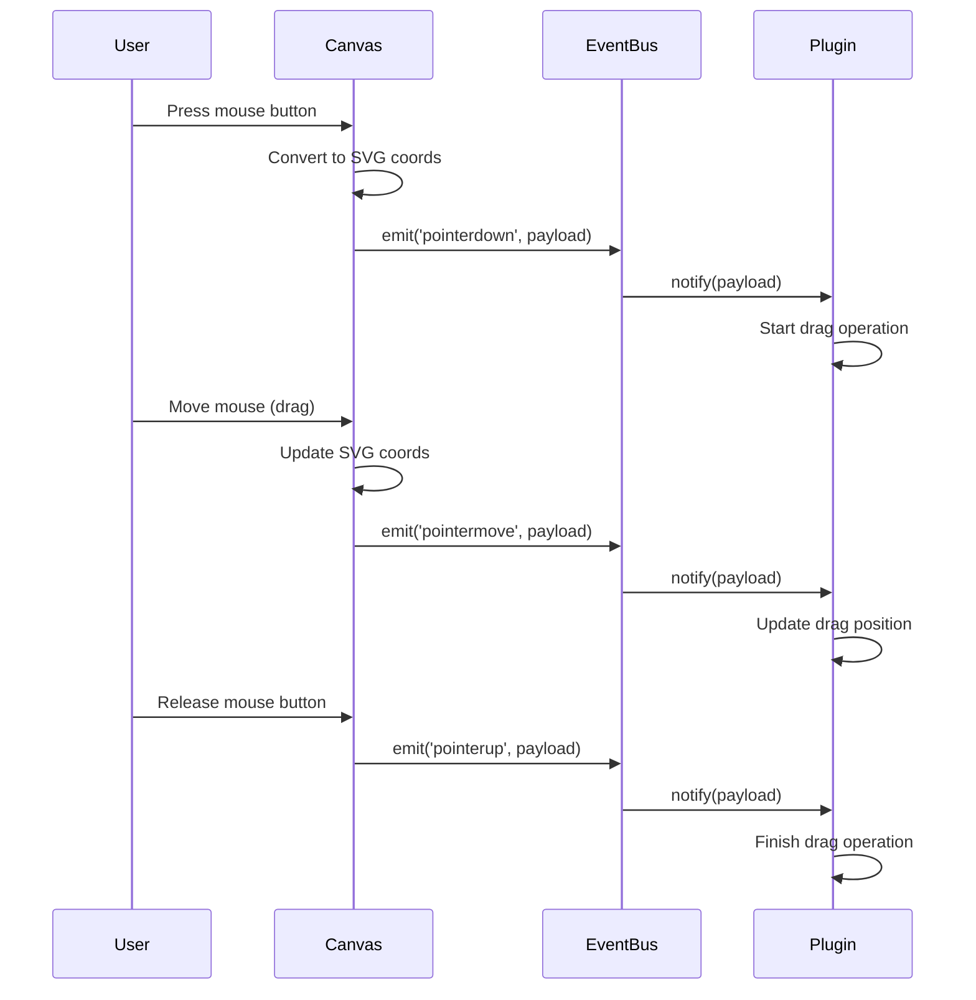
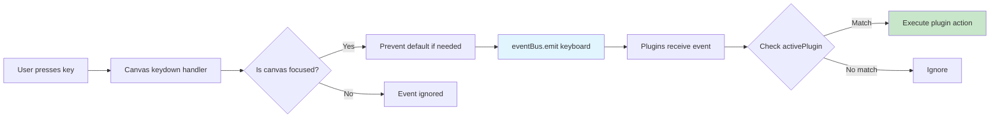

# Event Topics

Complete type reference for all Event Bus payloads. This page documents the exact structure of data passed through each event type, including helper functions and state snapshots.

## Event Map Overview

TTPE's Event Bus uses a strongly-typed `EventMap` that maps event names to their payload types:

```typescript
interface EventMap {
  pointerdown: CanvasPointerEventPayload;
  pointermove: CanvasPointerEventPayload;
  pointerup: CanvasPointerEventPayload;
  keyboard: CanvasKeyboardEventPayload;
  wheel: CanvasWheelEventPayload;
}
```

This ensures compile-time type safety when subscribing to or emitting events.

## Pointer Events

### CanvasPointerEventPayload

Used by `pointerdown`, `pointermove`, and `pointerup` events. This payload contains everything a plugin needs to respond to pointer interactions.

```typescript
interface CanvasPointerEventPayload {
  // Raw DOM event (includes modifiers: shiftKey, ctrlKey, metaKey, altKey)
  event: PointerEvent;
  
  // SVG coordinate space point (accounts for zoom and pan)
  point: Point;
  
  // DOM element under the pointer (null if canvas background)
  target: EventTarget | null;
  
  // Currently active plugin ID (e.g., 'pencil', 'select', 'edit')
  activePlugin: string | null;
  
  // Helper functions for canvas queries
  helpers: CanvasPointerEventHelpers;
  
  // Snapshot of relevant canvas state
  state: CanvasPointerEventState;
}
```

#### Point Type

The `point` property is in SVG coordinate space, not screen coordinates:

```typescript
interface Point {
  x: number;  // SVG X coordinate
  y: number;  // SVG Y coordinate
}
```

**Example**: If the user clicks at screen coordinates `(500, 300)` on a zoomed and panned canvas, the `point` will be transformed to the actual SVG location like `(245.5, 123.7)`.

#### CanvasPointerEventHelpers

Utility functions available in every pointer event:

```typescript
interface CanvasPointerEventHelpers {
  /**
   * Get current viewport information
   */
  getViewportInfo: () => ViewportInfo;
  
  /**
   * Get reference to root SVG element
   */
  getSVGRoot: () => SVGSVGElement | null;
}

interface ViewportInfo {
  zoom: number;          // Current zoom level (1.0 = 100%)
  panX: number;          // Pan offset X
  panY: number;          // Pan offset Y
  width: number;         // Viewport width in pixels
  height: number;        // Viewport height in pixels
  scrollLeft: number;    // Container scroll X
  scrollTop: number;     // Container scroll Y
}
```

**Usage**:
```typescript
eventBus.subscribe('pointerdown', (payload) => {
  const viewport = payload.helpers.getViewportInfo();
  console.log(`Zoom: ${viewport.zoom}x, Pan: (${viewport.panX}, ${viewport.panY})`);
  
  const svg = payload.helpers.getSVGRoot();
  if (svg) {
    console.log('SVG dimensions:', svg.viewBox.baseVal);
  }
});
```

#### CanvasPointerEventState

Snapshot of canvas state at the time of the event:

```typescript
interface CanvasPointerEventState {
  // Viewport state
  zoom: number;              // Current zoom level
  panX: number;              // Pan offset X
  panY: number;              // Pan offset Y
  
  // Selection state
  selectedIds: string[];     // IDs of selected elements
}
```

This allows plugins to make decisions based on current state without querying the store:

```typescript
eventBus.subscribe('pointerdown', (payload) => {
  if (payload.state.selectedIds.length > 0) {
    console.log('User clicked with existing selection');
  }
  
  if (payload.state.zoom > 5.0) {
    console.log('User is zoomed in significantly');
  }
});
```

### Pointer Event Lifecycle



### Common Pointer Event Patterns

#### Detect Click vs. Drag

```typescript
let startPoint: Point | null = null;
const DRAG_THRESHOLD = 3; // pixels

eventBus.subscribe('pointerdown', (payload) => {
  startPoint = payload.point;
});

eventBus.subscribe('pointerup', (payload) => {
  if (!startPoint) return;
  
  const distance = Math.hypot(
    payload.point.x - startPoint.x,
    payload.point.y - startPoint.y
  );
  
  if (distance < DRAG_THRESHOLD) {
    console.log('Click detected');
  } else {
    console.log('Drag detected');
  }
  
  startPoint = null;
});
```

#### Check Modifier Keys

```typescript
eventBus.subscribe('pointerdown', (payload) => {
  if (payload.event.shiftKey) {
    console.log('Shift+Click: Add to selection');
  }
  
  if (payload.event.ctrlKey || payload.event.metaKey) {
    console.log('Ctrl/Cmd+Click: Toggle selection');
  }
  
  if (payload.event.altKey) {
    console.log('Alt+Click: Duplicate element');
  }
});
```

#### Hit Testing

```typescript
eventBus.subscribe('pointerdown', (payload) => {
  if (payload.target) {
    const element = payload.target as SVGElement;
    const elementId = element.getAttribute('data-element-id');
    
    if (elementId) {
      console.log('Clicked on element:', elementId);
    } else {
      console.log('Clicked on canvas background');
    }
  }
});
```

## Keyboard Events

### CanvasKeyboardEventPayload

Used by the `keyboard` event for all keyboard interactions:

```typescript
interface CanvasKeyboardEventPayload {
  // Raw keyboard event (includes key, code, shiftKey, ctrlKey, metaKey, altKey)
  event: KeyboardEvent;
  
  // Currently active plugin ID
  activePlugin: string | null;
}
```

### Keyboard Event Examples

#### Handle Delete Key

```typescript
eventBus.subscribe('keyboard', (payload) => {
  if (payload.event.key === 'Delete' || payload.event.key === 'Backspace') {
    const state = useCanvasStore.getState();
    state.deleteSelectedElements();
  }
});
```

#### Mode Switching with Keys

```typescript
const KEY_TO_PLUGIN: Record<string, string> = {
  'v': 'select',
  'p': 'pencil',
  'r': 'shape',
  't': 'text',
};

eventBus.subscribe('keyboard', (payload) => {
  const plugin = KEY_TO_PLUGIN[payload.event.key];
  if (plugin) {
    const state = useCanvasStore.getState();
    state.setMode(plugin);
  }
});
```

#### Complex Shortcuts

```typescript
eventBus.subscribe('keyboard', (payload) => {
  const { event } = payload;
  const isMac = navigator.platform.includes('Mac');
  const modKey = isMac ? event.metaKey : event.ctrlKey;
  
  // Ctrl/Cmd + Z: Undo
  if (modKey && event.key === 'z' && !event.shiftKey) {
    console.log('Undo');
  }
  
  // Ctrl/Cmd + Shift + Z: Redo
  if (modKey && event.key === 'z' && event.shiftKey) {
    console.log('Redo');
  }
  
  // Ctrl/Cmd + D: Duplicate
  if (modKey && event.key === 'd') {
    event.preventDefault();
    console.log('Duplicate selection');
  }
});
```

### Keyboard Event Flow



## Wheel Events

### CanvasWheelEventPayload

Used by the `wheel` event for scroll/zoom interactions:

```typescript
interface CanvasWheelEventPayload {
  // Raw wheel event (includes deltaX, deltaY, deltaZ, ctrlKey)
  event: WheelEvent;
  
  // Currently active plugin ID
  activePlugin: string | null;
  
  // Reference to root SVG element (optional)
  svg?: SVGSVGElement | null;
}
```

### Wheel Event Patterns

#### Zoom with Ctrl+Wheel

```typescript
eventBus.subscribe('wheel', (payload) => {
  if (payload.event.ctrlKey) {
    payload.event.preventDefault();
    
    const zoomDelta = payload.event.deltaY > 0 ? 0.9 : 1.1;
    const state = useCanvasStore.getState();
    const newZoom = state.viewport.zoom * zoomDelta;
    
    state.setViewport({ zoom: newZoom });
  }
});
```

#### Horizontal Scroll

```typescript
eventBus.subscribe('wheel', (payload) => {
  if (payload.event.shiftKey) {
    const state = useCanvasStore.getState();
    const newPanX = state.viewport.panX + payload.event.deltaY;
    
    state.setViewport({ panX: newPanX });
  }
});
```

## Event Type Summary

| Event | Payload Type | Triggered By | Common Uses |
|-------|-------------|--------------|-------------|
| `pointerdown` | `CanvasPointerEventPayload` | Mouse/touch press | Start drawing, begin selection, click handling |
| `pointermove` | `CanvasPointerEventPayload` | Mouse/touch move | Continue drawing, drag elements, hover effects |
| `pointerup` | `CanvasPointerEventPayload` | Mouse/touch release | Complete drawing, end selection, finish drag |
| `keyboard` | `CanvasKeyboardEventPayload` | Key press | Shortcuts, mode switching, deletion |
| `wheel` | `CanvasWheelEventPayload` | Mouse wheel scroll | Zoom, pan, scroll canvas |

## Type-Safe Subscription Examples

### Using TypeScript Inference

```typescript
// TypeScript infers payload type from event name
eventBus.subscribe('pointerdown', (payload) => {
  // payload is CanvasPointerEventPayload
  payload.point;  // ✓ Valid
  payload.svg;    // ✗ Type error - only in WheelEventPayload
});

eventBus.subscribe('keyboard', (payload) => {
  // payload is CanvasKeyboardEventPayload
  payload.event.key;  // ✓ Valid
  payload.point;      // ✗ Type error - not in KeyboardEventPayload
});
```

### Explicit Typing

```typescript
import { CanvasPointerEventPayload } from '@/canvas/eventBus';

const handlePointerDown = (payload: CanvasPointerEventPayload) => {
  console.log(payload.point);
};

eventBus.subscribe('pointerdown', handlePointerDown);
```

## Related Documentation

- **[Event Bus Overview](./overview)**: Architecture and core concepts
- **[Event Patterns](./patterns)**: Advanced usage patterns and best practices
- **[Canvas Architecture](../app-structure/canvas)**: How canvas emits events
- **[Plugin System](../plugins/overview)**: How plugins consume events
