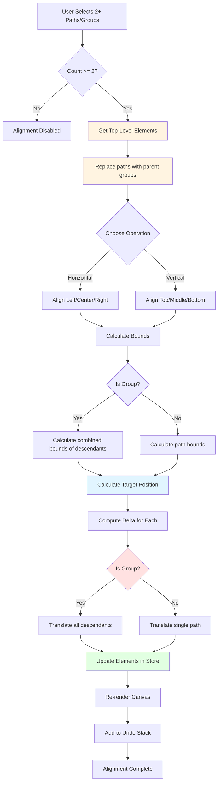

# Alignment

The Alignment system enables precise positioning of multiple selected elements by aligning them to common edges or center points. It's essential for creating organized, visually balanced compositions.

## Overview

Alignment operations calculate target positions based on the bounds of selected elements and then translate elements to match those positions. The system supports both **horizontal alignment** (left, center, right) and **vertical alignment** (top, middle, bottom).

**Key Features:**
- Works with 2 or more selected elements
- Maintains element sizes (only adjusts positions)
- **Supports groups as single units** - moves entire groups together
- Supports elements, edit points, and subpaths
- Non-destructive (reversible via undo)
- Respects current selection and plugin context

---

## Group Support

When working with groups, the alignment system treats them as **indivisible units**:

### Automatic Group Detection

When paths inside groups are selected on the canvas, the alignment system automatically:
1. **Identifies parent groups** of selected paths
2. **Works with top-level groups** rather than individual paths
3. **Moves all descendants** together as a single unit
4. **Calculates group bounds** from all descendants

### Selection Behavior Examples

**Example 1: Paths in different groups**
```typescript
// Selected: path-1 (in group-A), path-2 (in group-A), path-3 (in group-B)
// System works with: [group-A, group-B]
state.alignLeft();
// → Both groups align to the left, all descendants move together
```

**Example 2: Mix of paths with and without groups**
```typescript
// Selected: path-1 (in group-A), standalone-path, path-3 (in group-B)
// System works with: [group-A, standalone-path, group-B]
state.alignCenter();
// → Group A, standalone path, and group B all align to center
```

**Example 3: Nested groups**
```typescript
// Selected: path-1 (in group-B inside group-A), path-2 (in group-C inside group-A)
// System works with: [group-A]
state.alignRight();
// → The entire parent group A moves as one unit
```

---

## Alignment Operations

### Horizontal Alignment

**Align Left**: Aligns all selected elements/groups to the leftmost edge (minimum X)
**Align Center**: Aligns all selected elements/groups to the average center X position
**Align Right**: Aligns all selected elements/groups to the rightmost edge (maximum X)

### Vertical Alignment

**Align Top**: Aligns all selected elements/groups to the topmost edge (minimum Y)
**Align Middle**: Aligns all selected elements/groups to the average center Y position
**Align Bottom**: Aligns all selected elements/groups to the bottommost edge (maximum Y)

---

## Alignment Flow



---

## API Reference

```typescript
// Element alignment
const state = useCanvasStore.getState();
state.alignLeft();      // Align to left edge
state.alignCenter();    // Align to horizontal center
state.alignRight();     // Align to right edge
state.alignTop();       // Align to top edge
state.alignMiddle();    // Align to vertical center
state.alignBottom();    // Align to bottom edge

// Edit mode (points/commands)
state.alignLeftCommands();
state.alignCenterCommands();
// ... etc

// Subpath mode
state.alignLeftSubpaths();
state.alignCenterSubpaths();
// ... etc
```

---

## Usage Example

```typescript
// Select multiple paths (some may be in groups)
state.setSelectedIds(['path-1', 'path-2', 'path-3']);

// Align them to the left
// If paths are in groups, the groups will move instead
state.alignLeft();

// Result: All top-level elements/groups now share the same left edge (minX)
```

---

## Implementation Details

### Group Hierarchy Resolution

The alignment system uses `getTopLevelSelectedElements()` to resolve the selection:

```typescript
// Example: selected = [path-a, path-b, path-c]
// where path-a and path-b are in group-1, path-c is standalone

const topLevel = getTopLevelSelectedElements(elements, selectedIds);
// → [group-1, path-c]

// Alignment then works with these top-level elements
```

### Bounds Calculation

For groups, bounds are calculated by combining all descendant path bounds:

```typescript
// For a group with 3 child paths
const groupBounds = calculateGroupBounds(group, elements, zoom);
// → Returns combined {minX, minY, maxX, maxY} of all descendants
```

### Translation Application

When translating groups, all descendants are updated:

```typescript
// For each descendant path in the group
descendantPath.data = translatePathData(
  descendantPath.data,
  deltaX,
  deltaY
);
```

---

## Related

- [Distribution Features](./distribution.md) - Distribute elements evenly
- [Match Features](./match.md) - Match element sizes
- [Groups](./groups.md) - Group management
- [Selection System](./selection.md) - Element selection
- [Ordering Features](./ordering.md) - Z-index control
