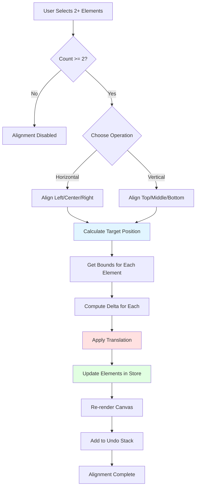

# Alignment

The Alignment system enables precise positioning of multiple selected elements by aligning them to common edges or center points. It's essential for creating organized, visually balanced compositions.

## Overview

Alignment operations calculate target positions based on the bounds of selected elements and then translate elements to match those positions. The system supports both **horizontal alignment** (left, center, right) and **vertical alignment** (top, middle, bottom).

**Key Features:**
- Works with 2 or more selected elements
- Maintains element sizes (only adjusts positions)
- Supports elements, edit points, and subpaths
- Non-destructive (reversible via undo)
- Respects current selection and plugin context

---

## Alignment Operations

### Horizontal Alignment

**Align Left**: Aligns all selected elements to the leftmost edge (minimum X)
**Align Center**: Aligns all selected elements to the average center X position
**Align Right**: Aligns all selected elements to the rightmost edge (maximum X)

### Vertical Alignment

**Align Top**: Aligns all selected elements to the topmost edge (minimum Y)
**Align Middle**: Aligns all selected elements to the average center Y position
**Align Bottom**: Aligns all selected elements to the bottommost edge (maximum Y)

---

## Alignment Flow



---

## API Reference

```typescript
// Element alignment
const state = useCanvasStore.getState();
state.alignLeft();      // Align to left edge
state.alignCenter();    // Align to horizontal center
state.alignRight();     // Align to right edge
state.alignTop();       // Align to top edge
state.alignMiddle();    // Align to vertical center
state.alignBottom();    // Align to bottom edge

// Edit mode (points/commands)
state.alignLeftCommands();
state.alignCenterCommands();
// ... etc

// Subpath mode
state.alignLeftSubpaths();
state.alignCenterSubpaths();
// ... etc
```

---

## Usage Example

```typescript
// Select multiple elements
state.setSelectedIds(['element-1', 'element-2', 'element-3']);

// Align them to the left
state.alignLeft();

// Result: All elements now share the same left edge (minX)
```

---

## Related Documentation

- [Distribution](./distribution.md) - Even spacing between elements
- [Selection System](./selection.md) - Element selection
- [Transform System](./transforms.md) - Element transformation
- [Select Plugin](../plugins/catalog/select.md) - Plugin implementation
