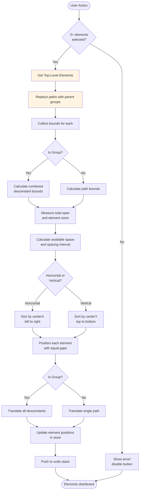

# Distribution

The distribution system provides tools to evenly space multiple elements along the horizontal or vertical axis. Unlike alignment (which adjusts element positions to common edges), distribution ensures equal spacing between elements while maintaining their relative order and dimensions.

Distribution is essential for creating balanced layouts, organizing UI elements consistently, and maintaining visual rhythm across your canvas. The system supports distribution for elements, edit mode commands (points), and subpaths with intelligent spacing calculations that account for element sizes.

## Overview

Distribution requires **at least 3 elements** to perform meaningful spacing calculations. The system identifies the outermost elements along the chosen axis and redistributes the middle elements to create equal gaps between them.

**Key characteristics:**

- **Maintains order**: Elements keep their relative position along the axis
- **Preserves size**: Element dimensions remain unchanged
- **Equal spacing**: Gaps between adjacent elements become uniform
- **Non-destructive**: Original shapes are unaffected, only positions change
- **Supports groups as single units**: Moves entire groups together
- **Works across modes**: Available for elements, edit mode points, and subpaths

## Group Support

The distribution system handles groups intelligently:

### Automatic Group Detection

When paths inside groups are selected on the canvas, the distribution system:
1. **Identifies parent groups** of selected paths
2. **Works with top-level groups** rather than individual paths
3. **Moves all descendants** together as a single unit
4. **Calculates group bounds** from all descendants for spacing

### Selection Behavior Examples

**Example 1: Distributing groups and standalone elements**
```typescript
// Selected: path-1 (in group-A), path-2 (in group-A), standalone-path, path-3 (in group-B)
// System works with: [group-A, standalone-path, group-B]
state.distributeHorizontally();
// → group-A, standalone path, and group-B distributed with equal spacing
```

**Example 2: Mixed groups**
```typescript
// Selected: path-1 (in group-1), path-2 (in group-2), path-3 (in group-3)
// System works with: [group-1, group-2, group-3]
state.distributeVertically();
// → All three groups distributed vertically with equal gaps
```

## Distribution Flow



**Flow explanation:**

1. **Selection validation**: System checks that at least 3 elements are selected
2. **Group resolution**: Replaces selected paths with their parent groups
3. **Bounds collection**: Measures each element/group's position and size
4. **Span calculation**: Identifies leftmost/rightmost (or topmost/bottommost) edges
5. **Spacing calculation**: Computes available space after subtracting element sizes
6. **Element positioning**: Places each element/group with uniform gaps between neighbors
7. **Group translation**: For groups, translates all descendants together
8. **State update**: Updates positions atomically and adds to undo history

## Distribution Operations

### Horizontal Distribution

Distributes elements evenly along the **X-axis** (left to right), creating equal horizontal gaps between adjacent elements.

**Algorithm:**

```
totalWidth = rightmost element's maxX - leftmost element's minX
totalElementsWidth = sum of all element widths
availableSpace = totalWidth - totalElementsWidth
spaceBetween = availableSpace / (elementCount - 1)

for each element (sorted by centerX):
  newX = previousElement.maxX + spaceBetween
```

**Use cases:**

- Toolbar buttons with consistent spacing
- Navigation menu items
- Column layouts
- Icon grids

### Vertical Distribution

Distributes elements evenly along the **Y-axis** (top to bottom), creating equal vertical gaps between adjacent elements.

**Algorithm:**

```
totalHeight = bottommost element's maxY - topmost element's minY
totalElementsHeight = sum of all element heights
availableSpace = totalHeight - totalElementsHeight
spaceBetween = availableSpace / (elementCount - 1)

for each element (sorted by centerY):
  newY = previousElement.maxY + spaceBetween
```

**Use cases:**

- Vertical navigation
- Form fields
- Stacked panels
- List items

## API Reference

### Element Distribution

Available in **Select** mode for distributing entire elements:

```typescript
const state = useCanvasStore.getState();

// Distribute selected elements horizontally (X-axis)
state.distributeHorizontally();

// Distribute selected elements vertically (Y-axis)
state.distributeVertically();
```

**Requirements:**

- At least 3 elements must be selected
- Works on root-level elements (not children within groups)

### Edit Mode Command Distribution

Available in **Edit** mode for distributing selected points/commands along path:

```typescript
const state = useCanvasStore.getState();

// Distribute selected commands horizontally
state.distributeHorizontallyCommands();

// Distribute selected commands vertically
state.distributeVerticallyCommands();
```

**Requirements:**

- At least 3 commands/points must be selected
- Distributes only the selected points within the path

### Subpath Distribution

Available in **Subpath** mode for distributing selected subpaths:

```typescript
const state = useCanvasStore.getState();

// Distribute selected subpaths horizontally
state.distributeHorizontallySubpaths();

// Distribute selected subpaths vertically
state.distributeVerticallySubpaths();
```

**Requirements:**

- At least 3 subpaths must be selected
- Subpaths can belong to the same or different parent elements

## Usage Examples

### Basic Element Distribution

```typescript
// Select 5 elements programmatically
state.selectElement('element-1');
state.addToSelection('element-2');
state.addToSelection('element-3');
state.addToSelection('element-4');
state.addToSelection('element-5');

// Distribute horizontally with equal spacing
state.distributeHorizontally();
```

### Edit Mode Point Distribution

```typescript
// In edit mode with selected points
const state = useCanvasStore.getState();

// Ensure you have 3+ selected commands
if (state.selectedCommands && state.selectedCommands.length >= 3) {
  state.distributeVerticallyCommands();
}
```

### Combining Alignment and Distribution

```typescript
// Create a grid layout: align vertically, distribute horizontally
state.selectElement('element-1');
state.addToSelection('element-2');
state.addToSelection('element-3');

// First align all elements to their shared center Y
state.alignMiddle();

// Then distribute horizontally for equal spacing
state.distributeHorizontally();
```

## UI Integration

Distribution controls are located in the **Arrange Panel** within the sidebar:

```tsx
// Distribution buttons in ArrangePanel.tsx
const distributionButtons: ButtonConfig[] = [
  { 
    handler: currentHandlers.distributeHorizontally, 
    icon: <ArrowLeftRight size={12} />, 
    title: "Distribute Horizontally", 
    disabled: !canDistribute 
  },
  { 
    handler: currentHandlers.distributeVertically, 
    icon: <ArrowUpDown size={12} />, 
    title: "Distribute Vertically", 
    disabled: !canDistribute 
  }
];
```

**Conditions for enabling:**

- `canDistribute = selectedCount >= 3` (for element distribution)
- `canDistribute = selectedCommandsCount >= 3` (for edit mode)
- `canDistribute = selectedSubpathsCount >= 3` (for subpath mode)

## Best Practices

### For Users

- **Select outer boundaries first**: The first and last elements (by position) define the distribution span
- **Combine with alignment**: Use alignment to set a common axis, then distribute for spacing
- **Use with grids**: Enable grid snapping for precise distributed layouts
- **Work with copies**: Test distribution on duplicates before applying to originals

### For Plugin Developers

- **Validate selection count**: Always check `selectedIds.length >= 3` before calling distribution methods
- **Respect element hierarchy**: Distribution only affects root-level elements (not children)
- **Update atomically**: Use single `set()` call to update all element positions
- **Integrate with undo**: Distribution operations are automatically added to undo stack
- **Provide visual feedback**: Show distribution gaps or guides during preview

## Common Use Cases

### Create Evenly-Spaced Navigation

```typescript
// Select all navigation items
const navItems = ['nav-1', 'nav-2', 'nav-3', 'nav-4'];
navItems.forEach(id => state.addToSelection(id));

// Distribute horizontally for equal spacing
state.distributeHorizontally();
```

### Organize Form Fields Vertically

```typescript
// Select all form fields
const formFields = state.elements.filter(el => 
  el.type === 'path' && el.data?.role === 'form-field'
).map(el => el.id);

formFields.forEach(id => state.addToSelection(id));

// Distribute vertically
state.distributeVertically();
```

### Create Button Grid

```typescript
// Step 1: Align all buttons to top edge
state.alignTop();

// Step 2: Distribute horizontally
state.distributeHorizontally();

// Result: Buttons aligned at top with equal horizontal spacing
```

## Related Documentation

- [Alignment](./alignment.md) - Align elements to common edges
- [Match Features](./match.md) - Match element sizes
- [Groups](./groups.md) - Group management
- [Selection System](./selection.md) - Element selection
- [Transformation Plugin](../plugins/catalog/transformation.md) - Element transformation
- [Arrange Panel](../app-structure/sidebar.md) - UI controls
- [Edit Plugin](../plugins/catalog/edit.md) - Edit mode distribution
- [Subpath Plugin](../plugins/catalog/subpath.md) - Subpath distribution
