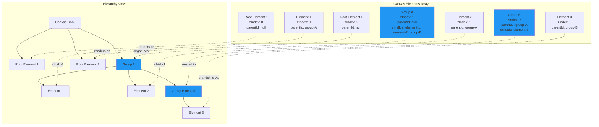
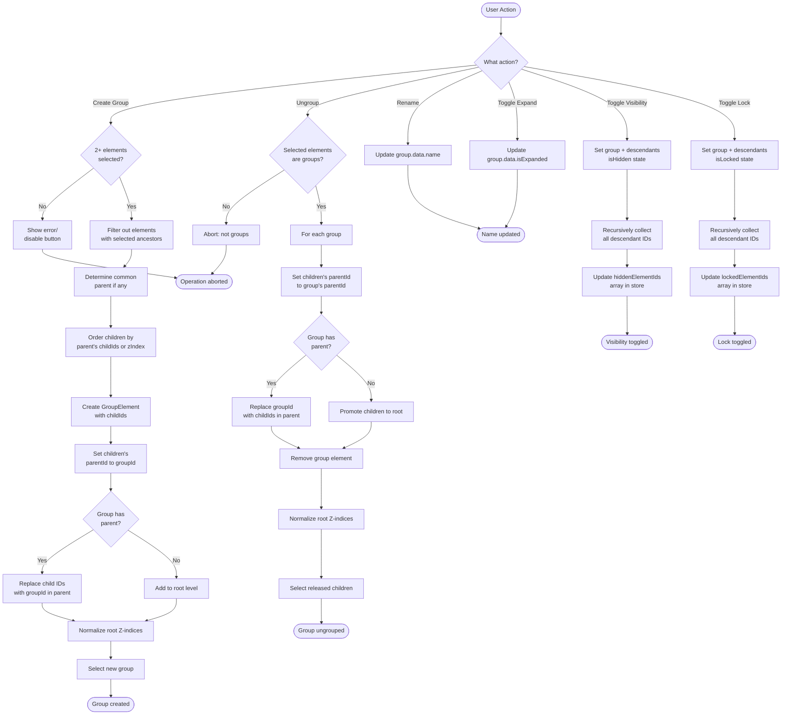

# Groups

The groups system provides **hierarchical organization** for canvas elements through nestable group containers. Groups enable you to organize related elements into logical units, apply collective transformations, manage visibility/lock states hierarchically, and maintain clean layer structures in complex compositions.

Groups are essential for managing large projects with dozens or hundreds of elements, creating reusable components, organizing design systems, and maintaining visual hierarchy through collapsible structures in the selection panel.

## Overview

A **group** is a special container element that holds references to child elements via their IDs. Unlike visual grouping systems that merely select multiple elements, TTPE groups establish true parent-child relationships with the following characteristics:

**Key characteristics:**

- **Hierarchical structure**: Elements reference their parent via `parentId`, groups maintain child lists via `childIds`
- **Named containers**: Each group has a customizable name for identification
- **Transform propagation**: Group transforms affect all descendants
- **Collective state management**: Visibility and lock states cascade to children
- **Preserved order**: Child rendering order is preserved within groups
- **Recursive nesting**: Groups can contain other groups (nested hierarchies)
- **Non-destructive**: Ungrouping restores original element properties

## Group Architecture



**Data structure:**

```typescript
interface GroupElement extends CanvasElementBase {
  type: 'group';
  data: GroupData;
}

interface GroupData {
  childIds: string[];           // Ordered list of child element IDs
  name: string;                 // Display name for the group
  isLocked: boolean;            // Lock state (cascades to children)
  isHidden: boolean;            // Visibility state (cascades to children)
  isExpanded: boolean;          // UI: whether group is expanded in panel
  transform: {                  // Group-level transformation
    translateX: number;
    translateY: number;
    rotation: number;
    scaleX: number;
    scaleY: number;
  };
}

interface PathElement extends CanvasElementBase {
  type: 'path';
  parentId?: string | null;     // Reference to parent group (if any)
  data: PathData;
}
```

## Group Operations

### Create Group from Selection

Creates a new group containing the currently selected elements. The operation:

1. Validates selection (at least 2 elements)
2. Filters out elements with selected ancestors (avoid duplicate nesting)
3. Determines common parent (if all selected elements share one)
4. Creates group element with ordered `childIds`
5. Updates child elements to set `parentId` to new group ID
6. If children had a parent, replaces child references in parent with group reference
7. Normalizes Z-indices to maintain rendering order
8. Selects the newly created group

**Algorithm:**

```
1. selectedElements = filter(elements where id in selectedIds)
2. normalizedSelection = filter(selectedElements without selected ancestors)
3. if normalizedSelection.length < 2: abort

4. parentId = commonParent(normalizedSelection) or null
5. orderedChildIds = sort(normalizedSelection by zIndex or parent's childIds order)

6. groupId = generateUniqueId()
7. groupName = customName or "Group N"

8. for each child in orderedChildIds:
     child.parentId = groupId

9. if parentId exists:
     parent.childIds = replace(child IDs with groupId at insertion point)

10. create GroupElement with:
      - id: groupId
      - parentId: parentId
      - data.childIds: orderedChildIds
      - data.name: groupName
      - zIndex: min(child zIndices)

11. normalize root Z-indices
12. select groupId
```

### Ungroup Selected Groups

Dissolves selected groups, restoring children to the group's parent (or root level if no parent). The operation:

1. Filters selected elements to only groups
2. For each group:
   - Sets children's `parentId` to group's `parentId` (or null)
   - If group had a parent, replaces group ID in parent's `childIds` with group's children
3. Removes group elements from canvas
4. Normalizes Z-indices
5. Selects the released children

**Algorithm:**

```
1. groupsToUngroup = filter(selectedElements where type === 'group')
2. if groupsToUngroup.length === 0: abort

3. releasedChildIds = []
4. for each group in groupsToUngroup:
     parentId = group.parentId or null
     
     for each childId in group.childIds:
       child.parentId = parentId
       releasedChildIds.push(childId)
     
     if parentId exists:
       parent.childIds = replace(group.id with group.childIds)
     
     remove group from elements

5. normalize root Z-indices
6. select releasedChildIds
```

### Rename Group

Updates a group's display name, used in the selection panel and exports.

```typescript
state.renameGroup(groupId: string, name: string)
```

**Validation:** Trims whitespace, rejects empty names.

### Toggle Group Expansion

Controls whether a group's children are visible in the selection panel (UI-only state, doesn't affect rendering).

```typescript
state.setGroupExpanded(groupId: string, expanded: boolean)
```

**Note:** Only affects UI panel display, not canvas rendering.

### Toggle Group Visibility/Lock

Toggles the `isHidden` or `isLocked` state of a group, which **cascades to all descendants**.

```typescript
state.toggleGroupVisibility(groupId: string)
state.toggleGroupLock(groupId: string)
```

**Cascade behavior:**

- **Hidden**: Group and all descendants become non-interactive and visually dimmed
- **Locked**: Group and all descendants cannot be selected or modified
- **Propagation**: States propagate through nested groups recursively

## Group Flow Diagram



## API Reference

### Create and Ungroup

#### `createGroupFromSelection(name?: string): string | null`

Creates a group from selected elements.

```typescript
const state = useCanvasStore.getState();

// Create group with auto-generated name
const groupId = state.createGroupFromSelection();

// Create group with custom name
const groupId = state.createGroupFromSelection('Navigation Menu');
```

**Parameters:**
- `name` (optional): Custom name for the group. If omitted, auto-generates "Group N"

**Returns:** Group ID if successful, `null` if operation fails

**Requirements:**
- At least 2 elements must be selected
- Selected elements must not all be descendants of other selected elements

#### `ungroupSelectedGroups(): void`

Ungroups all selected group elements.

```typescript
const state = useCanvasStore.getState();

// Select groups and ungroup them
state.selectElement('group-1');
state.addToSelection('group-2');
state.ungroupSelectedGroups();
```

**Behavior:**
- Only affects selected elements that are groups
- Released children are automatically selected
- Preserves original Z-index order

#### `ungroupGroupById(groupId: string): void`

Ungroups a specific group by ID.

```typescript
state.ungroupGroupById('group-123');
```

**Use case:** Ungroup a specific group without changing selection.

### Group Properties

#### `renameGroup(groupId: string, name: string): void`

Renames a group.

```typescript
state.renameGroup('group-123', 'Header Components');
```

**Validation:** Name is trimmed; empty names are rejected.

#### `setGroupExpanded(groupId: string, expanded: boolean): void`

Sets whether a group is expanded in the selection panel.

```typescript
// Collapse group in UI
state.setGroupExpanded('group-123', false);

// Expand group in UI
state.setGroupExpanded('group-123', true);
```

**Note:** Only affects UI display, not canvas rendering.

### Group State Management

#### `toggleGroupVisibility(groupId: string): void`

Toggles visibility state for group and all descendants.

```typescript
state.toggleGroupVisibility('group-123');
```

**Effect:** Hides/shows group and all nested children.

#### `toggleGroupLock(groupId: string): void`

Toggles lock state for group and all descendants.

```typescript
state.toggleGroupLock('group-123');
```

**Effect:** Locks/unlocks group and all nested children.

#### `toggleElementVisibility(elementId: string): void`

Toggles visibility state for a specific element (path or group).

```typescript
state.toggleElementVisibility('element-123');
```

#### `toggleElementLock(elementId: string): void`

Toggles lock state for a specific element (path or group).

```typescript
state.toggleElementLock('element-123');
```

### Query Methods

#### `getGroupById(groupId: string): GroupElement | null`

Retrieves a group element by ID.

```typescript
const group = state.getGroupById('group-123');
if (group) {
  console.log(`Group "${group.data.name}" has ${group.data.childIds.length} children`);
}
```

#### `getGroupDescendants(groupId: string): string[]`

Gets all descendant element IDs recursively (children, grandchildren, etc.).

```typescript
const descendants = state.getGroupDescendants('group-123');
console.log(`Group has ${descendants.length} total descendants`);
```

**Returns:** Flat array of all descendant IDs in depth-first order.

#### `isElementHidden(elementId: string): boolean`

Checks if an element is hidden (directly or via ancestor).

```typescript
if (state.isElementHidden('element-123')) {
  console.log('Element is hidden');
}
```

#### `isElementLocked(elementId: string): boolean`

Checks if an element is locked (directly or via ancestor).

```typescript
if (state.isElementLocked('element-123')) {
  console.log('Element is locked');
}
```

## Usage Examples

### Basic Grouping

```typescript
// Select multiple elements
state.selectElement('rect-1');
state.addToSelection('rect-2');
state.addToSelection('circle-1');

// Create group
const groupId = state.createGroupFromSelection('Shapes Group');

// Group is now selected
console.log(state.selectedIds); // ['group-123']
```

### Nested Groups

```typescript
// Create first group
state.selectElements(['element-1', 'element-2']);
const innerGroupId = state.createGroupFromSelection('Inner Group');

// Create second group
state.selectElements(['element-3', 'element-4']);
const outerGroupId = state.createGroupFromSelection('Outer Group');

// Group the groups
state.selectElements([innerGroupId, outerGroupId, 'element-5']);
const parentGroupId = state.createGroupFromSelection('Parent Group');

// parentGroupId now contains two groups and one element
const parent = state.getGroupById(parentGroupId);
console.log(parent.data.childIds); // [innerGroupId, outerGroupId, 'element-5']
```

### Manage Group State

```typescript
const groupId = 'group-123';

// Hide entire group and descendants
state.toggleGroupVisibility(groupId);

// Lock group to prevent edits
state.toggleGroupLock(groupId);

// Rename group
state.renameGroup(groupId, 'Navigation');

// Collapse in UI panel
state.setGroupExpanded(groupId, false);
```

### Ungroup and Select Children

```typescript
// Select and ungroup
state.selectElement('group-123');
state.ungroupSelectedGroups();

// Children are now selected
console.log(state.selectedIds); // ['child-1', 'child-2', 'child-3']
```

### Query Descendants

```typescript
const groupId = 'parent-group';
const descendants = state.getGroupDescendants(groupId);

console.log(`Group has ${descendants.length} descendants`);

// Check if specific element is a descendant
const isDescendant = descendants.includes('element-456');
```

## UI Integration

Groups are managed through the **Select Panel** in the sidebar:

### Group Item Features

- **Name display**: Editable name with truncation for long names
- **Child count badge**: Shows number of direct children
- **Expand/collapse**: Toggle to show/hide children
- **Visibility control**: Eye icon to hide/show group and descendants
- **Lock control**: Lock icon to lock/unlock group and descendants
- **Ungroup button**: Dissolves group and releases children
- **Selection**: Click to select group

### Visual Hierarchy

Groups are rendered with:
- **Indentation**: Visual nesting via left margin
- **Chevron icon**: Expand/collapse indicator
- **Distinct styling**: Different background color from paths
- **Cascading state**: Visual feedback when group is hidden/locked

## Group Transforms

Groups support collective transformations that affect all descendants:

```typescript
interface GroupTransform {
  translateX: number;    // Horizontal offset
  translateY: number;    // Vertical offset
  rotation: number;      // Rotation in degrees
  scaleX: number;        // Horizontal scale (1 = 100%)
  scaleY: number;        // Vertical scale (1 = 100%)
}
```

**Transform application:**

- Group transforms are **cumulative** with child transforms
- Nested groups accumulate transforms from all ancestors
- Moving a group updates its `transform.translateX/Y`
- Individual child transforms are preserved

**Example:**

```
Group transform: { translateX: 100, translateY: 50, rotation: 0, scaleX: 1, scaleY: 1 }
Child path at (20, 30)
→ Rendered at (120, 80) = (20 + 100, 30 + 50)
```

## Best Practices

### For Users

- **Name groups meaningfully**: Use descriptive names for easy identification
- **Group by function**: Organize related elements (header, footer, nav, etc.)
- **Limit nesting depth**: Avoid deeply nested hierarchies (3-4 levels max)
- **Collapse unused groups**: Keep panel clean by collapsing inactive groups
- **Lock completed sections**: Prevent accidental edits to finished work
- **Use visibility to focus**: Hide groups temporarily to focus on specific areas

### For Plugin Developers

- **Respect hierarchy**: Always check `parentId` when operating on elements
- **Handle cascading state**: Check `isElementHidden`/`isElementLocked` for descendants
- **Maintain order**: Preserve `childIds` order when modifying groups
- **Validate ancestors**: Prevent creating groups with selected ancestors
- **Update references**: When deleting groups, properly reparent children
- **Normalize Z-indices**: Call normalization after operations that affect root elements

## Common Use Cases

### Organize UI Components

```typescript
// Group header elements
const headerElements = ['logo', 'nav-menu', 'search-box'];
state.selectElements(headerElements);
const headerId = state.createGroupFromSelection('Header');

// Group footer elements
const footerElements = ['copyright', 'social-links', 'contact'];
state.selectElements(footerElements);
const footerId = state.createGroupFromSelection('Footer');

// Lock completed sections
state.toggleGroupLock(headerId);
state.toggleGroupLock(footerId);
```

### Create Reusable Component

```typescript
// Create icon with background
const iconElements = ['icon-shape', 'background-circle'];
state.selectElements(iconElements);
const iconGroupId = state.createGroupFromSelection('Icon Component');

// Duplicate group for reuse
// (duplication would copy the group and all children)
```

### Hierarchical Layer Management

```typescript
// Create nested structure: Scene > Background/Foreground > Elements
state.selectElements(['sky', 'mountains']);
const bgId = state.createGroupFromSelection('Background');

state.selectElements(['character', 'props']);
const fgId = state.createGroupFromSelection('Foreground');

state.selectElements([bgId, fgId]);
const sceneId = state.createGroupFromSelection('Scene 1');

// Collapse entire scene to declutter panel
state.setGroupExpanded(sceneId, false);
```

### Batch Visibility Control

```typescript
// Hide all construction guides at once
const guidesId = 'guides-group';
state.toggleGroupVisibility(guidesId);

// Later, show them again
state.toggleGroupVisibility(guidesId);
```

## Testing

Groups are covered by E2E tests in `tests/grouping.spec.ts`:

```typescript
test('creates a group from multiple selected paths', async ({ page }) => {
  // Create two rectangles
  const firstId = createRectangle(12, 14);
  const secondId = createRectangle(80, 20);
  
  // Select and group
  storeApi.getState().selectElements([firstId, secondId]);
  const groupId = storeApi.getState().createGroupFromSelection('Test Group');
  
  // Verify group was created
  expect(groupId).toBeTruthy();
  
  // Verify group is selected
  expect(selectedIds).toEqual([groupId]);
  
  // Verify children have correct parentId
  childParents.forEach(({ parentId }) => {
    expect(parentId).toBe(groupId);
  });
});

test('propagates visibility and lock state from group to descendants', async ({ page }) => {
  // Create group
  const groupId = createGroupFromSelection('Visibility Group');
  
  // Toggle group visibility
  toggleGroupVisibility(groupId);
  
  // Verify descendants are hidden
  const hiddenAfterToggle = isElementHidden(descendantId);
  expect(hiddenAfterToggle).toBe(true);
  
  // Toggle group lock
  toggleGroupLock(groupId);
  
  // Verify descendants are locked
  const lockedAfterToggle = isElementLocked(descendantId);
  expect(lockedAfterToggle).toBe(true);
});

test('ungroups selected group and restores child parent references', async ({ page }) => {
  // Create and select group
  const groupId = createGroupFromSelection('Ungroup Group');
  selectElements([groupId]);
  
  // Ungroup
  ungroupSelectedGroups();
  
  // Verify group no longer exists
  expect(hasGroup).toBe(false);
  
  // Verify children have null parentId
  childParents.forEach(({ parentId }) => {
    expect(parentId === null || parentId === undefined).toBe(true);
  });
  
  // Verify children are selected
  expect(new Set(selection)).toEqual(new Set(childParents.map(info => info.id)));
});
```

## Related Documentation

- [Selection System](./selection.md) - Element and group selection
- [Ordering](./ordering.md) - Z-index management (groups use root-level Z-index)
- [UI Components](../ui/components.md) - UI for group management
- [Transform System](./transforms.md) - Group transforms and child propagation
- [Canvas Store API](../api/canvas-store.md) - Group slice methods
