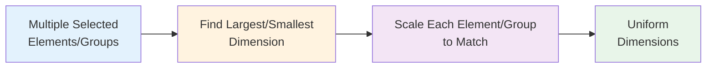

# Match

**Category**: Core Feature  
**Purpose**: Homogenize dimensions of selected elements by matching width or height to the largest or smallest selected element

## Overview

The Match feature allows users to quickly standardize the dimensions of multiple selected elements. When two or more paths are selected, Match operations resize all elements to match either the width or height of the largest or smallest element in the selection.



---

## Group Support

The match system handles groups intelligently:

### Automatic Group Detection

When paths inside groups are selected on the canvas, the match system:
1. **Identifies parent groups** of selected paths
2. **Works with top-level groups** rather than individual paths
3. **Scales all descendants** together as a single unit
4. **Calculates group bounds** from all descendants for comparison

### Selection Behavior Examples

**Example 1: Matching groups and standalone elements**
```typescript
// Selected: path-1 (in group-A), path-2 (in group-A), standalone-path, path-3 (in group-B)
// System works with: [group-A, standalone-path, group-B]
state.matchWidthToLargest();
// → All three elements/groups scaled to match the widest one
```

**Example 2: Nested groups**
```typescript
// Selected: path-1 (in group-B inside group-A)
// System works with: [group-A]
state.matchHeightToLargest();
// → The entire parent group A is scaled as one unit
```

---

## Features

### Match Width to Largest

**Operation**: Resize all selected elements/groups to match the width of the widest element

**Icon**: `UnfoldHorizontal` ↔️ (expand horizontally)

**Requirements**:
- At least 2 paths/groups selected
- Available in: Select mode, Subpath mode
- **Not available** in Edit mode (commands cannot be scaled)

**Behavior**:
1. Calculate bounds for all selected elements/groups
2. Identify the element/group with maximum width
3. Calculate scale factor for each element/group
4. Scale path data (or all group descendants) horizontally while maintaining center position
5. Preserve height (vertical dimension unchanged)

**Mathematical Process**:

```typescript
const largestWidth = Math.max(...elements.map(el => el.width));

for each element/group:
  scaleFactor = largestWidth / currentWidth;
  scaleX = scaleFactor;
  scaleY = 1; // Preserve height
  
  // Scale path/group around center point
  centerX = (bounds.minX + bounds.maxX) / 2;
  centerY = (bounds.minY + bounds.maxY) / 2;
  
  if (isGroup) {
    // Scale all descendants
    scaleGroupDescendants(group, scaleX, scaleY, centerX, centerY);
  } else {
    // Scale single path
    newPathData = scalePathData(pathData, scaleX, scaleY, centerX, centerY);
  }
```

**Visual Example**:

```
Before Match Width to Largest:
┌──────┐  ┌────────────┐  ┌─────┐
│  A   │  │     B      │  │  C  │
│      │  │            │  │     │
└──────┘  └────────────┘  └─────┘
 60px         100px        40px

After Match Width to Largest:
┌────────────┐  ┌────────────┐  ┌────────────┐
│     A      │  │     B      │  │     C      │
│            │  │            │  │            │
└────────────┘  └────────────┘  └────────────┘
    100px            100px           100px
```

### Match Height to Largest

**Operation**: Resize all selected elements/groups to match the height of the tallest element

**Icon**: `UnfoldVertical` ↕️ (expand vertically)

**Requirements**:
- At least 2 paths/groups selected
- Available in: Select mode, Subpath mode
- **Not available** in Edit mode (commands cannot be scaled)

**Behavior**:
1. Calculate bounds for all selected elements/groups
2. Identify the element/group with maximum height
3. Calculate scale factor for each element/group
4. Scale path data (or all group descendants) vertically while maintaining center position
5. Preserve width (horizontal dimension unchanged)

**Visual Example**:

```
Before Match Height to Largest:
┌────┐  ┌────┐  ┌────┐
│ A  │  │ B  │  │ C  │
│    │  │    │  └────┘
└────┘  │    │   30px
 50px   │    │
        │    │
        └────┘
         80px

After Match Height to Largest:
┌────┐  ┌────┐  ┌────┐
│ A  │  │ B  │  │ C  │
│    │  │    │  │    │
│    │  │    │  │    │
│    │  │    │  │    │
│    │  │    │  │    │
└────┘  └────┘  └────┘
 80px    80px    80px
```

### Match Width to Smallest

**Operation**: Resize all selected elements/groups to match the width of the narrowest element

**Icon**: `FoldHorizontal` →← (contract horizontally)

**Requirements**:
- At least 2 paths/groups selected
- Available in: Select mode, Subpath mode
- **Not available** in Edit mode

**Behavior**:
1. Calculate bounds for all selected elements/groups
2. Identify the element/group with minimum width
3. Calculate scale factor for each element/group (< 1 for larger elements)
4. Scale path data (or all group descendants) horizontally while maintaining center position
5. Preserve height (vertical dimension unchanged)

**Visual Example**:

```
Before Match Width to Smallest:
┌──────┐  ┌────────────┐  ┌─────┐
│  A   │  │     B      │  │  C  │
│      │  │            │  │     │
└──────┘  └────────────┘  └─────┘
 60px         100px        40px

After Match Width to Smallest:
┌─────┐  ┌─────┐  ┌─────┐
│  A  │  │  B  │  │  C  │
│     │  │     │  │     │
└─────┘  └─────┘  └─────┘
 40px     40px     40px
```

### Match Height to Smallest

**Operation**: Resize all selected elements/groups to match the height of the shortest element

**Icon**: `FoldVertical` ↓↑ (contract vertically)

**Requirements**:
- At least 2 paths/groups selected
- Available in: Select mode, Subpath mode
- **Not available** in Edit mode

**Behavior**:
1. Calculate bounds for all selected elements/groups
2. Identify the element/group with minimum height
3. Calculate scale factor for each element/group (< 1 for taller elements)
4. Scale path data (or all group descendants) vertically while maintaining center position
5. Preserve width (horizontal dimension unchanged)

**Visual Example**:

```
Before Match Height to Smallest:
┌────┐  ┌────┐  ┌────┐
│ A  │  │ B  │  │ C  │
│    │  │    │  └────┘
└────┘  │    │   30px
 50px   │    │
        │    │
        └────┘
         80px

After Match Height to Smallest:
┌────┐  ┌────┐  ┌────┐
│ A  │  │ B  │  │ C  │
└────┘  └────┘  └────┘
 30px    30px    30px
```

---

## User Interface

### Arrange Panel

Match operations are located in the **Arrange Panel** at the bottom of the sidebar:

**Location**:
- Sidebar → Bottom section → Arrange Panel (collapsible)
- Visible when elements are selected

**Button Layout** (3 rows):

```
┌─────────────────────────────────────────┐
│  [←] [↔] [→] [↑] [↕] [↓]               │  ← Row 1: Alignment (6 buttons)
│  [⇄] [⇅]   [↟] [↥] [↧] [↡]             │  ← Row 2: Distribution + Order
│  [↔️] [↕️] [→←] [↓↑]                     │  ← Row 3: Match operations (4 buttons)
└─────────────────────────────────────────┘

[↔️] = Match Width to Largest (UnfoldHorizontal)
[↕️] = Match Height to Largest (UnfoldVertical)
[→←] = Match Width to Smallest (FoldHorizontal)
[↓↑] = Match Height to Smallest (FoldVertical)
```

**Icons**:
- **Match Width to Largest**: `UnfoldHorizontal` - Expand horizontal arrows
- **Match Height to Largest**: `UnfoldVertical` - Expand vertical arrows
- **Match Width to Smallest**: `FoldHorizontal` - Contract horizontal arrows
- **Match Height to Smallest**: `FoldVertical` - Contract vertical arrows

**Tooltips**:
- "Match Width to Largest"
- "Match Height to Largest"
- "Match Width to Smallest"
- "Match Height to Smallest"

**Button State**:
- **Enabled**: When 2+ paths/groups selected
- **Disabled**: When 0-1 paths selected, or in Edit mode
- **Hidden**: Row 3 is hidden in Edit mode

### Keyboard Shortcuts

Match operations do not currently have keyboard shortcuts. They must be triggered from the Arrange Panel.

---

## Technical Implementation

### Store Methods

#### Match to Largest

```typescript
matchWidthToLargest: () => {
  performMatchSizeToLargest(set, get, 'width');
}

matchHeightToLargest: () => {
  performMatchSizeToLargest(set, get, 'height');
}
```

#### Match to Smallest

```typescript
matchWidthToSmallest: () => {
  performMatchSizeToSmallest(set, get, 'width');
}

matchHeightToSmallest: () => {
  performMatchSizeToSmallest(set, get, 'height');
}
```

**Store Location**: `src/store/slices/features/arrangeSlice.ts`

#### Match Width (Subpaths)

```typescript
matchWidthToLargestSubpaths: () => {
  const state = get() as CanvasStore;
  const selectedSubpaths = state.selectedSubpaths ?? [];
  matchSubpathSizeToLargest(state, selectedSubpaths, 'width');
}
```

**Store Location**: `src/plugins/subpath/slice.ts`

#### Match Height (Subpaths)

```typescript
matchHeightToLargestSubpaths: () => {
  const state = get() as CanvasStore;
  const selectedSubpaths = state.selectedSubpaths ?? [];
  matchSubpathSizeToLargest(state, selectedSubpaths, 'height');
}
```

### Core Algorithm

The matching logic is implemented in two helper functions:

#### Match to Largest Algorithm

```typescript
const matchSizeToLargest = (
  elements: CanvasElement[],
  selectedIds: string[],
  zoom: number,
  dimension: 'width' | 'height'
): CanvasElement[] => {
  // Get top-level elements (handles groups)
  const topLevelIds = getTopLevelSelectedElements(elements, selectedIds);
  const elementBounds = collectSelectedElementBounds(
    elements, 
    selectedIds, 
    zoom
  );

  if (elementBounds.length < 2) return elements;

  // Find the LARGEST dimension
  const largestSize = Math.max(...elementBounds.map(item => 
    dimension === 'width' ? item.width : item.height
  ));

  let updatedElements = elements;

  elementBounds.forEach(boundItem => {
    if (!topLevelIds.includes(boundItem.element.id)) return;

    const currentSize = dimension === 'width' 
      ? boundItem.width 
      : boundItem.height;
      
    if (currentSize === 0) return; // Avoid division by zero

    const scaleFactor = largestSize / currentSize; // ≥ 1.0
    
    // Skip if already largest (within tolerance)
    if (Math.abs(scaleFactor - 1) < 0.0001) return;

    const bounds = boundItem.bounds;
    const centerX = (bounds.minX + bounds.maxX) / 2;
    const centerY = (bounds.minY + bounds.maxY) / 2;
    const scaleX = dimension === 'width' ? scaleFactor : 1;
    const scaleY = dimension === 'height' ? scaleFactor : 1;

    // Handle groups and paths differently
    if (boundItem.element.type === 'group') {
      updatedElements = scaleGroupDescendants(
        updatedElements,
        boundItem.element.id,
        scaleX,
        scaleY,
        centerX,
        centerY
      );
    } else if (boundItem.element.type === 'path') {
      updatedElements = updatedElements.map(el => {
        if (el.id === boundItem.element.id && el.type === 'path') {
          const pathData = el.data as PathData;
          return {
            ...el,
            data: scalePathData(pathData, scaleX, scaleY, centerX, centerY)
          };
        }
        return el;
      });
    }
  });

  return updatedElements;
};
```

#### Match to Smallest Algorithm

```typescript
const matchSizeToSmallest = (
  elements: CanvasElement[],
  selectedIds: string[],
  zoom: number,
  dimension: 'width' | 'height'
): CanvasElement[] => {
  // Get top-level elements (handles groups)
  const topLevelIds = getTopLevelSelectedElements(elements, selectedIds);
  const elementBounds = collectSelectedElementBounds(
    elements, 
    selectedIds, 
    zoom
  );

  if (elementBounds.length < 2) return elements;

  // Find the SMALLEST dimension
  const smallestSize = Math.min(...elementBounds.map(item => 
    dimension === 'width' ? item.width : item.height
  ));

  let updatedElements = elements;

  elementBounds.forEach(boundItem => {
    if (!topLevelIds.includes(boundItem.element.id)) return;

    const currentSize = dimension === 'width' 
      ? boundItem.width 
      : boundItem.height;
      
    if (currentSize === 0) return; // Avoid division by zero

    const scaleFactor = smallestSize / currentSize; // ≤ 1.0
    
    // Skip if already smallest (within tolerance)
    if (Math.abs(scaleFactor - 1) < 0.0001) return;

    const bounds = boundItem.bounds;
    const centerX = (bounds.minX + bounds.maxX) / 2;
    const centerY = (bounds.minY + bounds.maxY) / 2;
    const scaleX = dimension === 'width' ? scaleFactor : 1;
    const scaleY = dimension === 'height' ? scaleFactor : 1;

    // Handle groups and paths differently
    if (boundItem.element.type === 'group') {
      updatedElements = scaleGroupDescendants(
        updatedElements,
        boundItem.element.id,
        scaleX,
        scaleY,
        centerX,
        centerY
      );
    } else if (boundItem.element.type === 'path') {
      updatedElements = updatedElements.map(el => {
        if (el.id === boundItem.element.id && el.type === 'path') {
          const pathData = el.data as PathData;
          return {
            ...el,
            data: scalePathData(pathData, scaleX, scaleY, centerX, centerY)
          };
        }
        return el;
      });
    }
  });

  return updatedElements;
};
```

**Key Differences**:
- `matchSizeToLargest` uses `Math.max()` → scale factor ≥ 1.0 (expand)
- `matchSizeToSmallest` uses `Math.min()` → scale factor ≤ 1.0 (contract)
```

### Bounds Collection

Match operations rely on accurate bounds calculation:

```typescript
const collectSelectedElementBounds = (
  elements: CanvasElement[],
  selectedIds: string[],
  zoom: number
) => {
  return elements
    .filter(el => selectedIds.includes(el.id))
    .map(el => {
      const bounds = getElementBounds(el, zoom);
      return {
        element: el,
        bounds,
        width: bounds.maxX - bounds.minX,
        height: bounds.maxY - bounds.maxY
      };
    })
    .filter(item => item.width > 0 && item.height > 0);
};
```

### Path Scaling

The `scalePathData` utility handles transformation of path commands:

```typescript
const scalePathData = (
  pathData: PathData,
  scaleX: number,
  scaleY: number,
  centerX: number,
  centerY: number
): PathData => {
  return {
    ...pathData,
    commands: pathData.commands.map(cmd => {
      // Transform all point coordinates relative to center
      // Apply scale factors independently to X and Y
      return transformCommandPoints(cmd, scaleX, scaleY, centerX, centerY);
    })
  };
};
```

---

## Integration

### Hook: useArrangeHandlers

The `useArrangeHandlers` hook provides context-aware handlers:

```typescript
export const useArrangeHandlers = () => {
  const store = useCanvasStore.getState();
  const activePlugin = useCanvasStore(state => state.activePlugin);

  const handlers = useMemo(() => {
    const suffix = activePlugin === 'subpath' ? 'Subpaths' : '';
    
    return {
      matchWidthToLargest: store[`matchWidthToLargest${suffix}`],
      matchHeightToLargest: store[`matchHeightToLargest${suffix}`],
      // ... other handlers
    };
  }, [activePlugin, store]);

  return handlers;
};
```

**Mode Mapping**:

| Mode | Match Width Handler | Match Height Handler |
|------|---------------------|----------------------|
| Select | `matchWidthToLargest()` | `matchHeightToLargest()` |
| Subpath | `matchWidthToLargestSubpaths()` | `matchHeightToLargestSubpaths()` |
| Edit | *(disabled)* | *(disabled)* |

### ArrangePanel Component

```typescript
const ArrangePanelComponent: React.FC = () => {
  const currentHandlers = useArrangeHandlers();
  const selectedCount = useCanvasStore(state => 
    state.selectedIds.length
  );
  const activePlugin = useCanvasStore(state => 
    state.activePlugin
  );
  
  const canAlign = selectedCount >= 2;

  const sizeMatchButtons = [
    { 
      handler: currentHandlers.matchWidthToLargest,
      icon: <UnfoldHorizontal size={12} />,
      title: "Match Width to Largest",
      disabled: !canAlign
    },
    { 
      handler: currentHandlers.matchHeightToLargest,
      icon: <UnfoldVertical size={12} />,
      title: "Match Height to Largest",
      disabled: !canAlign
    },
    { 
      handler: currentHandlers.matchWidthToSmallest,
      icon: <FoldHorizontal size={12} />,
      title: "Match Width to Smallest",
      disabled: !canAlign
    },
    { 
      handler: currentHandlers.matchHeightToSmallest,
      icon: <FoldVertical size={12} />,
      title: "Match Height to Smallest",
      disabled: !canAlign
    }
  ];

  // Match buttons hidden in edit mode
  if (activePlugin === 'edit') {
    return /* layout without match buttons */;
  }

  return (
    <Box>
      {/* Row 1: Align buttons */}
      {renderButtonRow(alignmentButtons)}
      
      {/* Row 2: Distribute + Order */}
      {renderButtonRow([...distributionButtons, ...orderButtons])}
      
      {/* Row 3: Match operations (4 buttons) */}
      {renderButtonRow(sizeMatchButtons)}
    </Box>
  );
};
```

---

## Largest vs Smallest: Comparison

### When to Use Match to Largest

**Scenario**: You want to expand smaller elements to match the largest one

**Use cases**:
- Creating uniform headers/titles from varying text widths
- Expanding thumbnails to match the largest image
- Making buttons consistently large for better touch targets
- Creating spacious layouts with generous sizing

**Example**:
```
Before: [Small] [Medium] [Extra Large]
After:  [Extra Large] [Extra Large] [Extra Large]
```

**Effect**: All elements grow (or stay same size)

### When to Use Match to Smallest

**Scenario**: You want to shrink larger elements to match the smallest one

**Use cases**:
- Creating compact layouts with minimal spacing
- Reducing oversized icons to match the smallest
- Creating dense information displays
- Miniaturizing elements for mobile views

**Example**:
```
Before: [Small] [Medium] [Extra Large]
After:  [Small] [Small] [Small]
```

**Effect**: All elements shrink (or stay same size)

### Comparison Table

| Feature | Match to Largest | Match to Smallest |
|---------|------------------|-------------------|
| **Direction** | Expand (or maintain) | Contract (or maintain) |
| **Scale Factor** | ≥ 1.0 | ≤ 1.0 |
| **Use Case** | Spacious layouts | Compact layouts |
| **Icon** | UnfoldHorizontal/Vertical | FoldHorizontal/Vertical |
| **Visual Metaphor** | Opening/Expanding | Closing/Contracting |
| **Typical Result** | Larger overall footprint | Smaller overall footprint |

### Combined Usage Example

```typescript
// Create a compact grid with uniform small sizes
state.selectElements(['icon-1', 'icon-2', 'icon-3']);

// Match to smallest for compact sizing
state.matchWidthToSmallest();
state.matchHeightToSmallest();

// Result: All icons are small and uniform
```

---

## Use Cases

### Design System Consistency

**Scenario**: Standardizing button widths across a UI mockup

```
Before:
[Login]  [Sign Up]  [Reset Password]

After Match Width:
[    Login    ]  [   Sign Up   ]  [Reset Password]
```

**Steps**:
1. Select all button paths
2. Click Match Width
3. All buttons resize to match the widest ("Reset Password")

### Icon Grid Alignment

**Scenario**: Creating uniform icon sizes

```
Before:
📱  💻  ⌚  🖥️
Various sizes

After Match Width + Match Height:
📱  💻  ⌚  🖥️
All 64x64px
```

**Steps**:
1. Select all icon paths
2. Click Match Width
3. Click Match Height
4. All icons become square with same dimensions

### Layout Placeholders

**Scenario**: Creating consistent card layouts

```
Before:
┌─────────┐  ┌───────────────┐  ┌────────┐
│ Card A  │  │    Card B     │  │ Card C │
└─────────┘  └───────────────┘  └────────┘

After Match Width:
┌───────────────┐  ┌───────────────┐  ┌───────────────┐
│    Card A     │  │    Card B     │  │    Card C     │
└───────────────┘  └───────────────┘  └───────────────┘
```

---

## Limitations

### Edit Mode Restriction

**Why disabled**: Individual path commands (M, L, C, etc.) cannot be scaled independently without affecting the entire path structure. Match operations work at the element level, not command level.

**Workaround**: Exit Edit mode, apply Match operation to the entire path, then re-enter Edit mode if needed.

### Non-Path Elements

**Current support**: Path elements (`type: 'path'`) and Groups (`type: 'group'`)

**Group behavior**: When a group is matched, all its descendants are scaled together as a single unit

**Future consideration**: Text elements and other types are not yet supported

### Zero-Dimension Elements

**Behavior**: Elements with width or height of 0 are skipped to avoid division by zero errors

**Example**: A perfectly vertical line (width = 0) cannot be matched in width

### Aspect Ratio Changes

**Important**: Match operations do **not** preserve aspect ratio. Matching width alone will stretch/compress elements vertically if they have different heights.

**Solution**: Apply both Match Width and Match Height sequentially if uniform sizing is desired:
1. Match Width → All elements same width, varying heights
2. Match Height → All elements become rectangles with same dimensions

---

## Performance Considerations

### Complexity

- **Time**: O(n) where n = number of selected elements
- **Operations per element**:
  - Bounds calculation: O(m) for m commands in path
  - Path scaling: O(m) for m commands in path
  - Total: O(n × m)

### Optimization Strategies

1. **Single-pass bounds collection**: All bounds calculated in one iteration
2. **Memoized scale factors**: Calculated once per element
3. **Tolerance check**: Skip scaling if difference < 0.0001
4. **Selective updates**: Only selected elements processed

### Large Selections

For selections with many elements (>100):
- Operation typically completes in < 50ms
- No visual lag or blocking
- History entry created for undo/redo

---

## Debugging

### Common Issues

**Issue**: Match operation doesn't work

**Checks**:
1. Are 2+ paths selected? (Check `selectedIds.length`)
2. Is Edit mode active? (Match disabled in Edit)
3. Do elements have valid bounds? (Check for zero dimensions)

**Issue**: Elements scale unexpectedly

**Checks**:
1. Verify bounds calculation: Use dev tools to inspect `collectSelectedElementBounds`
2. Check scale factors: Log `scaleFactor` for each element
3. Verify center point: Ensure center calculation is correct

**Issue**: Some elements not affected

**Checks**:
1. Filter by element type: Only `type === 'path'` supported
2. Check bounds validity: Elements with invalid bounds are skipped
3. Review selection: Verify all intended elements are selected

---

## Testing

### Unit Tests

```typescript
describe('Match Operations', () => {
  test('matchWidthToLargest scales elements to widest', () => {
    const elements = [
      createPath({ width: 50, height: 100 }),
      createPath({ width: 100, height: 80 }),
      createPath({ width: 30, height: 120 })
    ];
    
    const result = matchSizeToLargest(elements, getAllIds(elements), 1, 'width');
    
    result.forEach(el => {
      const bounds = getElementBounds(el, 1);
      expect(bounds.maxX - bounds.minX).toBeCloseTo(100, 2);
    });
  });

  test('matchHeightToLargest preserves width', () => {
    const elements = [
      createPath({ width: 50, height: 80 }),
      createPath({ width: 100, height: 120 })
    ];
    
    const originalWidths = elements.map(el => 
      getElementBounds(el, 1).maxX - getElementBounds(el, 1).minX
    );
    
    const result = matchSizeToLargest(elements, getAllIds(elements), 1, 'height');
    
    result.forEach((el, i) => {
      const bounds = getElementBounds(el, 1);
      expect(bounds.maxX - bounds.minX).toBeCloseTo(originalWidths[i], 2);
    });
  });

  test('skips elements already at largest size', () => {
    const elements = [
      createPath({ width: 100, height: 100 }),
      createPath({ width: 100, height: 100 })
    ];
    
    const result = matchSizeToLargest(elements, getAllIds(elements), 1, 'width');
    
    expect(result).toEqual(elements); // No changes
  });
});
```

### Integration Tests

```typescript
test('ArrangePanel match buttons work correctly', async () => {
  const { user } = setup();
  
  // Create and select multiple paths with different widths
  await createPath({ width: 50 });
  await createPath({ width: 100 });
  await createPath({ width: 75 });
  await user.keyboard('{Control>}a{/Control}'); // Select all
  
  // Click Match Width button
  const matchWidthBtn = screen.getByTitle('Match Width to Largest');
  await user.click(matchWidthBtn);
  
  // Verify all paths now have width of 100
  const paths = getAllPaths();
  paths.forEach(path => {
    const bounds = getElementBounds(path, 1);
    expect(bounds.maxX - bounds.minX).toBeCloseTo(100, 1);
  });
});
```

---

## Related

- **[Alignment](./alignment.md)** - Align elements to each other
- **[Distribution](./distribution.md)** - Distribute elements with even spacing
- **[Groups](./groups.md)** - Group management and hierarchy
- **[Ordering](./ordering.md)** - Change Z-index stacking order
- **[Selection System](./selection.md)** - Element selection mechanisms
- **[Transformation Plugin](../plugins/catalog/transformation.md)** - Manual scaling with handles
- **[Arrange Panel](../app-structure/sidebar.md#arrange-panel)** - UI for arrange operations
- **[useArrangeHandlers Hook](../utilities/hooks.md#usearrangehandlers)** - Context-aware operation handlers

---

## Code References

- **Store Slice**: `src/store/slices/features/arrangeSlice.ts`
- **Subpath Implementation**: `src/plugins/subpath/slice.ts`
- **UI Component**: `src/sidebar/panels/ArrangePanel.tsx`
- **Hook**: `src/hooks/useArrangeHandlers.ts`
- **Utilities**: `src/utils/pathParserUtils.ts` (scalePathData)
- **Types**: `src/types/elements.ts`
