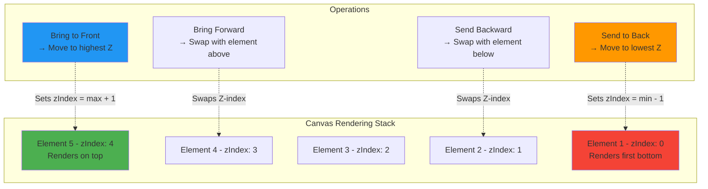

# Element Ordering (Z-Index)

The ordering system controls the **visual stacking** of elements on the canvas through Z-index management. Elements with higher Z-index values render on top of those with lower values, determining which shapes appear in front when they overlap.

Z-index ordering is fundamental to layer management in vector editors, allowing users to control occlusion relationships, create depth hierarchies, and organize complex compositions. The system provides four operations for moving elements up or down the rendering stack, with support for multi-element selection and atomic undo/redo.

## Overview

**Z-index** is a numeric value assigned to each canvas element that determines its rendering order. Elements are drawn from **lowest to highest** Z-index, meaning higher values appear "on top" of lower ones.

**Key characteristics:**

- **Stack-based model**: Elements are organized in a rendering stack
- **Integer values**: Z-index uses integer values for precise layer control
- **Root-level only**: Ordering applies to root elements (not children within groups)
- **Multi-selection support**: Operations can move multiple elements simultaneously
- **Undo/redo integrated**: All operations are recorded in history stack
- **Relative positioning**: Forward/backward operations maintain element relationships

## Z-Index Stack Visualization



## Ordering Operations

### Bring to Front

Moves selected element(s) to the **top of the rendering stack**, giving them the highest Z-index value(s). This operation makes elements appear above all others.

**Algorithm:**

```
maxZIndex = max(all root elements' Z-index values)
for each selected element:
  element.zIndex = maxZIndex + elementIndex + 1
```

**Behavior:**

- Sets Z-index above all other root elements
- Maintains relative order among selected elements
- Multiple selections move as a block to the top
- Ignores child elements within groups

### Bring Forward

Moves selected element(s) **up one layer** by swapping Z-index with the element immediately above. If no element exists above, the operation has no effect.

**Algorithm:**

```
for each selected element:
  elementsAbove = filter(elements where zIndex > current.zIndex)
  if elementsAbove.length > 0:
    nextElement = elementsAbove.first() // Lowest Z-index above current
    swap(current.zIndex, nextElement.zIndex)
```

**Behavior:**

- Swaps Z-index with the next higher element
- Incremental adjustment (one layer at a time)
- No effect if element is already at top
- Preserves Z-index values (just swaps them)

### Send Backward

Moves selected element(s) **down one layer** by swapping Z-index with the element immediately below. If no element exists below, the operation has no effect.

**Algorithm:**

```
for each selected element:
  elementsBelow = filter(elements where zIndex < current.zIndex)
  if elementsBelow.length > 0:
    prevElement = elementsBelow.last() // Highest Z-index below current
    swap(current.zIndex, prevElement.zIndex)
```

**Behavior:**

- Swaps Z-index with the next lower element
- Incremental adjustment (one layer at a time)
- No effect if element is already at bottom
- Preserves Z-index values (just swaps them)

### Send to Back

Moves selected element(s) to the **bottom of the rendering stack**, giving them the lowest Z-index value(s). This operation makes elements appear below all others.

**Algorithm:**

```
minZIndex = min(all root elements' Z-index values)
for each selected element:
  element.zIndex = minZIndex - elementIndex - 1
```

**Behavior:**

- Sets Z-index below all other root elements
- Maintains relative order among selected elements
- Multiple selections move as a block to the bottom
- Ignores child elements within groups

## API Reference

### Element Ordering

Available in **Select** mode for root-level elements:

```typescript
const state = useCanvasStore.getState();

// Bring selected elements to front (top of stack)
state.bringToFront();

// Move selected elements forward one layer
state.sendForward();

// Move selected elements backward one layer
state.sendBackward();

// Send selected elements to back (bottom of stack)
state.sendToBack();
```

**Requirements:**

- At least 1 element must be selected
- Only affects root-level elements (not children)
- Operations are atomic and added to undo history

### Subpath Ordering

Available in **Subpath** mode for reordering subpaths within path elements:

```typescript
const state = useCanvasStore.getState();

// Bring selected subpaths to front (render last)
state.bringSubpathToFront();

// Move selected subpaths forward one position
state.sendSubpathForward();

// Move selected subpaths backward one position
state.sendSubpathBackward();

// Send selected subpaths to back (render first)
state.sendSubpathToBack();
```

**Behavior:**

- Reorders subpaths within the `subPaths` array
- Earlier subpaths render first (below later ones)
- Operations update both rendering order and `selectedSubpaths` indices

## Usage Examples

### Basic Z-Index Control

```typescript
// Select an element and bring to front
state.selectElement('element-1');
state.bringToFront();

// Select another element and send to back
state.selectElement('element-2');
state.sendToBack();
```

### Incremental Layer Adjustment

```typescript
// Select element and move up one layer at a time
state.selectElement('element-3');
state.sendForward(); // Move up one layer
state.sendForward(); // Move up another layer
```

### Multi-Element Ordering

```typescript
// Select multiple elements and move together
state.selectElement('element-1');
state.addToSelection('element-2');
state.addToSelection('element-3');

// Bring all selected elements to front as a group
state.bringToFront();
```

### Subpath Ordering

```typescript
// In subpath mode, reorder subpaths within an element
state.setActivePlugin('subpath');
state.selectSubpath({ elementId: 'path-1', subpathIndex: 0 });
state.addSubpathToSelection({ elementId: 'path-1', subpathIndex: 2 });

// Move selected subpaths to render on top
state.bringSubpathToFront();
```

## UI Integration

Ordering controls are located in the **Arrange Panel** within the sidebar:

```tsx
// Order buttons in ArrangePanel.tsx
const orderButtons: ButtonConfig[] = [
  { 
    handler: currentHandlers.bringToFront, 
    icon: <Triangle size={12} />, 
    title: "Bring to Front", 
    disabled: selectedCount === 0 
  },
  { 
    handler: currentHandlers.sendForward, 
    icon: <ChevronUp size={12} />, 
    title: "Send Forward", 
    disabled: selectedCount === 0 
  },
  { 
    handler: currentHandlers.sendBackward, 
    icon: <ChevronDown size={12} />, 
    title: "Send Backward", 
    disabled: selectedCount === 0 
  },
  { 
    handler: currentHandlers.sendToBack, 
    icon: <Triangle size={12} style={{ transform: 'rotate(180deg)' }} />, 
    title: "Send to Back", 
    disabled: selectedCount === 0 
  }
];
```

**Button states:**

- **Enabled**: When 1+ elements are selected
- **Disabled**: When no elements are selected
- **In edit mode**: Order buttons are hidden (not applicable to points)

## Z-Index Normalization

The system automatically normalizes Z-index values to ensure they remain contiguous and start from 0:

```typescript
// In groupSlice.ts - normalizeRootZIndices helper
const normalizeRootZIndices = (elements: CanvasElement[]): CanvasElement[] => {
  const rootElements = elements
    .filter(element => !element.parentId)
    .sort((a, b) => a.zIndex - b.zIndex);

  const zIndexMap = new Map<string, number>();
  rootElements.forEach((element, index) => {
    zIndexMap.set(element.id, index); // Assign sequential indices
  });

  return elements.map(element =>
    zIndexMap.has(element.id)
      ? { ...element, zIndex: zIndexMap.get(element.id)! }
      : element
  );
};
```

**Normalization triggers:**

- After ungrouping operations
- When removing elements
- On document load (to clean up gaps)

## Best Practices

### For Users

- **Use visual feedback**: Enable render order indicators (if available) to see Z-index visually
- **Group before ordering**: Group related elements, then order the group as a unit
- **Use forward/backward for precision**: Incremental adjustments are safer than jumping to front/back
- **Test with overlaps**: Create overlapping shapes to verify stacking order

### For Plugin Developers

- **Validate root elements**: Always check `!element.parentId` before applying order operations
- **Preserve relationships**: When moving multiple elements, maintain their relative Z-index order
- **Normalize after bulk operations**: Call normalization after operations that create Z-index gaps
- **Integrate with undo**: Order operations must be recorded in undo history
- **Handle edge cases**: Check for empty selections, single-element stacks, and boundary conditions

## Common Use Cases

### Layer Organization

```typescript
// Organize layers in a typical structure
state.selectElement('background-layer');
state.sendToBack(); // Background at bottom

state.selectElement('foreground-layer');
state.bringToFront(); // Foreground on top
```

### Fine-Tuning Overlaps

```typescript
// Adjust overlapping elements incrementally
state.selectElement('overlapping-shape');
state.sendForward(); // Move up one layer to appear above neighbor
```

### Subpath Rendering Order

```typescript
// Change rendering order of subpaths (e.g., holes in compound paths)
state.setActivePlugin('subpath');
state.selectSubpath({ elementId: 'compound-path', subpathIndex: 1 });
state.sendSubpathToBack(); // Render first (becomes innermost hole)
```

### Creating Depth Hierarchy

```typescript
// Organize elements by visual depth
const backgroundIds = ['bg-1', 'bg-2'];
const midgroundIds = ['mid-1', 'mid-2'];
const foregroundIds = ['fg-1', 'fg-2'];

// Send backgrounds to back
backgroundIds.forEach(id => {
  state.selectElement(id);
  state.sendToBack();
});

// Bring foregrounds to front
foregroundIds.forEach(id => {
  state.selectElement(id);
  state.bringToFront();
});
```

## Testing

Z-index ordering is covered by E2E tests in `tests/order.spec.ts`:

```typescript
test('should arrange elements using bring to front and send to back', async ({ page }) => {
  // Create two overlapping shapes with different colors
  // Verify initial Z-order by fill colors
  
  // Select first shape and bring to front
  await bringToFrontButton.click();
  
  // Verify first shape now has higher Z-index
  const afterBringToFront = await getElementOrder(page);
  expect(redElement.zIndex).toBeGreaterThan(blueElement.zIndex);
  
  // Send first shape to back
  await sendToBackButton.click();
  
  // Verify first shape now has lower Z-index
  const afterSendToBack = await getElementOrder(page);
  expect(redElement.zIndex).toBeLessThan(blueElement.zIndex);
});
```

## Related Documentation

- [Selection System](./selection.md) - Element selection
- [Groups](./groups.md) - Group hierarchies and Z-index
- [Arrange Panel](../app-structure/sidebar.md) - UI controls
- [Select Plugin](../plugins/catalog/select.md) - Select mode ordering
- [Subpath Plugin](../plugins/catalog/subpath.md) - Subpath ordering
- [Canvas Store API](../api/canvas-store) - Order slice methods
