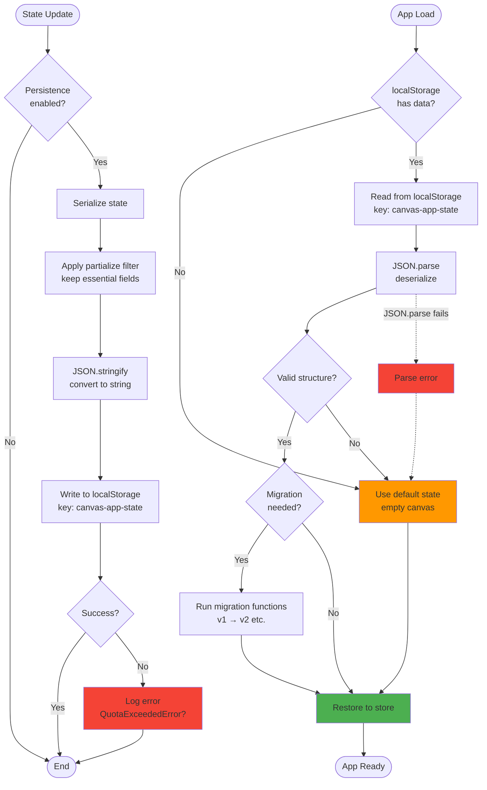

# Persistence

The persistence system provides **automatic state storage** to `localStorage`, ensuring user work is preserved across browser sessions. Built on Zustand's persist middleware, the system intelligently serializes canvas state to the browser's local storage, rehydrates it on application load, and handles storage quota limits gracefully.

Persistence is essential for a web-based editor, enabling users to close their browser without losing work, recover from crashes, and maintain continuity between editing sessions. The system excludes transient state (viewport, UI panels) to keep storage lean while capturing all essential canvas data.

## Overview

Persistence operates through Zustand's **persist middleware**, which wraps the store and intercepts state changes. When state updates occur, the middleware serializes the configured state slice to JSON and writes it to `localStorage` under the key `canvas-app-state`. On application load, the middleware reads from storage, deserializes the JSON, and merges it into the initial store state.

**Key characteristics:**

- **Automatic persistence**: Every state change triggers storage update (debounced)
- **Full state storage**: All state is persisted by default (see Configuration section)
- **localStorage backend**: Uses browser's `localStorage` API (typically 5-10 MB limit)
- **JSON serialization**: State is serialized to JSON for storage
- **Graceful degradation**: Falls back to default state if storage is unavailable
- **No undo history**: Undo/redo stacks are excluded via temporal middleware's `partialize`

## Persistence Flow



## What's Saved

The following state is **automatically persisted** to `localStorage`:

### Canvas Elements

All canvas elements (paths, groups, shapes) and their complete data:

- **Element IDs**: Unique identifiers for each element
- **Type**: Element type (`path`, `group`, etc.)
- **Position**: `x`, `y` coordinates
- **Dimensions**: `width`, `height`, `rotation`
- **Hierarchy**: `parentId` (for grouped elements), `zIndex` (layer order)
- **Visibility**: `visible`, `locked` flags
- **Path data**: Complete path commands, subpaths, stroke/fill styles
- **Group data**: Group transforms, children references

**Storage key:** `elements` array in persisted state

### User Settings

Global application settings and preferences:

- **Keyboard precision**: `keyboardMovementPrecision` (decimal places for arrow key movement)
- **Render badges**: `showRenderCountBadges` (debug mode for render counts)
- **Minimap**: `showMinimap` (minimap overlay visibility)
- **Tooltips**: `showTooltips` (tooltip visibility on desktop)
- **Default stroke color**: `defaultStrokeColor` (default stroke color for new paths)

**Note:** Grid settings (`showGrid`, `gridSize`, `snapToGrid`) are managed by the Grid plugin, not in the base settings object.

**Storage key:** `settings` object in persisted state

### Plugin State

Plugin-specific state that contributes to canvas appearance:

- **Guidelines plugin**: Guide positions, visibility
- **Grid plugin**: Grid type (cartesian, hexagonal), spacing
- **Minimap plugin**: Minimap visibility (if persisted by plugin)

**Note:** Plugin persistence is opt-in; plugins define what to persist via their slice configuration.

## What's Not Saved

The following state is managed by temporal middleware's `partialize` function and **excluded from undo/redo history** (but still persisted to localStorage):

### Undo/Redo History

Temporal middleware history stacks are not persisted to localStorage:

- **Past states**: `temporal.pastStates[]`
- **Future states**: `temporal.futureStates[]`

**Rationale:** Undo history can be large (50 snapshots × full state size) and is session-specific. Users expect undo to work within a session but not across reloads.

**Note:** The temporal middleware uses its own `partialize` function that only includes `elements`, `selectedIds`, and `viewport` in the undo/redo history. However, the persist middleware saves the full state (including viewport, UI panels, settings, and all plugin state) to localStorage.

## Configuration

Persistence is configured in `src/store/canvasStore.ts` using Zustand's `persist` middleware:

```typescript
const useCanvasStore = create<CanvasStore>()(
  persist(
    temporal(
      (...args) => ({
        ...createBaseSlice(...args),
        ...createViewportSlice(...args),
        // ... other slices
      }),
      { /* temporal config */ }
    ),
    {
      // Storage key in localStorage
      name: 'canvas-app-state',
      
      // Partialize: filter what to persist
      partialize: (state: CanvasStore) => {
        const { ...rest } = state;
        return rest; // Currently persists all state (adjust as needed)
      }
    }
  )
);
```

### Configuration Parameters

| Parameter | Value | Purpose |
|-----------|-------|---------|
| `name` | `'canvas-app-state'` | Key used in localStorage |
| `partialize` | `(state) => state` | Function to filter persisted state (currently returns full state) |
| `storage` | `localStorage` (default) | Storage backend (can be `sessionStorage` or custom) |

**Current Implementation:** The `partialize` function currently returns the complete state (`{ ...rest } = state; return rest;`), which means **all state is persisted** including viewport, UI panels, plugin state, and settings.

### Partialize Example

To exclude specific state explicitly (not currently implemented):

```typescript
partialize: (state: CanvasStore) => ({
  elements: state.elements,
  selectedIds: state.selectedIds,
  settings: state.settings,
  // Explicitly include what you want to persist
  // Currently all state is persisted
})
```

## Storage Key Structure

Data is stored in `localStorage` under the key `canvas-app-state` with the following JSON structure:

```json
{
  "state": {
    "elements": [
      {
        "id": "element-1",
        "type": "path",
        "data": { /* path data */ },
        "zIndex": 0,
        "parentId": null
      },
      // ... more elements
    ],
    "selectedIds": ["element-1"],
    "viewport": {
      "zoom": 1,
      "panX": 0,
      "panY": 0
    },
    "settings": {
      "keyboardMovementPrecision": 2,
      "showRenderCountBadges": false,
      "showMinimap": true,
      "showTooltips": true,
      "defaultStrokeColor": "#000000"
    },
      "keyboardMovePrecision": 1,
      "showRenderCounters": false,
      "documentName": "Untitled"
    },
    // ... other persisted slices
  },
  "version": 0 // Zustand persist version (for migrations)
}
```

## Manual Control

While persistence is automatic, you can manually save/restore state for backup or migration purposes:

### Manual Save

```typescript
// Export current state to JSON string
const state = useCanvasStore.getState();
const stateJSON = JSON.stringify(state, null, 2);

// Save to custom localStorage key (backup)
localStorage.setItem('ttpe-backup', stateJSON);

// Or download as file
const blob = new Blob([stateJSON], { type: 'application/json' });
const url = URL.createObjectURL(blob);
const link = document.createElement('a');
link.href = url;
link.download = 'canvas-backup.json';
link.click();
URL.revokeObjectURL(url);
```

### Manual Restore

```typescript
// Restore from custom localStorage key
const backup = localStorage.getItem('ttpe-backup');
if (backup) {
  try {
    const restoredState = JSON.parse(backup);
    useCanvasStore.setState(restoredState);
    
    // Clear undo history after restore
    useCanvasStore.temporal.getState().clear();
  } catch (error) {
    console.error('Failed to restore backup:', error);
    alert('Invalid backup data');
  }
}
```

### Clear Persisted State

```typescript
// Remove persisted state from localStorage
localStorage.removeItem('canvas-app-state');

// Then reload page to start fresh
window.location.reload();
```

## Storage Limits

### Browser Quota

`localStorage` has limited storage capacity:

- **Typical limit**: 5-10 MB per origin
- **QuotaExceededError**: Thrown when limit is reached
- **No automatic cleanup**: Data persists until manually deleted or quota exceeded

### Handling Quota Exceeded

```typescript
try {
  localStorage.setItem('canvas-app-state', JSON.stringify(state));
} catch (error) {
  if (error instanceof DOMException && error.name === 'QuotaExceededError') {
    console.error('localStorage quota exceeded');
    
    // Option 1: Notify user
    alert('Storage full. Consider exporting your work.');
    
    // Option 2: Clear old data
    localStorage.removeItem('old-data-key');
    
    // Option 3: Switch to export-only mode
    // (disable auto-persist, require manual save)
  }
}
```

### Reducing Storage Size

**Strategies to minimize storage usage:**

1. **Limit element count**: Warn users when element count is high
2. **Compress JSON**: Use JSON compression libraries (e.g., lz-string)
3. **Exclude large data**: Don't persist preview images or cached data
4. **Paginate history**: Only persist last N elements/operations
5. **Use IndexedDB**: Switch to IndexedDB for larger storage needs (up to browser limits)

## Migration Strategy

When introducing breaking changes to state structure, implement migrations to preserve user data:

### Version Detection

Store a `version` field in persisted state:

```typescript
interface PersistedState {
  version: number;
  elements: CanvasElement[];
  // ... other fields
}
```

### Migration Functions

Create migration functions for each version transition:

```typescript
function migrateV1ToV2(oldState: any): PersistedState {
  return {
    version: 2,
    elements: oldState.elements.map((el: any) => ({
      ...el,
      // Add new required field with default value
      locked: el.locked ?? false,
    })),
    // ... map other fields
  };
}

function migrateV2ToV3(oldState: any): PersistedState {
  // Handle v2 → v3 changes
  // ...
}
```

### Apply Migrations on Load

```typescript
const persistConfig = {
  name: 'canvas-app-state',
  version: 3, // Current version
  migrate: (persistedState: any, version: number): PersistedState => {
    let state = persistedState;
    
    // Apply migrations sequentially
    if (version < 2) {
      state = migrateV1ToV2(state);
    }
    if (version < 3) {
      state = migrateV2ToV3(state);
    }
    
    return state;
  }
};
```

### Fallback on Migration Failure

```typescript
migrate: (persistedState: any, version: number): PersistedState | undefined => {
  try {
    return applyMigrations(persistedState, version);
  } catch (error) {
    console.error('Migration failed:', error);
    
    // Option 1: Prompt user to reset
    if (confirm('State migration failed. Reset to default state?')) {
      return undefined; // Triggers default state
    }
    
    // Option 2: Return as-is and hope for best
    return persistedState;
  }
};
```

## Best Practices

### For Users

- **Export regularly**: Use manual save to download backup files
- **Monitor storage**: Check browser console for quota warnings
- **Clear old sessions**: Periodically reset state if working on new projects
- **Use document name**: Set meaningful `documentName` to identify saves

### For Plugin Developers

- **Opt-in persistence**: Only persist essential plugin state
- **Document persisted fields**: Clearly document what your plugin persists
- **Handle missing data**: Provide defaults if persisted data is absent
- **Test migrations**: Verify your plugin data migrates correctly across versions
- **Avoid large data**: Don't persist images, cached calculations, or transient data

## Common Use Cases

### Backup Before Risky Operation

```typescript
const backupState = () => {
  const state = useCanvasStore.getState();
  const backup = JSON.stringify(state);
  localStorage.setItem('ttpe-backup-' + Date.now(), backup);
};

// Before performing risky operation
backupState();
performRiskyOperation();
```

### Restore from Specific Backup

```typescript
const restoreBackup = (timestamp: number) => {
  const backup = localStorage.getItem(`ttpe-backup-${timestamp}`);
  if (backup) {
    const state = JSON.parse(backup);
    useCanvasStore.setState(state);
    useCanvasStore.temporal.getState().clear();
  }
};
```

### Export/Import Document

```typescript
// Export document to file
const exportDocument = () => {
  const state = useCanvasStore.getState();
  const documentData = {
    version: '1.0',
    elements: state.elements,
    settings: state.settings,
    viewport: state.viewport, // Include viewport in export (optional)
  };
  
  const blob = new Blob([JSON.stringify(documentData, null, 2)], {
    type: 'application/json'
  });
  const url = URL.createObjectURL(blob);
  const link = document.createElement('a');
  link.href = url;
  link.download = `${state.documentName}.json`;
  link.click();
  URL.revokeObjectURL(url);
};

// Import document from file
const importDocument = async (file: File) => {
  const text = await file.text();
  const documentData = JSON.parse(text);
  
  // Validate version
  if (documentData.version !== '1.0') {
    throw new Error('Unsupported document version');
  }
  
  // Restore state
  useCanvasStore.setState({
    elements: documentData.elements,
    settings: documentData.settings,
    selectedIds: [], // Clear selection
  });
  
  // Clear undo history
  useCanvasStore.temporal.getState().clear();
};
```

### Clear State on Logout

```typescript
const handleLogout = () => {
  // Clear persisted state
  localStorage.removeItem('canvas-app-state');
  
  // Reset store to default state
  useCanvasStore.setState(getDefaultState());
  
  // Navigate to login
  window.location.href = '/login';
};
```

## Troubleshooting

### State Not Persisting

**Problem:** Changes are not saved to localStorage.

**Solutions:**

- Check browser localStorage is enabled (private/incognito mode may disable it)
- Verify `persist` middleware is correctly configured
- Check console for quota exceeded errors
- Ensure `partialize` includes the fields you expect to persist

### Corrupted State on Load

**Problem:** App crashes or behaves incorrectly after reload.

**Solutions:**

- Clear localStorage: `localStorage.removeItem('canvas-app-state')`
- Implement migration functions for version mismatches
- Add error boundaries to catch deserialization errors
- Validate state structure before applying to store

### Storage Quota Exceeded

**Problem:** `QuotaExceededError` thrown when saving state.

**Solutions:**

- Reduce element count or complexity
- Implement data compression (e.g., lz-string)
- Switch to IndexedDB for larger storage capacity
- Prompt user to export/download and reset state

### Lost Data After Browser Update

**Problem:** State lost after browser or app update.

**Solutions:**

- Always provide export/download functionality as backup
- Implement robust migration system for version changes
- Consider server-side storage for critical data
- Add version detection and migration fallback

## Related Documentation

- [Canvas Store](../api/canvas-store.md) - Store architecture and slices
- [Undo/Redo](./undo-redo.md) - History management (not persisted)
- [State Management](../architecture/overview.md#persistence-strategy) - Persistence architecture
- [File Panel](../ui/components.md#file-panel) - Save/Load UI controls
- [Versioning & Migration](../architecture/overview.md#versioning--migration) - Migration strategies
- [Zustand Persist Middleware](https://github.com/pmndrs/zustand#persist-middleware) - Official documentation
