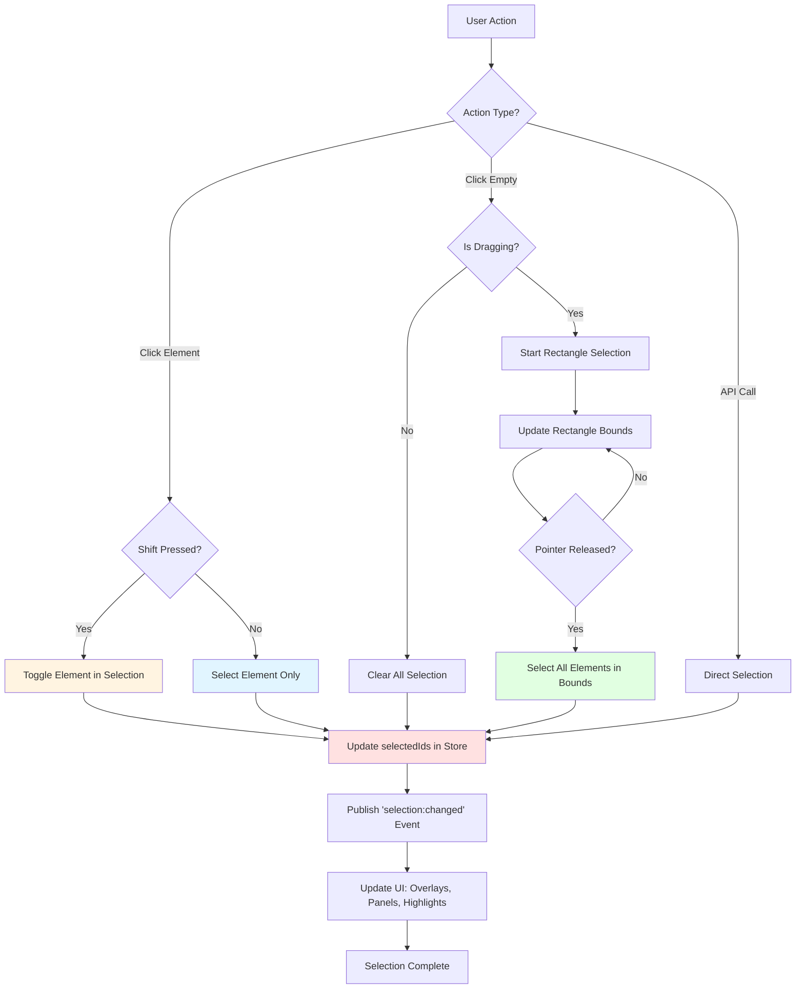
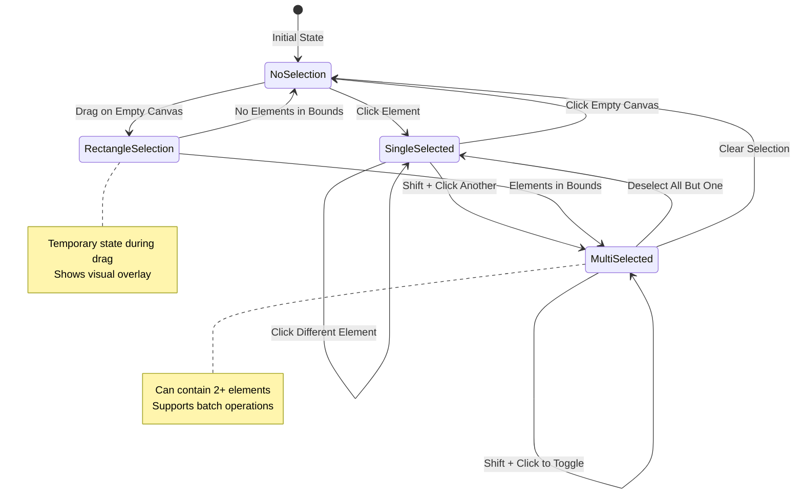

# Selection System

The Selection System is the foundational interaction mechanism in TTPE, enabling users to choose one or multiple elements for editing, transformation, or manipulation. It provides intuitive single-click, multi-select, and rectangle-drag selection modes with full keyboard modifier support.

## Overview

Selection in TTPE is **context-aware** and **non-destructive**. When you select elements, they remain in the canvas while being highlighted with visual indicators (bounding boxes, selection handles). The selection state is tracked globally in the Canvas Store and can be modified through user interactions or programmatically via the API.

The system supports:
- **Single Selection**: Click an element to select it exclusively
- **Multi-Selection**: Hold Shift while clicking to add/remove elements
- **Rectangle Selection**: Click and drag on empty canvas to select all elements within bounds
- **Keyboard Navigation**: Use arrow keys to adjust selection
- **Programmatic Selection**: Use API methods to control selection state

---

## Selection Modes

### Single Selection

Click any element on the canvas to select it. The previously selected elements are automatically deselected (unless Shift is held).

**Behavior:**
- Clicking an unselected element → Selects it and clears previous selection
- Clicking an already selected element → No change (keeps selection)
- Clicking empty canvas → Clears all selection

### Multi-Selection with Shift

Hold **Shift** and click elements to build a selection set.

**Behavior:**
- Shift + Click unselected element → Adds to selection
- Shift + Click selected element → Removes from selection (toggle)
- Works with both mouse clicks and touch events (with Virtual Shift on mobile)

### Rectangle Selection

Click and drag on empty canvas to draw a selection rectangle. All elements whose bounds intersect with the rectangle are selected.

**Behavior:**
- Drag from top-left to bottom-right → Selects elements within bounds
- Works in any direction (start and end points determine rectangle)
- Real-time visual feedback with semi-transparent overlay
- Automatically selects elements on pointer up

---

## Selection Flow Diagram



---

## Selection State Management

The selection state is managed in the Canvas Store as an array of element IDs:

```typescript
interface CanvasState {
  selectedIds: string[];           // Array of selected element IDs
  selectionBounds: Rect | null;   // Computed bounds of selection
  selectionRect: Rect | null;     // Active rectangle selection (during drag)
}
```

### State Transitions



---

## Keyboard Modifiers

### Shift Key

**Purpose**: Modify selection behavior to add/remove rather than replace

**Effects:**
- With element click: Toggle element in selection
- With rectangle drag: Add to existing selection (instead of replace)
- Cross-platform: Works on Windows, Mac, Linux, and mobile (Virtual Shift)

### Virtual Shift (Mobile)

On mobile devices without physical keyboards, use the **Virtual Shift** toggle button:

```typescript
const toggleVirtualShift = useCanvasStore(state => state.toggleVirtualShift);
const isVirtualShiftActive = useCanvasStore(state => state.isVirtualShiftActive);

// Button in toolbar
<Button onClick={toggleVirtualShift} isActive={isVirtualShiftActive}>
  Virtual Shift
</Button>
```

See [Mobile Features](./mobile.md) for more details.

---

## API Reference

### Store Methods

```typescript
// Get store instance
const state = useCanvasStore.getState();

// Select single element (replaces selection)
state.selectElement(elementId: string): void

// Add element to selection
state.addToSelection(elementId: string): void

// Remove element from selection
state.removeFromSelection(elementId: string): void

// Toggle element in selection
state.toggleSelection(elementId: string): void

// Clear all selection
state.clearSelection(): void

// Select multiple elements
state.setSelectedIds(ids: string[]): void

// Select elements within bounds
state.selectByBounds(rect: Rect): void

// Check if element is selected
state.isSelected(elementId: string): boolean
```

### Hook Usage

```typescript
import { useCanvasStore } from '../store/canvasStore';

// Subscribe to selection changes
const selectedIds = useCanvasStore(state => state.selectedIds);
const selectionCount = selectedIds.length;

// Get selection bounds
const selectionBounds = useCanvasStore(state => state.selectionBounds);

// Programmatically modify selection
const addToSelection = useCanvasStore(state => state.addToSelection);
const clearSelection = useCanvasStore(state => state.clearSelection);
```

---

## Selection Events

The Event Bus publishes selection events that plugins and UI components can subscribe to:

```typescript
// Event published when selection changes
eventBus.publish('selection:changed', {
  selectedIds: string[],
  addedIds: string[],
  removedIds: string[],
  selectionBounds: Rect | null
});

// Subscribe to selection changes
eventBus.subscribe('selection:changed', (payload) => {
  console.log('Selection changed:', payload.selectedIds);
  updateUI(payload);
});
```

---

## Visual Indicators

### Selection Highlight

Selected elements are highlighted with:
- **Bounding box outline**: Blue stroke around element bounds
- **Resize handles**: 8 corner/edge handles for transformation (when in transform mode)
- **Selection badge**: Element count indicator (for multi-selection)

### Rectangle Selection Overlay

During rectangle selection, a semi-transparent overlay shows:
- **Stroke**: Dashed blue border indicating selection area
- **Fill**: Light blue semi-transparent background
- **Real-time bounds**: Updates as you drag

---

## Best Practices

### For Users

1. **Use Shift for multi-select**: Build complex selections element by element
2. **Rectangle select for groups**: Quickly select many elements in an area
3. **Click empty to deselect**: Clear selection by clicking canvas background
4. **Check selection count**: Look for badge showing number of selected items

### For Plugin Developers

1. **Always check selection state** before performing operations:
   ```typescript
   const selectedIds = useCanvasStore.getState().selectedIds;
   if (selectedIds.length === 0) {
     console.warn('No elements selected');
     return;
   }
   ```

2. **Subscribe to selection events** instead of polling:
   ```typescript
   useEffect(() => {
     const unsubscribe = eventBus.subscribe('selection:changed', handleSelectionChange);
     return unsubscribe;
   }, []);
   ```

3. **Respect existing selection** when appropriate (don't clear unnecessarily)

4. **Provide feedback** when operations require selection:
   ```typescript
   if (selectedIds.length === 0) {
     toast.error('Please select at least one element');
   }
   ```

---

## Common Use Cases

### Select All Elements of a Type

```typescript
const state = useCanvasStore.getState();
const pathElements = state.elements.filter(el => el.type === 'path');
const pathIds = pathElements.map(el => el.id);
state.setSelectedIds(pathIds);
```

### Invert Selection

```typescript
const state = useCanvasStore.getState();
const allIds = state.elements.map(el => el.id);
const selectedIds = state.selectedIds;
const invertedIds = allIds.filter(id => !selectedIds.includes(id));
state.setSelectedIds(invertedIds);
```

### Select by Property

```typescript
// Select all red elements
const state = useCanvasStore.getState();
const redElements = state.elements.filter(el => 
  el.type === 'path' && el.data?.stroke === '#ff0000'
);
state.setSelectedIds(redElements.map(el => el.id));
```

---

## Related Documentation

- [Select Plugin](../plugins/catalog/select.md) - Plugin implementation
- [Transformation System](./transforms.md) - Transform selected elements
- [Alignment](./alignment.md) - Align selected elements
- [Mobile Features](./mobile.md) - Virtual Shift and touch selection
