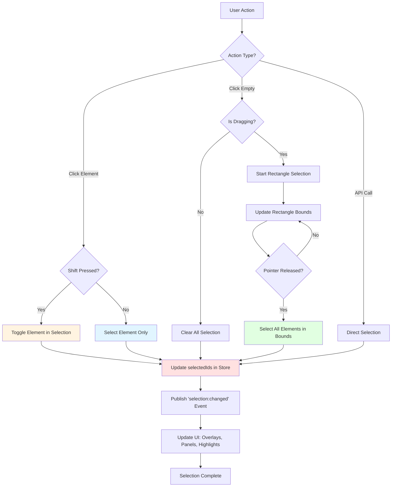
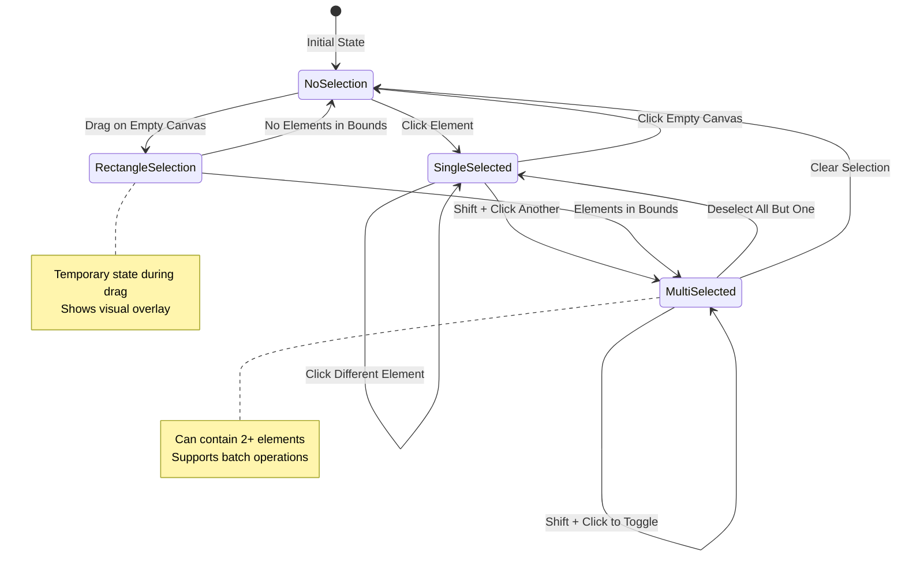

# Selection System

The Selection System is the foundational interaction mechanism in VectorNest, enabling users to choose one or multiple elements for editing, transformation, or manipulation. It provides intuitive single-click, multi-select, and rectangle-drag selection modes with full keyboard modifier support.

## Overview

Selection in VectorNest is **context-aware** and **non-destructive**. When you select elements, they remain in the canvas while being highlighted with visual indicators (bounding boxes, selection handles). The selection state is tracked globally in the Canvas Store and can be modified through user interactions or programmatically via the API.

**Key Features:**
- **Single Selection**: Click an element to select it exclusively
- **Multi-Selection**: Hold Shift while clicking to add/remove elements (toggle behavior)
- **Rectangle Selection**: Click and drag on empty canvas to select all elements within bounds
- **Keyboard Movement**: Use arrow keys to move selected elements (1px normal, 10px with Shift)
- **Programmatic Selection**: Use API methods to control selection state
- **Hidden/Locked Elements**: Cannot be selected (filtered automatically)

:::note
**Alignment, distribution, and ordering** (bring to front, send to back) are provided by the `useArrangeHandlers` hook and displayed in the **ArrangePanel** in the sidebar when elements are selected. These features are not part of the selection system itself.
:::

---

## Selection Modes

### Single Selection

Click any element on the canvas to select it. The previously selected elements are automatically deselected (unless Shift is held).

**Behavior:**
- Clicking an unselected element → Selects it and clears previous selection
- Clicking an already selected element → No change (keeps selection)
- Clicking empty canvas → Clears all selection

### Multi-Selection with Shift

Hold **Shift** and click elements to build a selection set with **toggle behavior**.

**Behavior:**
- Shift + Click unselected element → Adds to selection
- Shift + Click selected element → **Removes from selection (toggle)**
- Works with both mouse clicks and touch events (with Virtual Shift on mobile)
- Toggle behavior allows precise control over selection

### Rectangle Selection

Click and drag on empty canvas (SVG element) to draw a selection rectangle. All elements whose bounds intersect with the rectangle are selected.

**Behavior:**
- Drag from any direction → Rectangle adapts to drag motion
- Works only when clicking on the empty SVG canvas (not on elements)
- Real-time visual feedback with semi-transparent overlay
- Automatically selects elements on pointer up
- **Without Shift**: Replaces current selection
- **With Shift**: Adds to current selection

---

## Selection Flow Diagram



---

## Selection State Management

The selection state is managed in the Canvas Store as an array of element IDs:

```typescript
interface SelectionSlice {
  selectedIds: string[];           // Array of selected element IDs
}
```

**Note:** Selection bounds are computed on-demand when needed, not stored in state. Rectangle selection (during drag) is handled by the canvas interaction hooks, not persisted in the store.

### State Transitions



---

## Keyboard Modifiers

### Shift Key

**Purpose**: Modify selection behavior to add/remove rather than replace

**Effects:**
- With element click: Toggle element in selection
- With rectangle drag: Add to existing selection (instead of replace)
- Cross-platform: Works on Windows, Mac, Linux, and mobile (Virtual Shift)

### Virtual Shift (Mobile)

On mobile devices without physical keyboards, use the **Virtual Shift** toggle button:

```typescript
const toggleVirtualShift = useCanvasStore(state => state.toggleVirtualShift);
const isVirtualShiftActive = useCanvasStore(state => state.isVirtualShiftActive);

// Button in toolbar
<Button onClick={toggleVirtualShift} isActive={isVirtualShiftActive}>
  Virtual Shift
</Button>
```

See [Mobile Features](./mobile.md) for more details.

---

## API Reference

### Store Methods

```typescript
// Get store instance
const state = useCanvasStore.getState();

// Select single element (replaces selection if multiSelect=false)
state.selectElement(elementId: string, multiSelect?: boolean): void

// Select multiple elements (replaces selection)
state.selectElements(ids: string[]): void

// Clear all selection
state.clearSelection(): void

// Get currently selected elements
state.getSelectedElements(): CanvasElement[]

// Get count of selected path elements
state.getSelectedPathsCount(): number

// Move all selected elements by delta
state.moveSelectedElements(deltaX: number, deltaY: number): void

// Update path properties on all selected paths
state.updateSelectedPaths(properties: Partial<PathData>): void
```

**Note:** Methods like `addToSelection`, `removeFromSelection`, `toggleSelection`, `setSelectedIds`, `selectByBounds`, and `isSelected` do not exist in the current implementation. Use `selectElement(id, true)` for multi-selection and `selectElements([...ids])` to set multiple selections.

### Hook Usage

```typescript
import { useCanvasStore } from '../store/canvasStore';

// Subscribe to selection changes
const selectedIds = useCanvasStore(state => state.selectedIds);
const selectionCount = selectedIds.length;

// Get selection methods
const selectElement = useCanvasStore(state => state.selectElement);
const selectElements = useCanvasStore(state => state.selectElements);
const clearSelection = useCanvasStore(state => state.clearSelection);

// Example: Select element with multi-select support
const handleElementClick = (id: string, shiftKey: boolean) => {
  selectElement(id, shiftKey);
};
```

**Note:** `selectionBounds` is not stored in state. Compute bounds on-demand using element positions when needed.

---

## Selection Events

Selection changes can be detected by subscribing to the Zustand store:

```typescript
import { useCanvasStore } from '../store/canvasStore';

// React component: subscribe to selection changes
const selectedIds = useCanvasStore(state => state.selectedIds);

// React effect: run side effects when selection changes
useEffect(() => {
  console.log('Selection changed:', selectedIds);
  // Update UI, trigger actions, etc.
}, [selectedIds]);

// Outside React: subscribe to store changes
const unsubscribe = useCanvasStore.subscribe(
  (state) => state.selectedIds,
  (selectedIds) => {
    console.log('Selection changed:', selectedIds);
  }
);

// Clean up subscription
unsubscribe();
```

**Note:** The application does not currently publish `selection:changed` events to the Event Bus. Selection state changes are tracked through Zustand's subscription mechanism.

---

## Visual Indicators

### Selection Highlight

Selected elements are highlighted with:
- **Bounding box outline**: Blue stroke around element bounds
- **Resize handles**: 8 corner/edge handles for transformation (when in transform mode)
- **Selection badge**: Element count indicator (for multi-selection)

### Canvas Layers

The selection system renders **4 canvas layers** (all in midground placement):

1. **selection-overlays**: Selection overlays for individual path elements showing control points
2. **group-selection-bounds**: Dashed rectangles around selected groups
3. **selection-rectangle**: Live rectangle during drag-to-select operation
4. **selection-blocking-overlay**: Blocks interactions during rectangle selection

### Rectangle Selection Overlay

During rectangle selection, a semi-transparent overlay shows:
- **Stroke**: Dashed blue border indicating selection area
- **Fill**: Gray semi-transparent background
- **Real-time bounds**: Updates as you drag

### Delete Functionality

Selected elements can be deleted using the **Delete** or **Backspace** key:
- Removes elements from canvas
- Clears selection automatically
- Adds operation to undo stack

---

## Keyboard Shortcuts

| Key | Action | Description |
|-----|--------|-------------|
| `Delete` or `Backspace` | Delete selected elements | Removes all selected elements from canvas |
| `Arrow Keys` | Move selection | Move selected elements by 1px in the arrow direction |
| `Shift + Arrow Keys` | Move selection (fast) | Move selected elements by 10px in the arrow direction |
| `Shift + Click` | Toggle selection | Add or remove element from selection |

:::tip
The movement precision can be adjusted in Settings under "Keyboard Movement Precision". The default precision rounds to whole pixels (0 decimal places).
:::

---

## Best Practices

### For Users

1. **Use Shift for multi-select**: Build complex selections element by element
2. **Rectangle select for groups**: Quickly select many elements in an area
3. **Click empty to deselect**: Clear selection by clicking canvas background
4. **Check selection count**: Look for badge showing number of selected items

### For Plugin Developers

1. **Always check selection state** before performing operations:
   ```typescript
   const selectedIds = useCanvasStore.getState().selectedIds;
   if (selectedIds.length === 0) {
     console.warn('No elements selected');
     return;
   }
   ```

2. **Subscribe to selection events** instead of polling:
   ```typescript
   useEffect(() => {
     const unsubscribe = eventBus.subscribe('selection:changed', handleSelectionChange);
     return unsubscribe;
   }, []);
   ```

3. **Respect existing selection** when appropriate (don't clear unnecessarily)

4. **Provide feedback** when operations require selection:
   ```typescript
   if (selectedIds.length === 0) {
     toast.error('Please select at least one element');
   }
   ```

---

## Common Use Cases

### Select All Elements of a Type

```typescript
const state = useCanvasStore.getState();
const pathElements = state.elements.filter(el => el.type === 'path');
const pathIds = pathElements.map(el => el.id);
state.setSelectedIds(pathIds);
```

### Invert Selection

```typescript
const state = useCanvasStore.getState();
const allIds = state.elements.map(el => el.id);
const selectedIds = state.selectedIds;
const invertedIds = allIds.filter(id => !selectedIds.includes(id));
state.setSelectedIds(invertedIds);
```

### Select by Property

```typescript
// Select all red elements
const state = useCanvasStore.getState();
const redElements = state.elements.filter(el => 
  el.type === 'path' && el.data?.stroke === '#ff0000'
);
state.setSelectedIds(redElements.map(el => el.id));
```

---

## Related Documentation

- [Transformation Plugin](../plugins/catalog/transformation.md) - Transform selected elements
- [Alignment](./alignment.md) - Align selected elements
- [Distribution](./distribution.md) - Distribute selected elements
- [Mobile Features](./mobile.md) - Virtual Shift and touch selection
- [Canvas Store API](../api/canvas-store.md) - Selection slice methods

---

## Implementation Notes

### Plugin Architecture

Selection is implemented through the **Select Plugin** (`src/plugins/index.tsx`) which:
- Defines inline within the `CORE_PLUGINS` array (no separate directory)
- Provides pointer event handler for click and drag interactions
- Registers 4 canvas layers for visual feedback
- Exposes Delete keyboard shortcut
- **Does not have its own slice** - uses global `SelectionSlice`

### State Location

Selection state lives in `src/store/slices/features/selectionSlice.ts`:
- Contains `selectedIds` array
- Provides core methods: `selectElement`, `selectElements`, `clearSelection`
- Filters hidden and locked elements automatically
- Clears subpath selection when switching to different path in select mode

### Selection Controller

The `SelectionController` (`src/canvas/selection/SelectionController.ts`) handles:
- Keyboard modifier state (Shift, Ctrl)
- Multi-select mode tracking
- Integration between pointer events and store actions
- Provides `selectElement`, `toggleSelection`, and `clearSelection` methods
