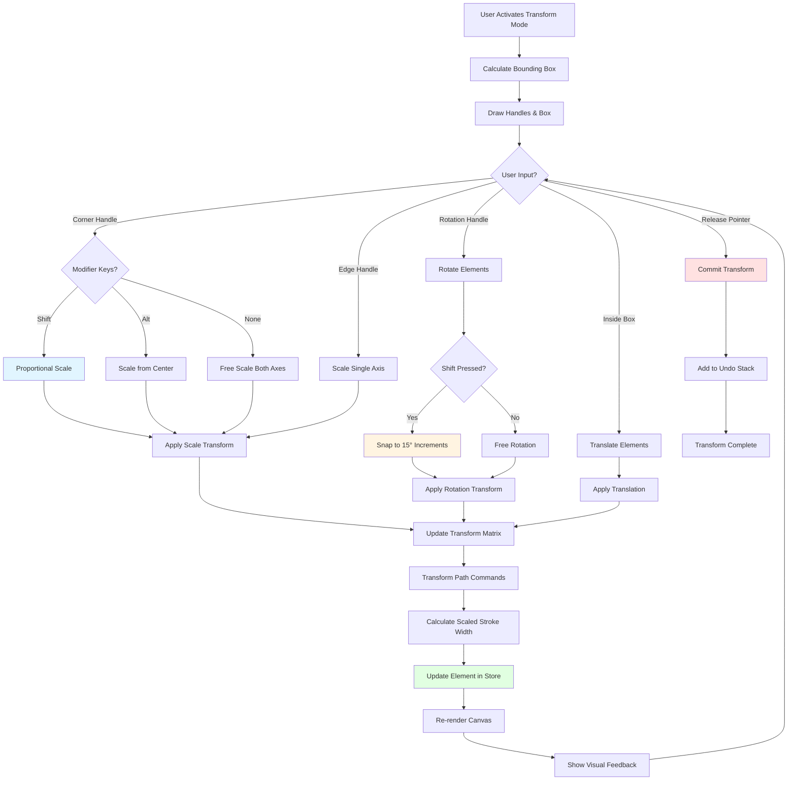
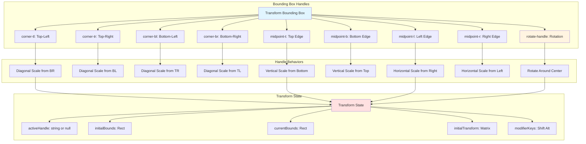

# Transform System

The Transform System provides intuitive visual handles for resizing, rotating, and transforming selected elements on the canvas. It supports both proportional and free-form scaling, rotation with angle snapping, and real-time visual feedback during transformations.

## Overview

Transformations in TTPE are **non-destructive** and **reversible**. When you transform elements, the system calculates scale, rotation, and translation matrices that are applied to the underlying path data. All transformations respect the undo/redo history and can be combined with other operations.

The system provides:
- **8-handle bounding box**: Corner and edge handles for precise control
- **Rotation handle**: Circular handle above the bounding box
- **Proportional scaling**: Hold Shift to maintain aspect ratio
- **Center scaling**: Hold Alt/Option to scale from center
- **Visual feedback**: Real-time dimension and angle display
- **Snap to angles**: 15° increments when holding Shift during rotation

---

## Transform Operations

### Resize (Scale)

Drag any of the 8 handles on the bounding box to resize elements.

**Corner Handles (4):**
- Drag to scale both width and height
- Hold **Shift** for proportional scaling (maintains aspect ratio)
- Hold **Alt/Option** to scale from center point
- Visual feedback shows current dimensions

**Edge Handles (4):**
- **Top/Bottom**: Scale height only (width locked)
- **Left/Right**: Scale width only (height locked)
- No proportional constraint (independent axis scaling)

**Scale Limits:**
- Minimum scale: 0.05× (5% of original size)
- Maximum scale: 10× (1000% of original size)
- Prevents extreme or invalid transformations

### Rotate

Drag the circular rotation handle above the bounding box to rotate elements.

**Behavior:**
- Rotates around the center point of the bounding box
- Hold **Shift** to snap to 15° increments (0°, 15°, 30°, 45°, etc.)
- Visual angle indicator shows current rotation
- Full 360° rotation support (no limits)

**Angle Display:**
- Real-time tooltip shows angle in degrees
- Positive values: Clockwise rotation
- Negative values: Counter-clockwise rotation
- Wraps at ±180°

### Move (Translate)

Click and drag anywhere inside the bounding box (not on handles) to move elements.

**Behavior:**
- Maintains relative positions of all selected elements
- Works with single or multi-selection
- Respects grid snapping when enabled
- Real-time position feedback

---

## Transform Flow Diagram



---

## Transform Handle System



---

## Transform Mathematics

### Scale Calculation

When a handle is dragged, the system calculates scale factors:

```typescript
// Corner handle scale (proportional with Shift)
const deltaX = currentPoint.x - dragStart.x;
const deltaY = currentPoint.y - dragStart.y;

const rawScaleX = (bounds.width + deltaX * signX) / bounds.width;
const rawScaleY = (bounds.height + deltaY * signY) / bounds.height;

if (isShiftPressed) {
  // Proportional: use minimum scale for both axes
  const scale = Math.min(Math.abs(rawScaleX), Math.abs(rawScaleY));
  scaleX = rawScaleX < 0 ? -scale : scale;
  scaleY = rawScaleY < 0 ? -scale : scale;
} else {
  scaleX = rawScaleX;
  scaleY = rawScaleY;
}

// Apply scale limits
scaleX = clamp(scaleX, -10, 10);
scaleY = clamp(scaleY, -10, 10);
```

### Rotation Calculation

```typescript
// Calculate angle from center to current point
const centerX = bounds.x + bounds.width / 2;
const centerY = bounds.y + bounds.height / 2;

const angle = Math.atan2(
  currentPoint.y - centerY,
  currentPoint.x - centerX
) * (180 / Math.PI);

if (isShiftPressed) {
  // Snap to 15° increments
  return Math.round(angle / 15) * 15;
}

return angle;
```

### Transform Matrix Application

```typescript
// Apply transformation to path commands
const transformedCommands = transformCommands(subPath, {
  scaleX,
  scaleY,
  originX,    // Transform origin point
  originY,
  rotation,   // In degrees
  rotationCenterX,
  rotationCenterY
});

// Scale stroke width proportionally
const scaledStrokeWidth = calculateScaledStrokeWidth(
  originalStrokeWidth,
  scaleX,
  scaleY
);
```

---

## Visual Feedback

### Dimension Display

During resize operations, a tooltip shows:
- **Current dimensions**: "Width × Height" in canvas units
- **Delta values**: "+X, +Y" showing change from original
- **Scale percentages**: "150% × 200%" relative to original size

### Angle Display

During rotation, a tooltip shows:
- **Current angle**: "45°" or "Rotation: 45°"
- **Snap indicator**: Highlights when snapped to 15° increment
- **Direction**: Visual arc showing rotation direction

### Handle Highlighting

- **Hover state**: Handle grows slightly and changes color
- **Active state**: Handle is highlighted while dragging
- **Cursor feedback**: Cursor changes based on handle type
  - Diagonal arrows for corner handles
  - Vertical/horizontal arrows for edge handles
  - Circular arrow for rotation handle

---

## Keyboard Modifiers

### Shift Key

**During Resize:**
- Maintains aspect ratio (proportional scaling)
- Applies to corner handles only (edge handles unaffected)
- Visual indicator shows "Shift" in feedback tooltip

**During Rotation:**
- Snaps angle to 15° increments
- Helps achieve precise angles (0°, 45°, 90°, etc.)
- Visual indicator shows angle snap

### Alt/Option Key

**During Resize:**
- Scales from center point instead of opposite corner
- Works with both corner and edge handles
- Useful for symmetrical scaling

---

## API Reference

### Store Methods

```typescript
// Get store instance
const state = useCanvasStore.getState();

// Apply resize transformation
state.applyResizeTransform?.(width: number, height: number): void

// Apply rotation transformation
state.applyRotationTransform?.(degrees: number): void

// Get transformation bounds
state.getTransformationBounds?.(): Rect | null

// Update transformation state
state.updateTransformationState?.(state: Partial<TransformState>): void

// Check if working with subpaths
state.isWorkingWithSubpaths?.(): boolean
```

### Hook Usage

```typescript
import { useCanvasStore } from '../store/canvasStore';

// Subscribe to transformation state
const transformation = useCanvasStore(state => state.transformation);
const isTransforming = transformation.isTransforming;
const activeHandle = transformation.activeHandler;

// Get selected elements for transformation
const selectedIds = useCanvasStore(state => state.selectedIds);
const elements = useCanvasStore(state => state.elements);
const selectedElements = elements.filter(el => 
  selectedIds.includes(el.id)
);
```

### Transform Controller

```typescript
import { TransformController } from '../canvas/interactions/TransformController';

const controller = new TransformController();

// Calculate transform update
const result = controller.calculateTransformUpdate(
  currentPoint,
  transformState,
  elements,
  isShiftPressed
);

// result.updatedElement: Transformed element
// result.feedback: Visual feedback data (dimensions, angle, etc.)
```

---

## Advanced Features

### Subpath Transformation

The system can transform individual subpaths within a multi-path element:

```typescript
// Check if working with subpaths
const isSubpathMode = state.isWorkingWithSubpaths?.();

// Transform only selected subpath
if (isSubpathMode && selectedSubpathIndex !== null) {
  // Transform just this subpath
  transformSubpath(elementId, subpathIndex, transformMatrix);
}
```

### Multi-Element Transformation

Transform multiple selected elements as a group:

```typescript
// All selected elements transform together
// Maintains relative positions and proportions
// Bounding box encompasses all elements
const selectionBounds = accumulateBounds(selectedElements);
```

### Stroke Width Scaling

Stroke width scales proportionally with the element:

```typescript
// Calculate new stroke width
const scaledStroke = calculateScaledStrokeWidth(
  originalStroke,
  scaleX,
  scaleY
);

// Use average of X and Y scales
const avgScale = (Math.abs(scaleX) + Math.abs(scaleY)) / 2;
const newStroke = originalStroke * avgScale;
```

---

## Best Practices

### For Users

1. **Use Shift for proportions**: Hold Shift when dragging corners to maintain aspect ratio
2. **Use Alt for center scale**: Scale from center for symmetrical adjustments
3. **Rotate with Shift**: Hold Shift for precise 15° angle snapping
4. **Check dimensions**: Look at tooltip feedback for exact sizes
5. **Undo if needed**: Use Ctrl+Z to revert unwanted transformations

### For Plugin Developers

1. **Check transform state** before operations:
   ```typescript
   const isTransforming = useCanvasStore.getState().transformation.isTransforming;
   if (isTransforming) {
     // Wait for transform to complete
     return;
   }
   ```

2. **Subscribe to transform events**:
   ```typescript
   eventBus.subscribe('elements:transformed', (payload) => {
     console.log('Elements transformed:', payload.elementIds);
   });
   ```

3. **Respect transformation bounds**:
   ```typescript
   const bounds = state.getTransformationBounds?.();
   if (!bounds) {
     console.warn('No transformation bounds available');
     return;
   }
   ```

4. **Apply scale limits** in custom transforms:
   ```typescript
   const MIN_SCALE = 0.05;
   const MAX_SCALE = 10.0;
   const clampedScale = Math.max(MIN_SCALE, Math.min(MAX_SCALE, scale));
   ```

---

## Common Use Cases

### Resize to Specific Dimensions

```typescript
const state = useCanvasStore.getState();

// Set exact width and height
state.applyResizeTransform?.(200, 150);

// Proportional resize to width
const aspectRatio = bounds.height / bounds.width;
state.applyResizeTransform?.(200, 200 * aspectRatio);
```

### Rotate to Specific Angle

```typescript
// Rotate to 45 degrees
state.applyRotationTransform?.(45);

// Rotate by relative amount
const currentRotation = element.data?.transform?.rotation || 0;
state.applyRotationTransform?.(currentRotation + 90);
```

### Flip Horizontally/Vertically

```typescript
// Horizontal flip (negative scaleX)
const bounds = state.getTransformationBounds?.();
transformElement(element, {
  scaleX: -1,
  scaleY: 1,
  originX: bounds.x + bounds.width / 2,
  originY: bounds.y + bounds.height / 2,
  rotation: 0
});

// Vertical flip (negative scaleY)
transformElement(element, {
  scaleX: 1,
  scaleY: -1,
  originX: bounds.x + bounds.width / 2,
  originY: bounds.y + bounds.height / 2,
  rotation: 0
});
```

---

## Troubleshooting

### Transform not visible
- Ensure elements are selected
- Check that Transform mode is active
- Verify viewport zoom (handles may be too small/large)

### Proportional scaling not working
- Hold Shift key while dragging corner handles
- Edge handles don't support proportional scaling

### Rotation jumps unexpectedly
- Angle wraps at ±180° (expected behavior)
- Release Shift if you don't want angle snapping

### Stroke width becomes too thick/thin
- Stroke scales with element (expected behavior)
- Use Edit mode to adjust stroke independently
- Consider separating stroke into its own path

---

## Related Documentation

- [Transformation Plugin](../plugins/catalog/transformation.md) - Plugin implementation
- [Selection System](./selection.md) - Element selection
- [Canvas Store API](../api/canvas-store) - State management
- [Transform Controller](../architecture/overview.md) - Transform math
