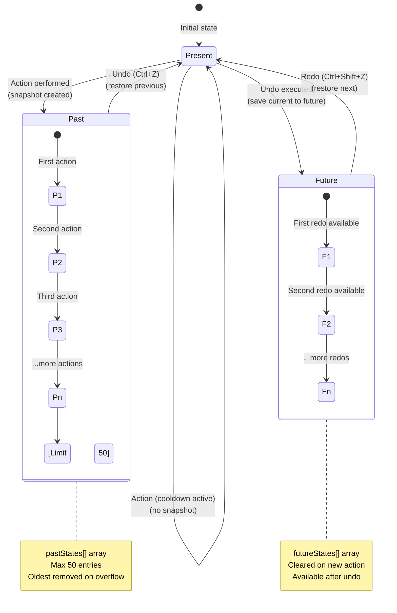
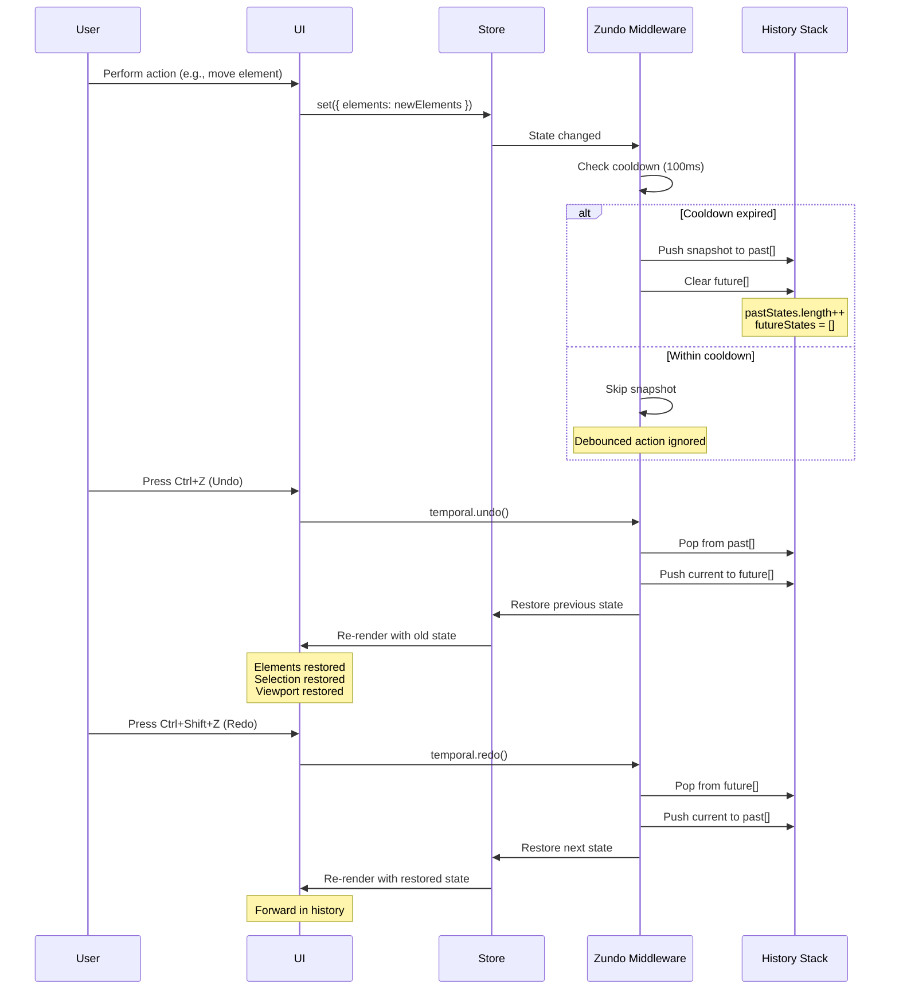

# Undo/Redo

The undo/redo system provides comprehensive history management for all canvas operations, allowing users to step backward and forward through their editing history. Built on **Zundo** middleware for Zustand, the system intelligently tracks state changes with automatic snapshot creation, cooldown periods to prevent excessive history entries, and selective state tracking to optimize memory usage.

Undo/redo is critical for confident editing workflows, enabling users to experiment freely knowing they can revert mistakes. The system integrates seamlessly with all canvas operations while excluding transient UI state and viewport changes that shouldn't clutter the history stack.

## Overview

The undo/redo system is implemented using **Zundo**, a temporal middleware for Zustand that wraps the store and maintains parallel **past** and **future** state stacks. When a user performs an action, the current state is pushed to the past stack, and the future stack is cleared. Undoing pops from past and pushes to future; redoing reverses this process.

**Key characteristics:**

- **Automatic snapshots**: State changes trigger automatic history snapshots
- **Cooldown period**: 100ms debounce prevents excessive snapshots during rapid actions
- **Selective tracking**: Only essential state (elements, selection, viewport) is tracked
- **Deep equality check**: Prevents duplicate snapshots when state hasn't truly changed
- **Memory limited**: Maintains last 50 steps to prevent unbounded growth
- **Non-blocking**: Operates without blocking UI or user interactions

## Temporal State Architecture



**State transitions:**

1. **Action performed**: `present` → `past`, `future` cleared
2. **Undo (Ctrl+Z)**: `past.pop()` → `present`, old `present` → `future.push()`
3. **Redo (Ctrl+Shift+Z)**: `future.pop()` → `present`, old `present` → `past.push()`
4. **Within cooldown**: State change ignored, no snapshot created

## Configuration

The undo/redo system is configured in `src/store/canvasStore.ts` with the following parameters:

```typescript
const useCanvasStore = create<CanvasStore>()(
  persist(
    temporal(
      (...args) => ({
        ...createBaseSlice(...args),
        ...createViewportSlice(...args),
        ...createSelectionSlice(...args),
        // ... other slices
      }),
      {
        // Maximum history depth: keep last 50 state snapshots
        limit: 50,
        
        // Selective state: only track essential fields
        partialize: (state) => ({
          elements: state.elements,
          selectedIds: state.selectedIds,
          viewport: state.viewport,
        }),
        
        // Deep equality check to prevent duplicate snapshots
        equality: (pastState, currentState) => isDeepEqual(pastState, currentState),
        
        // Cooldown period: 100ms debounce for rapid changes
        handleSet: (handleSet) =>
          debounce<typeof handleSet>((state) => {
            handleSet(state);
          }, 100),
      }
    ),
    {
      name: 'canvas-app-state',
      // ... persistence config
    }
  )
);
```

### Configuration Parameters

| Parameter | Value | Purpose |
|-----------|-------|---------|
| `limit` | `50` | Maximum number of history snapshots to retain |
| `partialize` | `{ elements, selectedIds, viewport }` | Which state fields to track in history |
| `equality` | `isDeepEqual()` | Deep equality check to skip duplicate snapshots |
| `handleSet` | `debounce(100ms)` | Cooldown period between snapshots |

## What's Tracked vs. Not Tracked

### Tracked State (Included in History)

The following state changes **trigger undo/redo snapshots**:

- **Canvas elements**: All path, group, and shape modifications
  - Element creation/deletion
  - Property changes (position, size, rotation, style)
  - Path data modifications (commands, points)
  
- **Selection state**: Which elements are currently selected
  - `selectedIds` array changes
  - Selection mode transitions
  
- **Viewport state**: Pan and zoom (included for context)
  - `viewport.panX`, `viewport.panY`
  - `viewport.zoom`

### Not Tracked (Excluded from History)

The following state changes **do not trigger snapshots**:

- **Transient UI state**: Temporary interaction states
  - Hover highlights
  - Drag previews
  - Selection rectangle during drag
  - Active tool indicators
  
- **Plugin-specific ephemeral state**: Temporary plugin data
  - Pencil stroke preview before commit
  - Transform handle positions
  - Text cursor position
  
- **Panel visibility**: UI panel open/closed states
  - Sidebar expansion
  - Panel toggles
  - Theme preferences

**Rationale:** Excluding non-essential state prevents history pollution and keeps snapshots focused on meaningful canvas changes.

## Undo/Redo Flow



## Usage

### Keyboard Shortcuts

The system provides standard keyboard shortcuts for undo/redo:

- **Undo**: `Ctrl + Z` (Windows/Linux) or `Cmd + Z` (macOS)
- **Redo**: `Ctrl + Shift + Z` (Windows/Linux) or `Cmd + Shift + Z` (macOS)

**Implementation:** Handled by `useKeyboardShortcuts` hook which dispatches to `temporal.undo()` and `temporal.redo()`.

### UI Controls

Undo/redo buttons are displayed in the **Bottom Action Bar** with visual counters:

```tsx
// In BottomActionBar.tsx
<ToolbarIconButton
  icon={Undo2}
  label="Undo"
  onClick={() => undo()}
  isDisabled={!canUndo || activePlugin === 'curves'}
  counter={pastStates.length} // Shows number of available undos
/>

<ToolbarIconButton
  icon={Redo2}
  label="Redo"
  onClick={() => redo()}
  isDisabled={!canRedo || activePlugin === 'curves'}
  counter={futureStates.length} // Shows number of available redos
/>
```

**Button states:**

- **Enabled**: When `pastStates.length > 0` (undo) or `futureStates.length > 0` (redo)
- **Disabled**: When no history available or in incompatible plugin (e.g., curves)
- **Counter badge**: Shows number of available undo/redo steps

## API Reference

### Accessing Temporal State

```typescript
import { useCanvasStore } from './store/canvasStore';

// Access temporal state via the temporal property
const { undo, redo, clear, pastStates, futureStates } = useCanvasStore.temporal.getState();
```

### Temporal Methods

#### `undo()`

Undoes the last action by restoring the previous state from history.

```typescript
const { undo } = useCanvasStore.temporal.getState();
undo();
```

**Behavior:**

- Pops most recent snapshot from `pastStates[]`
- Pushes current state to `futureStates[]`
- Restores elements, selection, viewport from snapshot
- No effect if `pastStates` is empty

#### `redo()`

Redoes a previously undone action by restoring the next state from future history.

```typescript
const { redo } = useCanvasStore.temporal.getState();
redo();
```

**Behavior:**

- Pops most recent snapshot from `futureStates[]`
- Pushes current state to `pastStates[]`
- Restores elements, selection, viewport from snapshot
- No effect if `futureStates` is empty

#### `clear()`

Clears all undo/redo history, resetting the history stacks to empty.

```typescript
const { clear } = useCanvasStore.temporal.getState();
clear();
```

**Use cases:**

- After loading a new document
- On explicit "Clear History" action
- When entering a mode that doesn't support undo (e.g., non-destructive preview)

**Warning:** This operation is irreversible; past history cannot be recovered.

### Temporal State Properties

#### `pastStates`

Array of previous state snapshots available for undo.

```typescript
const { pastStates } = useCanvasStore.temporal.getState();
console.log(`Can undo ${pastStates.length} steps`);
```

**Type:** `Array<Partial<CanvasStore>>`

**Max length:** 50 (oldest entries removed when limit exceeded)

#### `futureStates`

Array of future state snapshots available for redo (populated after undo).

```typescript
const { futureStates } = useCanvasStore.temporal.getState();
console.log(`Can redo ${futureStates.length} steps`);
```

**Type:** `Array<Partial<CanvasStore>>`

**Behavior:** Cleared when a new action is performed (branching from past state)

## Usage Examples

### Basic Undo/Redo

```typescript
// Perform some actions
state.addElement(newElement);
state.updateElement('element-1', { x: 100 });
state.deleteElement('element-2');

// Undo last action (deletion)
useCanvasStore.temporal.getState().undo();

// Redo the undone action
useCanvasStore.temporal.getState().redo();
```

### Check History Availability

```typescript
const { pastStates, futureStates } = useCanvasStore.temporal.getState();

if (pastStates.length > 0) {
  console.log(`Can undo ${pastStates.length} steps`);
  // Enable undo button
}

if (futureStates.length > 0) {
  console.log(`Can redo ${futureStates.length} steps`);
  // Enable redo button
}
```

### Clear History on Document Load

```typescript
const loadDocument = async (file: File) => {
  // Parse document
  const documentData = await parseDocumentFile(file);
  
  // Load elements into store
  useCanvasStore.setState({ elements: documentData.elements });
  
  // Clear undo history (new document context)
  useCanvasStore.temporal.getState().clear();
};
```

### Custom Undo Hook

```typescript
import { useEffect, useState } from 'react';
import { useCanvasStore } from './store/canvasStore';

const useTemporalState = () => {
  const [temporalState, setTemporalState] = useState(() => 
    useCanvasStore.temporal.getState()
  );

  useEffect(() => {
    const unsubscribe = useCanvasStore.temporal.subscribe(setTemporalState);
    return unsubscribe;
  }, []);

  return temporalState;
};

// Usage in component
const MyComponent = () => {
  const { undo, redo, pastStates, futureStates } = useTemporalState();
  
  return (
    <div>
      <button onClick={undo} disabled={pastStates.length === 0}>
        Undo ({pastStates.length})
      </button>
      <button onClick={redo} disabled={futureStates.length === 0}>
        Redo ({futureStates.length})
      </button>
    </div>
  );
};
```

## Cooldown Period Explained

The **100ms cooldown** prevents excessive snapshot creation during rapid, continuous actions like dragging or drawing. Without cooldown, every mousemove event would create a snapshot, quickly filling the 50-entry history limit with redundant states.

**How it works:**

1. User starts dragging an element (first state change triggers snapshot)
2. During drag, state updates occur every ~16ms (60fps)
3. Cooldown debouncer ignores updates within 100ms window
4. Only after 100ms of inactivity does next snapshot get created
5. When drag ends, final state is captured

**Example timeline:**

```
Time (ms): 0    50   100  150  200  250  300
Action:    Drag →  →   →    →    →    End
Snapshot:  ✓    ✗   ✗    ✗    ✗    ✓
```

**Benefits:**

- Prevents history pollution from continuous actions
- Maintains meaningful undo steps (start/end of operation)
- Reduces memory usage and improves performance
- Users experience logical undo behavior (undo entire drag, not individual mousemove)

## Best Practices

### For Users

- **Undo frequently**: Don't hesitate to undo and explore alternative approaches
- **Use redo**: After undoing, you can redo to compare options
- **Mind the limit**: Only last 50 actions are retained; older history is lost
- **Save before risky operations**: Complex edits may consume multiple undo steps

### For Plugin Developers

- **Let system handle snapshots**: Don't manually call snapshot creation; system handles it automatically
- **Batch operations**: Group related state changes in single `set()` call to create one snapshot
- **Respect partialize**: Only modify tracked state fields (`elements`, `selectedIds`, `viewport`)
- **Don't mutate state**: Always return new objects; Zustand relies on immutability
- **Test undo behavior**: Verify that undoing your operation restores expected state

## Limitations

- **50-step limit**: Only last 50 actions are retained
- **No branching**: Performing a new action after undo clears redo history (linear timeline)
- **Memory overhead**: Each snapshot stores complete element/selection/viewport state
- **Cooldown delays**: Very rapid actions (< 100ms apart) may not create individual snapshots
- **No partial undo**: Can't undo individual property changes; entire snapshot is restored

## Related Documentation

- [Canvas Store](../api/canvas-store) - Store architecture and slices
- [State Management](../architecture/overview.md#state-management-strategy) - Zustand + Zundo integration
- [Persistence](./persistence.md) - localStorage persistence (undo history not saved)
- [Action Bars](../app-structure/actionbars.md) - Undo/redo UI controls
- [Event Bus](../event-bus/topics.md) - Keyboard event handling for shortcuts
- [Zundo Documentation](https://github.com/charkour/zundo) - Official Zundo middleware docs
