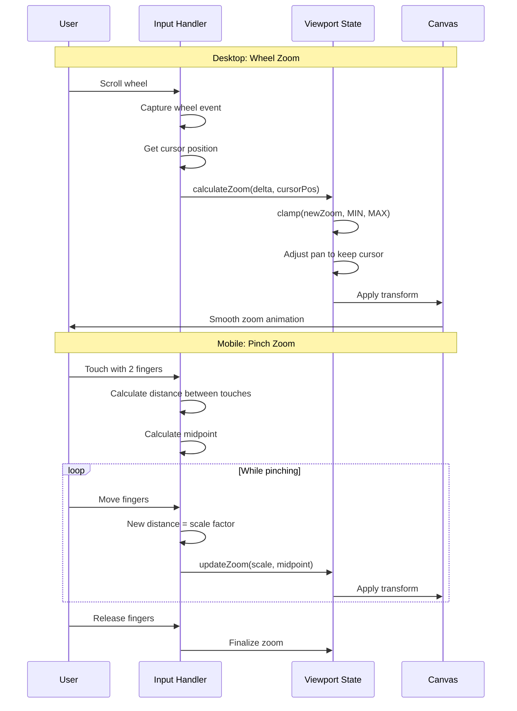
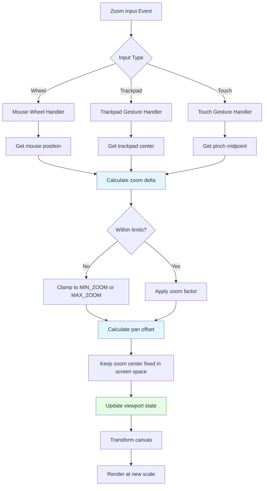
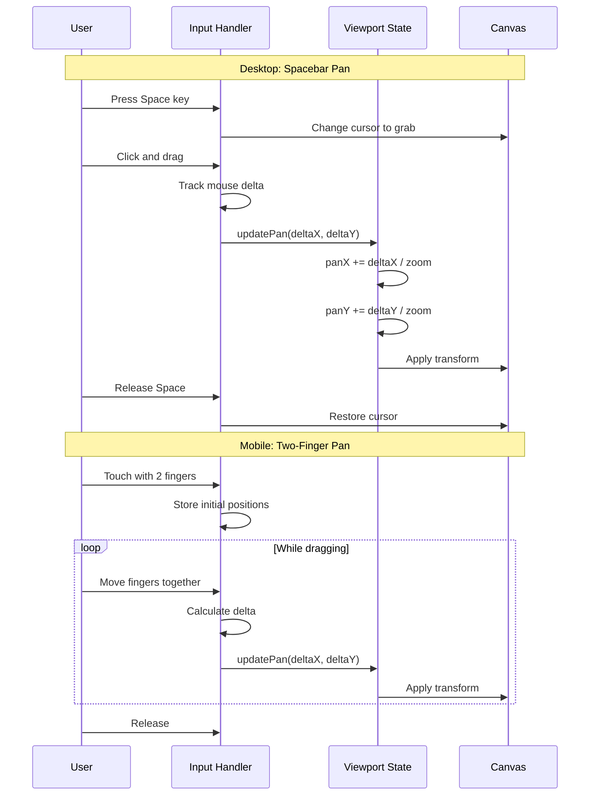
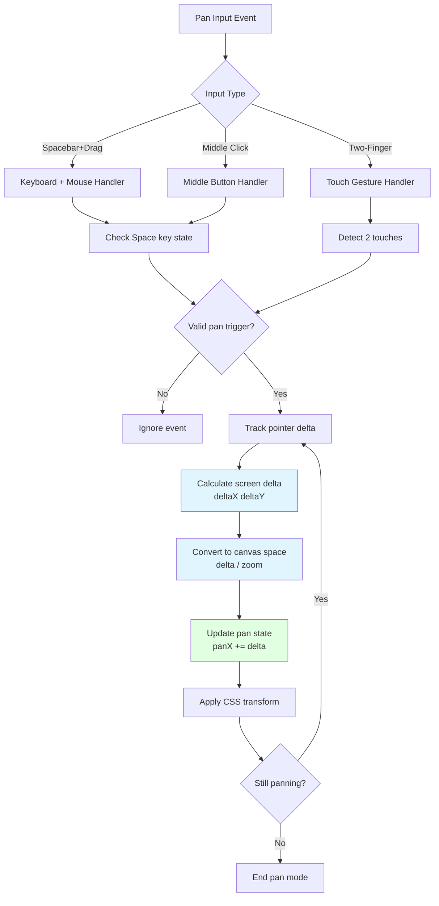

# Viewport: Zoom & Pan

The viewport system manages the user's view into the infinite canvas, providing smooth zoom and pan interactions across desktop and mobile devices.

## Overview

The viewport controls how users navigate the canvas space through:
- **Zoom**: Magnify or reduce the view scale
- **Pan**: Move the visible area of the canvas

Both features work seamlessly across mouse, trackpad, and touch inputs with hardware-accelerated transforms for smooth performance.

## Zoom

### Desktop Zoom

**Mouse Wheel Zoom**:
- Scroll wheel up: Zoom in
- Scroll wheel down: Zoom out
- Zoom centers on cursor position

**Trackpad Pinch**:
- Pinch out: Zoom in
- Pinch in: Zoom out
- Natural scrolling support

### Mobile Zoom

**Pinch-to-Zoom**:
- Two-finger pinch out: Zoom in
- Two-finger pinch in: Zoom out
- Zoom centers on midpoint between fingers

### Zoom Interaction Flow



### Zoom Architecture



### Zoom Limits

- **Minimum Zoom**: 0.1 (10%) - Prevents zooming out to infinity
- **Maximum Zoom**: 10.0 (1000%) - Prevents performance issues
- **Default Zoom**: 1.0 (100%) - 1:1 pixel ratio

### Zoom Keyboard Shortcuts

| Shortcut | Action |
|----------|--------|
| `Ctrl/Cmd + =` | Zoom in |
| `Ctrl/Cmd + -` | Zoom out |
| `Ctrl/Cmd + 0` | Reset zoom to 100% |
| `Ctrl/Cmd + 1` | Fit to screen |

## Pan

### Desktop Pan

**Spacebar + Drag**:
1. Hold Space bar
2. Click and drag anywhere on canvas
3. Canvas moves with cursor
4. Release Space to return to normal mode

**Middle Mouse Button**:
- Click and drag with middle mouse button
- Canvas pans with cursor movement

### Mobile Pan

**Two-Finger Drag**:
1. Touch canvas with two fingers
2. Drag in any direction
3. Canvas pans proportionally
4. Works simultaneously with zoom

### Pan Interaction Flow



### Pan Architecture



### Infinite Canvas

The pan system supports an infinite canvas:
- No artificial boundaries
- Pan to any coordinate
- Coordinate system: `(-∞, -∞)` to `(∞, ∞)`
- Origin (0, 0) at top-left of initial view

## Coordinate Systems

### Screen Coordinates
- Origin: Top-left of viewport
- Units: Pixels
- Affected by zoom and pan

### Canvas Coordinates
- Origin: Arbitrary (user-defined)
- Units: Canvas units (typically pixels at 100% zoom)
- Independent of viewport transform

### Conversion

```typescript
// Screen to Canvas
function screenToCanvas(
  screenX: number, 
  screenY: number, 
  viewport: { zoom: number; panX: number; panY: number }
): Point {
  return {
    x: (screenX - viewport.panX) / viewport.zoom,
    y: (screenY - viewport.panY) / viewport.zoom,
  };
}

// Canvas to Screen
function canvasToScreen(
  canvasX: number, 
  canvasY: number, 
  viewport: { zoom: number; panX: number; panY: number }
): Point {
  return {
    x: canvasX * viewport.zoom + viewport.panX,
    y: canvasY * viewport.zoom + viewport.panY,
  };
}
```

## State Management

```typescript
interface ViewportSlice {
  viewport: {
    zoom: number;        // 0.1 - 10.0
    panX: number;        // Pixels
    panY: number;        // Pixels
    isDragging: boolean; // Pan in progress
  };
  setZoom: (zoom: number, center?: Point) => void;
  setPan: (panX: number, panY: number) => void;
  resetViewport: () => void;
  fitToScreen: (elements: CanvasElement[]) => void;
}
```

## Implementation Details

**Zoom Hook**: `src/canvas/hooks/useCanvasZoom.ts`
- Handles wheel events
- Clamps zoom values
- Adjusts pan to maintain cursor position

**Touch Gestures Hook**: `src/canvas/hooks/useMobileTouchGestures.ts`
- Detects pinch gestures
- Calculates zoom scale from finger distance
- Handles simultaneous pan and zoom

**Pan Hook**: `src/canvas/hooks/useCanvasDrag.ts`
- Spacebar detection
- Drag tracking
- Pan state management

## Performance Optimizations

### Hardware Acceleration
- CSS `transform: translate() scale()` for 60fps
- GPU-accelerated rendering
- No layout recalculation during zoom/pan

### Throttling
- Wheel events: Debounced to 16ms (60fps)
- Touch events: Throttled to 50ms (20fps)
- State updates batched

### Rendering
- Only visible elements rendered
- Viewport culling for off-screen objects
- Level-of-detail adjustments at extreme zooms

## Usage Examples

### Programmatic Zoom

```typescript
import { useCanvasStore } from '@/store/canvasStore';

// Zoom to 200%
useCanvasStore.getState().setZoom(2.0);

// Zoom centered on point
useCanvasStore.getState().setZoom(1.5, { x: 500, y: 300 });
```

### Programmatic Pan

```typescript
// Pan to specific position
useCanvasStore.getState().setPan(100, 200);

// Pan relative to current position
const { panX, panY } = useCanvasStore.getState().viewport;
useCanvasStore.getState().setPan(panX + 50, panY - 30);
```

### Fit to Screen

```typescript
// Fit all elements in view
const elements = useCanvasStore.getState().elements;
useCanvasStore.getState().fitToScreen(elements);
```

### Reset Viewport

```typescript
// Reset to default (100% zoom, centered)
useCanvasStore.getState().resetViewport();
```

## Touch Gestures Reference

### Mobile Gestures

| Gesture | Action |
|---------|--------|
| **Pinch Out** | Zoom in |
| **Pinch In** | Zoom out |
| **Two-Finger Drag** | Pan canvas |
| **Pinch + Drag** | Zoom and pan simultaneously |

### Gesture Priority

1. **Two Fingers**: Always triggers viewport control
2. **One Finger**: Selection or drawing (depends on active tool)
3. **Three+ Fingers**: Reserved for system gestures

## Edge Cases

### Zoom Edge Cases
- **Minimum Zoom**: Displays at 10%, prevents further zoom out
- **Maximum Zoom**: Displays at 1000%, prevents further zoom in
- **Precision**: Zoom values stored with 3 decimal precision

### Pan Edge Cases
- **Infinite Panning**: No limits, users can pan arbitrarily far
- **Lost Elements**: "Fit to Screen" button returns to content
- **Empty Canvas**: Pan still works, allows positioning before drawing

## Accessibility

- **Keyboard Navigation**: Full zoom/pan control without mouse
- **Screen Readers**: Viewport state announced on change
- **Reduced Motion**: Respects `prefers-reduced-motion` setting

## Related Features

- [Selection](./selection) - Selection box accounts for zoom
- [Grids](../plugins/catalog/grid) - Grid scale adapts to zoom level
- [Snapping](../plugins/catalog/object-snap) - Snap distances zoom-aware
