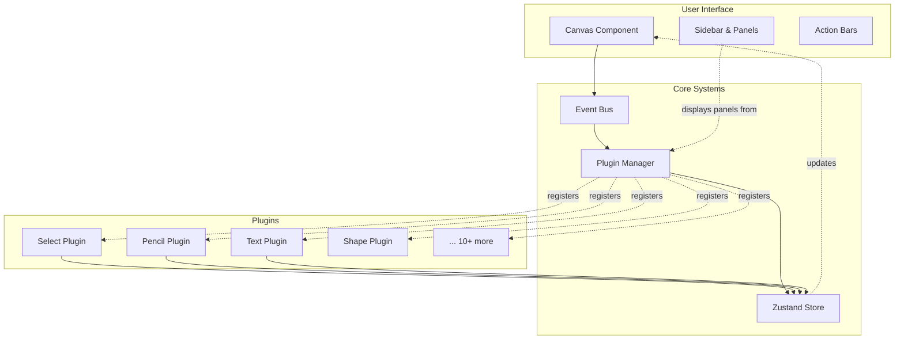

# Vectornest — Web Vector Editor

Welcome to the comprehensive technical documentation for **Vectornest**, a modern, extensible web-based vector graphics editor built with React, TypeScript, and a sophisticated plugin architecture.

## What is Vectornest?

Vectornest is a full-featured SVG vector graphics editor that runs entirely in the browser. It provides:

- **Advanced Path Editing**: Precise manipulation of Bézier curves and path segments
- **Plugin Architecture**: Extensible tool system with hot-swappable plugins
- **Event-Driven Architecture**: Flexible pub/sub system for loose component coupling
- **Modern Stack**: React 19, TypeScript, Zustand state management, Chakra UI
- **Comprehensive Testing**: E2E tests with Playwright ensuring reliability

## Documentation Structure

This documentation is organized into the following main sections:

### Application Structure
Learn about the overall application layout and key components:
- **Overview**: High-level application architecture
- **Canvas**: The main drawing surface and rendering system
- **Action Bars**: Top and bottom toolbars with controls
- **Sidebar**: Plugin panels and configuration options
- **Editor Panel**: Provides universal stroke/fill/opacity controls, independent of the active mode
- **File Panel**: Document management and import/export
- **Settings Panel**: Application preferences and configuration

### Architecture
Understand the system design and technical foundations:
- **Overview**: Core architectural principles and design decisions
- **Diagrams**: Visual representations of system interactions and data flow

### Plugin System
Master the extensible plugin architecture:
- **Overview**: Plugin concepts and registration process
- **Lifecycle**: Plugin initialization, activation, and cleanup
- **Registration**: How plugins are discovered and loaded
- **Configuration**: Plugin settings and customization
- **Plugin Catalog**: Complete reference for all built-in plugins

### Event Bus
Learn about the communication system that connects components:
- **Overview**: Event-driven architecture principles
- **Topics**: Available event types and payload structures
- **Patterns**: Best practices for event publishing and subscription

### Public API
Reference documentation for plugin development:
- **Create API**: The plugin interface for extending Vectornest
- **Plugin Manager**: Runtime plugin management and coordination
- **Canvas Store**: State management and data persistence

### Core Features
Explore Vectornest's main editing capabilities:
- **Alignment**: Precise element positioning
- **Distribution**: Spacing and layout tools
- **Groups**: Element grouping and hierarchy
- **Match**: Homogenize dimensions by matching width or height
- **Mobile**: Touch and mobile device support
- **Ordering**: Z-index management and layering
- **Persistence**: Data saving and loading
- **Selection**: Element selection and manipulation
- **Undo/Redo**: History management and state restoration

### UI & Theming
Customize the appearance and user experience:
- **Components**: Reusable UI components and patterns
- **Theming**: Color schemes and visual customization
- **Accessibility**: Inclusive design and keyboard navigation
- **Feedback Overlay**: User notifications and status messages

### TypeScript Types
Complete type definitions for development:
- **Index**: Type system overview and conventions
- **Canvas Elements**: Element data structures and properties
- **Curves**: Interactive curve creation types
- **Geometry**: Points, paths, and mathematical types
- **Plugin Context**: Runtime context and helper types
- **Plugin Contributions**: UI and canvas layer contribution types
- **Plugin Definition**: Plugin registration and metadata types
- **Selection**: Selection state and manipulation types
- **Shortcuts**: Keyboard shortcut system types
- **Viewport**: Camera and coordinate transformation types

### Utilities
Helper functions and development tools:
- **Hooks**: Custom React hooks for common patterns

### Operations
Build, test, and deployment workflows:
- **Operations**: Development and production workflows
- **Testing**: Test execution and quality assurance
- **Test Results**: Automated test evidence and reports

### Contributing
Guidelines for contributors and maintainers:
- **Style Guide**: Code formatting and documentation standards
- **Code Standards**: Development best practices and conventions

### Additional Resources
- **FAQ**: Frequently asked questions
- **Troubleshooting**: Common issues and solutions
- **Changelog**: Version history and release notes

## Quick Links

### For Developers

- **[Architecture Overview](architecture/overview)** - Understand the system design and key abstractions
- **[Plugin System](plugins/overview)** - Learn how to create and register plugins
- **[Event Bus](event-bus/overview)** - Master the pub/sub event system
- **[Public API](api/create-api)** - Reference for the `createApi` plugin interface

### For Contributors

- **[Contributing Guide](contributing/style-guide)** - Documentation and code standards
- **[Operations](ops/operations)** - Build, test, and deployment workflows

### Reference

- **[Plugin Catalog](plugins/catalog/pencil)** - Complete reference for all built-in plugins
- **[UI Components](ui/components)** - Reusable React components
- **[Theming](ui/theming)** - Color tokens and theme customization
- **[FAQ](faq)** - Frequently asked questions
- **[Troubleshooting](troubleshooting)** - Common issues and solutions

## Key Features

### Plugin-Based Architecture

Vectornest's core strength is its plugin system. Every tool—from selection and drawing to transforms and grid fills—is implemented as a plugin:

```typescript
const myPlugin: PluginDefinition = {
  id: 'my-tool',
  metadata: { label: 'My Tool', icon: MyIcon },
  handler: (event, point, target, context) => {
    // Tool interaction logic
  },
  slices: [createMyPluginSlice],
  createApi: (context) => ({
    doSomething: () => { /* public API */ }
  })
};
```

See [Plugin System Overview](plugins/overview) for details.

### Canvas Event Bus

A type-safe event bus coordinates interactions between the canvas, plugins, and UI:

```typescript
eventBus.emit('pointerdown', {
  event, point, target, activePlugin, helpers, state
});

eventBus.subscribe('pointermove', (payload) => {
  // React to pointer movements
});
```

Learn more in [Event Bus Documentation](event-bus/overview).

### Zustand Store with Slices

State is managed through a modular slice architecture. Each plugin can contribute its own slice:

```typescript
export const createMySlice: PluginSliceFactory = (set, get, api) => ({
  state: {
    myData: [],
    mySettings: { ... }
  },
  cleanup: (set, get, api) => {
    // Cleanup logic
  }
});
```

See [Canvas Store API](api/canvas-store) for the complete reference.

## Core Concepts

### 1. Plugins

Plugins are self-contained modules that extend Vectornest's functionality. They can:

- Handle pointer events on the canvas
- Register keyboard shortcuts
- Contribute UI panels and overlays
- Expose public APIs to other plugins
- Manage their own state via Zustand slices

### 2. Event Bus

The event bus decouples plugins from direct canvas manipulation:

- **Type-safe**: All events have defined payload types
- **Scoped**: Handlers can filter by active plugin
- **Lifecycle-managed**: Subscriptions cleanup automatically

### 3. Canvas Services

Long-running services (like zoom, smooth brush, add-point) register with the plugin manager and interact with the canvas lifecycle independently of tools.

### 4. Layers & Rendering

Plugins can contribute canvas layers (foreground, midground, background) for custom SVG rendering without modifying core canvas code.

## Architecture Highlights



See [Architecture Diagrams](architecture/diagrams) for detailed system views.

## Technology Stack

- **React 19**: UI framework with concurrent features
- **TypeScript 5.8**: Type safety and developer experience
- **Zustand 5**: Lightweight state management
- **Chakra UI 2**: Component library with theming
- **Paper.js**: Boolean operations and computational geometry
- **Playwright**: End-to-end testing
- **Vite 7**: Build tool and dev server

## Performance Considerations

Vectornest is designed for performance:

- **Virtual rendering**: Only visible elements are processed
- **Debounced operations**: Undo snapshots and expensive calculations are throttled
- **Memoization**: React components use `useMemo` and `useCallback` extensively
- **Canvas services**: Heavy computations run outside the React render cycle

See [Architecture Overview](architecture/overview#performance-optimizations) for optimization strategies.

## Browser Support

- **Chrome/Edge**: 90+
- **Firefox**: 88+
- **Safari**: 14.1+
- **Mobile**: iOS Safari 14.1+, Chrome Mobile 90+

## Getting Started

Ready to dive in? Choose your path:

- **Using Vectornest**: See the main project README for running the application
- **Extending Vectornest**: Start with [Plugin System](plugins/overview)
- **Understanding the Code**: Begin with [Architecture Overview](architecture/overview)
- **Contributing**: Read the [Style Guide](contributing/style-guide)

## Documentation Philosophy

This documentation follows these principles:

- **DRY (Don't Repeat Yourself)**: Cross-links instead of duplication
- **Precision**: Accurate, tested code examples
- **Completeness**: No "TBD" placeholders; all sections are complete
- **Actionable**: Copy-paste examples that work
- **Diagrams**: Mermaid visualizations for complex flows

## Support & Community

- **Issues**: [GitHub Issues](https://github.com/ekrsulov/ttpe/issues)
- **Discussions**: [GitHub Discussions](https://github.com/ekrsulov/ttpe/discussions)
- **Email**: [Maintainer contact info - replace with actual]

## License

Vectornest is licensed under [LICENSE TYPE - Assumption: MIT]. See the main repository for details.

---

**Ready to explore?** Start with the [Architecture Overview](architecture/overview) or jump directly to [Plugin Development](plugins/overview).
