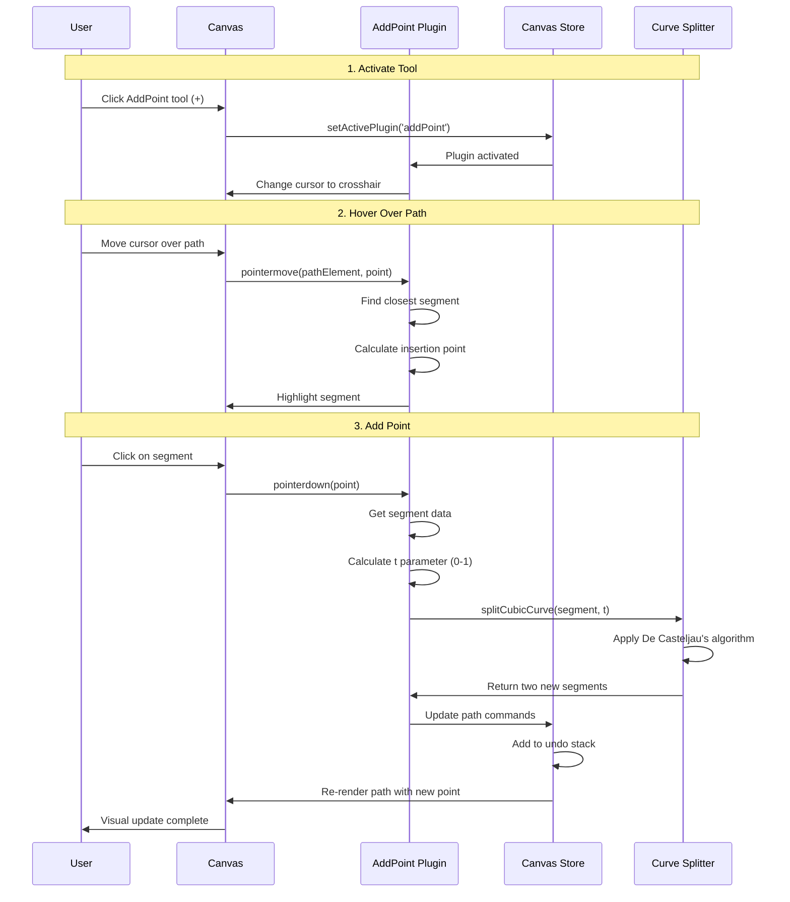
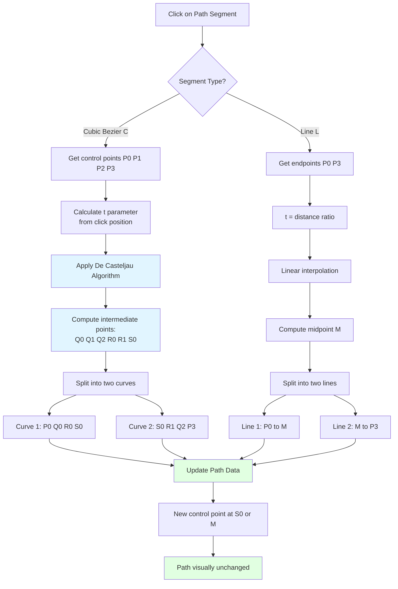

# Add Point Plugin

**Purpose**: Add new control points to existing paths with precision

## Overview

The Add Point plugin allows users to insert new control points into existing path segments. This is essential for refining shapes, adding detail, or preparing paths for further manipulation. The plugin intelligently splits bezier curves while maintaining the visual appearance of the original shape.

**Key Features:**
- Click to add points anywhere on a path segment
- Automatic bezier curve splitting with shape preservation
- Visual feedback showing where the point will be inserted
- Supports both straight lines and curved segments
- Works on any selected path element

## Plugin Interaction Flow



## Point Insertion System



## Handler

The AddPoint plugin uses a custom handler that:
- Only responds when the plugin is active
- Detects clicks on path segments
- Calculates the precise insertion point
- Triggers the curve splitting algorithm

## Keyboard Shortcuts

| Shortcut | Action |
|----------|--------|
| `+` (Plus) | Activate Add Point tool |
| `Esc` | Return to Select tool |

## UI Contributions

### Panels

**AddPointPanel**: Information and instructions
- Shows currently selected path
- Displays hover state when over a valid segment
- Usage instructions
- "Click on any segment to add a point" guidance

### Overlays

**AddPointFeedbackOverlay**: Visual guidance
- Highlights the segment under cursor
- Shows insertion point preview
- Displays closest point indicator

### Canvas Layers

**add-point-preview**: Interactive preview layer
- Shows where the point will be inserted
- Highlights the target segment
- Renders in midground layer

## Technical Details

### Curve Splitting Algorithm

The plugin uses **De Casteljau's algorithm** to split cubic Bezier curves:

```typescript
function splitCubicCurve(
  p0: Point, p1: Point, p2: Point, p3: Point, 
  t: number
): { curve1: CubicCurve; curve2: CubicCurve } {
  // First level interpolation
  const q0 = lerp(p0, p1, t);
  const q1 = lerp(p1, p2, t);
  const q2 = lerp(p2, p3, t);
  
  // Second level interpolation
  const r0 = lerp(q0, q1, t);
  const r1 = lerp(q1, q2, t);
  
  // Third level - split point
  const s0 = lerp(r0, r1, t);
  
  return {
    curve1: { p0, p1: q0, p2: r0, p3: s0 },
    curve2: { p0: s0, p1: r1, p2: q2, p3 }
  };
}
```

### T Parameter Calculation

The `t` parameter (0 to 1) represents the position along the curve where the split occurs:
- **t = 0**: Start of segment
- **t = 0.5**: Midpoint
- **t = 1**: End of segment

The plugin calculates `t` based on the click position's distance along the curve.

## State Management

```typescript
interface AddPointSlice {
  addPoint: {
    hoveredSegment: {
      elementId: string;
      segmentIndex: number;
      tParameter: number;
    } | null;
    isActive: boolean;
  };
}
```

## Usage Examples

### Activating the Tool

```typescript
const state = useCanvasStore.getState();
state.setActivePlugin('addPoint');
```

### Programmatic Point Addition

```typescript
import { addPointToPath } from '@/plugins/addPoint/actions';

// Add point at 50% along segment 2 of a path
addPointToPath({
  elementId: 'path-123',
  segmentIndex: 2,
  t: 0.5
});
```

## Implementation Details

**Location**: `src/plugins/addPoint/`

**Files**:
- `index.tsx`: Plugin definition
- `slice.ts`: Zustand state management
- `AddPointPanel.tsx`: UI panel
- `AddPointFeedbackOverlay.tsx`: Visual feedback
- `hooks/useAddPointHook.ts`: Core logic
- `utils/curveSplitting.ts`: Math utilities

## Edge Cases & Limitations

- **Path Selection**: Must have a path element selected
- **Minimum Distance**: Won't add points too close to existing points (< 2px)
- **Closed Paths**: Works on both open and closed paths
- **Complex Paths**: Performance may vary with very complex multi-segment paths
- **Undo/Redo**: Each point addition creates one undo entry

## Sidebar Configuration

```typescript
sidebarPanels: [
  {
    key: 'addPoint',
    condition: (ctx) => !ctx.isInSpecialPanelMode && ctx.activePlugin === 'addPoint',
    component: AddPointPanel,
  },
]
```

## Related

- [Edit Plugin](./edit) - For manipulating existing points
- [Curves Plugin](./curves) - For creating new curved paths
- [Path Plugin](./path) - For basic path creation
