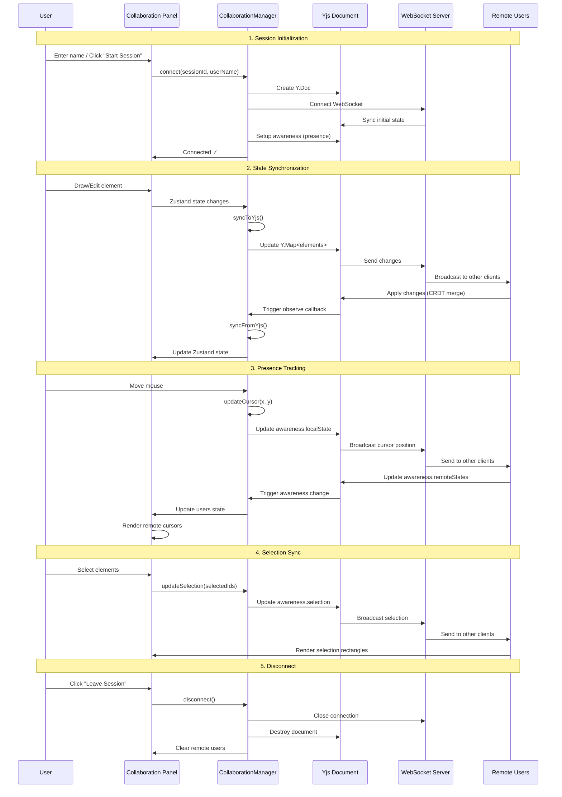
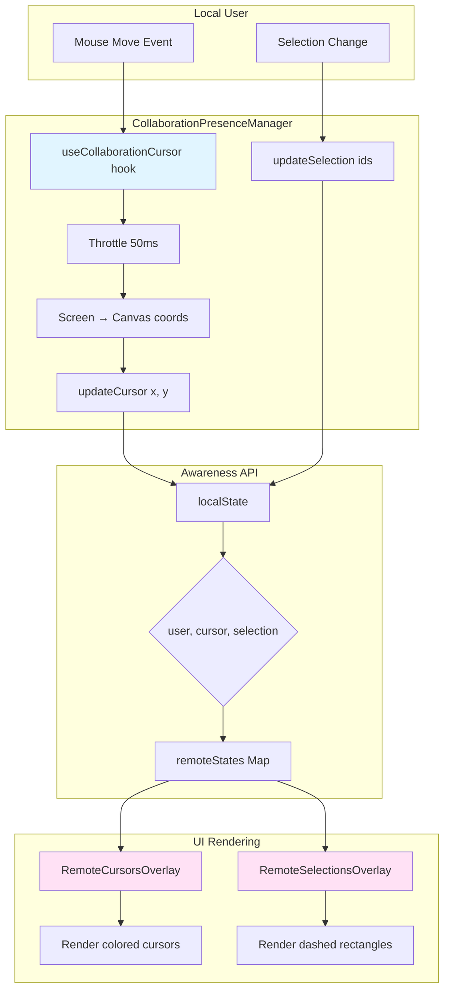

# Collaboration Plugin

**Purpose**: Real-time multiplayer collaboration using CRDTs and WebSocket synchronization

## Overview

The Collaboration plugin enables multiple users to work on the same canvas simultaneously with automatic conflict resolution, presence awareness, and session management.

**Features**:
- Real-time synchronization using Yjs CRDTs
- WebSocket-based communication
- Presence awareness (cursors and selections)
- Persistent username storage
- Auto-join sessions via shareable links
- Conflict-free concurrent editing
- Session management UI

## Plugin Interaction Flow



## CRDT Synchronization System

```mermaid
graph TB
    subgraph "Zustand State (Local)"
        A[elements: CanvasElement[]]
        B[viewport: {zoom, pan}]
        C[selectedIds: string[]]
    end
    
    subgraph "CollaborationManager"
        D[syncToYjs]
        E[syncFromYjs]
        F[isSyncing flag]
    end
    
    subgraph "Yjs Document (CRDT)"
        G[Y.Map elements]
        H[Y.Map viewport]
        I[Awareness presence]
    end
    
    subgraph "WebSocket Server"
        J[y-websocket]
        K[Session rooms]
    end
    
    subgraph "Remote Clients"
        L[Other Users' State]
    end
    
    A -->|State change| D
    D -->|Set Y.Map| G
    G -->|Observe| E
    E -->|Update state| A
    
    B -->|State change| D
    D -->|Set Y.Map| H
    H -->|Observe| E
    E -->|Update state| B
    
    C -->|Selection change| I
    I -->|Awareness change| F
    
    G <-->|WebSocket| J
    H <-->|WebSocket| J
    I <-->|WebSocket| J
    
    J <-->|Sync| K
    K <-->|Broadcast| L
    
    style D fill:#e1f5ff
    style E fill:#ffe1e1
    style F fill:#fff4e1
    style G fill:#e1ffe1
```

## Presence System



## Handler

N/A (No canvas interaction handler; uses global presence manager)

## Keyboard Shortcuts

No plugin-specific shortcuts.

## UI Contributions

### Panels

**CollaborationPanel**: Session management interface integrated into the File sidebar panel
- **Start Session**: Creates a new collaboration session with a unique ID
- **Join Session**: Connects to an existing session using a session ID or URL parameter
- **Copy Link**: Copies a shareable URL to clipboard
- **Leave Session**: Disconnects from the current session
- **User List**: Shows all connected users with colored indicators
- **Connection Status**: Displays connection state and session ID
- **Persistent Username**: Saves username to localStorage for future sessions
- **Auto-Join**: Automatically joins sessions when clicking shared links (if username is saved)

Condition: Shows when File panel is active (`condition: (ctx) => ctx.showFilePanel`)

### Overlays

**CollaborationGlobalManager**: Invisible global component that manages presence tracking
- Runs independently of UI panel visibility
- Tracks cursor position across all modes
- Syncs selection changes automatically
- Active whenever a collaboration session is connected

**RemoteCursorsOverlay**: Renders remote user cursors as colored pointers
- Displays user name labels
- Converts canvas coordinates to screen coordinates
- Uses fixed positioning over entire viewport
- Each user gets a unique color from predefined palette

### Canvas Layers

**RemoteSelectionsOverlay**: Shows selection rectangles from other users
- Renders dashed rectangles around selected elements
- Uses each user's assigned color
- Calculates bounds for selected elements
- Foreground layer (renders above elements)

## Public APIs

### CollaborationManager

#### `connect(sessionId: string, userName: string): Promise<void>`
Connects to a collaboration session.

```typescript
const manager = getCollaborationManager();
await manager.connect('session_123', 'John Doe');
```

#### `disconnect(): void`
Disconnects from the current session.

```typescript
manager.disconnect();
```

#### `updateCursor(x: number, y: number): void`
Updates local cursor position (called automatically by presence manager).

```typescript
manager.updateCursor(100, 200);
```

#### `updateSelection(selectedIds: string[]): void`
Updates local selection state (called automatically by presence manager).

```typescript
manager.updateSelection(['element-1', 'element-2']);
```

### Static Methods

#### `CollaborationManager.getSessionFromUrl(): string | null`
Extracts session ID from URL query parameters.

```typescript
const sessionId = CollaborationManager.getSessionFromUrl();
// Returns: "session_123" from "?session=session_123"
```

#### `CollaborationManager.createSessionUrl(sessionId: string): string`
Creates a shareable URL with session ID.

```typescript
const url = CollaborationManager.createSessionUrl('session_123');
// Returns: "http://localhost:5173?session=session_123"
```

#### `CollaborationManager.generateSessionId(): string`
Generates a unique session ID.

```typescript
const sessionId = CollaborationManager.generateSessionId();
// Returns: "1700000000000_abc123def"
```

### getCollaborationManager()

Gets or creates the singleton CollaborationManager instance.

```typescript
import { getCollaborationManager } from './collaborationManagerInstance';

const manager = getCollaborationManager();
await manager.connect(sessionId, userName);
```

## State Management

### CollaborationSlice

```typescript
interface CollaborationState {
  isEnabled: boolean;
  isConnected: boolean;
  sessionId: string | null;
  currentUserId: string | null;
  currentUser: CollaborationUser | null;
  users: Record<string, CollaborationUser>;
  error: string | null;
}

interface CollaborationUser {
  id: string;
  name: string;
  color: string;
  lastSeen: number;
  cursor?: { x: number; y: number };
  selection?: string[];
}
```

### Actions

- `setCollaborationEnabled(enabled: boolean)`
- `setCollaborationConnected(connected: boolean)`
- `setSessionId(sessionId: string | null)`
- `setCurrentUser(user: CollaborationUser | null)`
- `updateRemoteUser(user: CollaborationUser)`
- `removeRemoteUser(userId: string)`
- `setCollaborationError(error: string | null)`
- `updateUserCursor(userId: string, cursor: { x: number; y: number })`
- `updateUserSelection(userId: string, selection: string[])`

## Configuration

### Environment Variables

The plugin requires a WebSocket server URL configured in `.env`:

```bash
# .env
VITE_COLLABORATION_WS_URL=ws://localhost:1234
```

For production:
```bash
VITE_COLLABORATION_WS_URL=wss://your-collaboration-server.com
```

If not set, defaults to `ws://localhost:1234` with a console warning.

### WebSocket Server

The collaboration feature requires a running y-websocket server:

```bash
# Start the collaboration server
cd collaboration-server
npm install
npm start
```

Or use the combined script:
```bash
npm run dev:collab
```

## Usage Examples

### Starting a Session

```typescript
import { getCollaborationManager } from '@/plugins/collaboration/collaborationManagerInstance';
import { CollaborationManager } from '@/plugins/collaboration/CollaborationManager';

const manager = getCollaborationManager();
const sessionId = CollaborationManager.generateSessionId();
await manager.connect(sessionId, 'Alice');

// Share the URL
const shareableUrl = CollaborationManager.createSessionUrl(sessionId);
console.log('Share this link:', shareableUrl);
```

### Joining a Session

```typescript
// Extract session ID from URL
const sessionId = CollaborationManager.getSessionFromUrl();

if (sessionId) {
  const manager = getCollaborationManager();
  await manager.connect(sessionId, 'Bob');
}
```

### Auto-Join with Saved Username

The plugin automatically stores the username in localStorage and auto-joins sessions when a user clicks a collaboration link:

```typescript
// Username is saved automatically when starting or joining
localStorage.setItem('collaboration-user-name', userName);

// Auto-join logic (handled by CollaborationPanel)
const savedUserName = localStorage.getItem('collaboration-user-name');
const urlSessionId = CollaborationManager.getSessionFromUrl();

if (savedUserName && urlSessionId) {
  // Automatically connects without user interaction
  await manager.connect(urlSessionId, savedUserName);
}
```

### Accessing Collaboration State

```typescript
import { useCanvasStore } from '@/store/canvasStore';

function MyComponent() {
  const collaboration = useCanvasStore(state => state.collaboration);
  const isConnected = collaboration?.isConnected;
  const users = collaboration?.users || {};
  const sessionId = collaboration?.sessionId;
  
  return (
    <div>
      <p>Connected: {isConnected ? 'Yes' : 'No'}</p>
      <p>Session: {sessionId}</p>
      <p>Users: {Object.keys(users).length}</p>
    </div>
  );
}
```

## Technical Details

### CRDT Synchronization

The plugin uses Yjs (Yet another JSON) for conflict-free replicated data types:

- **Y.Map for elements**: Stores canvas elements with automatic conflict resolution
- **Y.Map for viewport**: Syncs viewport state (zoom, pan) across clients
- **Awareness API**: Handles ephemeral presence data (cursors, selections)

### Bidirectional Sync

```typescript
// Zustand → Yjs (outgoing changes)
private syncToYjs(state: CanvasState, prevState: CanvasState) {
  if (!this.isSyncing) {
    this.doc.transact(() => {
      // Update Y.Maps with changed state
      this.yElements.set(elementId, element);
      this.yViewport.set('zoom', state.viewport.zoom);
    });
  }
}

// Yjs → Zustand (incoming changes)
private syncFromYjs() {
  if (!this.isSyncing) {
    const elements = Array.from(this.yElements.values());
    this.storeApi.setState({ elements });
  }
}
```

### Cursor Coordinate Conversion

Cursors are tracked in canvas coordinates and converted to screen coordinates for rendering:

```typescript
// Track in canvas coords (independent of zoom/pan)
const canvasX = (screenX - viewport.panX) / viewport.zoom;
const canvasY = (screenY - viewport.panY) / viewport.zoom;
manager.updateCursor(canvasX, canvasY);

// Render in screen coords
const screenX = user.cursor.x * viewport.zoom + viewport.panX;
const screenY = user.cursor.y * viewport.zoom + viewport.panY;
```

### Session Management

- **Session IDs**: Timestamp + random string (`1700000000000_abc123def`)
- **URL Persistence**: Session ID stored in query parameter (`?session=...`)
- **Username Persistence**: Saved in localStorage (`collaboration-user-name`)
- **Auto-Join**: Automatic connection when both session ID and username are available

## Architecture

### File Structure

```
src/plugins/collaboration/
├── index.tsx                           # Plugin definition
├── slice.ts                            # Zustand state slice
├── CollaborationManager.ts             # Core sync logic
├── collaborationManagerInstance.ts     # Singleton instance
├── CollaborationPanel.tsx              # UI panel
├── CollaborationGlobalManager.tsx      # Global presence wrapper
├── CollaborationPresenceManager.tsx    # Cursor/selection tracking
├── RemoteCursorsOverlay.tsx           # Remote cursor rendering
└── RemoteSelectionsOverlay.tsx        # Remote selection visualization

src/types/
└── collaboration.ts                   # TypeScript types

collaboration-server/
├── package.json                       # Server dependencies
└── README.md                          # Server documentation
```

### Dependencies

- **yjs** (^13.6.10): CRDT library
- **y-websocket** (^1.5.0): WebSocket provider for Yjs
- **WebSocket Server**: Node.js server running `y-websocket`

## Common Use Cases

### 1. Starting a Collaboration Session

1. Open File panel → Collaboration
2. Enter your name (saved automatically)
3. Click "Start Session"
4. Click "Copy Link" to share with collaborators

### 2. Joining via Shared Link

1. Click the shared link (e.g., `http://app.com?session=abc123`)
2. If username is saved, auto-joins immediately
3. Otherwise, prompted to enter name

### 3. Real-Time Editing

- All drawing and editing actions sync automatically
- No manual save or sync required
- Conflicts resolved automatically via CRDTs
- Each user sees others' cursors and selections

### 4. Leaving a Session

1. Click "Leave Session" in Collaboration panel
2. Removes session parameter from URL
3. Disconnects WebSocket
4. Clears remote user states

## Troubleshooting

### Connection Issues

**Problem**: "Connection failed" error
- Verify WebSocket server is running (`npm start` in `collaboration-server/`)
- Check `VITE_COLLABORATION_WS_URL` in `.env`
- Ensure port 1234 is not blocked by firewall

**Problem**: Cannot see remote cursors
- Check that CollaborationGlobalManager is rendering (global overlay)
- Verify both users are connected to the same session ID
- Check browser console for errors

### State Sync Issues

**Problem**: Changes not appearing for other users
- Verify WebSocket connection is established (green "Connected" badge)
- Check that both clients are in the same session
- Look for sync errors in browser console

**Problem**: Duplicate elements or state conflicts
- CRDTs should prevent this, but check for `isSyncing` flag issues
- Verify only one CollaborationManager instance exists (singleton)

## Performance Considerations

- **Cursor Updates**: Throttled to 50ms (20 updates/second)
- **State Sync**: Only sends changes, not entire state
- **CRDT Overhead**: Minimal for typical canvas sizes (&lt;1000 elements)
- **WebSocket Bandwidth**: Efficient binary protocol via Yjs
- **Memory**: Y.Doc stores full history (periodic cleanup may be needed)

## Security Considerations

- **No Authentication**: Current implementation has no user authentication
- **Open Sessions**: Anyone with session ID can join
- **Data Persistence**: Server stores in-memory only (lost on restart)
- **Production Recommendations**:
  - Add authentication layer
  - Implement session access control
  - Use WSS (WebSocket Secure) in production
  - Add rate limiting
  - Implement session timeouts

## Future Enhancements

Potential improvements:
- Voice/video chat integration
- Shared undo/redo across users
- User permissions (view-only, edit, admin)
- Persistent session storage
- Session replay/history
- Collaborative text editing
- Comments and annotations
- Version control integration

## Related Documentation

- [Plugin System Overview](/ttpe/docs/docs/plugins/overview)
- [Event Bus](/ttpe/docs/docs/event-bus/overview)
