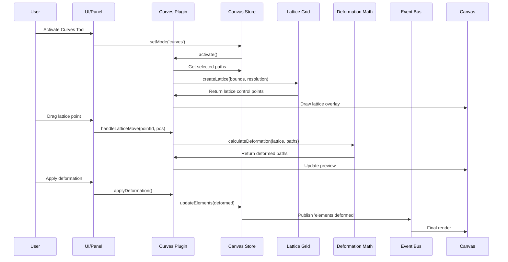
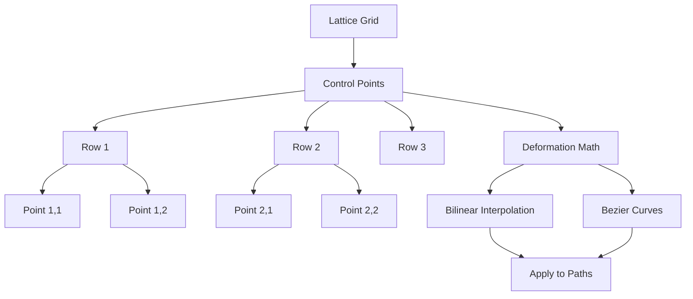

# Curves Plugin

**Purpose**: Advanced curve manipulation with lattice deformation

## Overview

- Lattice-based curve deformation
- Adjustable grid resolution
- Tension/smoothness controls
- Preview lattice grid
- Apply deformation to selected paths

## Plugin Interaction Flow



## Lattice System



## Handler

## Handler

N/A (uses UI controls)

## Keyboard Shortcuts

No plugin-specific shortcuts.

## UI Contributions

### Panels

- Lattice grid controls, tension settings

### Overlays

No overlays.

### Canvas Layers

- Lattice visualization grid

## Public APIs

No public APIs exposed.

## Usage Examples

```typescript
// Activate the plugin
const state = useCanvasStore.getState();
state.setMode('curves');

// Access plugin state
const curvesState = useCanvasStore(state => state.curves);
```


## Implementation Details

**Location**: `src/plugins/curves/`

**Files**:
- `index.ts`: Plugin definition
- `slice.ts`: Zustand slice (if applicable)
- `*Panel.tsx`: UI panels (if applicable)
- `*Overlay.tsx`: Overlays (if applicable)

## Edge Cases & Limitations

- Implementation-specific constraints
- Performance considerations for large datasets
- Browser compatibility notes (if any)

## Related

- [Plugin System Overview](../overview)
- [Event Bus](../../event-bus/overview)


