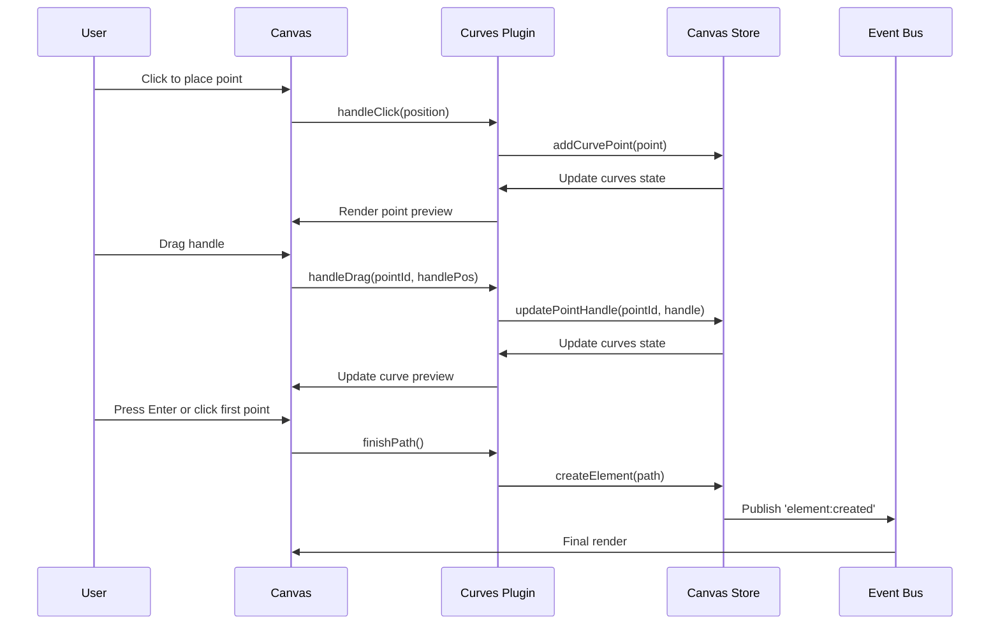
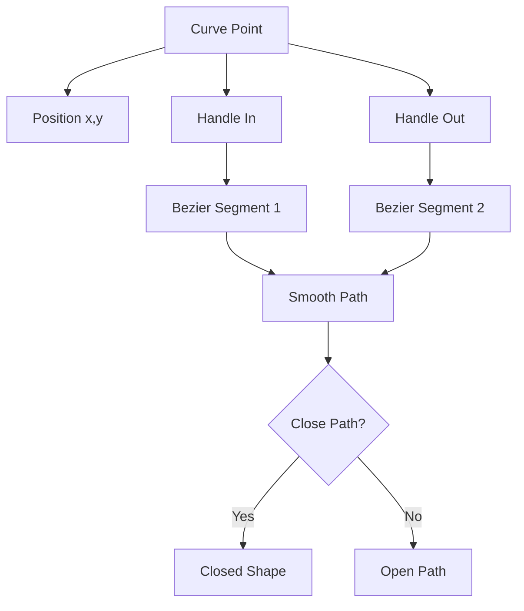

# Curves Plugin

**Purpose**: Draw custom Bézier curves by placing control points and adjusting handles

## Overview

The Curves plugin allows users to create custom paths by clicking to place points and dragging to create smooth Bézier curves. Similar to the Pen tool in Adobe Illustrator or Figma, this plugin provides precise control over curve creation.

**Key Features:**
- Click to place curve control points
- Drag handles to adjust curve smoothness and direction
- Click the first point to close the path
- Press Enter to finish an open path
- Delete selected points with Delete/Backspace
- Real-time curve preview as you draw

## Plugin Interaction Flow



## Point and Handle System



## Handler

The Curves plugin uses dedicated canvas interactions through the `CurvesRenderer` component rather than a traditional event handler. User clicks and drags are captured by the canvas layer.

## Keyboard Shortcuts

| Key | Action |
|-----|--------|
| `Delete` / `Backspace` | Delete the currently selected control point |
| `Enter` | Finish the current path (must have at least 2 points) |
| `Escape` | Cancel the current curve and clear all points |

## UI Contributions

### Panels

**CurvesPanel**: Displays curve drawing information and controls
- Shows current point count
- Displays selected point position and handle coordinates
- Delete and deselect buttons for selected points
- "Finish Curve" button (enabled when ≥2 points)
- "Cancel Curve" button to abandon current drawing
- Usage instructions when no points are placed

### Overlays

No overlays.

### Canvas Layers

**curves-renderer**: Renders the curve being drawn in real-time
- Placement: `midground`
- Shows control points as circles
- Displays Bézier handles when a point is selected
- Renders the curve path preview
- Highlights the first point when hoverable (to close the path)

## Public APIs

No public APIs exposed. The plugin uses internal controller methods accessed through `getGlobalCurvesController()`.

## Usage Examples

### Activating the Curves Tool

```typescript
const state = useCanvasStore.getState();
state.setActivePlugin('curves');
```

### Drawing a Curve

1. **Activate the curves tool** by clicking the curves icon or using the plugin switcher
2. **Click on the canvas** to place your first control point
3. **Click again** to place subsequent points - the curve will automatically connect them
4. **Drag after clicking** to adjust the Bézier handles and create smooth curves
5. **Close the path** by clicking the first point again (it will highlight when you hover over it)
6. **Or finish an open path** by pressing Enter or clicking "Finish Curve"

### Editing Points

```typescript
// Access the curves controller
const controller = getGlobalCurvesController();

// Delete the selected point
controller.deleteSelectedPoint();

// Finish the current path
controller.finishPath();

// Get current state
const state = controller.getState();
console.log(state.points); // Array of curve points
console.log(state.selectedPointId); // Currently selected point
```

### Programmatic Access

```typescript
import { useCanvasCurves } from './plugins/curves';

function MyComponent() {
  const { 
    curveState,           // Current curves state
    selectCurvePoint,     // Select a point by ID
    deleteSelectedPoint,  // Delete selected point
    finishPath,           // Finish and create the path
    cancelCurve          // Cancel current drawing
  } = useCanvasCurves();
  
  return (
    <button onClick={() => finishPath()}>
      Finish Curve
    </button>
  );
}
```

## Implementation Details

**Location**: `src/plugins/curves/`

**Files**:
- `index.tsx`: Plugin definition with keyboard shortcuts
- `slice.ts`: Zustand slice for curves state management
- `CurvesPanel.tsx`: UI panel with controls and instructions
- `CurvesRenderer.tsx`: Canvas layer for rendering curves in progress
- `useCanvasCurves.ts`: Hook for accessing curve functionality
- `useCurvesController.ts`: Controller logic for curve operations
- `CurvesControllerContext.tsx`: React context for controller
- `globalController.ts`: Global controller instance management
- `curvesContext.ts`: Curves-specific context definitions

**State Structure**:
```typescript
interface CurvesPluginSlice {
  points: CurvePoint[];           // Array of placed control points
  selectedPointId?: string;       // ID of currently selected point
  isDrawing: boolean;            // Whether actively drawing
}

interface CurvePoint {
  id: string;
  x: number;
  y: number;
  handleIn: { x: number; y: number };   // Incoming Bézier handle
  handleOut: { x: number; y: number };  // Outgoing Bézier handle
}
```

## Edge Cases & Limitations

- **Minimum points**: A path requires at least 2 points to be created
- **Point selection**: Only one point can be selected at a time
- **Path closure**: Clicking the first point again will close the path and create a shape
- **Handle mirroring**: Handles are independent - moving one doesn't mirror the other
- **Canvas interactions**: Curves tool takes priority over canvas panning when active
- **State persistence**: The curve-in-progress is lost if you switch to another tool
- **Performance**: Complex curves with many points may impact rendering performance

## Related

- [Plugin System Overview](../overview)
- [Event Bus](../../event-bus/overview)
- [Pencil Plugin](./pencil) - Alternative tool for freehand drawing


