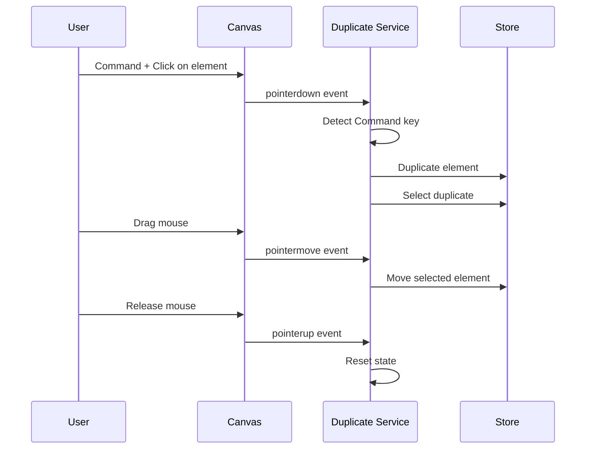

# Duplicate on Drag Plugin

The **Duplicate on Drag** plugin provides an intuitive way to duplicate elements by holding down the Command (⌘) key while dragging. This is a common interaction pattern found in many design tools.

## Overview

This plugin implements a **Canvas Service** that listens to pointer events globally, regardless of the active tool. When it detects Command+Click+Drag on a selected element or group, it:

1. Creates a duplicate of all selected elements or entire group hierarchies
2. Selects the new duplicates
3. Begins dragging the duplicates from the original positions

**Key Features:**
- **Recursive Group Duplication**: When duplicating elements inside groups, duplicates the entire root group and all its children
- **Multi-Selection Support**: Duplicates all currently selected elements when dragging any selected element
- **Smart Selection**: Automatically selects the root groups when clicking elements within groups

## Architecture

### Event-Driven Design

The plugin uses the **Canvas Service** pattern to decouple from the core canvas interaction logic:



### Plugin Structure

```
src/plugins/duplicateOnDrag/
├── index.ts         # Plugin definition and registration
├── service.ts       # Canvas Service implementation
└── slice.ts         # Zustand state slice (optional, for future use)
```

## Implementation Details

### Canvas Service

The service registers listeners in the **capture phase** to intercept events before other handlers:

```typescript
svg.addEventListener('pointerdown', handlePointerDown, { capture: true });
svg.addEventListener('pointermove', handlePointerMove, { capture: true });
svg.addEventListener('pointerup', handlePointerUp, { capture: true });
```

### Event Flow

#### Pointer Down (Initiate Duplicate)

```typescript
const handlePointerDown = (event: PointerEvent) => {
  // Only trigger on Command/Meta key + left click
  if (!event.metaKey || event.button !== 0) return;
  
  // Only work when select tool is active
  if (state.activePlugin !== 'select') return;
  
  // Check if clicking on an element
  const elementId = targetElement?.getAttribute('data-element-id');
  if (!elementId) return;
  
  const element = state.elementMap.get(elementId);
  if (!element) return;
  
  // Find the root group if this element is inside a group
  let elementToDuplicateId = elementId;
  if (element.parentId) {
    let currentElement = element;
    while (currentElement.parentId) {
      const parent = state.elementMap.get(currentElement.parentId);
      if (!parent) break;
      currentElement = parent;
    }
    elementToDuplicateId = currentElement.id;
  }
  
  // Recursively duplicate the element or entire group hierarchy
  const duplicatedIds = duplicateElementRecursively(elementToDuplicateId);
  
  // Select and start dragging the duplicated element(s)
  store.selectElements(duplicatedIds);
  
  // Prevent default interactions
  event.preventDefault();
  event.stopPropagation();
};
```

#### Pointer Move (Drag Duplicate)

```typescript
const handlePointerMove = (event: PointerEvent) => {
  if (!isDuplicating) return;
  
  const point = state.screenToCanvas(event.clientX, event.clientY);
  const deltaX = point.x - startPoint.x;
  const deltaY = point.y - startPoint.y;
  
  // Move the duplicated element
  store.moveSelectedElements(deltaX, deltaY);
  startPoint = point;
};
```

#### Pointer Up (Finalize)

```typescript
const handlePointerUp = () => {
  if (!isDuplicating) return;
  
  // Reset state
  isDuplicating = false;
  duplicatedElementId = null;
  startPoint = null;
};
```

## Usage

The plugin is **always active** and doesn't require switching to a specific tool mode.

### User Workflow

1. **Select an element** with the Select tool
2. **Hold Command (⌘)** key on Mac (or Ctrl on Windows)
3. **Click and drag** the selected element
4. A **duplicate is created** and moves with the cursor
5. **Release** to place the duplicate

### Keyboard Shortcuts

- **⌘ + Drag** (Mac) - Duplicate and drag
- **Ctrl + Drag** (Windows/Linux) - Duplicate and drag

## Technical Highlights

### Decoupled Architecture

The plugin doesn't modify core canvas code. It uses:

- **Canvas Service** pattern for event listening
- **Event Bus** architecture for loose coupling
- **Capture phase** event listeners to intercept before other handlers

### State Management

```typescript
export interface DuplicateOnDragPluginSlice {
  duplicateOnDrag: {
    isDuplicating: boolean;
    originalElementId: string | null;
    duplicatedElementId: string | null;
    startPoint: { x: number; y: number } | null;
  };
  updateDuplicateOnDragState: (state: Partial<...>) => void;
}
```

### Service Registration

```typescript
// Register service with plugin manager
pluginManager.registerCanvasService(duplicateOnDragService);

// Activate service in Canvas
useDuplicateOnDrag({
  svgRef,
  currentMode,
  screenToCanvas,
});
```

## Benefits

### For Users

- **Intuitive** - Familiar interaction from other design tools
- **Fast** - Quick duplication without menu navigation
- **Contextual** - Works naturally with selection workflow

### For Developers

- **Non-invasive** - No core code modifications required
- **Extensible** - Easy to add similar gesture-based features
- **Maintainable** - Self-contained service with clear responsibilities

## Limitations

- Currently only works in **Select mode**
- Command key detection depends on browser event handling

## Future Enhancements

Possible improvements:

1. **Modifier variations** - Different behaviors with Shift, Alt, etc.
2. **Visual feedback** - Show duplicate preview before dropping
3. **Smart positioning** - Snap to grid or guides while dragging

## Related Documentation

- [Architecture Overview](../../architecture/overview) - System design patterns
- [Event Bus](../../event-bus/overview) - Event-driven architecture
- [Plugin System](../overview) - Plugin development guide
- [Selection System](../../features/selection) - Selection handling

## Code References

- **Plugin Definition**: `src/plugins/duplicateOnDrag/index.ts`
- **Service Implementation**: `src/plugins/duplicateOnDrag/service.ts`
- **State Slice**: `src/plugins/duplicateOnDrag/slice.ts`
- **Hook Integration**: `src/canvas/hooks/useDuplicateOnDrag.ts`
