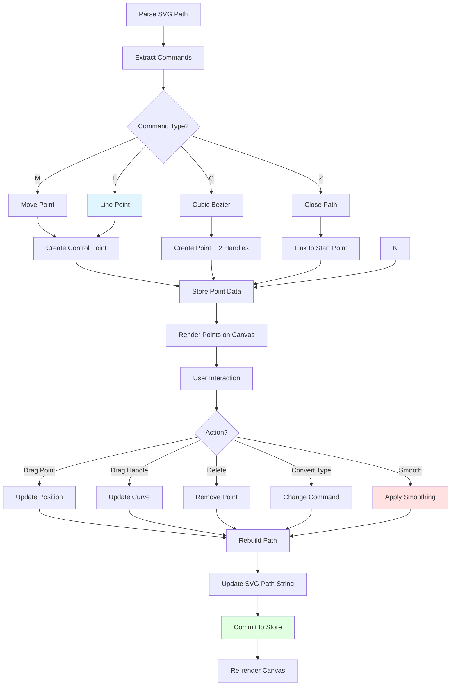
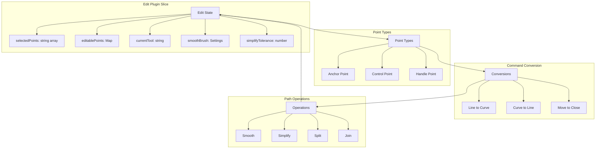

# Edit Plugin

**Purpose**: Advanced path editing with control point manipulation

## Overview

- Select and drag points
- Convert command types (line, curve, arc)
- Smooth brush for path smoothing
- Point simplification
- Align control points
- Delete points
- Split subpaths

## Plugin Interaction Flow

```mermaid
sequenceDiagram
    participant User
    participant UI as UI/Toolbar
    participant PM as PluginManager
    participant EP as Edit Plugin
    participant Store as Canvas Store
    participant EB as Event Bus
    participant Canvas as Canvas Renderer
    participant PP as Path Parser
    
    Note over User,Canvas: 1. Plugin Activation
    User->>UI: Click Edit Tool
    UI->>Store: setMode('edit')
    Store->>PM: Plugin mode changed
    PM->>EP: activate()
    EP->>Store: Initialize edit slice
    EP->>Store: Get selected elements
    EP->>PP: parsePathData(elements)
    PP->>EP: Return path commands & points
    EP->>Store: Set editable points
    EP->>EB: Publish 'plugin:activated'
    EB->>Canvas: Draw control points
    EB->>Canvas: Draw bezier handles
    
    Note over User,Canvas: 2. Select Control Point
    User->>Canvas: Click on control point
    Canvas->>EP: handlePointDown(pointId, event)
    EP->>Store: Set selectedPoints = [pointId]
    EP->>Store: Store initial position
    EP->>EB: Publish 'points:selected'
    EB->>Canvas: Highlight selected point
    EB->>UI: Show point coordinates
    
    Note over User,Canvas: 3. Drag Control Point
    User->>Canvas: Drag control point
    Canvas->>EP: handlePointMove(event)
    EP->>Store: Get selectedPoints
    EP->>Store: Calculate delta [dx, dy]
    EP->>Store: Update point position
    
    EP->>PP: updatePathData(pointId, newPosition)
    PP->>PP: Modify path command
    PP->>PP: Regenerate SVG path string
    PP->>EP: Return updated path data
    
    EP->>Store: Update element path
    Store->>Canvas: Re-render path (preview)
    Store->>UI: Update coordinate display
    
    loop While Dragging
        Canvas->>EP: handlePointMove
        EP->>PP: Update path
        PP->>Canvas: Render preview
    end
    
    User->>Canvas: Release point
    Canvas->>EP: handlePointUp(event)
    EP->>Store: Commit path changes
    Store->>EB: Publish 'path:modified'
    EB->>Store: Add to undo stack
    
    Note over User,Canvas: 4. Bezier Handle Manipulation
    User->>Canvas: Drag bezier handle
    Canvas->>EP: handleHandleMove(handleId, event)
    EP->>PP: updateControlPoint(handleId, position)
    PP->>PP: Update C command parameters
    
    alt Symmetric Handles
        PP->>PP: Mirror opposite handle
    else Asymmetric
        PP->>PP: Independent handle
    end
    
    PP->>EP: Return updated curve
    EP->>Store: Update path
    Store->>Canvas: Re-render smooth curve
    
    Note over User,Canvas: 5. Convert Point Type
    User->>UI: Click "Convert to Curve" button
    UI->>EP: convertPointType(pointId, 'curve')
    EP->>PP: convertCommand(pointId, 'C')
    PP->>PP: Calculate control points
    PP->>PP: Insert bezier handles
    PP->>EP: Return converted path
    EP->>Store: updateElement(newPath)
    Store->>EB: Publish 'path:converted'
    EB->>Canvas: Draw new handles
    
    Note over User,Canvas: 6. Smooth Brush Operation
    User->>UI: Activate smooth brush
    UI->>EP: setTool('smoothBrush')
    EP->>Store: Set smoothBrush.active = true
    
    User->>Canvas: Drag over path segment
    Canvas->>EP: handleSmoothDrag(event)
    EP->>PP: getPointsInRadius(mousePos, brushSize)
    PP->>EP: Return affected points
    
    loop For each affected point
        EP->>PP: smoothPoint(pointId, strength)
        PP->>PP: Apply smoothing algorithm
        PP->>PP: Average neighboring positions
    end
    
    PP->>EP: Return smoothed path
    EP->>Store: Update path (live preview)
    Store->>Canvas: Re-render smoothed section
    
    User->>Canvas: Release smooth brush
    Canvas->>EP: handleSmoothUp(event)
    EP->>Store: Commit smoothed path
    Store->>EB: Publish 'path:smoothed'
    
    Note over User,Canvas: 7. Delete Point
    User->>Canvas: Select point
    User->>UI: Press Delete key
    UI->>EP: deleteSelectedPoints()
    EP->>PP: removePoint(pointId)
    PP->>PP: Update path commands
    PP->>PP: Connect adjacent points
    PP->>EP: Return updated path
    EP->>Store: updateElement(newPath)
    Store->>EB: Publish 'points:deleted'
    EB->>Canvas: Re-render path
    
    Note over User,Canvas: 8. Path Simplification
    User->>UI: Click "Simplify" + set tolerance
    UI->>EP: simplifyPath(tolerance)
    EP->>PP: analyzePathComplexity()
    PP->>PP: Apply Ramer-Douglas-Peucker
    PP->>PP: Remove redundant points
    PP->>EP: Return simplified path
    EP->>Store: updateElement(simplified)
    Store->>Canvas: Re-render with fewer points
```



## Point Editing System



## State Management



## Handler

Select and drag control points and handles

## Keyboard Shortcuts

- **Delete**: Delete selected points

## UI Contributions

### Panels

**EditPanel**: Main control panel for path editing operations
- Point selection and manipulation controls
- Smooth brush settings with tolerance adjustment
- Path simplification controls

**ControlPointAlignmentPanel**: Advanced panel for Bézier handle alignment
- Appears when control points with handles are selected
- Displays alignment information for in/out handles
- Provides alignment type controls:
  - **Asymmetric**: Handles move independently
  - **Symmetric**: Handles mirror each other (same length and opposite angles)
  - **Smooth**: Handles maintain opposite angles but independent lengths
- Command type conversion (M, L, C, Z)
- Point manipulation operations:
  - Move to M (convert point to move command)
  - Delete Z command
  - Convert Z to Line
  - Cut subpath at point
- Collapsible detailed view showing:
  - Selected point coordinates
  - Handle angles and lengths
  - Command type information

### Overlays

- **EditPointsOverlay**: Visual rendering of control points and handles for path editing
- **AddPointFeedbackOverlay**: Visual feedback when adding new points to paths

### Canvas Layers

- Control points visualization (anchor points, handles)
- Bézier handle lines connecting control points
- Smooth brush preview visualization

## Public APIs

No public APIs exposed.

## Usage Examples

### Activating Edit Mode

```typescript
// Activate the plugin
const state = useCanvasStore.getState();
state.setActivePlugin('edit');

// Access plugin state
const editState = useCanvasStore(state => state.edit);
```

### Control Point Alignment

```typescript
// Set alignment type for selected control points
const state = useCanvasStore.getState();

// Asymmetric: handles move independently
state.setControlPointAlignmentType('asymmetric');

// Symmetric: handles mirror (same length, opposite angles)
state.setControlPointAlignmentType('symmetric');

// Smooth: handles maintain opposite angles but can have different lengths
state.setControlPointAlignmentType('smooth');
```

### Command Type Conversion

```typescript
const state = useCanvasStore.getState();

// Convert command to a different type
state.convertCommandType(elementId, commandIndex, 'C'); // to Cubic Bézier
state.convertCommandType(elementId, commandIndex, 'L'); // to Line
state.convertCommandType(elementId, commandIndex, 'Z'); // to Close Path

// Move point to become a new subpath start
state.moveToM(elementId, commandIndex);

// Cut subpath at selected point
state.cutSubpathAtPoint(elementId, commandIndex);
```

### Working with Z Commands (Close Path)

```typescript
const state = useCanvasStore.getState();

// Delete Z command (open the path)
state.deleteZCommandForMPoint(elementId, mCommandIndex);

// Convert Z to explicit Line command
state.convertZToLineForMPoint(elementId, mCommandIndex);
```

## Control Point Alignment Details

The Edit plugin includes sophisticated control point alignment features for managing Bézier curve handles:

### Alignment Types

**Asymmetric**
- Handles move completely independently
- No constraints on angle or length
- Maximum flexibility for custom curve shapes

**Symmetric**
- Handles maintain equal length
- Angles are exact opposites (180° apart)
- Creates smooth, balanced curves
- Moving one handle automatically updates the other

**Smooth**
- Handles maintain opposite angles (180° apart)
- Lengths can differ independently
- Creates smooth tangent continuity
- Allows for asymmetric curve weight while maintaining smoothness

### Alignment Information Display

The ControlPointAlignmentPanel shows:
- Current alignment type for each selected control point
- In-handle angle and length
- Out-handle angle and length
- Visual indicators when alignment is active
- Quick buttons to change alignment type


## Implementation Details

**Location**: `src/plugins/edit/`

**Files**:
- `index.tsx`: Plugin definition and event handlers
- `slice.ts`: Zustand slice for edit state management
- `EditPanel.tsx`: Main UI panel with editing controls
- `ControlPointAlignmentPanel.tsx`: Panel for Bézier handle alignment and command operations
- `EditPointsOverlay.tsx`: Canvas overlay rendering control points
- `AddPointFeedbackOverlay.tsx`: Visual feedback for point addition

**Key Features**:
- Real-time point manipulation with visual feedback
- Bézier handle constraint system (asymmetric/symmetric/smooth)
- Command type conversion between M, L, C, Z
- Path splitting and joining operations
- Smooth brush for path simplification
- Detailed alignment information and controls

## Edge Cases & Limitations

- **Selection Requirements**: Control Point Alignment panel only appears when points with Bézier handles are selected
- **Command Types**: Not all command types support all alignment modes (e.g., Line commands have no handles)
- **Z Command Handling**: Closing Z commands reference the last M command in their subpath
- **Symmetric Constraints**: Changing handle length in symmetric mode updates both handles simultaneously
- **Performance**: Complex paths with many points may experience slower manipulation on lower-end devices
- **Handle Visibility**: Handles only visible when their anchor point is selected
- **Undo/Redo**: Each handle adjustment creates an undo state (may create many undo steps during dragging)

## Related

- [Plugin System Overview](../overview)
- [Event Bus](../../event-bus/overview)


