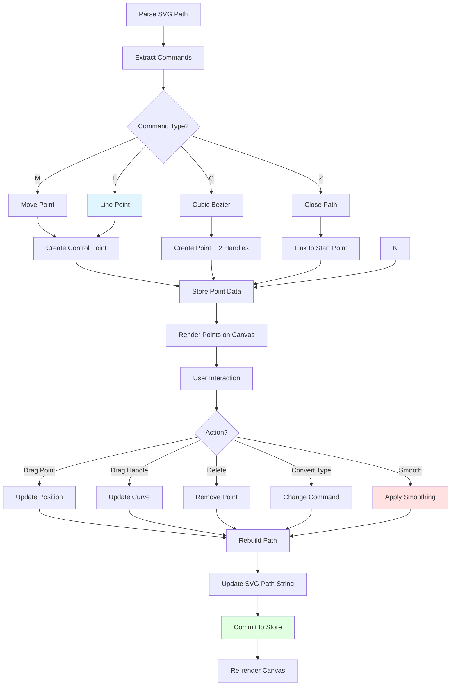
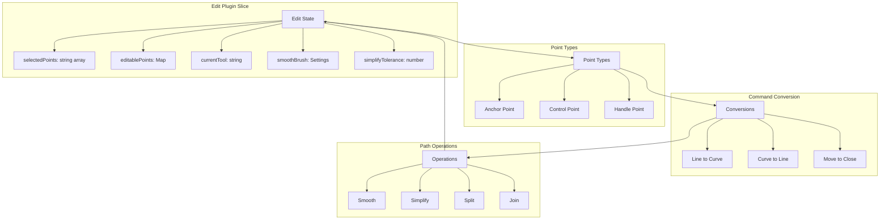

# Edit Plugin

**Purpose**: Advanced path editing with control point manipulation

## Overview

- Select and drag points
- Convert command types (line, curve, arc)
- Smooth brush for path smoothing
- Point simplification
- Align control points
- Delete points
- Split subpaths

## Plugin Interaction Flow

```mermaid
sequenceDiagram
    participant User
    participant UI as UI/Toolbar
    participant PM as PluginManager
    participant EP as Edit Plugin
    participant Store as Canvas Store
    participant EB as Event Bus
    participant Canvas as Canvas Renderer
    participant PP as Path Parser
    
    Note over User,Canvas: 1. Plugin Activation
    User->>UI: Click Edit Tool
    UI->>Store: setMode('edit')
    Store->>PM: Plugin mode changed
    PM->>EP: activate()
    EP->>Store: Initialize edit slice
    EP->>Store: Get selected elements
    EP->>PP: parsePathData(elements)
    PP->>EP: Return path commands & points
    EP->>Store: Set editable points
    EP->>EB: Publish 'plugin:activated'
    EB->>Canvas: Draw control points
    EB->>Canvas: Draw bezier handles
    
    Note over User,Canvas: 2. Select Control Point
    User->>Canvas: Click on control point
    Canvas->>EP: handlePointDown(pointId, event)
    EP->>Store: Set selectedPoints = [pointId]
    EP->>Store: Store initial position
    EP->>EB: Publish 'points:selected'
    EB->>Canvas: Highlight selected point
    EB->>UI: Show point coordinates
    
    Note over User,Canvas: 3. Drag Control Point
    User->>Canvas: Drag control point
    Canvas->>EP: handlePointMove(event)
    EP->>Store: Get selectedPoints
    EP->>Store: Calculate delta [dx, dy]
    EP->>Store: Update point position
    
    EP->>PP: updatePathData(pointId, newPosition)
    PP->>PP: Modify path command
    PP->>PP: Regenerate SVG path string
    PP->>EP: Return updated path data
    
    EP->>Store: Update element path
    Store->>Canvas: Re-render path (preview)
    Store->>UI: Update coordinate display
    
    loop While Dragging
        Canvas->>EP: handlePointMove
        EP->>PP: Update path
        PP->>Canvas: Render preview
    end
    
    User->>Canvas: Release point
    Canvas->>EP: handlePointUp(event)
    EP->>Store: Commit path changes
    Store->>EB: Publish 'path:modified'
    EB->>Store: Add to undo stack
    
    Note over User,Canvas: 4. Bezier Handle Manipulation
    User->>Canvas: Drag bezier handle
    Canvas->>EP: handleHandleMove(handleId, event)
    EP->>PP: updateControlPoint(handleId, position)
    PP->>PP: Update C command parameters
    
    alt Symmetric Handles
        PP->>PP: Mirror opposite handle
    else Asymmetric
        PP->>PP: Independent handle
    end
    
    PP->>EP: Return updated curve
    EP->>Store: Update path
    Store->>Canvas: Re-render smooth curve
    
    Note over User,Canvas: 5. Convert Point Type
    User->>UI: Click "Convert to Curve" button
    UI->>EP: convertPointType(pointId, 'curve')
    EP->>PP: convertCommand(pointId, 'C')
    PP->>PP: Calculate control points
    PP->>PP: Insert bezier handles
    PP->>EP: Return converted path
    EP->>Store: updateElement(newPath)
    Store->>EB: Publish 'path:converted'
    EB->>Canvas: Draw new handles
    
    Note over User,Canvas: 6. Smooth Brush Operation
    User->>UI: Activate smooth brush
    UI->>EP: setTool('smoothBrush')
    EP->>Store: Set smoothBrush.active = true
    
    User->>Canvas: Drag over path segment
    Canvas->>EP: handleSmoothDrag(event)
    EP->>PP: getPointsInRadius(mousePos, brushSize)
    PP->>EP: Return affected points
    
    loop For each affected point
        EP->>PP: smoothPoint(pointId, strength)
        PP->>PP: Apply smoothing algorithm
        PP->>PP: Average neighboring positions
    end
    
    PP->>EP: Return smoothed path
    EP->>Store: Update path (live preview)
    Store->>Canvas: Re-render smoothed section
    
    User->>Canvas: Release smooth brush
    Canvas->>EP: handleSmoothUp(event)
    EP->>Store: Commit smoothed path
    Store->>EB: Publish 'path:smoothed'
    
    Note over User,Canvas: 7. Delete Point
    User->>Canvas: Select point
    User->>UI: Press Delete key
    UI->>EP: deleteSelectedPoints()
    EP->>PP: removePoint(pointId)
    PP->>PP: Update path commands
    PP->>PP: Connect adjacent points
    PP->>EP: Return updated path
    EP->>Store: updateElement(newPath)
    Store->>EB: Publish 'points:deleted'
    EB->>Canvas: Re-render path
    
    Note over User,Canvas: 8. Path Simplification
    User->>UI: Click "Simplify" + set tolerance
    UI->>EP: simplifyPath(tolerance)
    EP->>PP: analyzePathComplexity()
    PP->>PP: Apply Ramer-Douglas-Peucker
    PP->>PP: Remove redundant points
    PP->>EP: Return simplified path
    EP->>Store: updateElement(simplified)
    Store->>Canvas: Re-render with fewer points
```



## Point Editing System



## State Management



## Handler

Select and drag control points and handles

## Keyboard Shortcuts

- **Delete**: Delete selected points

## UI Contributions

### Panels

**EditPanel**: Main control panel for path editing operations
- Point selection and manipulation controls
- Smooth brush settings with tolerance adjustment
- Path simplification controls

**Point Panel (ControlPointAlignmentPanel)**: Precise point position and alignment control
- Appears when exactly one point is selected
- Numeric X/Y position inputs for precise coordinate editing
- Command type and index information display
- For control points with paired handles:
  - Alignment type controls:
    - **Independent**: Handles move independently
    - **Aligned**: Handles maintain opposite angles but independent lengths
    - **Mirrored**: Handles mirror each other (same length and opposite angles)
  - Expandable detailed view with handle angles and magnitudes
- Command type conversion (M, L, C, Z)
- Point manipulation operations:
  - **Move to M**: Convert last point to start a new subpath (when not at M position)
  - **Add Z Command**: Add closing Z command to subpath (when last point is at M position)
  - **Delete Z command**: Remove closing Z command from subpath (for M points)
  - **Convert Z to Line**: Replace Z command with explicit L command (for M points)
  - **Cut subpath at point**: Split subpath at selected point
  - **Change to Curve/Line**: Convert between L and C command types
- Collapsible detailed view showing:
  - Selected point coordinates
  - Handle angles and lengths
  - Command type information

### Overlays

- **EditPointsOverlay**: Visual rendering of control points and handles for path editing
- **AddPointFeedbackOverlay**: Visual feedback when adding new points to paths

### Canvas Layers

- Control points visualization (anchor points, handles)
- Bézier handle lines connecting control points
- Smooth brush preview visualization

## Public APIs

No public APIs exposed.

## Usage Examples

### Activating Edit Mode

```typescript
// Activate the plugin
const state = useCanvasStore.getState();
state.setActivePlugin('edit');

// Access plugin state
const editState = useCanvasStore(state => state.edit);
```

### Point Panel

The Point panel appears when a single control point or anchor point is selected in edit mode. It provides:

- **Position Controls**: Numeric inputs for precise X and Y coordinate adjustment
- **Alignment Controls**: For control points with paired handles (independent, aligned, mirrored)
- **Command Information**: Display of command type and index

```typescript
// Set alignment type for selected control points
const state = useCanvasStore.getState();

// Independent: handles move independently
state.setControlPointAlignmentType(elementId, cmdIdx1, ptIdx1, cmdIdx2, ptIdx2, 'independent');

// Aligned: handles maintain opposite angles but can have different lengths
state.setControlPointAlignmentType(elementId, cmdIdx1, ptIdx1, cmdIdx2, ptIdx2, 'aligned');

// Mirrored: handles mirror (same length, opposite angles)
state.setControlPointAlignmentType(elementId, cmdIdx1, ptIdx1, cmdIdx2, ptIdx2, 'mirrored');
```

### Command Type Conversion

```typescript
const state = useCanvasStore.getState();

// Convert command to a different type
state.convertCommandType(elementId, commandIndex, 'C'); // to Cubic Bézier
state.convertCommandType(elementId, commandIndex, 'L'); // to Line
state.convertCommandType(elementId, commandIndex, 'Z'); // to Close Path

// Move point to become a new subpath start
state.moveToM(elementId, commandIndex);

// Cut subpath at selected point
state.cutSubpathAtPoint(elementId, commandIndex);
```

### Working with Z Commands (Close Path)

```typescript
const state = useCanvasStore.getState();

// Add Z command to close a subpath (when last point is at M position)
state.addZCommandToSubpath(elementId, commandIndex);

// Delete Z command (open the path)
state.deleteZCommandForMPoint(elementId, mCommandIndex);

// Convert Z to explicit Line command
state.convertZToLineForMPoint(elementId, mCommandIndex);
```

**Use Cases:**
- **Add Z Command**: Converts visually closed paths into explicitly closed paths. Use when the last L or C command ends at the same position as the M command that starts the subpath.
- **Delete Z Command**: Opens a closed path by removing the Z command, leaving an open subpath.
- **Convert Z to Line**: Replaces implicit Z closing with an explicit L command, useful for further editing the closing segment.

**Example Workflow:**
```typescript
// Scenario: You have a path that visually looks closed but lacks a Z command
// Path: M 100,100 L 200,100 L 200,200 L 100,200 L 100,100
// The last L command returns to the starting M position

const state = useCanvasStore.getState();

// 1. Select the last L command point (at 100,100)
state.selectCommand({ 
  elementId: 'path-1', 
  commandIndex: 4, // Index of last L command
  pointIndex: 0 
});

// 2. The Point panel will show "Add Z Command" button because:
//    - Point is type L (or C)
//    - It's the last point of the subpath
//    - Position matches the M command (100,100)
//    - No Z command exists yet

// 3. Add Z command to properly close the path
state.addZCommandToSubpath('path-1', 4);

// Result: M 100,100 L 200,100 L 200,200 L 100,200 L 100,100 Z
// Now the path is explicitly closed with proper Z command
```

## Point Panel Details

The Edit plugin includes a Point panel for precise control point and anchor point manipulation:

### Point Position Controls

The panel displays numeric inputs for direct coordinate editing:

- **X Coordinate**: Numeric input for horizontal position (step: 0.1)
- **Y Coordinate**: Numeric input for vertical position (step: 0.1)
- **Command Info**: Displays command type and index for reference

These controls allow precise positioning without manual dragging, useful for exact alignment and measurements.

### Control Point Alignment Types

When a control point with a paired handle is selected, alignment controls appear:

**Independent**
- Handles move completely independently
- No constraints on angle or length
- Maximum flexibility for custom curve shapes

**Aligned**
- Handles maintain opposite angles (180° apart)
- Lengths can differ independently
- Creates smooth tangent continuity
- Allows for asymmetric curve weight while maintaining smoothness

**Mirrored**
- Handles maintain equal length
- Angles are exact opposites (180° apart)
- Creates smooth, balanced curves
- Moving one handle automatically updates the other

### Panel Information Display

The Point panel shows:
- **Position Controls**: Always visible X and Y numeric inputs
- **Command Type**: The type of path command (M, L, C, Z)
- **Command Index**: The position in the command list
- **Alignment Type**: Current alignment mode for control points (when applicable)
- **Detailed View**: Expandable section with handle directions, sizes, and paired point information

### Point Manipulation Operations

The Point panel provides context-sensitive operations based on the selected point type and position:

**For M (Move) Points with Z Command:**
- **Delete Z Command**: Removes the closing Z command, opening the subpath
- **Convert Z to Line**: Replaces the Z with an explicit L command back to the M point

**For Last L/C Points NOT at M Position:**
- **Move to M**: Converts the point to start a new subpath
- **Change to Curve/Line**: Toggles between L and C command types
- **Cut Subpath**: Splits the subpath at this point (when not the last point)

**For Last L/C Points AT M Position (visually closed):**
- **Add Z Command**: Adds a Z command to explicitly close the subpath
- **Change to Curve/Line**: Toggles between L and C command types
- **Cut Subpath**: Splits the subpath at this point (when not the last point)

**For Any L/C Point:**
- **Change to Curve/Line**: Toggles between L (straight line) and C (Bézier curve) command types


## Implementation Details

**Location**: `src/plugins/edit/`

**Files**:
- `index.tsx`: Plugin definition and event handlers
- `slice.ts`: Zustand slice for edit state management
- `EditPanel.tsx`: Main UI panel with editing controls
- `ControlPointAlignmentPanel.tsx`: Point panel for position control, Bézier handle alignment, and command operations
- `EditPointsOverlay.tsx`: Canvas overlay rendering control points
- `AddPointFeedbackOverlay.tsx`: Visual feedback for point addition

**Key Features**:
- Real-time point manipulation with visual feedback
- Numeric position controls for precise coordinate editing
- Bézier handle constraint system (independent/aligned/mirrored)
- Command type conversion between M, L, C, Z
- Path splitting and joining operations
- Smooth brush for path simplification
- Detailed alignment information and controls

## Edge Cases & Limitations

- **Selection Requirements**: Point panel only appears when exactly one point is selected
- **Control Point Alignment**: Alignment controls only show for control points with paired handles
- **Command Types**: Not all command types support all alignment modes (e.g., Line commands have no handles)
- **Z Command Operations**: 
  - Add Z Command only available when last point is at M position and subpath doesn't already have a Z
  - Delete/Convert Z operations only available for M commands with closing Z
  - Z commands reference the last M command in their subpath
- **Mirrored Constraints**: Changing handle length in mirrored mode updates both handles simultaneously
- **Performance**: Complex paths with many points may experience slower manipulation on lower-end devices
- **Handle Visibility**: Handles only visible when their anchor point is selected
- **Position Tolerance**: Points are considered "at M position" with a tolerance of 0.1 units
- **Undo/Redo**: Each position adjustment creates an undo state (may create many undo steps during editing)

## Related

- [Plugin System Overview](../overview)
- [Event Bus](../../event-bus/overview)


