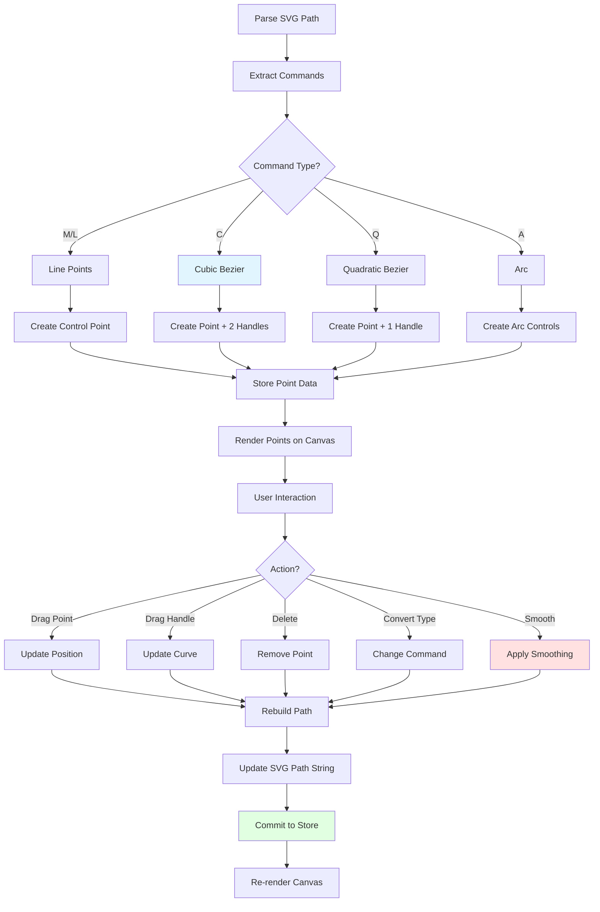
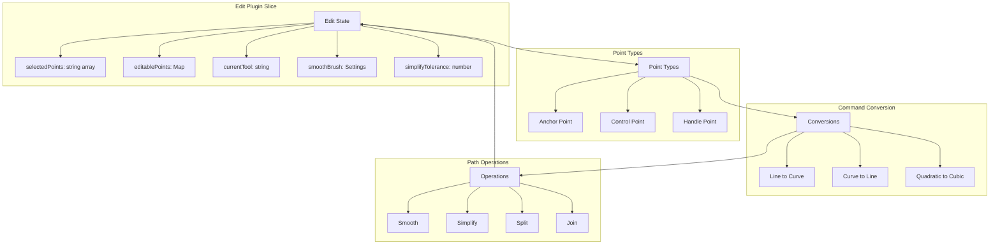

# Edit Plugin

**Purpose**: Advanced path editing with control point manipulation

## Overview

- Select and drag points
- Convert command types (line, curve, arc)
- Smooth brush for path smoothing
- Point simplification
- Align control points
- Delete points
- Split subpaths

## Plugin Interaction Flow

```mermaid
sequenceDiagram
    participant User
    participant UI as UI/Toolbar
    participant PM as PluginManager
    participant EP as Edit Plugin
    participant Store as Canvas Store
    participant EB as Event Bus
    participant Canvas as Canvas Renderer
    participant PP as Path Parser
    
    Note over User,Canvas: 1. Plugin Activation
    User->>UI: Click Edit Tool
    UI->>Store: setMode('edit')
    Store->>PM: Plugin mode changed
    PM->>EP: activate()
    EP->>Store: Initialize edit slice
    EP->>Store: Get selected elements
    EP->>PP: parsePathData(elements)
    PP->>EP: Return path commands & points
    EP->>Store: Set editable points
    EP->>EB: Publish 'plugin:activated'
    EB->>Canvas: Draw control points
    EB->>Canvas: Draw bezier handles
    
    Note over User,Canvas: 2. Select Control Point
    User->>Canvas: Click on control point
    Canvas->>EP: handlePointDown(pointId, event)
    EP->>Store: Set selectedPoints = [pointId]
    EP->>Store: Store initial position
    EP->>EB: Publish 'points:selected'
    EB->>Canvas: Highlight selected point
    EB->>UI: Show point coordinates
    
    Note over User,Canvas: 3. Drag Control Point
    User->>Canvas: Drag control point
    Canvas->>EP: handlePointMove(event)
    EP->>Store: Get selectedPoints
    EP->>Store: Calculate delta [dx, dy]
    EP->>Store: Update point position
    
    EP->>PP: updatePathData(pointId, newPosition)
    PP->>PP: Modify path command
    PP->>PP: Regenerate SVG path string
    PP->>EP: Return updated path data
    
    EP->>Store: Update element path
    Store->>Canvas: Re-render path (preview)
    Store->>UI: Update coordinate display
    
    loop While Dragging
        Canvas->>EP: handlePointMove
        EP->>PP: Update path
        PP->>Canvas: Render preview
    end
    
    User->>Canvas: Release point
    Canvas->>EP: handlePointUp(event)
    EP->>Store: Commit path changes
    Store->>EB: Publish 'path:modified'
    EB->>Store: Add to undo stack
    
    Note over User,Canvas: 4. Bezier Handle Manipulation
    User->>Canvas: Drag bezier handle
    Canvas->>EP: handleHandleMove(handleId, event)
    EP->>PP: updateControlPoint(handleId, position)
    PP->>PP: Update C command parameters
    
    alt Symmetric Handles
        PP->>PP: Mirror opposite handle
    else Asymmetric
        PP->>PP: Independent handle
    end
    
    PP->>EP: Return updated curve
    EP->>Store: Update path
    Store->>Canvas: Re-render smooth curve
    
    Note over User,Canvas: 5. Convert Point Type
    User->>UI: Click "Convert to Curve" button
    UI->>EP: convertPointType(pointId, 'curve')
    EP->>PP: convertCommand(pointId, 'C')
    PP->>PP: Calculate control points
    PP->>PP: Insert bezier handles
    PP->>EP: Return converted path
    EP->>Store: updateElement(newPath)
    Store->>EB: Publish 'path:converted'
    EB->>Canvas: Draw new handles
    
    Note over User,Canvas: 6. Smooth Brush Operation
    User->>UI: Activate smooth brush
    UI->>EP: setTool('smoothBrush')
    EP->>Store: Set smoothBrush.active = true
    
    User->>Canvas: Drag over path segment
    Canvas->>EP: handleSmoothDrag(event)
    EP->>PP: getPointsInRadius(mousePos, brushSize)
    PP->>EP: Return affected points
    
    loop For each affected point
        EP->>PP: smoothPoint(pointId, strength)
        PP->>PP: Apply smoothing algorithm
        PP->>PP: Average neighboring positions
    end
    
    PP->>EP: Return smoothed path
    EP->>Store: Update path (live preview)
    Store->>Canvas: Re-render smoothed section
    
    User->>Canvas: Release smooth brush
    Canvas->>EP: handleSmoothUp(event)
    EP->>Store: Commit smoothed path
    Store->>EB: Publish 'path:smoothed'
    
    Note over User,Canvas: 7. Delete Point
    User->>Canvas: Select point
    User->>UI: Press Delete key
    UI->>EP: deleteSelectedPoints()
    EP->>PP: removePoint(pointId)
    PP->>PP: Update path commands
    PP->>PP: Connect adjacent points
    PP->>EP: Return updated path
    EP->>Store: updateElement(newPath)
    Store->>EB: Publish 'points:deleted'
    EB->>Canvas: Re-render path
    
    Note over User,Canvas: 8. Path Simplification
    User->>UI: Click "Simplify" + set tolerance
    UI->>EP: simplifyPath(tolerance)
    EP->>PP: analyzePathComplexity()
    PP->>PP: Apply Ramer-Douglas-Peucker
    PP->>PP: Remove redundant points
    PP->>EP: Return simplified path
    EP->>Store: updateElement(simplified)
    Store->>EB: Publish 'path:simplified'
    EB->>Canvas: Re-render with fewer points
    
    Note over User,Canvas: 9. Plugin Deactivation
    User->>UI: Select different tool
    UI->>Store: setMode('select')
    Store->>PM: Plugin mode changed
    PM->>EP: deactivate()
    EP->>Store: Clear selected points
    EP->>Store: Clear edit state
    EP->>EB: Publish 'plugin:deactivated'
    EB->>Canvas: Hide control points
```



## Point Editing System



## State Management



## Handler

Select and drag control points and handles

## Keyboard Shortcuts

- **Delete**: Delete selected points

## UI Contributions

### Panels

- Point editing controls, smooth brush settings, simplification

### Overlays

- **EditPointsOverlay**: Visual rendering of control points and handles for path editing
- **AddPointFeedbackOverlay**: Visual feedback when adding new points to paths

### Canvas Layers

- Control points, handles, and smooth brush visualization

## Public APIs

No public APIs exposed.

## Usage Examples

```typescript
// Activate the plugin
const state = useCanvasStore.getState();
state.setMode('edit');

// Access plugin state
const editState = useCanvasStore(state => state.edit);
```


## Implementation Details

**Location**: `src/plugins/edit/`

**Files**:
- `index.ts`: Plugin definition
- `slice.ts`: Zustand slice (if applicable)
- `*Panel.tsx`: UI panels (if applicable)
- `*Overlay.tsx`: Overlays (if applicable)

## Edge Cases & Limitations

- Implementation-specific constraints
- Performance considerations for large datasets
- Browser compatibility notes (if any)

## Related

- [Plugin System Overview](../overview)
- [Event Bus](../../event-bus/overview)


