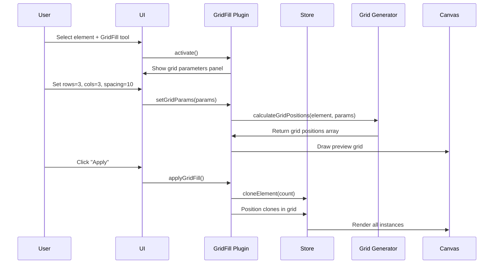

# Grid Fill Plugin

**Purpose**: Flood fill grid cells with shapes for tessellation

## Overview

- Fill individual grid cells\n- Works with all grid types\n- Rapid tessellation workflow\n- Uses current fill color and opacity\n- Multiple shape options

## Plugin Interaction Flow



## Handler

## Handler

Click cells to fill with current shape/color

## Keyboard Shortcuts

No plugin-specific shortcuts.

## UI Contributions

### Panels

- Grid settings, fill color, shape selection

### Overlays

No overlays.

### Canvas Layers

- Grid overlay for cell identification

## Public APIs

No public APIs exposed.

## Usage Examples

```typescript
// Activate the plugin
const state = useCanvasStore.getState();
state.setMode('grid-fill');

// Access plugin state
const grid-fillState = useCanvasStore(state => state.grid-fill);
```


## Implementation Details

**Location**: `src/plugins/grid-fill/`

**Files**:
- `index.ts`: Plugin definition
- `slice.ts`: Zustand slice (if applicable)
- `*Panel.tsx`: UI panels (if applicable)
- `*Overlay.tsx`: Overlays (if applicable)

## Edge Cases & Limitations

- Implementation-specific constraints
- Performance considerations for large datasets
- Browser compatibility notes (if any)

## Related

- [Plugin System Overview](../overview)
- [Event Bus](../../event-bus/overview)


