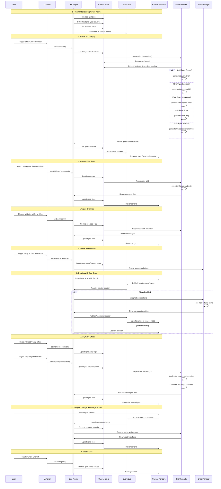
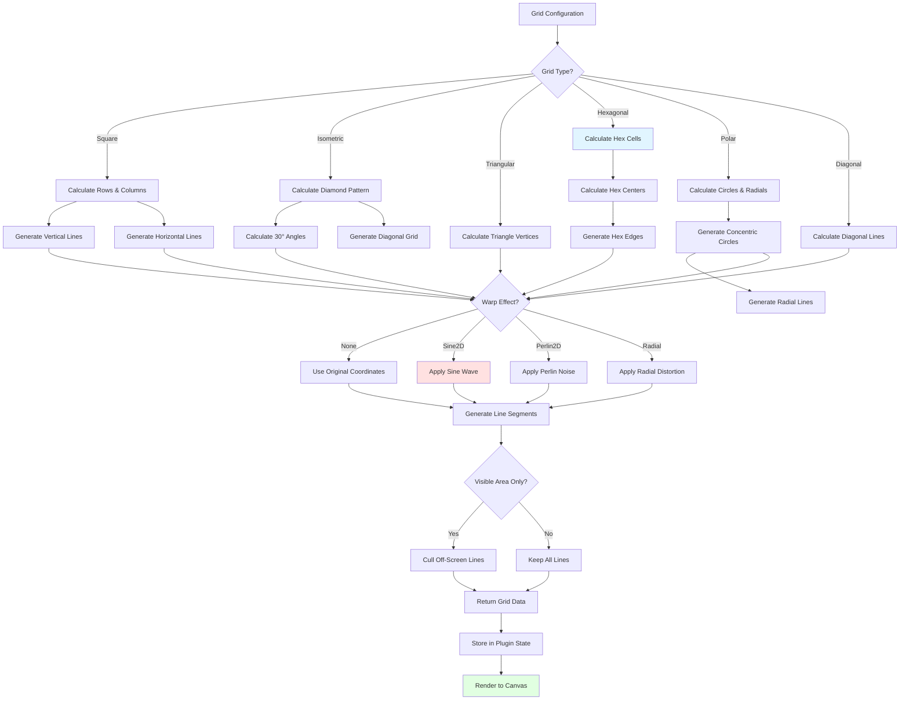
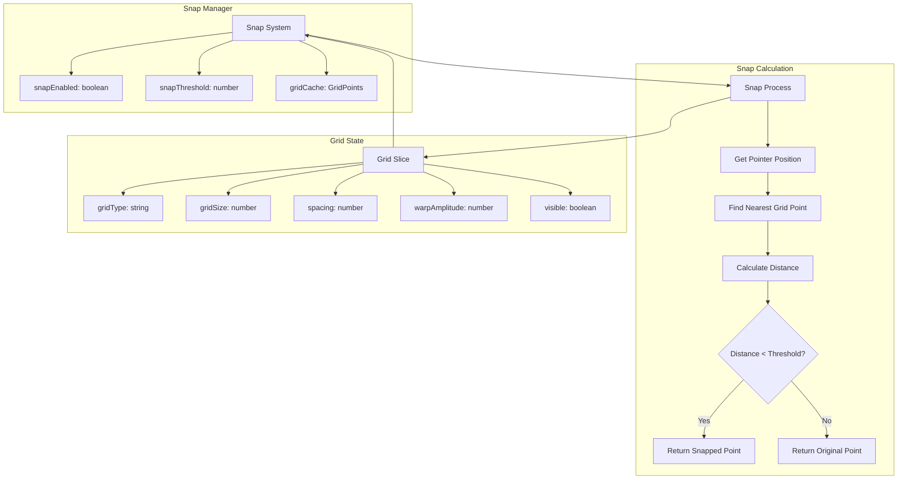

# Grid Plugin

**Purpose**: Display reference grids with optional snapping

## Overview

- Grid types: square, isometric, triangular, hexagonal, polar, diagonal, warped
- Customizable grid size and spacing
- Warp effects: sine2d, perlin2d, radial
- Optional snapping to grid
- Show/hide toggle

## Plugin Interaction Flow



## Grid Generation Process



## Snap System



## Handler

N/A (visual aid)

## Keyboard Shortcuts

No plugin-specific shortcuts.

## UI Contributions

### Panels

- Grid type, size, warping parameters, snap settings

### Overlays

No overlays.

### Canvas Layers

- Grid visualization

## Public APIs

No public APIs exposed.

## Usage Examples

```typescript
// Activate the plugin
const state = useCanvasStore.getState();
state.setMode('grid');

// Access plugin state
const gridState = useCanvasStore(state => state.grid);
```


## Implementation Details

**Location**: `src/plugins/grid/`

**Files**:
- `index.ts`: Plugin definition
- `slice.ts`: Zustand slice (if applicable)
- `*Panel.tsx`: UI panels (if applicable)
- `*Overlay.tsx`: Overlays (if applicable)

## Edge Cases & Limitations

- Implementation-specific constraints
- Performance considerations for large datasets
- Browser compatibility notes (if any)

## Related

- [Plugin System Overview](../overview)
- [Event Bus](../../event-bus/overview)


