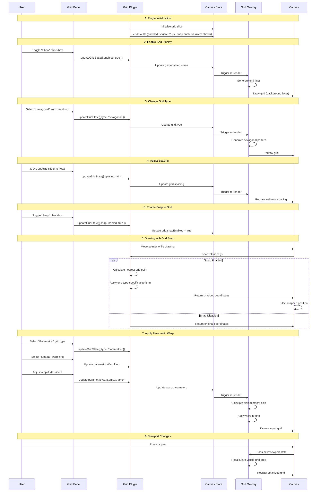
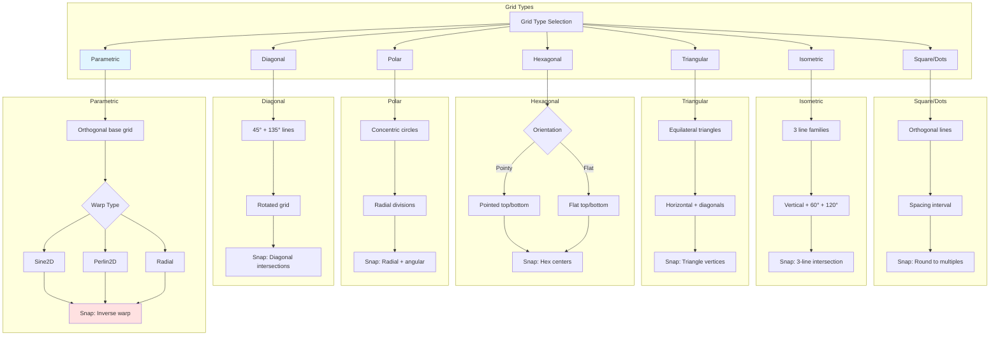
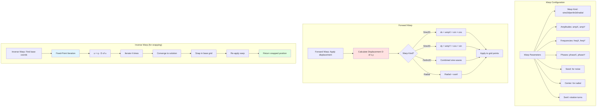
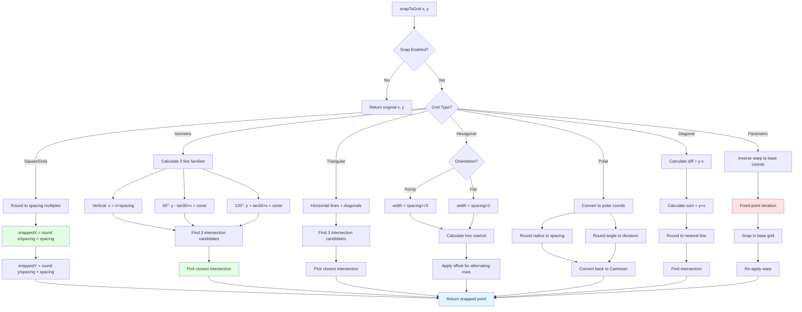

# Grid Plugin

**Purpose**: Display reference grids with optional snapping

## Overview

A comprehensive grid visualization and snapping system supporting multiple grid types, from classic square grids to advanced parametric warped grids.

**Features**:
- Grid types: square, dots, isometric, triangular, hexagonal, polar, diagonal, parametric
- Customizable grid spacing and visual properties
- Parametric warp effects: sine2d, perlin2d, radial
- Optional snapping to grid with type-specific algorithms
- Show/hide toggle with opacity control
- Coordinate rulers

## Plugin Interaction Flow



## Grid Type System



## Parametric Warp System



## Snap Algorithm Flow



## Handler

N/A (visual aid - no interactive handler)

## Keyboard Shortcuts

No plugin-specific shortcuts.

## UI Contributions

### Panels

**GridPanel**: Comprehensive grid configuration with:
- **Grid Type Dropdown**: Select from 8 grid types
- **Toggles**:
  - Show: Enable/disable grid visibility
  - Snap: Enable/disable snap-to-grid
  - Rulers: Show/hide coordinate labels
- **Spacing Slider**: Adjust grid cell size (5-100px)
- **Opacity Slider**: Control grid transparency (0-1)
- **Emphasize Every N**: Emphasize every Nth line
- **Parametric Settings** (when type = parametric):
  - Step Y: Vertical spacing
  - Warp Type: sine2d/perlin2d/radial
  - Amplitude X/Y
  - Frequency X/Y
  - Phase X/Y (sine2d)
  - Swirl Turns (radial)
  - Seed (perlin2d)

### Overlays

**GridOverlay**: Renders all grid types with:
- SVG-based rendering for crisp lines
- Viewport culling for performance
- Theme-aware colors
- Optional rulers with numeric labels

### Canvas Layers

Background layer (rendered behind all elements)

## Public APIs

```typescript
interface GridPluginSlice {
  grid: {
    enabled: boolean;
    snapEnabled: boolean;
    type: GridType;
    spacing: number;
    showRulers: boolean;
    
    // Type-specific
    polarDivisions?: number;
    hexOrientation?: 'pointy' | 'flat';
    
    // Visual
    opacity?: number;
    color?: string;
    emphasizeEvery?: number;
    
    // Parametric
    parametricStepY?: number;
    parametricWarp?: WarpParams;
  };
  
  updateGridState: (state: Partial<...>) => void;
  snapToGrid: (x: number, y: number) => { x: number; y: number };
}

type GridType = 'square' | 'dots' | 'isometric' | 'triangular' 
              | 'hexagonal' | 'polar' | 'diagonal' | 'parametric';

interface WarpParams {
  kind: 'sine2d' | 'perlin2d' | 'radial';
  ampX: number;
  ampY: number;
  freqX: number;
  freqY: number;
  phaseX?: number;
  phaseY?: number;
  seed?: number;
  centerX?: number;
  centerY?: number;
  swirlTurns?: number;
}
```

## Usage Examples

```typescript
// Enable grid with specific type
const updateGridState = useCanvasStore(state => state.updateGridState);
updateGridState({ 
  enabled: true, 
  snapEnabled: true,
  type: 'hexagonal',
  spacing: 30
});

// Access snap function
const snapToGrid = useCanvasStore(state => state.snapToGrid);
const snapped = snapToGrid(rawX, rawY);
// Use snapped.x and snapped.y for positioning

// Configure parametric warp
updateGridState({
  type: 'parametric',
  parametricWarp: {
    kind: 'sine2d',
    ampX: 20,
    ampY: 20,
    freqX: 3,
    freqY: 2,
    phaseX: 0,
    phaseY: Math.PI / 3
  }
});

// Toggle grid visibility
updateGridState({ enabled: !grid.enabled });
```

## Implementation Details

**Location**: `src/plugins/grid/`

**Files**:
- `index.tsx`: Plugin definition and canvas layer registration
- `slice.ts`: State management and snap algorithms (404 lines)
- `GridPanel.tsx`: Settings UI with all controls
- `GridOverlay.tsx`: Visual rendering of all grid types

**Key Algorithms**:

1. **Square/Dots**: Simple rounding to spacing multiples
   ```typescript
   snappedX = Math.round(x / spacing) * spacing
   ```

2. **Isometric**: Three-line family intersection
   - Vertical lines + 60° + 120° diagonals
   - Find three candidate intersections
   - Return closest to pointer

3. **Triangular**: Similar to isometric with different geometry
   - Horizontal lines + 60° + 120° diagonals
   - Triangle vertex snapping

4. **Hexagonal**: Offset grid calculation
   - Alternating row/column offsets
   - Different formulas for pointy vs flat orientation

5. **Polar**: Cylindrical coordinate snapping
   - Snap radius to spacing intervals
   - Snap angle to division increments

6. **Diagonal**: 45° grid intersection
   - Lines with slopes ±1
   - Solve using y-x and y+x constants

7. **Parametric**: Inverse warp + snap + forward warp
   - Fixed-point iteration for inverse (4 iterations)
   - Snap in unwarped space
   - Re-apply warp to snapped point

**Warp Mathematics**:

- **Sine2D**: `D(x,y) = (ampX×sin(...)×cos(...), ampY×cos(...)×sin(...))`
- **Radial**: Hann window with optional swirl: `0.5×(1-cos(π×r/maxR))`
- **Perlin2D**: Simplified multi-octave sine combination

## Edge Cases & Limitations

### Performance
- Grid rendered as canvas layer for optimal performance
- Viewport culling reduces rendering overhead
- Parametric grids have higher computational cost
- Snapping calculations are lightweight (per pointer event)

### Functional Limitations
- Parametric inverse warp uses 4 iterations (may not converge for extreme amplitudes)
- Polar grid assumes origin at (0, 0)
- Very small spacing (less than 5px) causes visual clutter
- Grid settings do not persist with saved files
- Snap accuracy for parametric grids decreases with high warp amplitudes

### Browser Compatibility
- Requires Canvas API and SVG support (all modern browsers)
- No known compatibility issues

## Related

- [Guidelines Plugin](./guidelines) - Alternative smart alignment system
- [Grid Fill Plugin](./grid-fill) - Fill grid cells with shapes
- [Plugin System Overview](../overview)
- [Selection System](../../features/selection) - Uses grid snapping during element manipulation


