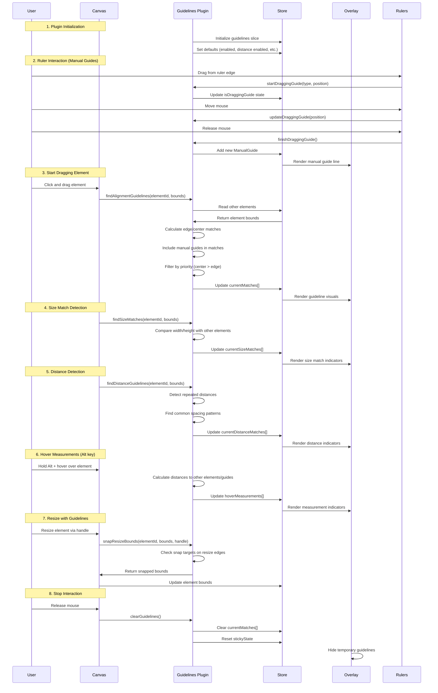
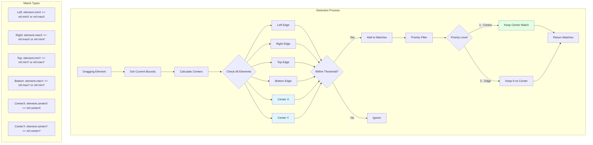
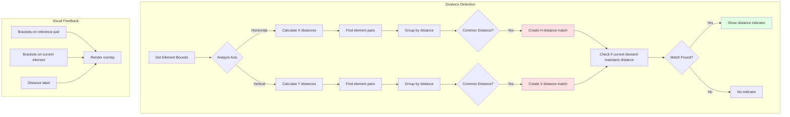
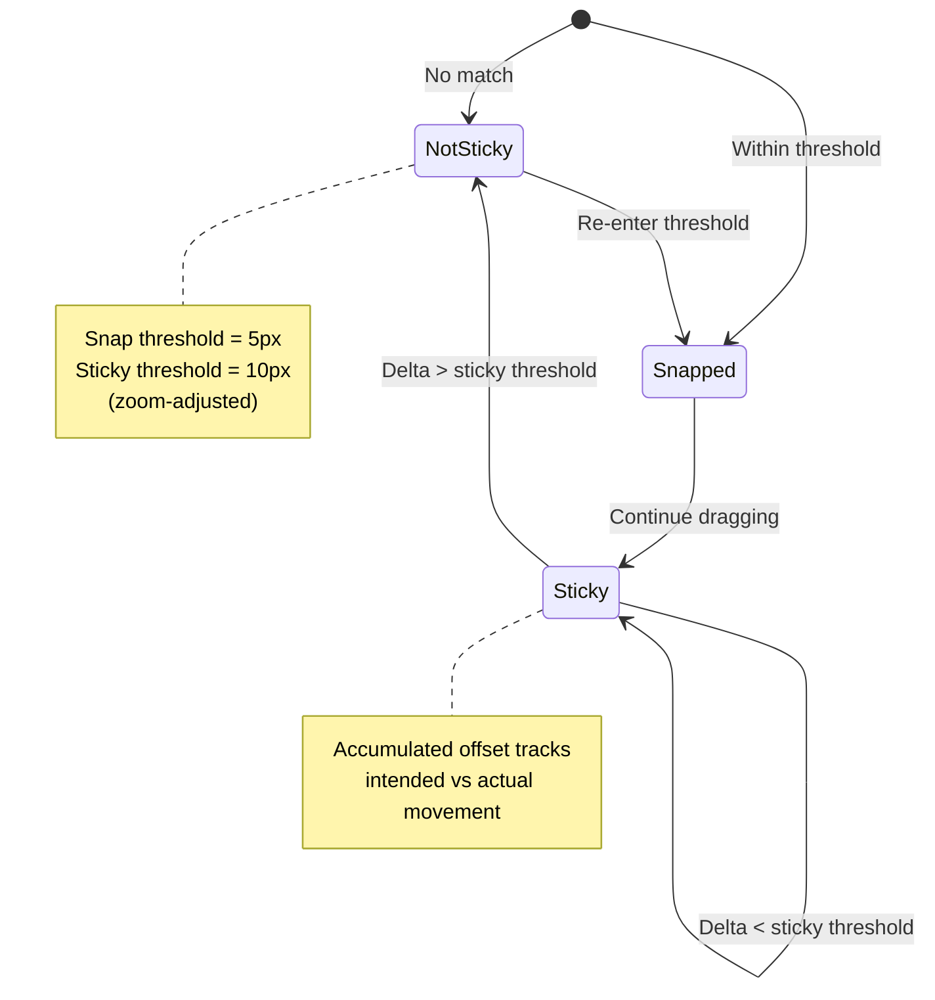

# Guidelines Plugin

**Purpose**: Smart guides for snapping elements to edges, centers, and manual reference guides with rulers support

## Overview

Smart alignment guides that help you position elements precisely by detecting edges, centers, distances, and size matches during drag and resize operations. Includes manual guides with interactive rulers for creating custom reference lines.

**Features**:
- Smart edge and center guides
- Distance repetition detection
- Size matching guidelines (width/height matching)
- Manual guides with draggable rulers
- Hover measurements (Alt + hover)
- Angle snap during rotation
- Sticky mode for automatic snapping
- Zoom-scaled snap threshold
- Visual feedback lines
- Guidelines during resize operations

## Plugin Interaction Flow



## Alignment Detection System



## Distance Repetition System



## Sticky Snap Behavior



## Handler

N/A (passive system - automatically active during drag and resize operations)

## Keyboard Shortcuts

- **G**: Toggle guidelines visibility (global shortcut)

## UI Contributions

### Panels

**GuidelinesPanel**: Compact settings control with toggles for:
- **Dist**: Enable/disable distance repetition detection
- **Size**: Enable/disable size matching (width/height)
- **Manual**: Enable/disable manual guides and rulers
- **Angle**: Enable/disable angle snap during rotation

**Snap Options**:
- **Edge**: Snap to element edges
- **Center**: Snap to element centers
- **Guide**: Snap to manual guides (requires Manual enabled)
- **View**: Snap to viewport center

**Threshold Settings**:
- **Snap**: Pixel threshold for snapping (1-50px)
- **Ang**: Angle threshold for angle snap (1-15°)

**Manual Guides List**: When Manual is enabled, shows:
- List of created guides with position, lock/unlock, and delete controls
- Clear all button

### Overlays

**GuidelinesOverlay**: Visual rendering component that displays:
- Alignment lines extending across canvas
- Distance markers with brackets and labels
- Size match indicators (W/H labels on matching elements)
- Hover measurements when Alt is pressed
- Manual guide lines

**Rulers**: Interactive rulers when Manual guides are enabled:
- Horizontal ruler at top of canvas
- Vertical ruler at left of canvas
- Drag from rulers to create manual guides
- Shows coordinate ticks and labels

### Canvas Layers

- Alignment guide lines (red by default)
- Distance indicators (gray with brackets)
- Size match indicators (green)
- Manual guide lines (cyan/deep sky blue)
- Ruler overlays (HTML canvas elements)

## Public APIs

```typescript
interface GuidelinesPluginSlice {
  guidelines: {
    // Core toggles
    enabled: boolean;
    distanceEnabled: boolean;
    sizeMatchingEnabled: boolean;
    manualGuidesEnabled: boolean;
    angleSnapEnabled: boolean;
    
    // Thresholds
    snapThreshold: number;
    angleSnapThreshold: number;
    
    // Visual colors
    guidelineColor: string;
    distanceColor: string;
    manualGuideColor: string;
    sizeMatchColor: string;
    
    // Snap options
    snapToEdges: boolean;
    snapToCenters: boolean;
    snapToManualGuides: boolean;
    snapToViewportCenter: boolean;
    
    // Debug
    debugMode: boolean;
    
    // Manual guides
    manualGuides: ManualGuide[];
    
    // Active matches
    currentMatches: GuidelineMatch[];
    currentDistanceMatches: DistanceGuidelineMatch[];
    currentSizeMatches: SizeMatch[];
    currentAngleSnap: AngleSnapMatch | null;
    
    // Hover measurements (Alt + hover)
    hoverMeasurements: HoverMeasurement[];
    isAltPressed: boolean;
    hoveredElementId: string | null;
    
    // Sticky state
    stickyState: GuidelinesStickyState;
    
    // Ruler interaction
    isDraggingGuide: boolean;
    draggingGuideType: 'horizontal' | 'vertical' | null;
    draggingGuidePosition: number | null;
  };
  
  // Actions
  updateGuidelinesState: (state: Partial<GuidelinesState>) => void;
  findAlignmentGuidelines: (elementId: string, bounds: Bounds) => GuidelineMatch[];
  findDistanceGuidelines: (elementId: string, bounds: Bounds) => DistanceGuidelineMatch[];
  findSizeMatches: (elementId: string, bounds: Bounds) => SizeMatch[];
  checkStickySnap: (deltaX: number, deltaY: number, bounds: Bounds) => SnapResult;
  snapResizeBounds: (elementId: string, bounds: Bounds, originalBounds: Bounds, handle: string) => SnapResizeResult;
  clearGuidelines: () => void;
  
  // Manual guide actions
  addManualGuide: (guide: ManualGuide) => void;
  removeManualGuide: (guideId: string) => void;
  updateManualGuide: (guideId: string, updates: Partial<ManualGuide>) => void;
  clearManualGuides: () => void;
  
  // Ruler dragging
  startDraggingGuide: (type: 'horizontal' | 'vertical', position: number) => void;
  updateDraggingGuide: (position: number) => void;
  finishDraggingGuide: () => void;
  cancelDraggingGuide: () => void;
}

// Types
interface ManualGuide {
  id: string;
  type: 'horizontal' | 'vertical';
  position: number;
  color?: string;
  locked: boolean;
  frameId?: string | null;
}

interface SizeMatch {
  type: 'width' | 'height';
  value: number;
  matchingElementIds: string[];
  currentElementId: string;
}

interface HoverMeasurement {
  elementId: string;
  targetId: string | 'guide';
  guideId?: string;
  axis: 'horizontal' | 'vertical';
  distance: number;
  start: number;
  end: number;
  perpendicularPosition: number;
}
```

## Usage Examples

```typescript
// Enable guidelines with all features
const updateGuidelinesState = useCanvasStore(state => state.updateGuidelinesState);
updateGuidelinesState({ 
  enabled: true, 
  distanceEnabled: true,
  sizeMatchingEnabled: true,
  manualGuidesEnabled: true 
});

// Access current guidelines during drag
const guidelines = useCanvasStore(state => state.guidelines);
const matches = guidelines.currentMatches;
const sizeMatches = guidelines.currentSizeMatches;

// Check for sticky snap
const checkStickySnap = useCanvasStore(state => state.checkStickySnap);
const result = checkStickySnap(deltaX, deltaY, projectedBounds);
if (result.snapped) {
  applyDelta(result.x, result.y);
}

// Snap during resize
const snapResizeBounds = useCanvasStore(state => state.snapResizeBounds);
const result = snapResizeBounds(elementId, newBounds, originalBounds, 'br');
if (result.didSnap) {
  applyBounds(result.snappedBounds);
}

// Add manual guide programmatically
const addManualGuide = useCanvasStore(state => state.addManualGuide);
addManualGuide({
  id: crypto.randomUUID(),
  type: 'vertical',
  position: 100,
  locked: false
});
```

## Implementation Details

**Location**: `src/plugins/guidelines/`

**Files**:
- `index.tsx`: Plugin definition, canvas layer registration, and keyboard shortcuts
- `slice.ts`: State management and guideline calculation algorithms
- `types.ts`: TypeScript interfaces and default configuration
- `constants.ts`: Shared constants (ruler size)
- `GuidelinesPanel.tsx`: Compact settings UI component
- `GuidelinesOverlay.tsx`: Visual rendering of all guidelines
- `GuidelineComponents.tsx`: Individual guideline visual components
- `Rulers.tsx`: Interactive rulers for manual guide creation
- `hooks/useGuidelinesAltKey.ts`: Hook for Alt key detection (hover measurements)
- `hooks/useGuidelinesHoverElement.ts`: Hook for tracking hovered elements

**Key Algorithms**:

1. **Bounds Caching**: `calculateElementBoundsMap()` - Computes and caches element bounds once per drag operation
2. **Overlap Detection**: `rangesOverlap()` - Optimizes by only checking elements with overlapping perpendicular ranges
3. **Priority System**: Center alignments (priority 1) take precedence over edge alignments (priority 2)
4. **Zoom Scaling**: Snap threshold automatically adjusted: `actualThreshold = snapThreshold / viewport.zoom`
5. **Sticky Mode**: Fixed-point tracking with accumulated offset and break-free threshold

## Edge Cases & Limitations

### Performance Considerations
- Element bounds calculated once per drag operation and cached
- Overlap checking reduces unnecessary comparisons
- May experience slowdown with hundreds of elements on canvas

### Functional Limitations
- Guidelines only work with **Select** tool during drag operations
- Point editing in path edit mode does not trigger guidelines
- Very small elements may be harder to align due to snap threshold
- Guidelines do not persist (temporary visual aids only)

### Coordinate System
- All calculations in **world space** (canvas coordinates)
- Snap threshold converted to world space based on zoom
- Ensures consistent behavior at any zoom level

## Related

- [Grid Plugin](./grid) - Alternative alignment system using regular grids
- [Selection System](../../features/selection) - Required for guideline activation
- [Plugin System Overview](../overview)
- [Alignment Features](../../features/alignment) - Manual alignment commands


