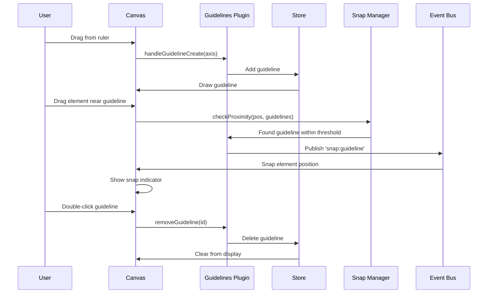

# Guidelines Plugin

**Purpose**: Smart guides for snapping elements to edges and centers

## Overview

- Smart edge and center guides\n- Distance repetition detection\n- Sticky mode for automatic snapping\n- Zoom-scaled snap threshold\n- Visual feedback lines

## Plugin Interaction Flow



## Handler

## Handler

N/A (passive system)

## Keyboard Shortcuts

No plugin-specific shortcuts.

## UI Contributions

### Panels

- Guide settings, snap threshold, sticky mode

### Overlays

No overlays.

### Canvas Layers

- Visual guide lines

## Public APIs

No public APIs exposed.

## Usage Examples

```typescript
// Activate the plugin
const state = useCanvasStore.getState();
state.setMode('guidelines');

// Access plugin state
const guidelinesState = useCanvasStore(state => state.guidelines);
```


## Implementation Details

**Location**: `src/plugins/guidelines/`

**Files**:
- `index.ts`: Plugin definition
- `slice.ts`: Zustand slice (if applicable)
- `*Panel.tsx`: UI panels (if applicable)
- `*Overlay.tsx`: Overlays (if applicable)

## Edge Cases & Limitations

- Implementation-specific constraints
- Performance considerations for large datasets
- Browser compatibility notes (if any)

## Related

- [Plugin System Overview](../overview)
- [Event Bus](../../event-bus/overview)


