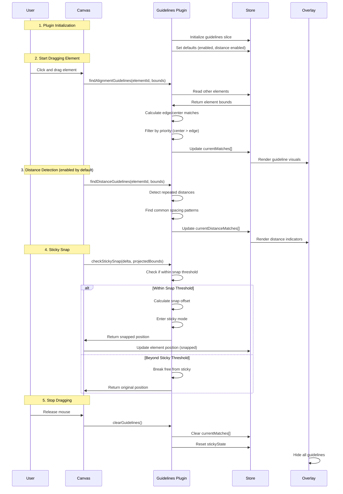
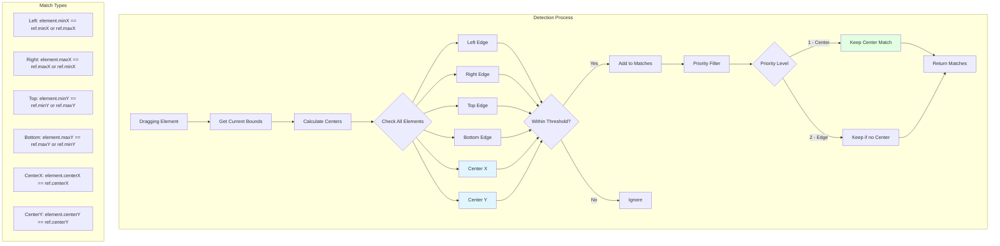
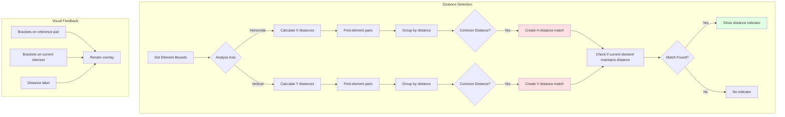
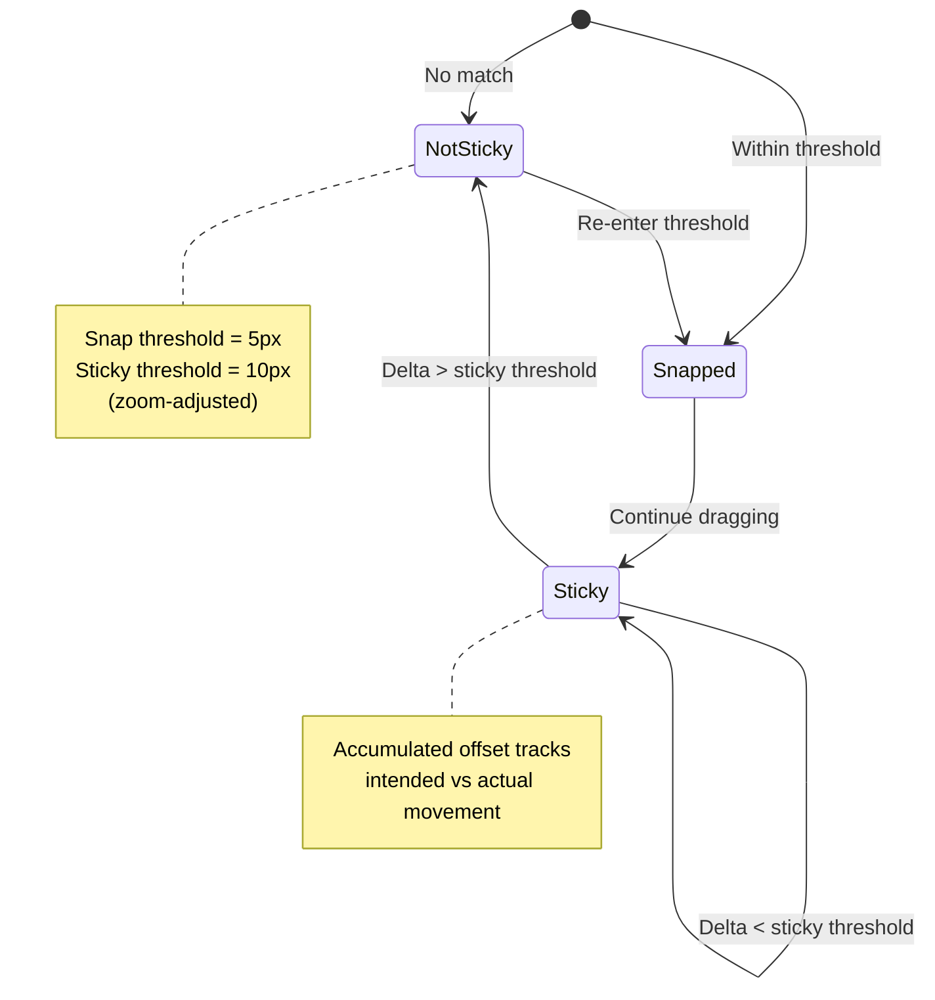

# Guidelines Plugin

**Purpose**: Smart guides for snapping elements to edges and centers

## Overview

Smart alignment guides that help you position elements precisely by detecting edges, centers, and distances during drag operations.

**Features**:
- Smart edge and center guides
- Distance repetition detection
- Sticky mode for automatic snapping
- Zoom-scaled snap threshold
- Visual feedback lines

## Plugin Interaction Flow



## Alignment Detection System



## Distance Repetition System



## Sticky Snap Behavior



## Handler

N/A (passive system - automatically active during drag operations)

## Keyboard Shortcuts

No plugin-specific shortcuts.

## UI Contributions

### Panels

**GuidelinesPanel**: Settings control with toggles for:
- **Alignment**: Enable/disable alignment guidelines (edges and centers)
- **Distance**: Enable/disable distance repetition detection (requires Alignment)
- **Debug Mode** (dev only): Show all possible guidelines without filtering

### Overlays

**GuidelinesOverlay**: Visual rendering component that displays:
- Alignment lines extending across canvas
- Distance markers with brackets
- Dynamic visibility (only during drag with select tool active)

### Canvas Layers

Visual guide lines rendered in foreground layer

## Public APIs

```typescript
interface GuidelinesPluginSlice {
  guidelines: {
    enabled: boolean;
    distanceEnabled: boolean;
    debugMode: boolean;
    snapThreshold: number;
    currentMatches: GuidelineMatch[];
    currentDistanceMatches: DistanceGuidelineMatch[];
    stickyState: {
      isSticky: boolean;
      stickyOffset: { x: number; y: number };
      lastStickyTime: number;
    };
  };
  
  updateGuidelinesState: (state: Partial<...>) => void;
  findAlignmentGuidelines: (elementId: string, bounds: Bounds) => GuidelineMatch[];
  findDistanceGuidelines: (elementId: string, bounds: Bounds) => DistanceGuidelineMatch[];
  checkStickySnap: (deltaX: number, deltaY: number, bounds: Bounds) => SnapResult;
  clearGuidelines: () => void;
}
```

## Usage Examples

```typescript
// Enable guidelines
const updateGuidelinesState = useCanvasStore(state => state.updateGuidelinesState);
updateGuidelinesState({ enabled: true, distanceEnabled: true });

// Access current guidelines during drag
const guidelines = useCanvasStore(state => state.guidelines);
const matches = guidelines.currentMatches;

// Check for sticky snap
const checkStickySnap = useCanvasStore(state => state.checkStickySnap);
const result = checkStickySnap(deltaX, deltaY, projectedBounds);
if (result.snapped) {
  // Apply snapped position
  applyDelta(result.x, result.y);
}
```

## Implementation Details

**Location**: `src/plugins/guidelines/`

**Files**:
- `index.tsx`: Plugin definition and canvas layer registration
- `slice.ts`: State management and guideline calculation algorithms
- `GuidelinesPanel.tsx`: Settings UI component
- `GuidelinesOverlay.tsx`: Visual rendering of guidelines

**Key Algorithms**:

1. **Bounds Caching**: `calculateElementBoundsMap()` - Computes and caches element bounds once per drag operation
2. **Overlap Detection**: `rangesOverlap()` - Optimizes by only checking elements with overlapping perpendicular ranges
3. **Priority System**: Center alignments (priority 1) take precedence over edge alignments (priority 2)
4. **Zoom Scaling**: Snap threshold automatically adjusted: `actualThreshold = snapThreshold / viewport.zoom`
5. **Sticky Mode**: Fixed-point tracking with accumulated offset and break-free threshold

## Edge Cases & Limitations

### Performance Considerations
- Element bounds calculated once per drag operation and cached
- Overlap checking reduces unnecessary comparisons
- May experience slowdown with hundreds of elements on canvas

### Functional Limitations
- Guidelines only work with **Select** tool during drag operations
- Point editing in path edit mode does not trigger guidelines
- Very small elements may be harder to align due to snap threshold
- Guidelines do not persist (temporary visual aids only)

### Coordinate System
- All calculations in **world space** (canvas coordinates)
- Snap threshold converted to world space based on zoom
- Ensures consistent behavior at any zoom level

## Related

- [Grid Plugin](./grid) - Alternative alignment system using regular grids
- [Selection System](../../features/selection) - Required for guideline activation
- [Plugin System Overview](../overview)
- [Alignment Features](../../features/alignment) - Manual alignment commands


