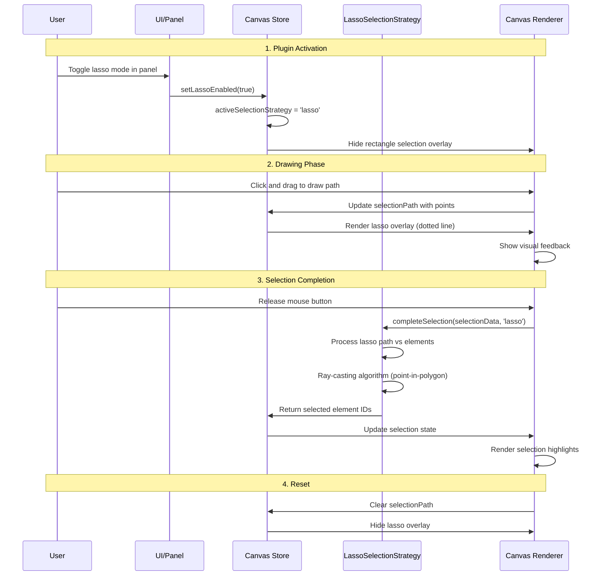
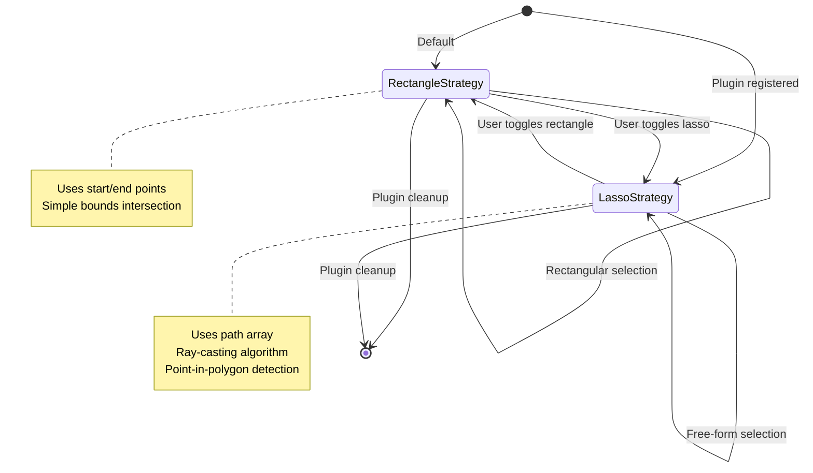
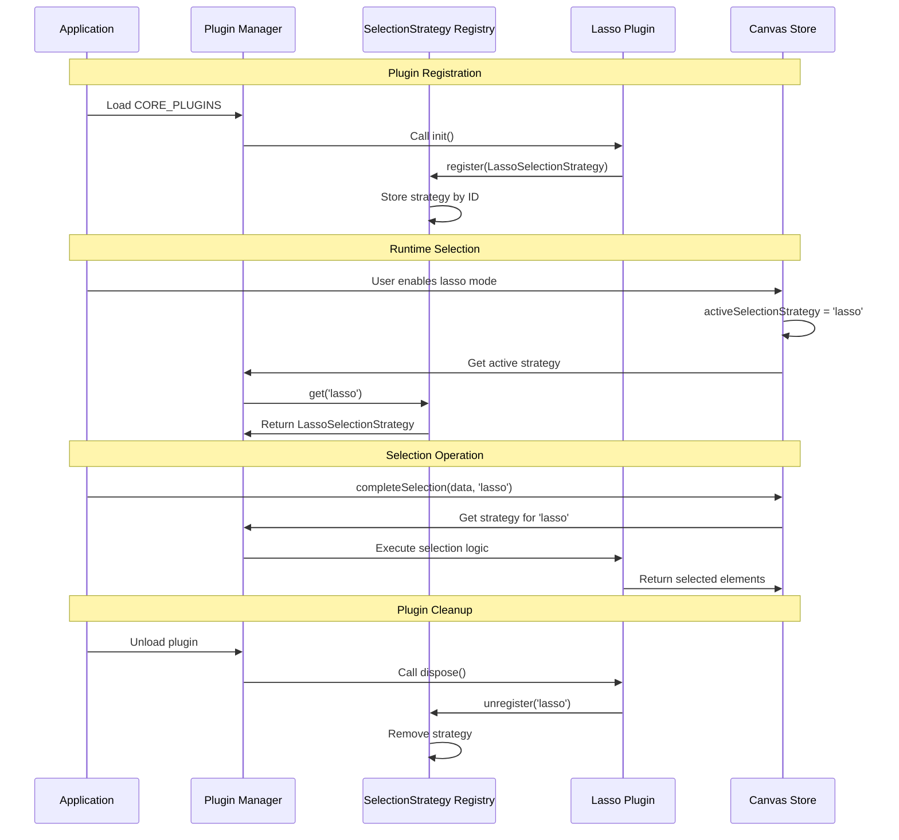
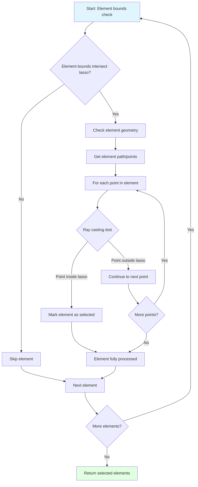

# Lasso Plugin

**Purpose**: Free-form selection tool for precise element selection

## Overview

The Lasso plugin provides an alternative selection method that allows users to draw free-form paths to select elements, offering more flexibility than traditional rectangular selection. It integrates seamlessly with the existing selection system through the SelectionStrategy architecture.

**Key Features:**
- Free-form path drawing for element selection
- Closed lasso (polygon) and open lasso (line) modes
- Visual feedback with dotted line overlay during drawing
- Automatic element detection within drawn path
- Compatible with select, edit, and subpath modes
- Toggle controls in sidebar panel
- Theme-aware visual styling matching selection rectangle
- Conditional divider display in edit mode

## How It Works

The Lasso plugin extends the core selection system by registering a custom `LassoSelectionStrategy` that implements point-in-polygon detection:

1. **Activation**: Toggle the lasso mode in the sidebar panel
2. **Mode Selection**: Choose between closed lasso (polygon) or open lasso (line) using the panel toggle
3. **Drawing**: Click and drag to draw a free-form path
4. **Selection**: Release to select all elements whose geometry intersects with the drawn path
5. **Visual Feedback**: 
   - Closed lasso: Dotted polygon with semi-transparent fill
   - Open lasso: Dotted line without fill

The plugin uses different selection algorithms based on the lasso mode:

- **Closed Lasso**: Point-in-polygon detection using ray-casting algorithm
- **Open Lasso**: Line proximity detection that selects elements within 5 pixels of the drawn path

## Selection Flow



## SelectionStrategy Architecture



## Plugin Integration Flow



## Point-in-Polygon Algorithm



## Configuration Options

### Enable Lasso
Master toggle in the sidebar panel to enable/disable lasso selection mode. When enabled, replaces rectangular selection with free-form path drawing and reveals the closed/open lasso toggle.

### Visual Styling
- **Stroke**: Gray tones matching selection rectangle (gray.300 in dark mode, gray.500 in light mode)
- **Fill**: Semi-transparent gray fill (10% opacity) - only for closed lasso
- **Stroke Width**: 1 pixel (zoom-adjusted)
- **Line Style**: Dotted pattern (2px dash, 2px gap, zoom-adjusted)

### Closed vs Open Lasso
- **Closed Lasso** (default): Forms a complete polygon that selects elements within the enclosed area
- **Open Lasso**: Draws as a simple line that selects elements the line path crosses or touches
- **Toggle**: Switch in panel content to change between closed and open modes

## Context Menu Actions

The lasso plugin contributes a context menu action for quick toggling of lasso mode:

### Toggle Lasso Selection
- **Available in**: Select, Edit, and Subpath modes
- **Label**: "Enable Lasso Selection" / "Disable Lasso Selection" (contextual)
- **Icon**: Lasso icon
- **Function**: Toggles the lasso selection mode on/off


## SelectionStrategy Architecture

The Lasso plugin demonstrates the extensibility of the selection system through the `SelectionStrategy` interface:

```typescript
interface SelectionStrategy {
  id: string;
  containsPoint(point: Point, selectionData: SelectionData): boolean;
  intersectsBounds(bounds: Bounds, selectionData: SelectionData): boolean;
}
```

### LassoSelectionStrategy Implementation

The plugin registers a `LassoSelectionStrategy` that:
- Uses `isPointInPolygon()` for point containment testing
- Uses `isBoundsIntersectingPolygon()` for bounds intersection
- Processes `SelectionData.path` containing the drawn lasso points

This architecture allows any plugin to contribute custom selection behaviors without modifying core selection logic.

## Usage

1. **Switch to Select/Edit/Subpath mode**
2. **Enable Lasso**: Toggle the switch in the Lasso Selector panel
3. **Draw Selection**: Click and drag to draw around desired elements
4. **Complete Selection**: Release mouse button to select elements within the path
5. **Disable Lasso**: Toggle off to return to rectangular selection

## Integration Points

- **Plugin System**: Registers via `PluginDefinition` with lifecycle management
- **Selection System**: Extends via `SelectionStrategy` registry pattern
- **State Management**: Uses dedicated slice for lasso-specific state
- **UI Components**: Integrates with `Panel` and `PanelSwitch` components
- **Canvas Layers**: Contributes overlay rendering for visual feedback

## Technical Details

### State Management
```typescript
interface LassoPluginSlice {
  lassoEnabled: boolean;
  lassoPath: Point[];
  activeSelectionStrategy?: string;
  // ... actions
}
```

### Plugin Registration
```typescript
export const lassoPlugin: PluginDefinition = {
  id: 'lasso',
  init: () => {
    selectionStrategyRegistry.register(new LassoSelectionStrategy());
    return () => selectionStrategyRegistry.unregister('lasso');
  },
  // ... other configuration
};
```

### Canvas Integration
- **Overlay**: `LassoOverlayWrapper` renders visual feedback
- **Geometry**: `lassoGeometry.ts` provides point-in-polygon utilities
- **Strategy**: `LassoSelectionStrategy` implements selection logic

## Accessibility

- Keyboard navigation support through panel switch
- Screen reader labels for toggle controls
- Visual contrast maintained across light/dark themes
- Consistent interaction patterns with other selection tools

## Performance Considerations

- Path drawing optimized with minimal point sampling
- Selection calculation uses efficient geometric algorithms
- Visual feedback updates in real-time during drawing
- Memory cleanup on plugin deactivation