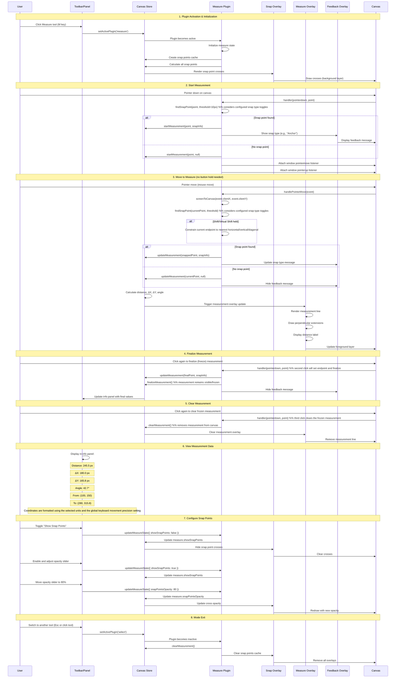

# Measure Plugin

**Purpose**: Professional measurement tool with intelligent snapping and visual feedback

## Overview

The Measure plugin provides a comprehensive measurement system that enables users to precisely measure distances, angles, and deltas between points on the canvas. It features intelligent snapping to geometric features, real-time visual feedback, and configurable precision settings.

- Click-to-start and click-to-finish measurement interface (no need to hold mouse)
  - Snap Points controls at the top of the panel with a percent opacity slider (debounced)
- Intelligent snapping to anchor points, edges, midpoints, bounding box corners, and centers
- Ability to toggle snapping by point type (Anchor, Midpoint, Edge, Corner, Center, Intersection) in the Measure panel
- Real-time distance, ΔX, ΔY, and angle calculations
- Visual measurement line with perpendicular extensions
- Configurable snap point visualization with opacity control
- Unit support: pixels (px), millimeters (mm), inches (in)
- Precision control based on global settings
- Theme-aware snap point indicators
- Expandable information panel

## How It Works

The Measure tool operates in two phases:

### 1. Snap Point Calculation
When entering measure mode, the plugin:
- Analyzes all visible canvas elements
- Extracts snap points from element geometry:
  - **Anchor points**: Path control points and vertices
  - **Bounding box corners**: Four corners of element bounds
  - **Bounding box midpoints**: Four edge midpoints
  - **Bounding box center**: Center point of bounds
  - **Edge points**: Points along path segments
- Caches snap points for performance optimization
- Renders subtle crosses at all snap points (configurable)
- Renders subtle crosses at all snap points (configurable)
  
> See the [Snap Point Utilities](../../utilities/snap-point-utils) documentation for function references and implementation details.
  - Uses `SnapPointsCache` to pre-compute and cache high-priority snap points (anchors, midpoints, BBox corners/center and intersections)
  - **Edge snapping** (closest point on path segments) is computed on-demand per cursor position and checked only if no higher-priority snap point is found within the threshold

### 2. Measurement Interaction
During measurement:
- **Start point**: Click to begin; the start point snaps to the nearest point within the threshold
- **End point**: 
  - **Click and release**: Move the mouse to update the measurement, then click again to finalize.
  - **Click and drag**: Drag to the desired end point and release to finalize immediately (freeze).
- **Hold Shift**: Hold the physical Shift key to constrain the measurement to exactly horizontal, vertical, or diagonal (±45°) directions.
- **Virtual Shift for Mobile**: On mobile devices, use the Virtual Shift button (bottom-right action bar) to emulate holding Shift — the constraint behavior is identical.
- **Visual feedback**: Shows measurement line with perpendicular extensions
- **Live calculations**: Updates distance, ΔX, ΔY, and angle in real-time
- **Snap type indicator**: Displays snap type (Anchor, Corner, Path, etc.) via feedback overlay
- **Finalize**: Click again to fix (freeze) the measurement at the current end point; the measurement remains visible on screen
- **Clear**: Click once more to clear the frozen measurement before starting a new one

## Configuration Options

### Show Snap Points
Toggle to display/hide the snap point crosses. When enabled, all available snap points are marked with subtle crosses on the canvas.

The Snap Points control is available at the top of the Measure side panel for quick access; the `Opacity` control is a percentage slider and uses debounced updates to avoid excessive redraws while dragging.

### Snap Type Toggles
In addition to showing/hiding snap point crosses, the Measure panel allows toggling specific snap point categories individually:

- **Anchor** — Path control points and vertices
- **Mid** — Midpoints of path segments and bounding box edges
- **Edge** — Closest point on a path edge (computed dynamic per position)
- **Corner** — Bounding box corner points
- **Center** — Bounding box center point
- **Inter** — Intersection points between paths

Turning off a snap type prevents the tool from considering that geometric feature when detecting the nearest snap point.

### Opacity
Adjustable opacity (10-100%) for snap point visibility:
- **Low opacity (10-30%)**: Subtle indicators, minimal visual interference
- **Medium opacity (40-60%)**: Balanced visibility (default: 50%)
- **High opacity (70-100%)**: Maximum visibility
  - Light mode: Nearly black crosses
  - Dark mode: Nearly white crosses

The Opacity slider is a percentage control (0.0 - 1.0 internally) and updates are debounced to avoid excessive redraws while the user adjusts the slider.

### Precision
Number of decimal places for measurements, controlled by global keyboard movement precision setting:
- **0 decimals**: Integer values only
- **1-2 decimals**: Standard precision (default: 1)
- **3+ decimals**: High precision for technical work

### Units
Measurement unit selection:
- **px**: Pixels (screen coordinates)
- **mm**: Millimeters (96 DPI conversion)
- **in**: Inches (96 DPI conversion)

## Plugin Interaction Flow



## Snap Point System

```mermaid
graph TB
    subgraph "Snap Point Detection"
        SPD[Snap Point Detection]
        SPD --> A[getAllSnapPoints]
        A --> E1[Iterate Elements]
        E1 --> G1{Element Type}
        
        G1 -->|Path| P1[Extract Anchors]
        G1 -->|Shape| P2[Extract Anchors]
        G1 -->|Text| P3[Skip]
        
        P1 --> BB[Calculate Bounds]
        P2 --> BB
        
        BB --> BB1[Get BBox Corners]
        BB --> BB2[Get BBox Midpoints]
        BB --> BB3[Get BBox Center]
        
        BB1 --> CACHE[Cache All Points]
        BB2 --> CACHE
        BB3 --> CACHE
        P1 --> CACHE
        P2 --> CACHE
    end
    
    subgraph "Snap Calculation"
        SC[findSnapPoint]
        SC --> SD[screenDistance]
        SD --> T{Within Threshold?}
        
        T -->|Yes| PR[Priority Check]
        T -->|No| N[Return null]
        
        PR --> PR1{Anchor Point?}
        PR1 -->|Yes| R1[Return Anchor]
        PR1 -->|No| PR2{BBox Feature?}
        PR2 -->|Yes| R2[Return BBox Snap]
        PR2 -->|No| PR3{Edge Point?}
        PR3 -->|Yes| R3[Return Edge Snap]
        PR3 -->|No| N
    end
    
    subgraph "Visual Feedback"
        VF[Visual Feedback]
        VF --> C1[Snap Point Crosses]
        VF --> C2[Measurement Line]
        VF --> C3[Feedback Message]
        
        C1 --> V1{Show Snap Points?}
        V1 -->|Yes| V2[Render Crosses]
        V1 -->|No| V3[Hide Crosses]
        
        V2 --> OP[Apply Opacity]
        OP --> TH{Theme}
        TH -->|Light| L[Dark Color * Opacity]
        TH -->|Dark| D[Light Color * Opacity]
        
        C2 --> ML[Main Line]
        C2 --> PE[Perpendicular Extensions]
        C2 --> DL[Distance Label]
        
        C3 --> ST[Display Snap Type]
        ST --> ST1[Anchor]
        ST --> ST2[Corner]
        ST --> ST3[Path]
        ST --> ST4[Midpoint]
        ST --> ST5[Center]
    end
    
    subgraph "Measurement Calculation"
        MC[Calculate Measurement]
        MC --> D1[Distance = sqrt dx² + dy²]
        MC --> D2[ΔX = endX - startX]
        MC --> D3[ΔY = endY - startY]
        MC --> D4[Angle = atan2 dy dx]
        
        D1 --> UC[Unit Conversion]
        D2 --> UC
        D3 --> UC
        D4 --> PC[Precision Formatting]
        
        UC --> U1{Unit Type}
        U1 -->|px| UP[value * 1]
        U1 -->|mm| UM[value * 25.4 / 96]
        U1 -->|in| UI[value / 96]
        
        UP --> PC
        UM --> PC
        UI --> PC
        
        PC --> F[toFixed precision]
    end
```



## State Management

The Measure plugin maintains the following state:

```typescript
measure: {
  measurement: {
    startPoint: Point | null;      // Initial click point
    endPoint: Point | null;        // Current/final point
    distance: number;              // Total distance
    deltaX: number;                // X component
    deltaY: number;                // Y component
    angle: number;                 // Angle in degrees
    isActive: boolean;             // Currently measuring?
  };
  startSnapInfo: SnapInfo | null;  // Snap at start
  currentSnapInfo: SnapInfo | null; // Snap at end
  cachedSnapPoints: SnapPointCache[]; // All snap points
  showInfo: boolean;               // Show info panel
  units: 'px' | 'mm' | 'in';      // Measurement units
  snapThreshold: 10;               // Snap distance (px)
  enableSnapping: true;            // Enable snap system
  showSnapPoints: boolean;         // Show snap crosses
  snapPointsOpacity: number;       // Cross opacity (0-100). The UI presents this as a percent slider; changes are debounced to prevent redraw storms.
  // Snap type toggles
  snapToAnchors?: boolean;
  snapToMidpoints?: boolean;
  snapToEdges?: boolean;
  snapToBBoxCorners?: boolean;
  snapToBBoxCenter?: boolean;
  snapToIntersections?: boolean;
}
```

## Canvas Layers

The plugin uses three canvas layers for optimal rendering:

1. **measure-snap-points** (background)
   - Renders snap point crosses
   - Conditionally visible based on `showSnapPoints`
   - Opacity controlled by `snapPointsOpacity`
   - Theme-aware colors
  - Uses `SnapPointsCache` component to compute & refresh cached snap points for performance

2. **measure-overlay** (foreground)
   - Main measurement line
   - Perpendicular extensions at both ends
   - Distance label with unit
   - Scales font size inversely with zoom (constant visual size)

3. **measure-feedback** (foreground)
   - Snap type indicator message
   - Bottom-left position
   - Auto-hide after 2 seconds
   - Integrated with FeedbackOverlay system

## Performance Optimizations

- **Snap point caching**: Points calculated once on mode entry, not per-frame
- **Threshold-based search**: Only checks points within 10px screen distance
- **Priority filtering**: Anchors checked first, then bbox, then edges
- **Viewport-aware rendering**: Only visible elements contribute snap points
- **Debounced updates**: Measurement calculations throttled during drag
- **Slider updates debounced**: UI controls like the snap opacity slider use debounce to prevent excessive redraws while the user adjusts values
- **Lazy calculation**: Snap points only computed when needed

## Usage Tips

1. **Quick measurements**: Press `M` to activate, click once to start, move the mouse to update, click again to fix the measurement (no need to hold the mouse)
2. **Precise alignment**: Use snap points to measure exact distances between features
3. **Angle checking**: View angle in degrees for rotation analysis
4. **Technical drawings**: Set precision to 2-3 decimals and use mm/in units
5. **Minimize visual clutter**: Lower snap point opacity or hide them entirely
6. **Snap feedback**: Watch the bottom-left corner for snap type confirmation
7. **Multiple measurements**: After a measurement is finalized (second click), click once more to clear it, then start a new measurement with the next click
8. **Clean workflow**: The three-click pattern (start → freeze → clear) ensures you can review each measurement before clearing the canvas
9. **Mobile constraint**: On mobile devices without a physical keyboard, use the Virtual Shift action (bottom-right toggle) to constrain the measure to cardinal and diagonal angles.

## Keyboard Shortcuts

| Shortcut | Action |
|----------|--------|
| `M` | Activate measure tool |
| `Esc` | Return to select mode |
| `Shift+M` | Toggle measure info panel / showInfo |
| `Hold Shift` | Constrain measurement to horizontal / vertical / diagonal |

## Related Features

- **Object Snap**: Similar snapping logic for point editing
- **Grid**: Alternative alignment system with configurable patterns
- **Transformation Panel**: Numeric position/size input
- **Settings**: Global precision control affects measurement decimals

## Technical Details

### Snap Point Types

```typescript
type SnapType = 
  | `anchor`        // Path control point
  | `edge`          // Point along path segment
  | `midpoint`      // Segment midpoint
  | `bbox-corner`   // Bounding box corner
  | `bbox-center`   // Bounding box center
  | `intersection`  // Path intersection
```

### Unit Conversions

Based on 96 DPI standard:
- **px → mm**: `value * 25.4 / 96`
- **px → in**: `value / 96`
- **mm → px**: `value * 96 / 25.4`
- **in → px**: `value * 96`

### Snap Distance Calculation

Screen-space distance accounts for zoom level:
```typescript
function screenDistance(p1: Point, p2: Point, zoom: number): number {
  const dx = (p2.x - p1.x) * zoom;
  const dy = (p2.y - p1.y) * zoom;
  return Math.sqrt(dx * dx + dy * dy);
}
```

### Opacity Mapping

Opacity slider (10-100%) maps to RGBA alpha (0.1-1.0):
```typescript
const opacityValue = snapPointsOpacity / 100;
const color = colorMode === 'dark' 
  ? `rgba(203, 213, 225, ${opacityValue})`  // Slate-300
  : `rgba(51, 65, 85, ${opacityValue})`;    // Slate-700
```

## Sidebar Configuration

The Measure plugin uses **declarative sidebar panels**:

```typescript
sidebarPanels: [
  {
    key: 'measure',
    condition: (ctx) => !ctx.isInSpecialPanelMode && ctx.activePlugin === 'measure',
    component: MeasureInfoPanel,
  },
]
```

The **MeasureInfoPanel** automatically appears when:
- The measure tool is active
- Not in a special panel mode

**Panel Features:**
- Snap point configuration (show/hide, opacity, type toggles)
- Measurement units selection (px, mm, in)
- Real-time measurement display (distance, ΔX, ΔY, angle)
- Start and end point coordinates
- Snap type indicators

## Future Enhancements

Potential improvements under consideration:

- [ ] Snap to curve tangents and normals
- [ ] Measurement history/annotations
- [ ] Multiple simultaneous measurements
- [ ] Export measurements to CSV/JSON
- [ ] Area and perimeter calculations
- [ ] Arc length measurements
- [ ] Custom snap point creation
- [ ] Measurement constraints (horizontal/vertical lock)
- [ ] Angle snapping (15°, 30°, 45° increments)
