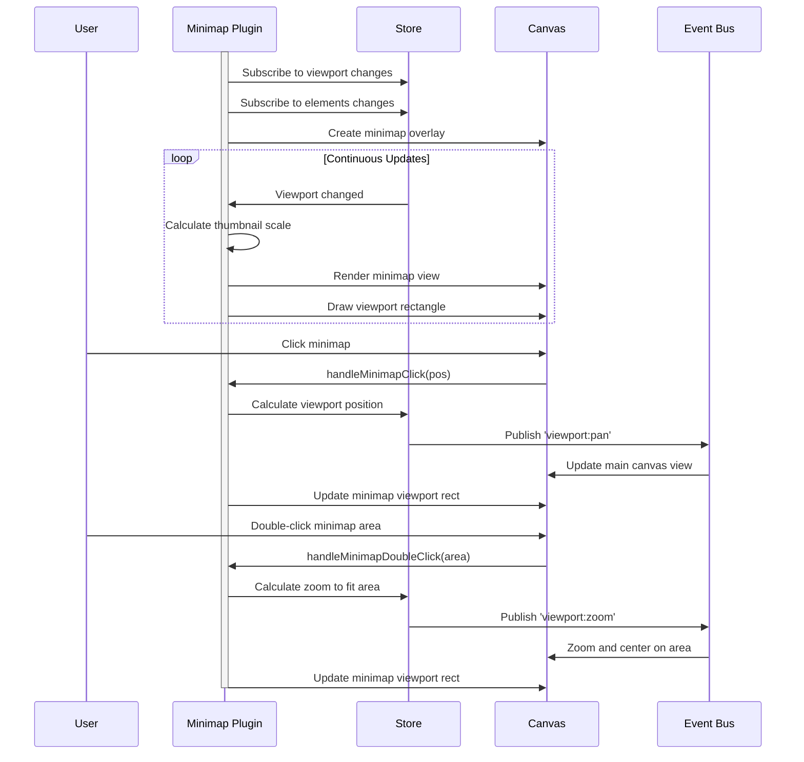

# Minimap Plugin

**Purpose**: Overview minimap for navigation in large canvases

## Overview

- Bird's-eye view of entire canvas
- Viewport indicator
- Click to jump to location
- Double-click to zoom into a specific area
- Scales with canvas content
- Always visible (global panel)

## Plugin Interaction Flow



## Handler

N/A (uses dedicated panel)

## Keyboard Shortcuts

No plugin-specific shortcuts.

## UI Contributions

### Panels

**MinimapPanel**: Global navigation panel displayed in the bottom-right corner
- Shows a bird's-eye view of all canvas content
- Displays a viewport rectangle showing the current visible area
- Interactive controls:
  - **Click**: Pan to clicked location
  - **Double-click**: Zoom to fit the clicked area into view
  - **Drag viewport rectangle**: Pan the main canvas (constrained to visible bounds)
- Auto-scales to fit all elements with padding
- Updates in real-time as elements move or viewport changes
- Movement is constrained to the union of viewport and content bounds

### Overlays

The MinimapPanel is registered as a **global overlay** in the plugin definition:

```typescript
overlays: [
  {
    id: 'minimap-panel',
    placement: 'global',
    component: MinimapPanel,
  },
],
```

This allows it to render independently of the active tool and read all required state (including `sidebarWidth` and `isSidebarPinned`) directly from the store.

### Canvas Layers

No canvas layers.

## Public APIs

No public APIs exposed.

## Usage Examples

### Interacting with the Minimap

**Click to Pan:**
```typescript
// The minimap automatically handles clicks
// User clicks on minimap at position (x, y)
// -> Viewport pans so that position is centered
```

**Double-Click to Zoom:**
```typescript
// User double-clicks on minimap
// -> Calculates bounds around clicked area
// -> Zooms to fit that area with appropriate padding
```

**Drag Viewport Rectangle:**
```typescript
// User can drag the viewport rectangle on the minimap
// -> Updates main canvas pan in real-time
// -> Movement is constrained to keep the viewport within the minimap bounds
// -> Prevents dragging beyond the combined area of content and viewport
```

### Accessing Minimap State

```typescript
import { useCanvasStore } from '../../store/canvasStore';

function MyComponent() {
  // Get viewport information
  const viewport = useCanvasStore(state => ({
    panX: state.panX,
    panY: state.panY,
    zoom: state.zoom
  }));
  
  // Get all elements for minimap rendering
  const elements = useCanvasStore(state => state.elements);
  
  return null;
}
```


## Implementation Details

**Location**: `src/plugins/minimap/`

**Files**:
- `index.tsx`: Plugin definition with global overlay registration
- `MinimapPanel.tsx`: Main panel component with rendering and interaction logic

**Key Features**:
- Automatic bounds calculation from all canvas elements
- Scale calculation to fit content within minimap dimensions
- Viewport rectangle tracking and interaction
- Drag state management with pointer events
- Real-time synchronization with main canvas
- Constrained movement to prevent viewport from leaving visible bounds
- Reads `sidebarWidth` and `isSidebarPinned` from store to calculate effective sidebar offset
- Registered as a global overlay (no hardcoded import in App.tsx)

## Edge Cases & Limitations

- **Empty canvas**: Minimap shows default viewport when no elements exist
- **Performance**: Large numbers of elements are rendered simplified in minimap
- **Dragging**: Uses pointer capture to ensure smooth dragging experience
- **Scaling**: Automatically adjusts scale to show all content with padding
- **Touch devices**: Supports both mouse and touch pointer events
- **Position**: Fixed in bottom-right corner, offset by sidebar width
- **Movement bounds**: Viewport movement is constrained to the union of content and viewport bounds, preventing navigation beyond the visible/content area
- **Viewport accuracy**: The viewport rectangle accurately reflects the visible canvas area by accounting for the sidebar width when calculating dimensions

## Related

- [Plugin System Overview](../overview)
- [Event Bus](../../event-bus/overview)


