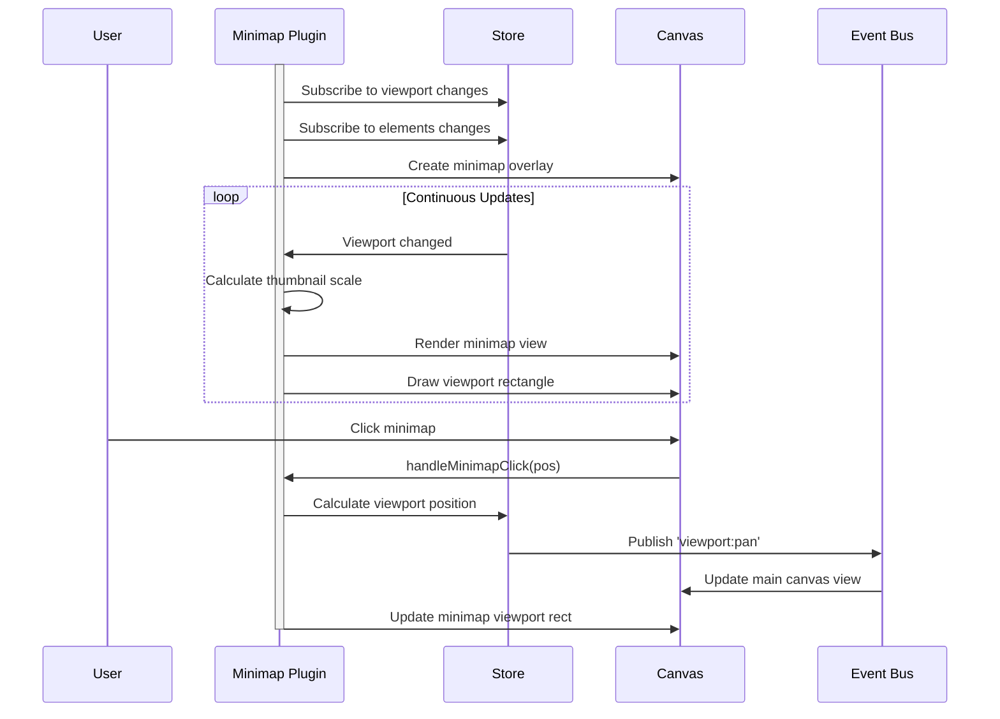

# Minimap Plugin

**Purpose**: Overview minimap for navigation in large canvases

## Overview

- Bird's-eye view of entire canvas
- Viewport indicator
- Click to jump to location
- Scales with canvas content
- Always visible (global panel)

## Plugin Interaction Flow



## Handler

N/A (uses dedicated panel)

## Keyboard Shortcuts

No plugin-specific shortcuts.

## UI Contributions

### Panels

- Minimap view with viewport indicator

### Overlays

No overlays.

### Canvas Layers

No canvas layers.

## Public APIs

No public APIs exposed.

## Usage Examples

```typescript
// Activate the plugin
const state = useCanvasStore.getState();
state.setMode('minimap');

// Access plugin state
const minimapState = useCanvasStore(state => state.minimap);
```


## Implementation Details

**Location**: `src/plugins/minimap/`

**Files**:
- `index.ts`: Plugin definition
- `slice.ts`: Zustand slice (if applicable)
- `*Panel.tsx`: UI panels (if applicable)
- `*Overlay.tsx`: Overlays (if applicable)

## Edge Cases & Limitations

- Implementation-specific constraints
- Performance considerations for large datasets
- Browser compatibility notes (if any)

## Related

- [Plugin System Overview](../overview)
- [Event Bus](../../event-bus/overview)


