# Object Snap Plugin

**Purpose**: Precision positioning system for enhanced editing accuracy

## Overview

The Object Snap (OSNAP) plugin provides intelligent snapping functionality to help users position elements precisely during editing operations. It automatically detects and snaps to key points on paths, making it easier to create aligned and precise vector graphics.

**Key Features:**
- Snap to path anchors (M/L/C), midpoints, edge points, intersections, and bounding box corners/center
- Configurable snap threshold for sensitivity adjustment
- Visual feedback with snap point indicators
- Toggle controls for enabling specific snap types
- Active during point editing and selection dragging in Edit mode
- Expandable panel for settings management
- Theme-aware visual indicators (black/white based on color mode)

## How It Works

Object Snap analyzes all visible canvas elements to identify potential snap points:

- **Anchors**: Move-to and anchor points generated by `M`, `L`, and `C` commands (path vertices and anchor points)
- **Midpoints**: Center points of line segments
- **Intersections**: Points where path segments cross each other

When dragging points or selections in Edit mode, the system continuously checks for nearby snap points within the configured threshold distance. When a snap point is detected, the cursor automatically aligns to it and visual indicators appear.

## Configuration Options

### Enable OSNAP
Master toggle to enable/disable the entire snapping system.

### Snap Threshold
Adjustable distance (4-20 pixels) within which snapping occurs. Lower values provide more precise snapping, higher values make it easier to snap from farther away.

### Snap Types
Individual toggles for different snap point types (available in the Object Snap panel):
- **Anchor**: Snap to `M`, `L`, and `C` command positions (enabled by default)
- **Midpoint**: Snap to midpoints of lines and curves (enabled by default)
- **Edge**: Snap to the closest point on a path segment (enabled by default)
- **BBox Corner**: Snap to corners of an element's bounding box (enabled by default)
- **BBox Center**: Snap to the center of an element's bounding box (enabled by default)
- **Intersection**: Snap to geometry intersections between elements (enabled by default)

## Plugin Interaction Flow

```mermaid
sequenceDiagram
    participant User
    participant UI as UI/Toolbar
    participant Store as Canvas Store
    participant OSP as Object Snap Plugin
    participant Canvas as Canvas Renderer
    
    Note over User,Canvas: 1. Plugin Activation
    User->>UI: Enter Edit mode
    UI->>Store: setActivePlugin('edit')
    Store->>OSP: Plugin becomes active
    OSP->>Store: Initialize object snap state
    OSP->>Canvas: Render snap overlay (when dragging)
    
    Note over User,Canvas: 2. Point Editing with Snapping
    User->>Canvas: Start dragging point in Edit mode
    Canvas->>OSP: Point drag starts
    OSP->>Store: Get available snap points
    Store->>OSP: Return SnapPoint[]
    OSP->>Store: Find closest snap point within threshold
    Store->>OSP: Return closest SnapPoint or null
    
    alt Snap point found
        OSP->>Canvas: Constrain cursor to snap point
        OSP->>Canvas: Show snap indicators
        OSP->>Store: Update currentSnapPoint
    else No snap point
        OSP->>Canvas: Allow free dragging
    end
    
    User->>Canvas: Continue dragging
    Canvas->>OSP: Update drag position
    OSP->>Store: Recalculate closest snap point
    OSP->>Canvas: Update visual feedback
    
    User->>Canvas: Release point
    Canvas->>OSP: End drag operation
    OSP->>Store: Clear currentSnapPoint
    OSP->>Canvas: Hide snap indicators
    
    Note over User,Canvas: 3. Selection Dragging with Snapping
    User->>Canvas: Start dragging selection
    Canvas->>OSP: Selection drag starts
    OSP->>Store: Calculate selection bounds
    OSP->>Store: Find snap points for selection anchor
    OSP->>Canvas: Show snap feedback for selection
    
    User->>Canvas: Release selection
    Canvas->>OSP: End selection drag
    OSP->>Store: Clear snap state
```



## State Management

The plugin adds an `objectSnap` slice to the global store:

```typescript
interface ObjectSnapState {
  /** Whether object snapping is enabled */
  enabled: boolean;

  /** Snap threshold in screen pixels (4-20) */
  snapThreshold: number;

  /** Currently active snap point for visualization */
  currentSnapPoint: SnapPoint | null;

  /** All available snap points for current operation */
  availableSnapPoints: SnapPoint[];

  /** Whether to snap to anchors (M/L/C) */
  snapToAnchors: boolean;
  /** Whether to snap to midpoints */
  snapToMidpoints: boolean;
  /** Whether to snap to path edges */
  snapToEdges: boolean;
  /** Whether to include bounding box corners */
  snapToBBoxCorners: boolean;
  /** Whether to include bounding box center */
  snapToBBoxCenter: boolean;
  /** Whether to compute intersections */
  snapToIntersections: boolean;

  /** Whether to render all snap points during dragging */
  showSnapPoints: boolean;
  /** Opacity of the snap point crosses (0-100) */
  snapPointsOpacity: number;

  /** Cached snap points for performance */
  cachedSnapPoints: SnapPoint[] | null;

  /** Cache key to detect element changes */
  cacheKey: string | null;
}

interface SnapPoint {
  /** Canvas coordinate */
  point: { x: number; y: number };
  /** Unified type */
  type: 'anchor' | 'midpoint' | 'edge' | 'bbox-corner' | 'bbox-center' | 'intersection';
  /** Associated element id (optional) */
  elementId?: string;
  /** Optional metadata */
  metadata?: { commandIndex?: number; pointIndex?: number };
}
```

## UI Components

### Object Snap Panel

Provides configuration controls for the snapping system (see `src/plugins/objectSnap/ObjectSnapPanel.tsx`):
- Master enable/disable toggle for OSNAP
- Threshold slider (4-20px) for sensitivity adjustment
- Individual toggles for snap types (Anchor, Midpoint, Edge, BBox Corner, BBox Center, Intersection)
- Toggle to show/hide all snap points and an opacity slider (0-100%)
- Expandable panel integration for quick access

### Object Snap Overlay

Renders visual feedback on the canvas (implemented in `src/overlays/SnapPointOverlay.tsx`):
- **SnapPointCrossOverlay**: Renders subtle crosses for all available snap points (configurable opacity)
- **ActiveSnapPointOverlay**: Renders emphasized active snap point (rings and center dot)
- Theme-aware colors (inverse of color mode: dark in light mode; light in dark mode)
- Only visible during active dragging in Edit mode

## Utility Functions

Leverages utilities from `src/utils/snapPointUtils.ts` and exposes convenience actions in `src/plugins/objectSnap/slice.ts`:

- `distance()`: Calculate Euclidean distance between two points
- `midpoint()`: Calculate center point between two points
- `lineSegmentIntersection()`: Find intersection point between two line segments
- `getCommandEndpoint()`: Extract endpoint from a path command
- `extractSnapPointsFromPath()`: Generate snap points from a path element
- `findIntersectionsBetweenPaths()`: Calculate intersection points between multiple paths
- `findAvailableSnapPoints()`: Get all snap points from visible elements
- `findClosestSnapPoint()`: Find nearest snap point within threshold
- `applyObjectSnap()`: Apply snapping to a position (slice API)

## Usage Examples

### Basic Point Snapping

1. Enter Edit mode and select a path
2. Enable Object Snap in the expandable panel
3. Drag a point near another path's anchor
4. The point automatically snaps to the anchor with visual feedback

### Selection Alignment

1. Select multiple elements
2. Enable Object Snap
3. Drag the selection near intersection points
4. Selection anchor snaps to intersections for precise alignment

### Threshold Adjustment

1. Set threshold to 4px for precise snapping
2. Increase to 20px for easier snapping from farther distances
3. Adjust based on zoom level and desired precision

## Integration Points

- **Canvas Store**: Adds object snap state slice with caching
- **Plugin Manager**: Registers as core plugin, active during Edit mode
- **Event Bus**: Responds to mode changes and element updates
- **Edit Plugin**: Integrates with point editing and selection dragging
- **Measure Plugin**: Shares snap utilities and can refresh the snap cache; it also uses the same visualizations for snap points
- **Utilities**: Uses the unified snap functions and types in `utilities/snap-point-utils` for computing snap points
- **Viewport System**: Converts screen thresholds to canvas coordinates

## Performance Considerations

- **Caching**: Snap points are cached and invalidated when elements change
- **Lazy Calculation**: Intersections only computed when enabled
- **Threshold Filtering**: Distance checks use efficient Euclidean calculations
- **Viewport Scaling**: Threshold automatically adjusts for zoom levels
- **Selective Computation**: Only processes visible, unlocked elements