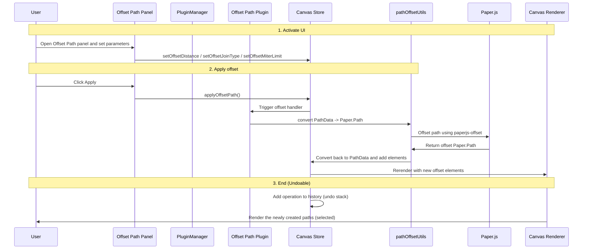

## Offset Path Plugin

**Purpose**: Create an offset path from existing path geometry, useful for stroking, adding margins, or creating outlines.

## Overview

The Offset Path plugin lets users expand or contract selected path(s) or path groups by an offset distance. It supports several corner join types and a configurable miter limit for sharp corners.

## Plugin Interaction Flow




**Key Features**
- Single-panel UI for quick off-setting of paths
- Distance control via a compact slider (min: -100, max: 100 px)
- Corner Join: Round, Miter, or Bevel (select via inline button group)
- Miter Limit control (slider) when Miter is selected
- Context menu action `Offset Path` available for applicable selections
- Handles closed and implicit-closed paths while preserving curves
- Uses Paper.js with a robust offset algorithm for accurate results and curve preservation

## Usage (UI)
1. Select one or more path elements, or a group with path children.
2. Open the `Offset Path` panel (shows only when selection contains valid elements).
3. Adjust the `Distance` slider to a positive or negative value:
   - Positive values expand the path.
   - Negative values contract the path.
4. Choose a `Corner Join`:
  - **Round:** Smooth rounded joins.
  - **Miter:** Sharp joins (control length with `Miter Limit`).
  - **Bevel:** Cut-off corner joins.
  (Select via the inline Corner Join button group.)
5. Click `Apply Offset Path` to generate new path elements. The newly created elements are automatically selected.

## Context Menu
Right-click while a path (or group with path children) is selected to access the `Offset Path` action in the floating context menu.

## State & API
The plugin adds the following store slice to the global canvas store:

```ts
interface OffsetPathSlice {
  offsetDistance: number; // Slider value (px)
  offsetJoinType: 'round' | 'miter' | 'bevel';
  offsetMiterLimit: number;
  isApplyingOffset: boolean;
  // Actions
  setOffsetDistance(distance: number): void;
  setOffsetJoinType(joinType: 'round' | 'miter' | 'bevel'): void;
  setOffsetMiterLimit(limit: number): void;
  canApplyOffset(): boolean; // checks if the panel should be shown
  applyOffsetPath(): void; // performs the operation
}
```

Programmatic usage example (plugin/internal API):

```ts
// From plugin code or other plugin that has access to the canvas store
const canvasState = useCanvasStore.getState();
if (canvasState.canApplyOffset?.()) {
  canvasState.setOffsetDistance?.(8);
  canvasState.setOffsetJoinType?.('round');
  canvasState.applyOffsetPath?.();
}
```

## Implementation Notes
- The plugin computes offsets with Paper.js using `paperjs-offset`. This preserves curve geometry and improves robustness for complex shapes.
- Closed paths (explicit Z command) and implicitly-closed paths (last point equals the first but without a Z) are detected and preserved in the offset result.
- For groups, the plugin offsets each child path individually and creates new elements for each offset path result.

## Limitations & Edge Cases
- Very large offsets on small geometry may produce degenerate or tiny geometry; use the limits (-100 to 100 px) to avoid gross artifacts.
- When offsetting groups, each path child is processed independently; complex nested group behaviors (like groups combining fills) might not be preserved exactly.
- The plugin attempts to maintain curve topology but very tight miter limits or extreme offsets might change visual results; consider using small steps and visually verifying results.

## Troubleshooting
- If the plugin does not appear in the panel, ensure at least one path or a group containing path elements is selected.
- If offsets look incorrect, try converting shapes to simple paths or adjust the Join Type and Miter Limit.

---

Happy editing! You can find the implementation at `src/plugins/offsetPath` and supporting utilities in `src/utils/pathOffsetUtils.ts`.
