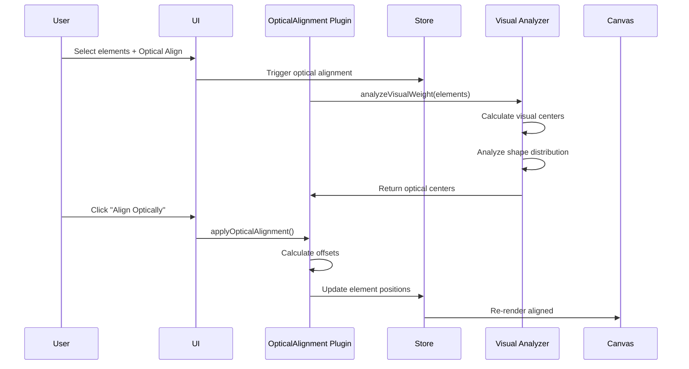

# Optical Alignment Plugin

**Purpose**: Apply optical corrections for visual alignment

## Overview

- Visual weight-based alignment
- Compensates for optical illusions

## Plugin Interaction Flow



## Handler

## Handler

N/A (uses actions)

## Keyboard Shortcuts

No plugin-specific shortcuts.

## UI Contributions

### Panels

No panels.

### Overlays

No overlays.

### Canvas Layers

No canvas layers.

## Public APIs

No public APIs exposed.

## Usage Examples

```typescript
// Activate the plugin
const state = useCanvasStore.getState();
state.setMode('optical-alignment');

// Access plugin state
const optical-alignmentState = useCanvasStore(state => state.optical-alignment);
```


## Calling Plugin APIs

```typescript
const api = pluginManager.getPluginApi('optical-alignment');
api?.applyOpticalAlignment();
```


## Implementation Details

**Location**: `src/plugins/optical-alignment/`

**Files**:
- `index.ts`: Plugin definition
- `slice.ts`: Zustand slice (if applicable)
- `*Panel.tsx`: UI panels (if applicable)
- `*Overlay.tsx`: Overlays (if applicable)

## Edge Cases & Limitations

### Contrast Requirements

The visual center algorithm requires sufficient contrast between the content and background to accurately detect visual weight distribution. The system automatically handles this:

- **Container with fill**: Uses the container's fill color as background
- **Container without fill + dark content**: Uses white background (default)
- **Container without fill + light content** (white, light grays, etc.): Automatically uses dark background (#333333) for proper contrast

This ensures accurate visual center calculation regardless of color combinations.

### Performance Considerations

- Visual center calculation involves pixel analysis and may take longer with very complex paths
- Batch operations (Apply All) process multiple pairs sequentially

## Related

- [Plugin System Overview](../overview)
- [Event Bus](../../event-bus/overview)
 - [Offset Path Plugin](./offset-path) - Generate offset outlines from selected paths to create consistent margins or stroke-like outlines; works well in combination with optical alignment for visual balancing of outlines.


