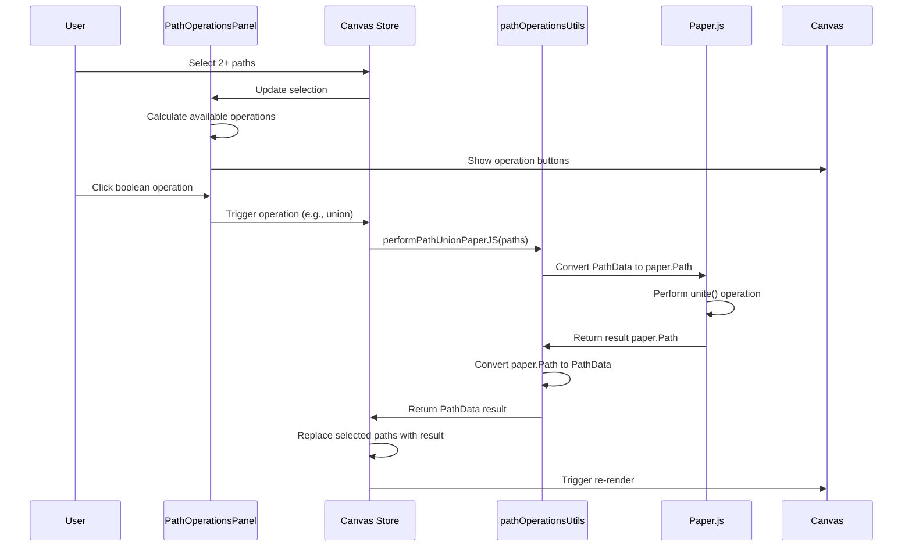
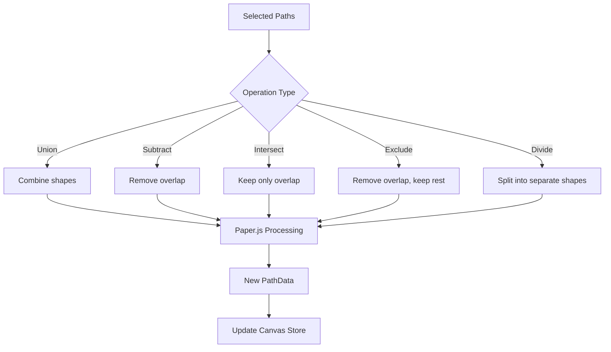

# Path Operations Plugin

**Purpose**: Provides boolean operations and path manipulation utilities using Paper.js

## Overview

The Path Operations plugin provides a set of tools for manipulating and combining SVG paths. It leverages the powerful [Paper.js](http://paperjs.org/) library to perform boolean operations and path transformations.

**Key Features:**
- Boolean operations (union, subtract, intersect, exclude, divide)
- Two union implementations: simple concatenation and Paper.js boolean
- Split paths with multiple subpaths into separate elements
- Path simplification with configurable tolerance
- Path rounding with configurable radius
- Automatic operation availability based on selection

## Plugin Interaction Flow



## Boolean Operations



## Handler

N/A - This plugin provides utility functions and UI panels but does not handle canvas events directly.

## Keyboard Shortcuts

No plugin-specific shortcuts.

## UI Contributions

### Panels

**PathOperationsPanel**: Conditionally displayed panel with path operation buttons
- **Visibility**: Only shown when selection meets operation requirements
- **Split Subpaths**: Available when a selected path has multiple subpaths
- **Boolean Operations**: Available when 2+ paths/subpaths are selected
  - Union (Simple): Concatenates subpaths without boolean logic
  - Union (Paper.js): True boolean union using Paper.js
  - Subtract: Removes second path from first (only for 2 selections)
  - Intersect: Keeps only overlapping area (only for 2 selections)
  - Exclude: Keeps non-overlapping areas (only for 2 selections)
  - Divide: Splits paths at intersections (only for 2 selections)

### Overlays

No overlays.

### Canvas Layers

No canvas layers.

## Public APIs

No public plugin APIs exposed. Operations are accessed through Canvas Store actions.

## Available Operations

### Boolean Operations (Paper.js)

All boolean operations use Paper.js internally for accurate geometric computations:

#### Union
```typescript
const state = useCanvasStore.getState();
state.performPathUnion(); // Simple: concatenates subpaths
state.performPathUnionPaperJS(); // Paper.js: true boolean union
```

Combines multiple paths into a single shape. Two implementations:
- **Simple Union**: Fast concatenation of all subpaths
- **Paper.js Union**: Proper boolean union with overlap resolution

#### Subtraction
```typescript
state.performPathSubtraction();
```

Removes the second selected path from the first. Order matters - the first selected path is the base, the second is subtracted from it.

#### Intersection
```typescript
state.performPathIntersect();
```

Creates a path containing only the area where both selected paths overlap.

#### Exclusion
```typescript
state.performPathExclude();
```

Creates a path containing the areas where the paths do NOT overlap (symmetric difference).

#### Division
```typescript
state.performPathDivide();
```

Splits paths at their intersections, creating separate path elements for each resulting region.

### Path Manipulation

#### Simplify Path
```typescript
import { performPathSimplifyPaperJS } from '../../utils/pathOperationsUtils';

const simplified = performPathSimplifyPaperJS(pathData, tolerance);
```

Reduces the number of points in a path while maintaining its visual appearance. Higher tolerance = more simplification.

**Parameters:**
- `pathData`: The path to simplify
- `tolerance`: Simplification threshold (default: 2.5)

#### Round Path Corners
```typescript
import { performPathRound } from '../../utils/pathOperationsUtils';

const rounded = performPathRound(pathData, radius);
```

Rounds all corners in a path with the specified radius.

**Parameters:**
- `pathData`: The path to round
- `radius`: Corner radius in pixels (default: 5)

#### Reverse SubPath
```typescript
import { reverseSubPath } from '../../utils/pathOperationsUtils';

const reversed = reverseSubPath(subPath);
```

Reverses the direction of a subpath (useful for path direction correction).

## Usage Examples

### Performing a Union Operation

```typescript
import { useCanvasStore } from '../../store/canvasStore';

function MyComponent() {
  const performUnion = () => {
    const state = useCanvasStore.getState();
    
    // Ensure 2+ paths are selected
    if (state.selectedIds.length < 2) {
      console.log('Select at least 2 paths');
      return;
    }
    
    // Perform Paper.js boolean union
    state.performPathUnionPaperJS();
  };
  
  return (
    <button onClick={performUnion}>
      Unite Paths
    </button>
  );
}
```

### Using Path Operations Utility Functions

```typescript
import { 
  performPathUnionPaperJS,
  performPathSubtraction,
  performPathSimplifyPaperJS,
  performPathRound
} from '../../utils/pathOperationsUtils';
import type { PathData } from '../../types';

// Unite multiple paths
const paths: PathData[] = [path1, path2, path3];
const united = performPathUnionPaperJS(paths);

// Subtract one path from another
const subtracted = performPathSubtraction(basePath, subtractPath);

// Simplify a complex path
const simplified = performPathSimplifyPaperJS(complexPath, 3.0);

// Round corners
const rounded = performPathRound(sharpPath, 10);
```

### Converting Between Paper.js and PathData

```typescript
import { 
  convertPathDataToPaperPath,
  convertPaperPathToPathData 
} from '../../utils/pathOperationsUtils';

// Convert to Paper.js for manipulation
const paperPath = convertPathDataToPaperPath(pathData);

// Manipulate using Paper.js API
paperPath.scale(2.0);
paperPath.rotate(45);

// Convert back to PathData
const result = convertPaperPathToPathData(paperPath);
```

## Implementation Details

**Location**: `src/plugins/path/` and `src/utils/pathOperationsUtils.ts`

**Files**:
- `index.tsx`: Plugin exports
- `PathOperationsPanel.tsx`: UI panel for path operations
- `../../utils/pathOperationsUtils.ts`: Core path operation utilities using Paper.js

**Dependencies**:
- **Paper.js**: Vector graphics library for boolean operations
  - Setup: Initialized with in-memory canvas for non-visual operations
  - All event listeners are set to passive during setup to avoid browser warnings

**Key Utilities**:

```typescript
// Boolean Operations
performPathUnion(paths: PathData[]): PathData | null
performPathUnionPaperJS(paths: PathData[]): PathData | null
performPathSubtraction(path1: PathData, path2: PathData): PathData | null
performPathIntersect(path1: PathData, path2: PathData): PathData | null
performPathExclude(path1: PathData, path2: PathData): PathData | null
performPathDivide(path1: PathData, path2: PathData): PathData | null

// Path Manipulation
performPathSimplifyPaperJS(pathData: PathData, tolerance?: number): PathData | null
performPathRound(pathData: PathData, radius?: number): PathData | null
reverseSubPath(subPath: SubPath): SubPath

// Conversion Utilities
convertPathDataToPaperPath(pathData: PathData): paper.Path | paper.CompoundPath
convertPaperPathToPathData(paperPath: paper.PathItem): PathData
```

## Edge Cases & Limitations

- **Selection Requirements**: 
  - Boolean operations require exactly 2 selected paths/subpaths
  - Union can work with 2+ paths
  - Split operation requires a path with multiple subpaths

- **Operation Order**: For subtract, intersect, exclude, and divide, the first selected path is processed first, and the second is the operand

- **Paper.js Errors**: If a boolean operation fails (e.g., due to invalid geometry), it logs an error and returns `null`

- **Path Complexity**: Very complex paths with many points may be slow to process

- **Compound Paths**: Paper.js may return compound paths for complex operations, which are automatically converted to PathData with multiple subpaths

- **Empty Results**: Some boolean operations may produce empty paths (e.g., intersecting non-overlapping paths), returning `null`

- **Path Direction**: Path direction matters for some operations - use `reverseSubPath()` if needed

- **Memory**: Paper.js runs in-memory without a visible canvas, but each operation creates temporary Paper.js objects

## Related

- [Subpath Plugin](./subpath) - For editing individual subpaths within a path
- [Plugin System Overview](../overview)
- [Canvas Store API](../../api/canvas-store) - Where path operation actions are defined
- [Paper.js Documentation](http://paperjs.org/reference/path/) - Underlying library reference
